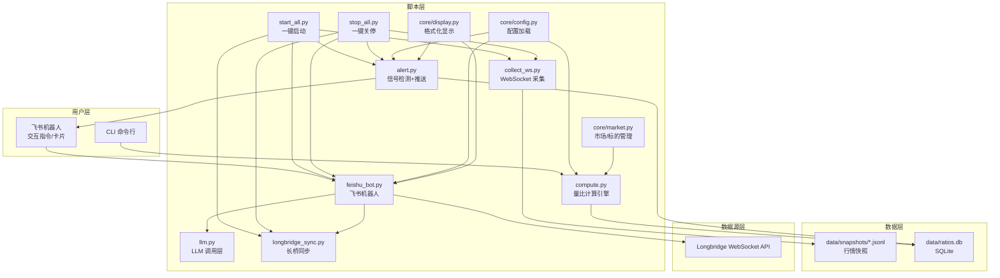
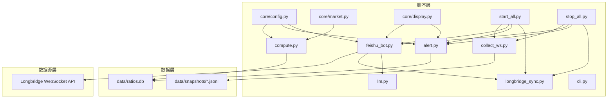

# 快速开始

<cite>
**本文引用的文件**
- [README.md](file://README.md)
- [config.yaml.example](file://config.yaml.example)
- [pyproject.toml](file://pyproject.toml)
- [scripts/start_all.py](file://scripts/start_all.py)
- [scripts/stop_all.py](file://scripts/stop_all.py)
- [scripts/bot_start.py](file://scripts/bot_start.py)
- [scripts/bot_stop.py](file://scripts/bot_stop.py)
- [scripts/cli.py](file://scripts/cli.py)
- [scripts/collect_ws.py](file://scripts/collect_ws.py)
- [scripts/alert.py](file://scripts/alert.py)
- [scripts/llm.py](file://scripts/llm.py)
- [scripts/longbridge_sync.py](file://scripts/longbridge_sync.py)
- [scripts/compute.py](file://scripts/compute.py)
- [scripts/core/config.py](file://scripts/core/config.py)
- [scripts/core/market.py](file://scripts/core/market.py)
- [scripts/core/display.py](file://scripts/core/display.py)
</cite>

## 目录
1. [简介](#简介)
2. [项目结构](#项目结构)
3. [核心组件](#核心组件)
4. [架构总览](#架构总览)
5. [详细组件分析](#详细组件分析)
6. [依赖分析](#依赖分析)
7. [性能考虑](#性能考虑)
8. [故障排查指南](#故障排查指南)
9. [结论](#结论)
10. [附录](#附录)

## 简介
本指南面向首次部署跨市场量比监控系统的用户，目标是在30分钟内完成从环境准备、依赖安装、配置文件设置到系统启动与验证的全流程。系统支持美股(US)、港股(HK)、A股(CN)三大市场的实时量比监控，结合LLM进行智能分析，并通过飞书机器人推送信号卡片。一键启动/关停服务，支持CLI查询与飞书指令交互。

## 项目结构
- 配置文件：config.yaml（示例位于 config.yaml.example）
- 项目元数据：pyproject.toml
- 脚本层：scripts/ 下包含采集、计算、告警、飞书机器人、CLI、LLM、长桥同步等脚本
- 数据层：data/ 下的 snapshots（JSONL行情快照）与 ratios.db（SQLite量比+信号历史）
- 日志：logs/ 下各类进程日志

图表来源
- [scripts/start_all.py:120-169](file://scripts/start_all.py#L120-L169)
- [scripts/stop_all.py:64-108](file://scripts/stop_all.py#L64-L108)
- [scripts/collect_ws.py:159-214](file://scripts/collect_ws.py#L159-L214)
- [scripts/alert.py:367-514](file://scripts/alert.py#L367-L514)
- [scripts/feishu_bot.py:712-800](file://scripts/feishu_bot.py#L712-L800)
- [scripts/compute.py:382-498](file://scripts/compute.py#L382-L498)
- [scripts/llm.py:110-159](file://scripts/llm.py#L110-L159)
- [scripts/longbridge_sync.py:209-250](file://scripts/longbridge_sync.py#L209-L250)
- [scripts/core/config.py:20-32](file://scripts/core/config.py#L20-L32)
- [scripts/core/market.py:61-88](file://scripts/core/market.py#L61-L88)
- [scripts/core/display.py:8-102](file://scripts/core/display.py#L8-L102)

章节来源
- [README.md:50-143](file://README.md#L50-L143)

## 核心组件
- 配置中心：统一加载 config.yaml，支持热加载（修改后自动生效）
- WebSocket 采集：订阅 Longbridge 实时行情，写入 JSONL 快照
- 量比计算：历史5日均量比 + 日内滚动量比，信号规则与去重状态机
- 飞书机器人：WebSocket 长连接，支持交互指令与富文本卡片
- LLM 调用：多模型切换（MiniMax/Xiaomi 等），统一接口封装
- 长桥同步：将持仓+自选股合并写入 watchlist，支持卡片按钮同步
- CLI：随时查询单个/扫描市场/历史/信号，系统状态检查
- 一键启停：配置 crontab + 启动/关停进程，守护进程与 PID 管理

章节来源
- [scripts/core/config.py:20-32](file://scripts/core/config.py#L20-L32)
- [scripts/collect_ws.py:159-214](file://scripts/collect_ws.py#L159-L214)
- [scripts/compute.py:197-242](file://scripts/compute.py#L197-L242)
- [scripts/alert.py:27-142](file://scripts/alert.py#L27-L142)
- [scripts/feishu_bot.py:712-800](file://scripts/feishu_bot.py#L712-L800)
- [scripts/llm.py:32-91](file://scripts/llm.py#L32-L91)
- [scripts/longbridge_sync.py:89-122](file://scripts/longbridge_sync.py#L89-L122)
- [scripts/cli.py:372-463](file://scripts/cli.py#L372-L463)

## 架构总览
系统采用“脚本层-数据层-数据源层”的分层设计，脚本层通过统一配置中心协调各模块；数据层以 JSONL 快照与 SQLite 数据库存储；数据源层依赖 Longbridge WebSocket 实时行情。

图表来源
- [scripts/core/config.py:20-32](file://scripts/core/config.py#L20-L32)
- [scripts/core/market.py:61-88](file://scripts/core/market.py#L61-L88)
- [scripts/core/display.py:8-102](file://scripts/core/display.py#L8-L102)
- [scripts/collect_ws.py:159-214](file://scripts/collect_ws.py#L159-L214)
- [scripts/compute.py:382-498](file://scripts/compute.py#L382-L498)
- [scripts/alert.py:367-514](file://scripts/alert.py#L367-L514)
- [scripts/feishu_bot.py:712-800](file://scripts/feishu_bot.py#L712-L800)
- [scripts/llm.py:110-159](file://scripts/llm.py#L110-L159)
- [scripts/longbridge_sync.py:209-250](file://scripts/longbridge_sync.py#L209-L250)
- [scripts/cli.py:372-463](file://scripts/cli.py#L372-L463)
- [scripts/start_all.py:120-169](file://scripts/start_all.py#L120-L169)
- [scripts/stop_all.py:64-108](file://scripts/stop_all.py#L64-L108)

## 详细组件分析

### 环境准备与依赖安装
- 创建并激活 Python 虚拟环境
- 安装依赖：pyyaml、requests、longbridge、lark-oapi、pytz
- 注意：项目要求 Python 版本满足 pyproject.toml 中的最低版本要求

章节来源
- [README.md:52-59](file://README.md#L52-L59)
- [pyproject.toml:4](file://pyproject.toml#L4)

### 配置文件设置
- 复制示例配置：config.yaml.example → config.yaml
- 填写监控标的（watchlist）、系统参数（params）、LLM 配置（llm/llm_profiles）、飞书配置（feishu）

配置字段说明（节选）
- watchlist：按市场分组的监控标的，格式为“代码-中文名”
- params：量比窗口、采样间隔、告警阈值、缩量阈值
- llm：当前激活的 LLM 提供商、模型、基础URL、API Key、最大token、温度
- llm_profiles：多模型配置档案，支持一键切换
- feishu：app_id、app_secret、chat_id（机器人会话ID）

章节来源
- [config.yaml.example:13-73](file://config.yaml.example#L13-L73)
- [README.md:61-93](file://README.md#L61-L93)

### 一键启动与关停服务
- 一键启动：配置 crontab + 启动 WebSocket 采集进程 + 飞书机器人 + 周期任务
- 一键关停：杀掉相关进程 + 清理 crontab + 删除 PID 文件

章节来源
- [scripts/start_all.py:120-169](file://scripts/start_all.py#L120-L169)
- [scripts/stop_all.py:64-108](file://scripts/stop_all.py#L64-L108)
- [README.md:94-102](file://README.md#L94-L102)

### 飞书机器人交互
- 支持指令：/start、/stop、/status、/scan、/signals、/brief、/watchlist、/allstock、/sync、/add、/remove、/mute
- 机器人具备 WebSocket 长连接，卡片按钮支持删除监控、添加到监控、同步长桥

章节来源
- [scripts/feishu_bot.py:712-800](file://scripts/feishu_bot.py#L712-L800)
- [README.md:176-214](file://README.md#L176-L214)

### CLI 查询与系统管理
- 查询单个标的、扫描持仓、扫描市场、历史量比、今日信号、添加/移除标的、静默标的
- 系统状态检查、LLM 模型切换与测试

章节来源
- [scripts/cli.py:372-463](file://scripts/cli.py#L372-L463)
- [README.md:219-269](file://README.md#L219-L269)

### 量比计算与信号检测
- 历史量比：当日同时段成交量 / 5日均量
- 日内滚动量比：三条件放量止跌检测
- 信号规则：放量突破、放量下跌、缩量止跌、尾盘放量
- 信号去重：状态机模型，状态变化/升级时推送

章节来源
- [scripts/compute.py:197-242](file://scripts/compute.py#L197-L242)
- [scripts/compute.py:249-322](file://scripts/compute.py#L249-L322)
- [scripts/alert.py:27-142](file://scripts/alert.py#L27-L142)
- [README.md:146-174](file://README.md#L146-L174)

### LLM 多模型切换
- 支持从 llm_profiles 中切换模型，写回 config.yaml
- 统一调用接口，兼容 Anthropic 兼容接口

章节来源
- [scripts/llm.py:32-91](file://scripts/llm.py#L32-L91)
- [scripts/llm.py:110-159](file://scripts/llm.py#L110-L159)
- [README.md:257-269](file://README.md#L257-L269)

### 长桥同步与卡片交互
- 合并持仓与自选股分组，写入 watchlist
- 卡片按钮支持从长桥移除/添加到“量比监控”分组，并同步 config.yaml

章节来源
- [scripts/longbridge_sync.py:89-122](file://scripts/longbridge_sync.py#L89-L122)
- [scripts/feishu_bot.py:526-616](file://scripts/feishu_bot.py#L526-L616)

## 依赖分析
- Python 版本：满足 pyproject.toml 中的最低版本要求
- 第三方库：pyyaml（配置）、requests（HTTP）、longbridge（行情）、lark-oapi（飞书）、pytz（时区）

章节来源
- [pyproject.toml:4-8](file://pyproject.toml#L4-L8)
- [README.md:394-407](file://README.md#L394-L407)

## 性能考虑
- JSONL 存储：每标的每日快照追加写入，显著降低文件数量
- SQLite 索引：对 signals、volume_ratios 建立索引，提升查询效率
- 信号去重：避免重复推送，减少飞书卡片压力
- WebSocket 重试：连接失败自动重试，保障数据连续性

章节来源
- [README.md:314-351](file://README.md#L314-L351)
- [scripts/alert.py:276-365](file://scripts/alert.py#L276-L365)
- [scripts/collect_ws.py:162-210](file://scripts/collect_ws.py#L162-L210)

## 故障排查指南
常见问题与解决步骤
- 量比显示“数据不足”
  - 说明：5日历史量比需要至少5个交易日数据
  - 建议：查看日内滚动量比（ratio_intraday）以确认当日可用
- 飞书机器人不响应
  - 检查 config.yaml 中 app_id/app_secret 是否正确
  - 确认飞书开放平台已开启机器人能力、配置权限、发布版本
  - 查看日志：logs/feishu_bot.log
- WebSocket 进程不存在
  - 查看日志：logs/launcher.log
  - 手动重启：python3 scripts/collect_ws_launcher.py
- LLM API 调用失败
  - 确认 config.yaml 中 api_key 正确
  - 测试连接：python3 scripts/llm.py --test
  - 切换模型：python3 scripts/llm.py --switch minimax

章节来源
- [README.md:354-391](file://README.md#L354-L391)

## 结论
通过本快速开始指南，您可以在30分钟内完成环境准备、依赖安装、配置文件设置与系统启动。建议先完成配置与依赖安装，再执行一键启动，随后使用 CLI 与飞书机器人进行验证。日常维护可通过一键关停与重新启动实现平滑切换。

## 附录

### 快速操作清单
- 环境准备与依赖安装
  - 创建虚拟环境并激活
  - 安装依赖：pyyaml、requests、longbridge、lark-oapi、pytz
- 配置文件设置
  - 复制示例配置并填写 watchlist、params、llm、feishu
- 一键启停
  - 启动：python3 scripts/start_all.py
  - 关停：python3 scripts/stop_all.py
- 验证步骤
  - CLI：python3 scripts/cli.py --status
  - 飞书：发送 /status、/scan、/brief 等指令
  - 日志：tail -f logs/ws_collect.log、logs/feishu_bot.log、logs/alert.log

章节来源
- [README.md:50-102](file://README.md#L50-L102)
- [scripts/cli.py:448-463](file://scripts/cli.py#L448-L463)