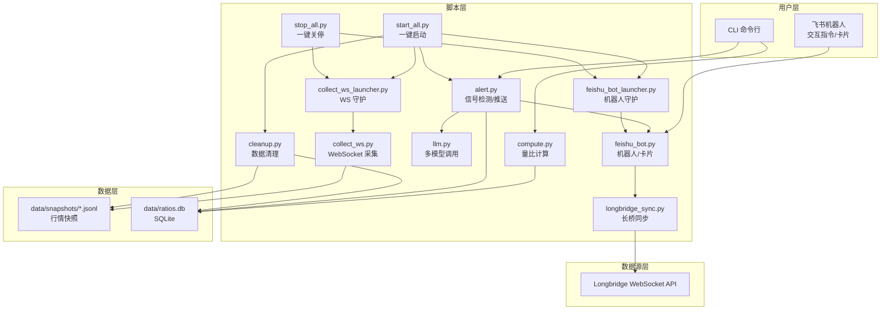
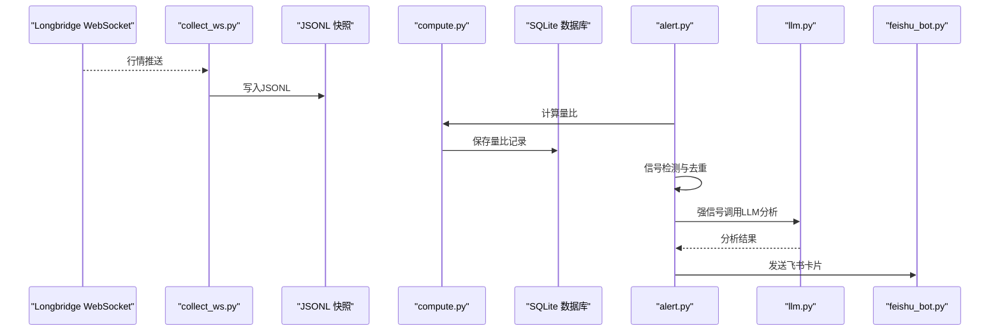
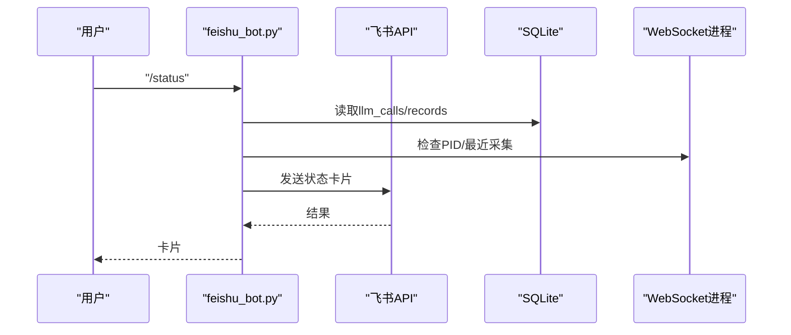
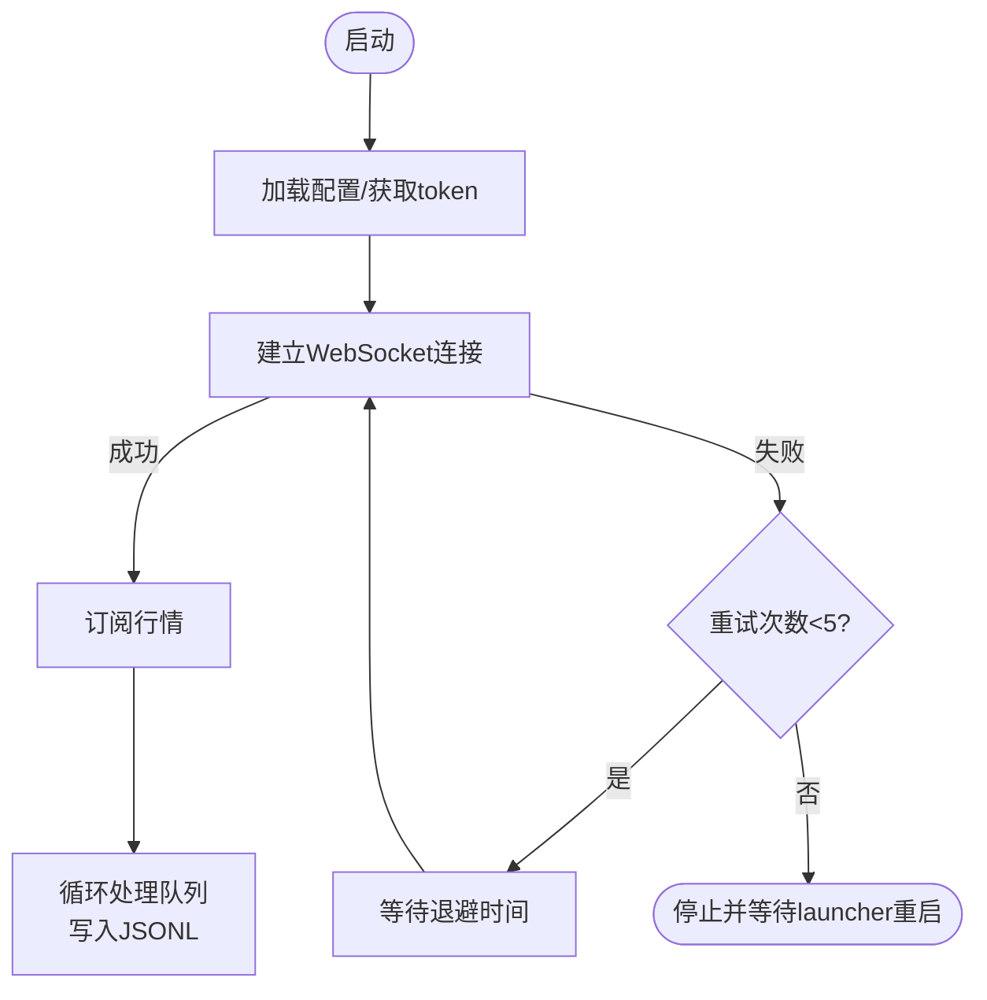
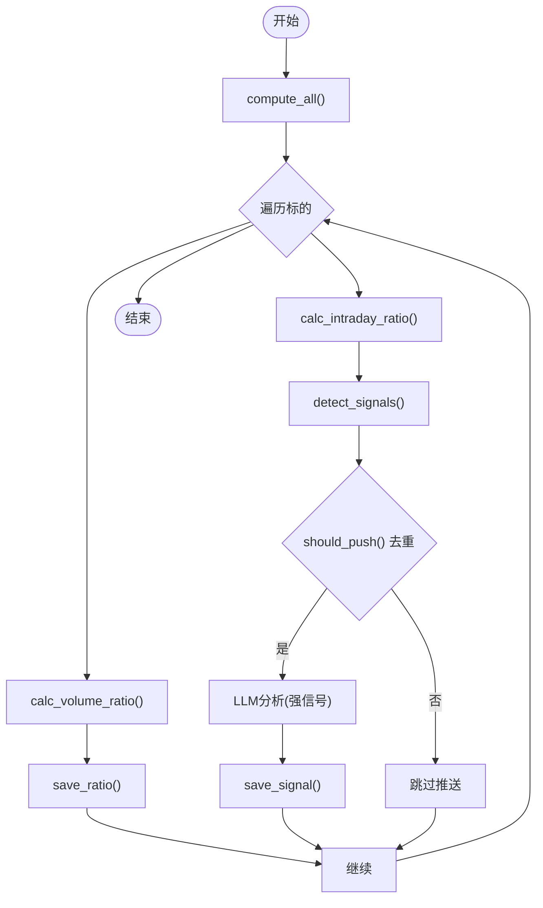
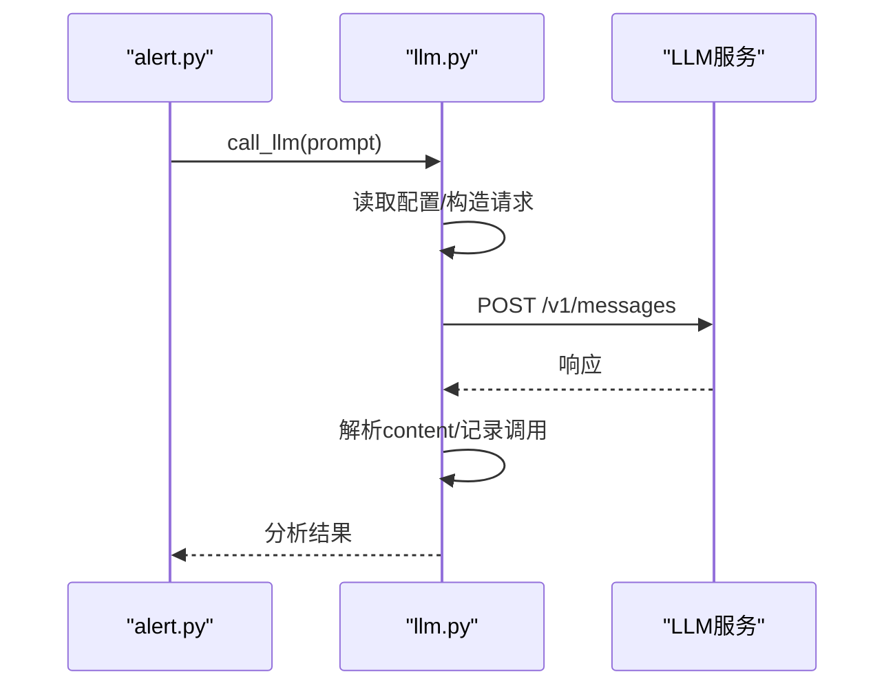
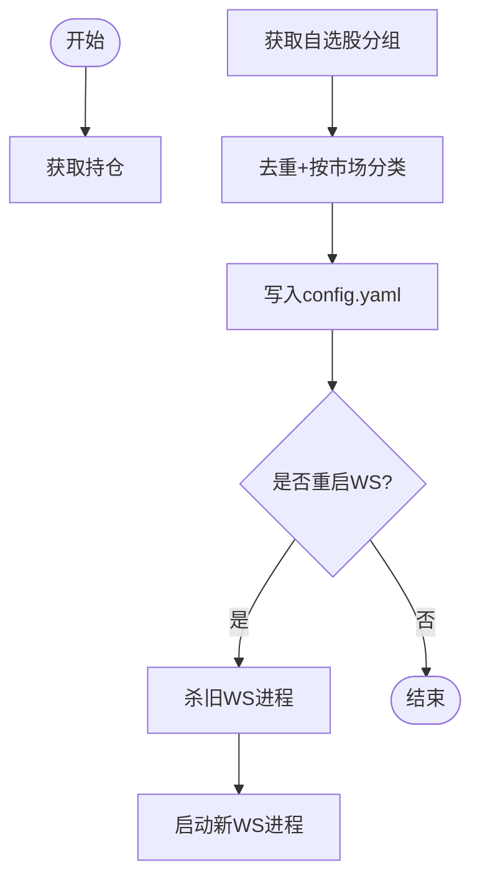
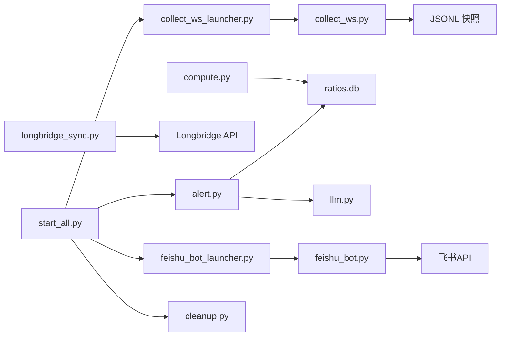

# 故障排查

<cite>
**本文引用的文件**
- [README.md](file://README.md)
- [config.yaml.example](file://config.yaml.example)
- [scripts/feishu_bot.py](file://scripts/feishu_bot.py)
- [scripts/collect_ws.py](file://scripts/collect_ws.py)
- [scripts/llm.py](file://scripts/llm.py)
- [scripts/alert.py](file://scripts/alert.py)
- [scripts/cli.py](file://scripts/cli.py)
- [scripts/compute.py](file://scripts/compute.py)
- [scripts/core/config.py](file://scripts/core/config.py)
- [scripts/longbridge_sync.py](file://scripts/longbridge_sync.py)
- [scripts/start_all.py](file://scripts/start_all.py)
- [scripts/stop_all.py](file://scripts/stop_all.py)
- [scripts/collect_ws_launcher.py](file://scripts/collect_ws_launcher.py)
- [scripts/feishu_bot_launcher.py](file://scripts/feishu_bot_launcher.py)
- [scripts/cleanup.py](file://scripts/cleanup.py)
</cite>

## 目录
1. [简介](#简介)
2. [项目结构](#项目结构)
3. [核心组件](#核心组件)
4. [架构总览](#架构总览)
5. [详细组件分析](#详细组件分析)
6. [依赖关系分析](#依赖关系分析)
7. [性能考虑](#性能考虑)
8. [故障排查指南](#故障排查指南)
9. [结论](#结论)
10. [附录](#附录)

## 简介
本指南面向系统运维与使用者，提供跨市场量比监控系统的全面故障排查方法。内容涵盖常见问题诊断（如量比显示0.0、飞书机器人无响应、WebSocket进程异常、LLM API调用失败）、日志分析方法（日志位置、格式与关键信息识别）、系统健康检查（进程状态、网络连接、API调用验证）、性能问题定位与优化策略（内存/CPU/网络延迟），以及紧急恢复与数据修复操作。

## 项目结构
系统采用脚本驱动的分层设计：
- 脚本层：采集、计算、告警、CLI、飞书机器人、LLM、同步、守护进程、清理等
- 数据层：JSONL行情快照与SQLite数据库
- 数据源层：Longbridge WebSocket API

图表来源
- [scripts/start_all.py:120-165](file://scripts/start_all.py#L120-L165)
- [scripts/stop_all.py:64-103](file://scripts/stop_all.py#L64-L103)
- [scripts/collect_ws_launcher.py:29-82](file://scripts/collect_ws_launcher.py#L29-L82)
- [scripts/feishu_bot_launcher.py:28-90](file://scripts/feishu_bot_launcher.py#L28-L90)
- [scripts/collect_ws.py:159-214](file://scripts/collect_ws.py#L159-L214)
- [scripts/compute.py:147-194](file://scripts/compute.py#L147-L194)
- [scripts/alert.py:367-448](file://scripts/alert.py#L367-L448)
- [scripts/llm.py:110-159](file://scripts/llm.py#L110-L159)
- [scripts/longbridge_sync.py:209-250](file://scripts/longbridge_sync.py#L209-L250)
- [scripts/cleanup.py:157-211](file://scripts/cleanup.py#L157-L211)

章节来源
- [README.md:106-142](file://README.md#L106-L142)

## 核心组件
- WebSocket 采集：从Longbridge拉取实时行情，写入JSONL快照；具备重试与守护机制
- 量比计算：双引擎（5日历史量比+日内滚动量比），信号检测与去重
- 飞书机器人：WebSocket长连接，支持交互指令与富文本卡片
- LLM调用：多模型切换（MiniMax/Xiaomi等），统一调用层与调用记录
- 长桥同步：将持仓与自选股合并写入watchlist，并可重启WS进程
- 守护进程：WS与机器人每分钟检查，自动拉起
- 数据清理：按市场收盘时间清理JSONL与数据库记录

章节来源
- [scripts/collect_ws.py:159-214](file://scripts/collect_ws.py#L159-L214)
- [scripts/compute.py:197-242](file://scripts/compute.py#L197-L242)
- [scripts/alert.py:61-142](file://scripts/alert.py#L61-L142)
- [scripts/feishu_bot.py:712-800](file://scripts/feishu_bot.py#L712-L800)
- [scripts/llm.py:110-159](file://scripts/llm.py#L110-L159)
- [scripts/longbridge_sync.py:209-250](file://scripts/longbridge_sync.py#L209-L250)
- [scripts/collect_ws_launcher.py:29-82](file://scripts/collect_ws_launcher.py#L29-L82)
- [scripts/feishu_bot_launcher.py:28-90](file://scripts/feishu_bot_launcher.py#L28-L90)
- [scripts/cleanup.py:46-60](file://scripts/cleanup.py#L46-L60)

## 架构总览
系统通过守护进程与定时任务保证服务连续性，数据流从Longbridge到JSONL再到SQLite，最终由飞书机器人推送信号卡片。

图表来源
- [scripts/collect_ws.py:159-214](file://scripts/collect_ws.py#L159-L214)
- [scripts/compute.py:382-402](file://scripts/compute.py#L382-L402)
- [scripts/alert.py:367-448](file://scripts/alert.py#L367-L448)
- [scripts/llm.py:110-159](file://scripts/llm.py#L110-L159)
- [scripts/feishu_bot.py:712-800](file://scripts/feishu_bot.py#L712-L800)

## 详细组件分析

### 飞书机器人组件
- 功能：处理指令、构建卡片、发送消息、状态检查、卡片回调
- 关键点：依赖飞书配置、通过client.im.v1.message.create发送；支持/stop时先发结果卡再关停
- 常见问题：app_id/app_secret未配置、chat_id缺失、卡片发送失败

图表来源
- [scripts/feishu_bot.py:100-163](file://scripts/feishu_bot.py#L100-L163)
- [scripts/feishu_bot.py:712-748](file://scripts/feishu_bot.py#L712-L748)

章节来源
- [scripts/feishu_bot.py:100-163](file://scripts/feishu_bot.py#L100-L163)
- [scripts/feishu_bot.py:712-748](file://scripts/feishu_bot.py#L712-L748)

### WebSocket采集组件
- 功能：建立Longbridge WebSocket连接，订阅行情，回调入队，主线程落盘
- 关键点：重试机制（最多5次，指数退避）、守护进程（PID文件）、后台日志重定向
- 常见问题：token目录缺失、连接失败、进程异常退出

图表来源
- [scripts/collect_ws.py:159-214](file://scripts/collect_ws.py#L159-L214)
- [scripts/collect_ws_launcher.py:29-82](file://scripts/collect_ws_launcher.py#L29-L82)

章节来源
- [scripts/collect_ws.py:159-214](file://scripts/collect_ws.py#L159-L214)
- [scripts/collect_ws_launcher.py:29-82](file://scripts/collect_ws_launcher.py#L29-L82)

### 量比计算与信号检测
- 功能：计算5日历史量比与日内滚动量比，检测信号并去重，保存到数据库
- 关键点：双信号路径（historical/intraday）、信号优先级、LLM分析仅对强信号调用一次
- 常见问题：数据不足（5日历史量比需要至少5个交易日）

图表来源
- [scripts/compute.py:382-402](file://scripts/compute.py#L382-L402)
- [scripts/alert.py:61-142](file://scripts/alert.py#L61-L142)
- [scripts/alert.py:367-448](file://scripts/alert.py#L367-L448)

章节来源
- [scripts/compute.py:197-242](file://scripts/compute.py#L197-L242)
- [scripts/alert.py:61-142](file://scripts/alert.py#L61-L142)
- [scripts/alert.py:367-448](file://scripts/alert.py#L367-L448)

### LLM调用组件
- 功能：统一调用多模型（Anthropic兼容接口），记录调用日志
- 关键点：配置热加载、脱敏显示API Key、数据库记录调用成功/失败
- 常见问题：API Key未配置、网络超时、模型不可用

图表来源
- [scripts/llm.py:110-159](file://scripts/llm.py#L110-L159)
- [scripts/alert.py:248-274](file://scripts/alert.py#L248-L274)

章节来源
- [scripts/llm.py:110-159](file://scripts/llm.py#L110-L159)
- [scripts/alert.py:248-274](file://scripts/alert.py#L248-L274)

### 长桥同步组件
- 功能：合并持仓与自选股，写入config.yaml，支持卡片按钮添加/移除
- 关键点：过滤期权、去重、按市场分类、可重启WS进程
- 常见问题：长桥token缺失、分组不存在、添加/移除失败

图表来源
- [scripts/longbridge_sync.py:209-250](file://scripts/longbridge_sync.py#L209-L250)

章节来源
- [scripts/longbridge_sync.py:209-250](file://scripts/longbridge_sync.py#L209-L250)

## 依赖关系分析
- 进程耦合：WS与机器人通过PID文件与守护进程协作；CLI与alert共享数据库访问
- 外部依赖：Longbridge WebSocket API、飞书OpenAPI、SQLite、本地JSONL文件系统
- 配置热加载：core.config.load_config基于文件mtime缓存，修改config.yaml后自动生效

图表来源
- [scripts/start_all.py:120-165](file://scripts/start_all.py#L120-L165)
- [scripts/collect_ws_launcher.py:29-82](file://scripts/collect_ws_launcher.py#L29-L82)
- [scripts/feishu_bot_launcher.py:28-90](file://scripts/feishu_bot_launcher.py#L28-L90)
- [scripts/compute.py:147-194](file://scripts/compute.py#L147-L194)
- [scripts/alert.py:367-448](file://scripts/alert.py#L367-L448)
- [scripts/llm.py:110-159](file://scripts/llm.py#L110-L159)
- [scripts/longbridge_sync.py:209-250](file://scripts/longbridge_sync.py#L209-L250)
- [scripts/cleanup.py:157-211](file://scripts/cleanup.py#L157-L211)

章节来源
- [scripts/core/config.py:20-31](file://scripts/core/config.py#L20-L31)

## 性能考虑
- 内存使用：JSONL逐行追加，避免大文件一次性读取；计算阶段仅缓存必要字段
- CPU占用：每分钟扫描，信号检测与LLM调用按需触发；WS回调线程仅入队，落盘在主线程
- 网络延迟：WS重试退避、LLM请求超时控制、数据库连接超时
- 存储清理：按市场收盘时间清理JSONL与数据库记录，控制快照与DB增长

章节来源
- [scripts/collect_ws.py:159-214](file://scripts/collect_ws.py#L159-L214)
- [scripts/alert.py:367-448](file://scripts/alert.py#L367-L448)
- [scripts/cleanup.py:46-60](file://scripts/cleanup.py#L46-L60)

## 故障排查指南

### 常见问题与解决方案

- 量比显示0.0/“数据不足”
  - 原因：5日历史量比需要至少5个交易日数据；日内滚动量比正常
  - 处理：等待至少5个交易日或使用日内滚动量比；检查JSONL写入与快照文件
  - 参考：[scripts/compute.py:217-225](file://scripts/compute.py#L217-L225)

- 飞书机器人不响应
  - 检查项：config.yaml中feishu.app_id与app_secret是否正确；机器人是否启用；chat_id是否配置
  - 日志：tail -f logs/feishu_bot.log
  - 参考：[README.md:362-365](file://README.md#L362-L365)，[scripts/feishu_bot.py:40-49](file://scripts/feishu_bot.py#L40-L49)

- WebSocket进程不存在
  - 检查项：查看launcher日志；手动重启collect_ws_launcher.py
  - 日志：cat logs/launcher.log
  - 参考：[README.md:367-369](file://README.md#L367-L369)，[scripts/collect_ws_launcher.py:29-82](file://scripts/collect_ws_launcher.py#L29-L82)

- LLM API调用失败
  - 检查项：确认config.yaml中api_key；使用llm.py --test测试；切换模型
  - 日志：查看ws_collect.log与feishu_bot.log中的错误信息
  - 参考：[README.md:371-375](file://README.md#L371-L375)，[scripts/llm.py:161-193](file://scripts/llm.py#L161-L193)

- 信号未推送
  - 检查项：确认飞书配置与chat_id；检查alert日志；查看去重状态机
  - 参考：[scripts/alert.py:339-364](file://scripts/alert.py#L339-L364)，[scripts/alert.py:199-246](file://scripts/alert.py#L199-L246)

- 长桥同步失败
  - 检查项：~/.longbridge/openapi/tokens是否存在；分组名称是否正确；添加/移除按钮是否可用
  - 参考：[scripts/longbridge_sync.py:18-30](file://scripts/longbridge_sync.py#L18-L30)，[scripts/longbridge_sync.py:124-163](file://scripts/longbridge_sync.py#L124-L163)

### 日志分析方法
- 日志位置与用途
  - ws_collect.log/err：WebSocket采集主/错误日志
  - feishu_bot.log/err：飞书机器人主/错误日志
  - alert.log/brief.log：信号扫描与简报日志
  - launcher.log：守护进程启动日志
  - cleanup.log：数据清理日志
  - sync.log：长桥同步日志
- 关键信息识别
  - 连接/订阅失败、token缺失、进程PID异常、卡片发送失败、LLM调用异常、数据库读写错误
- 参考：[README.md:376-390](file://README.md#L376-L390)

章节来源
- [README.md:354-390](file://README.md#L354-L390)
- [scripts/collect_ws.py:222-257](file://scripts/collect_ws.py#L222-L257)
- [scripts/feishu_bot.py:100-163](file://scripts/feishu_bot.py#L100-L163)
- [scripts/alert.py:199-246](file://scripts/alert.py#L199-L246)
- [scripts/llm.py:110-159](file://scripts/llm.py#L110-L159)

### 系统健康检查
- 进程状态检查
  - ps aux | grep collect_ws / feishu_bot
  - 查看PID文件：logs/ws_collect.pid / logs/feishu_bot.pid
- 网络连接测试
  - Longbridge：检查token目录与网络连通性
  - 飞书：使用llm.py --test验证API连通
- API调用验证
  - CLI：python3 scripts/cli.py --status
  - 飞书：/status指令查看组件状态
- 参考：[README.md:298-310](file://README.md#L298-L310)，[scripts/cli.py:113-178](file://scripts/cli.py#L113-L178)，[scripts/feishu_bot.py:746-748](file://scripts/feishu_bot.py#L746-L748)

章节来源
- [scripts/cli.py:113-178](file://scripts/cli.py#L113-L178)
- [scripts/feishu_bot.py:746-748](file://scripts/feishu_bot.py#L746-L748)

### 性能问题定位与优化
- 内存/CPU
  - 检查WS回调线程与落盘分离是否生效；减少不必要的日志输出
- 网络延迟
  - 优化LLM请求超时；启用WS重试退避；检查防火墙与DNS
- 存储
  - 启用数据清理；监控快照与DB大小；必要时调整保留天数
- 参考：[scripts/collect_ws.py:159-214](file://scripts/collect_ws.py#L159-L214)，[scripts/cleanup.py:157-211](file://scripts/cleanup.py#L157-L211)

章节来源
- [scripts/collect_ws.py:159-214](file://scripts/collect_ws.py#L159-L214)
- [scripts/cleanup.py:157-211](file://scripts/cleanup.py#L157-L211)

### 紧急恢复与数据修复
- 一键启停
  - 启动：python3 scripts/start_all.py
  - 关停：python3 scripts/stop_all.py
- 手动重启守护进程
  - python3 scripts/collect_ws_launcher.py
  - python3 scripts/feishu_bot_launcher.py
- 数据修复
  - 清理过期数据：python3 scripts/cleanup.py --force
  - 查看磁盘占用：python3 scripts/cleanup.py --status
- 配置修复
  - 检查config.yaml格式与字段；使用core.config热加载特性
- 参考：[README.md:94-102](file://README.md#L94-L102)，[scripts/start_all.py:120-165](file://scripts/start_all.py#L120-L165)，[scripts/stop_all.py:64-103](file://scripts/stop_all.py#L64-L103)，[scripts/cleanup.py:157-211](file://scripts/cleanup.py#L157-L211)，[scripts/core/config.py:20-31](file://scripts/core/config.py#L20-L31)

章节来源
- [scripts/start_all.py:120-165](file://scripts/start_all.py#L120-L165)
- [scripts/stop_all.py:64-103](file://scripts/stop_all.py#L64-L103)
- [scripts/cleanup.py:157-211](file://scripts/cleanup.py#L157-L211)
- [scripts/core/config.py:20-31](file://scripts/core/config.py#L20-L31)

## 结论
通过守护进程与定时任务保障服务连续性，配合完善的日志与健康检查机制，系统可在生产环境中稳定运行。遇到问题时，建议按“配置检查→日志分析→组件验证→数据清理”的顺序逐步排查，并利用一键启停与守护进程实现快速恢复。

## 附录
- 快速参考
  - 查看状态：python3 scripts/cli.py --status
  - 手动扫描：python3 scripts/alert.py
  - 发送简报：python3 scripts/alert.py --brief
  - LLM测试：python3 scripts/llm.py --test
  - 同步长桥：python3 scripts/longbridge_sync.py
- 参考：[README.md:237-268](file://README.md#L237-L268)，[scripts/cli.py:372-459](file://scripts/cli.py#L372-L459)