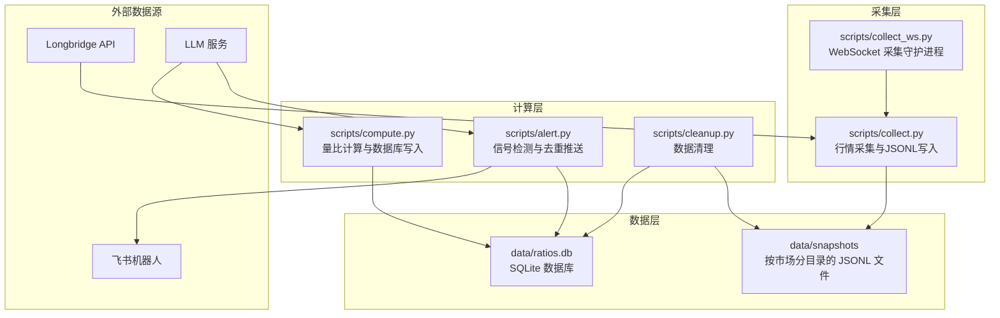
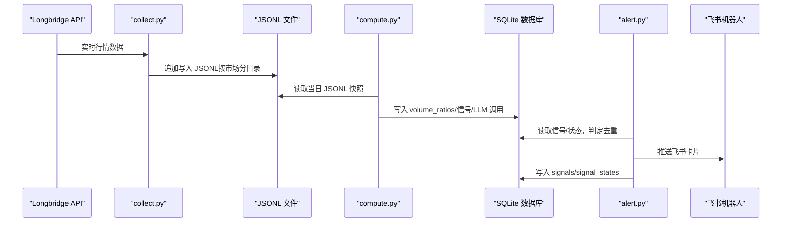
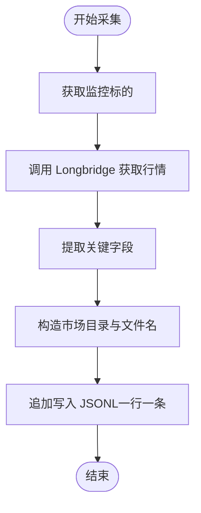
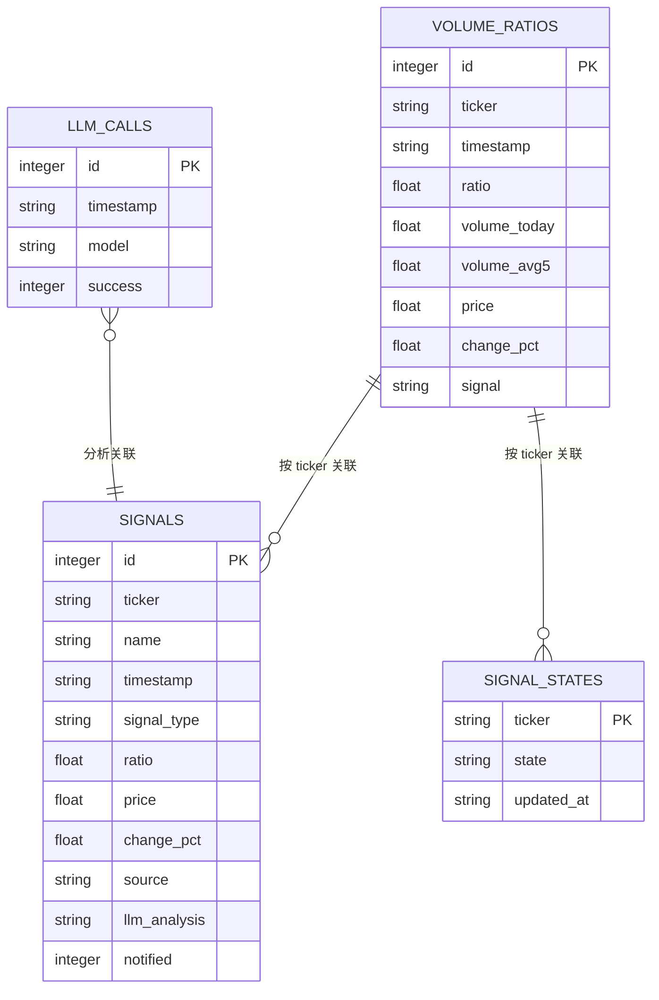
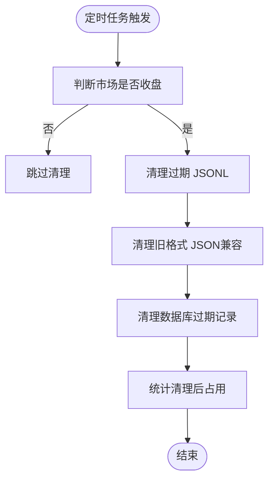
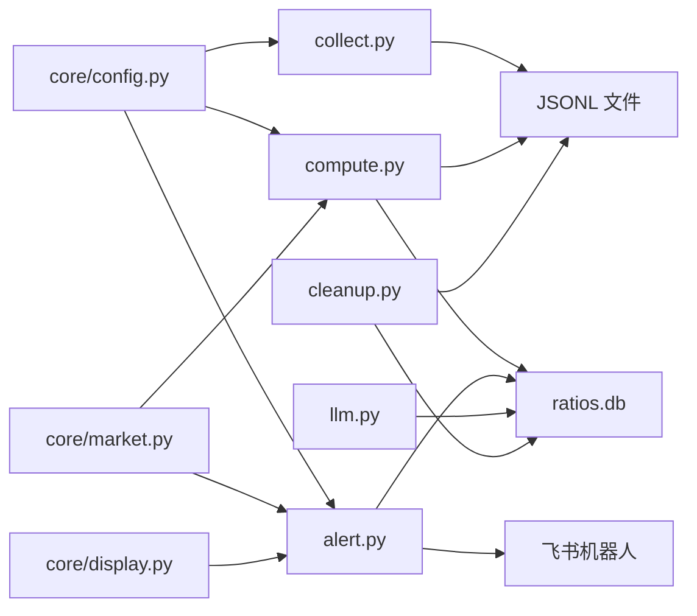

# 数据存储与管理

<cite>
**本文引用的文件**
- [README.md](file://README.md)
- [config.yaml.example](file://config.yaml.example)
- [scripts/core/config.py](file://scripts/core/config.py)
- [scripts/collect.py](file://scripts/collect.py)
- [scripts/compute.py](file://scripts/compute.py)
- [scripts/cleanup.py](file://scripts/cleanup.py)
- [scripts/alert.py](file://scripts/alert.py)
- [scripts/llm.py](file://scripts/llm.py)
- [scripts/longbridge_sync.py](file://scripts/longbridge_sync.py)
- [scripts/core/market.py](file://scripts/core/market.py)
- [scripts/core/display.py](file://scripts/core/display.py)
- [data/ratios.db](file://data/ratios.db)
</cite>

## 目录
1. [简介](#简介)
2. [项目结构](#项目结构)
3. [核心组件](#核心组件)
4. [架构总览](#架构总览)
5. [详细组件分析](#详细组件分析)
6. [依赖关系分析](#依赖关系分析)
7. [性能考量](#性能考量)
8. [故障排查指南](#故障排查指南)
9. [结论](#结论)
10. [附录](#附录)

## 简介
本文件面向“跨市场量比监控系统”的数据存储与管理，系统采用两类主要存储介质：
- JSONL 文件：按市场分目录的每日快照存储，采用追加写入策略，单文件多行，便于高效写入与压缩。
- SQLite 数据库：集中存储量比、信号、LLM 调用等结构化数据，并建立索引以提升查询性能。

系统还包含数据生命周期管理（清理策略）、并发访问控制（进程守护与锁）、数据访问模式（读写分离与去重）、以及备份恢复与迁移建议。

## 项目结构
- data 目录包含：
  - snapshots：按市场分目录的 JSONL 快照文件（US/HK/CN）
  - ratios.db：SQLite 数据库
- scripts 目录包含数据采集、计算、清理、告警、LLM 调用、长桥同步等脚本。

图表来源
- [scripts/collect.py:1-125](file://scripts/collect.py#L1-L125)
- [scripts/compute.py:1-498](file://scripts/compute.py#L1-L498)
- [scripts/alert.py:1-514](file://scripts/alert.py#L1-L514)
- [scripts/cleanup.py:1-216](file://scripts/cleanup.py#L1-L216)

章节来源
- [README.md:106-142](file://README.md#L106-L142)
- [README.md:314-351](file://README.md#L314-L351)

## 核心组件
- JSONL 快照存储
  - 按市场分目录组织（US/HK/CN）
  - 文件命名规范：TICKER_市场_YYYYMMDD.jsonl
  - 追加写入策略：每条行情记录一行，便于高吞吐写入与压缩
- SQLite 数据库
  - 表：volume_ratios、signals、signal_states、llm_calls
  - 索引：signals.timestamp、volume_ratios.ticker
  - 事务与超时控制：保证并发安全与稳定性
- 数据生命周期管理
  - JSONL：20 天
  - volume_ratios、signals：20 天
  - daily_summary：90 天
- 数据访问模式
  - 采集侧：写 JSONL（追加）
  - 计算侧：读 JSONL + 写 SQLite
  - 告警侧：读 SQLite + 写 SQLite + 飞书推送
- 并发访问控制
  - 守护进程（collect_ws_launcher、feishu_bot_launcher）保障服务存活
  - SQLite 连接设置超时，避免阻塞
- 备份与迁移
  - SQLite 备份：直接复制 .db 文件
  - JSONL 备份：按市场目录打包
  - 迁移：重建索引、调整保留策略、校验数据完整性

章节来源
- [README.md:314-351](file://README.md#L314-L351)
- [scripts/collect.py:81-95](file://scripts/collect.py#L81-L95)
- [scripts/compute.py:147-195](file://scripts/compute.py#L147-L195)
- [scripts/cleanup.py:63-113](file://scripts/cleanup.py#L63-L113)

## 架构总览
系统围绕“采集-计算-告警-存储”闭环展开，数据流如下：
- Longbridge API 提供实时行情 → 采集脚本写入 JSONL → 计算脚本读取 JSONL 计算量比并写入 SQLite → 告警脚本读取 SQLite 判定信号并推送 → 清理脚本定期清理过期数据。

图表来源
- [scripts/collect.py:81-95](file://scripts/collect.py#L81-L95)
- [scripts/compute.py:340-375](file://scripts/compute.py#L340-L375)
- [scripts/alert.py:367-448](file://scripts/alert.py#L367-L448)

## 详细组件分析

### JSONL 快照存储机制
- 组织方式
  - 目录：data/snapshots/{US|HK|CN}/
  - 文件：TICKER_市场_YYYYMMDD.jsonl（例如 CLF_US_20260429.jsonl）
- 写入策略
  - 追加写入：每次采集一条记录写一行，无需随机访问
  - 压缩友好：单文件多行，利于压缩与后续归档
- 读取策略
  - 读取当日 JSONL 文件，逐行解析为记录
  - 支持按时间窗口计算差分量（区间成交量）

图表来源
- [scripts/collect.py:27-95](file://scripts/collect.py#L27-L95)

章节来源
- [scripts/collect.py:81-95](file://scripts/collect.py#L81-L95)
- [scripts/compute.py:48-71](file://scripts/compute.py#L48-L71)

### SQLite 数据库设计
- 表结构与关系
  - volume_ratios：量比实时记录（按 ticker+timestamp 唯一）
  - signals：信号记录（含通知标记）
  - signal_states：信号去重状态机（ticker 主键）
  - llm_calls：LLM 调用记录（时间戳、模型、成功标记）
- 索引
  - signals.timestamp：加速按时间查询
  - volume_ratios.ticker：加速按标的查询
- 初始化与并发
  - 首次连接时创建表与索引
  - 连接超时控制，避免长时间阻塞

图表来源
- [scripts/compute.py:147-195](file://scripts/compute.py#L147-L195)
- [scripts/alert.py:292-337](file://scripts/alert.py#L292-L337)
- [scripts/llm.py:93-108](file://scripts/llm.py#L93-L108)

章节来源
- [scripts/compute.py:147-195](file://scripts/compute.py#L147-L195)
- [scripts/alert.py:292-337](file://scripts/alert.py#L292-L337)
- [scripts/llm.py:93-108](file://scripts/llm.py#L93-L108)

### 数据生命周期管理
- 清理规则
  - JSONL 快照：保留 20 天（按 YYYYMMDD 截断比较）
  - volume_ratios、signals：保留 20 天（按 timestamp）
  - daily_summary：保留 90 天（按 date 字段）
- 市场关闭检测
  - A股：16:30 后清理
  - 港股：17:00 后清理
  - 美股：ET 17:00 后清理
- 干跑与统计
  - 支持 --dry-run 预览清理内容
  - 支持 --status 统计磁盘占用与文件数量

图表来源
- [scripts/cleanup.py:46-61](file://scripts/cleanup.py#L46-L61)
- [scripts/cleanup.py:63-113](file://scripts/cleanup.py#L63-L113)
- [scripts/cleanup.py:115-207](file://scripts/cleanup.py#L115-L207)

章节来源
- [scripts/cleanup.py:63-113](file://scripts/cleanup.py#L63-L113)
- [scripts/cleanup.py:115-207](file://scripts/cleanup.py#L115-L207)

### 数据访问模式与并发控制
- 读写分离
  - 采集写 JSONL，计算读 JSONL 并写 SQLite，告警读 SQLite 并写 SQLite
- 并发与守护
  - collect_ws_launcher、feishu_bot_launcher 每分钟检查并重启挂掉的进程
  - SQLite 连接设置超时，避免阻塞
- 去重与状态机
  - signal_states 记录上次状态，按优先级决定是否推送
  - 强信号才调用 LLM，减少 API 调用成本

章节来源
- [scripts/alert.py:339-448](file://scripts/alert.py#L339-L448)
- [scripts/llm.py:93-108](file://scripts/llm.py#L93-L108)

### 数据备份与恢复
- 备份
  - SQLite：直接复制 data/ratios.db
  - JSONL：按市场目录打包 data/snapshots/{US|HK|CN}
- 恢复
  - 恢复 SQLite：将 .db 文件放回 data/ 目录
  - 恢复 JSONL：解压对应市场的目录
- 迁移
  - 新环境部署后，先恢复 .db，再恢复 JSONL
  - 如需调整保留策略，修改清理脚本的保留天数并重新运行清理

章节来源
- [scripts/cleanup.py:157-211](file://scripts/cleanup.py#L157-L211)

## 依赖关系分析
- 采集层依赖
  - Longbridge CLI/SDK 获取行情
  - JSONL 文件系统写入
- 计算层依赖
  - 读取 JSONL 快照
  - 写入 SQLite（volume_ratios、signals、signal_states、llm_calls）
- 告警层依赖
  - 读取 SQLite 进行信号判定与去重
  - 飞书机器人推送
- 配置与市场工具
  - 配置热加载与 watchlist 解析
  - 市场判断与交易时间检测

图表来源
- [scripts/collect.py:23-24](file://scripts/collect.py#L23-L24)
- [scripts/compute.py:23-24](file://scripts/compute.py#L23-L24)
- [scripts/alert.py:20-22](file://scripts/alert.py#L20-L22)
- [scripts/llm.py:22](file://scripts/llm.py#L22)
- [scripts/cleanup.py:25](file://scripts/cleanup.py#L25)
- [scripts/core/config.py:20-31](file://scripts/core/config.py#L20-L31)
- [scripts/core/market.py:11-47](file://scripts/core/market.py#L11-L47)
- [scripts/core/display.py:1-102](file://scripts/core/display.py#L1-L102)

章节来源
- [scripts/core/config.py:20-31](file://scripts/core/config.py#L20-L31)
- [scripts/core/market.py:11-47](file://scripts/core/market.py#L11-L47)

## 性能考量
- JSONL 写入
  - 追加写入，避免随机 IO；单文件多行，压缩友好
- SQLite 查询
  - 为 signals.timestamp、volume_ratios.ticker 建立索引
  - 连接超时控制，避免长时间阻塞
- 信号去重
  - 使用 signal_states 降低重复推送与 LLM 调用
- 清理策略
  - 按市场收盘后清理，避免影响实时计算
  - 干跑预览，减少误删风险

章节来源
- [scripts/compute.py:192-194](file://scripts/compute.py#L192-L194)
- [scripts/alert.py:339-448](file://scripts/alert.py#L339-L448)
- [scripts/cleanup.py:157-211](file://scripts/cleanup.py#L157-L211)

## 故障排查指南
- 量比显示 0.0 “数据不足”
  - 5 日历史量比需要至少 5 个交易日数据
  - 可查看 ratio_intraday 日内滚动量比
- WebSocket 进程不存在
  - 查看守护进程日志，手动重启采集进程
- LLM API 调用失败
  - 检查 config.yaml 中 api_key
  - 使用 llm.py --test 测试连接
  - 切换模型：llm.py --switch minimax/xiaomi
- 飞书机器人不响应
  - 检查 feishu.app_id 与 app_secret
  - 确认飞书开放平台已开启机器人能力、配置权限、发布版本

章节来源
- [README.md:354-390](file://README.md#L354-L390)
- [scripts/llm.py:161-193](file://scripts/llm.py#L161-L193)

## 结论
本系统通过 JSONL 快照与 SQLite 数据库的协同，实现了高吞吐、低延迟的数据采集与分析闭环。按市场分目录的 JSONL 组织方式与追加写入策略有效降低了 IO 成本；SQLite 的索引与事务控制保障了查询与写入的稳定性；清理脚本与守护进程确保了长期运行的可靠性。建议在生产环境中定期备份 .db 与 snapshots 目录，并根据业务需求调整保留策略与清理频率。

## 附录
- 配置文件
  - config.yaml.example 展示了 watchlist、params、llm、feishu 等配置项
- 命令行工具
  - llm.py 支持模型切换与测试
  - cleanup.py 支持干跑与状态统计
- 长桥同步
  - longbridge_sync.py 支持将持仓与自选股同步至 watchlist，并可添加/移除分组

章节来源
- [config.yaml.example:1-73](file://config.yaml.example#L1-L73)
- [scripts/llm.py:161-193](file://scripts/llm.py#L161-L193)
- [scripts/cleanup.py:157-211](file://scripts/cleanup.py#L157-L211)
- [scripts/longbridge_sync.py:209-250](file://scripts/longbridge_sync.py#L209-L250)