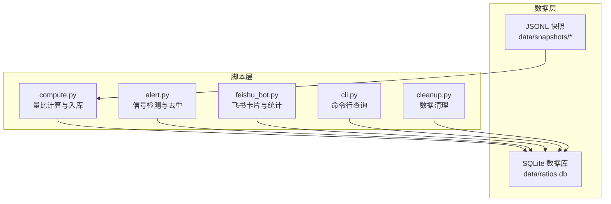
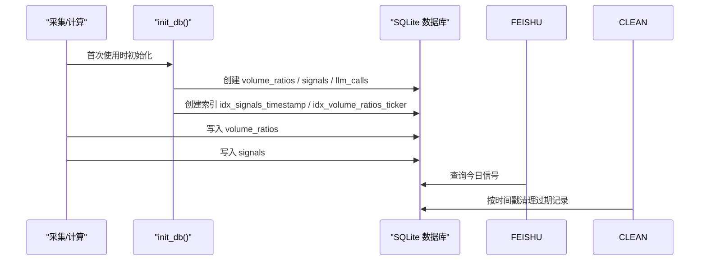
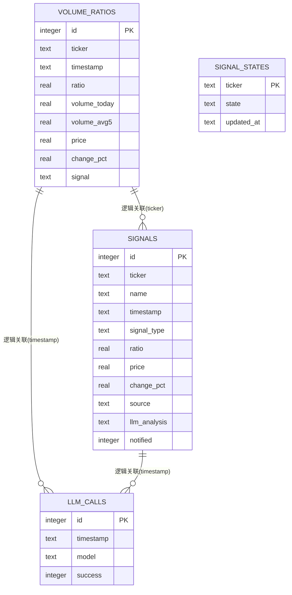
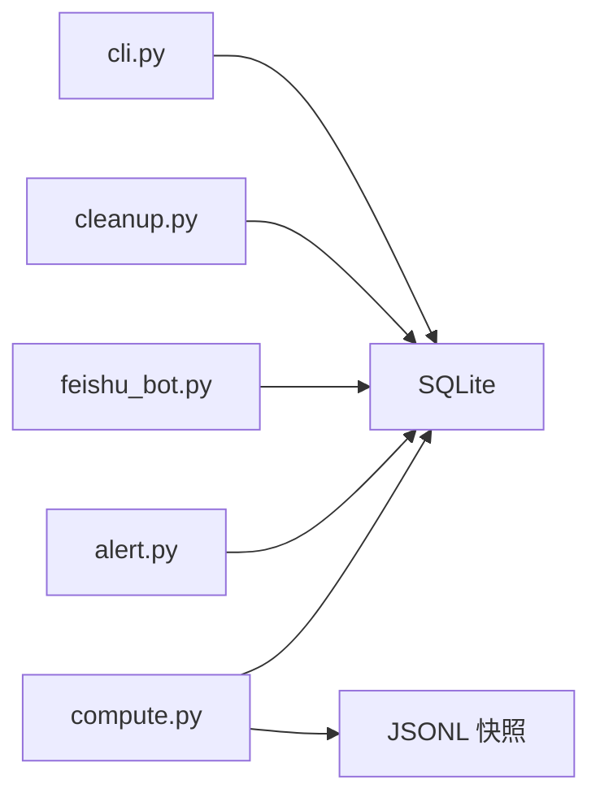

# 数据库设计

<cite>
**本文引用的文件**
- [README.md](file://README.md)
- [compute.py](file://scripts/compute.py)
- [alert.py](file://scripts/alert.py)
- [feishu_bot.py](file://scripts/feishu_bot.py)
- [cli.py](file://scripts/cli.py)
- [cleanup.py](file://scripts/cleanup.py)
- [config.py](file://scripts/core/config.py)
- [.gitignore](file://.gitignore)
</cite>

## 目录
1. [简介](#简介)
2. [项目结构](#项目结构)
3. [核心组件](#核心组件)
4. [架构总览](#架构总览)
5. [详细组件分析](#详细组件分析)
6. [依赖分析](#依赖分析)
7. [性能考虑](#性能考虑)
8. [故障排查指南](#故障排查指南)
9. [结论](#结论)
10. [附录](#附录)

## 简介
本文件系统性梳理 SQLite 数据库在跨市场量比监控系统中的设计与使用，重点覆盖以下内容：
- volume_ratios 表的字段定义、业务语义与索引策略
- signals 表的字段设计、业务含义与查询用途
- llm_calls 表的记录结构与调用统计功能
- 数据库初始化流程 init_db 的创建逻辑与约束定义
- 表间关系与约束（含 UNIQUE 约束与索引优化）
- 查询示例与性能优化建议

## 项目结构
数据库位于 data/ratios.db，采用 SQLite 存储，配合 JSONL 快照文件进行高频写入与低频查询。系统通过多个脚本模块协同完成数据采集、计算、存储与展示。

图表来源
- [compute.py:138-194](file://scripts/compute.py#L138-L194)
- [feishu_bot.py:124-155](file://scripts/feishu_bot.py#L124-L155)
- [cli.py:157-177](file://scripts/cli.py#L157-L177)
- [cleanup.py:115-128](file://scripts/cleanup.py#L115-L128)

章节来源
- [README.md:326-350](file://README.md#L326-L350)
- [.gitignore:12-14](file://.gitignore#L12-L14)

## 核心组件
本节聚焦数据库三层表结构：volume_ratios、signals、llm_calls，并说明其字段语义、约束与索引。

- volume_ratios 表
  - 用途：记录量比实时数据，支持 5 日历史量比与日内滚动量比的对比分析
  - 关键字段：ticker、timestamp、ratio、volume_today、volume_avg5、price、change_pct、signal
  - 约束：UNIQUE(ticker, timestamp)，避免同标的同时间重复写入
  - 索引：idx_volume_ratios_ticker（按 ticker 查询）

- signals 表
  - 用途：记录触发的信号事件，便于飞书卡片展示与后续分析
  - 关键字段：ticker、name、timestamp、signal_type、ratio、price、change_pct、source、llm_analysis、notified
  - 默认值：notified 默认 1，表示“已通知”
  - 索引：idx_signals_timestamp（按时间过滤）

- llm_calls 表
  - 用途：记录 LLM API 调用情况，支持今日调用次数统计
  - 关键字段：timestamp、model、success
  - 默认值：success 默认 1

章节来源
- [compute.py:156-194](file://scripts/compute.py#L156-L194)
- [feishu_bot.py:129-140](file://scripts/feishu_bot.py#L129-L140)

## 架构总览
数据库初始化与使用贯穿采集、计算、告警、展示与清理全流程。

图表来源
- [compute.py:147-194](file://scripts/compute.py#L147-L194)
- [feishu_bot.py:200-229](file://scripts/feishu_bot.py#L200-L229)
- [cleanup.py:115-128](file://scripts/cleanup.py#L115-L128)

## 详细组件分析

### volume_ratios 表设计与索引策略
- 字段定义与业务含义
  - id：自增主键
  - ticker：标的代码（如 CLF.US）
  - timestamp：记录时间（ISO 字符串）
  - ratio：量比数值
  - volume_today：当日同时段真实成交量（差分）
  - volume_avg5：过去 5 日同一时段平均成交量
  - price：当前价格
  - change_pct：涨跌幅百分比
  - signal：信号类别（如“正常”、“放量”等）

- 约束与索引
  - UNIQUE(ticker, timestamp)：保证同一标的在同一时刻仅有一条记录
  - idx_volume_ratios_ticker：加速按标的维度的查询与聚合

- 典型查询场景
  - 按标的查询最新记录
  - 按时间范围统计量比分布
  - 计算某标的的历史趋势

章节来源
- [compute.py:156-167](file://scripts/compute.py#L156-L167)
- [compute.py:192-193](file://scripts/compute.py#L192-L193)

### signals 表设计与业务含义
- 字段定义与业务含义
  - id：自增主键
  - ticker/name：标的及中文名
  - timestamp：信号触发时间
  - signal_type：信号类型（如“放量止跌”、“尾盘放量”等）
  - ratio/price/change_pct：触发时的量比与价格信息
  - source：信号来源（如“intraday”表示日内滚动量比）
  - llm_analysis：LLM 分析结果（用于卡片展示）
  - notified：是否已通知（默认 1）

- 典型查询场景
  - 今日信号列表（按时间排序）
  - 按标的查询历史信号
  - 按信号类型统计

- 与飞书卡片的关系
  - 飞书卡片通过 signals 表构造今日信号列表，包含 ticker、name、signal_type、ratio、price、change_pct、source、timestamp 等字段

章节来源
- [compute.py:170-182](file://scripts/compute.py#L170-L182)
- [feishu_bot.py:200-229](file://scripts/feishu_bot.py#L200-L229)

### llm_calls 表设计与调用统计
- 字段定义与用途
  - id：自增主键
  - timestamp：调用时间
  - model：所用模型
  - success：调用成功标记（默认 1）

- 统计功能
  - 飞书状态页统计今日 LLM 调用次数：COUNT(*) WHERE timestamp LIKE “YYYY-MM-DD%”

章节来源
- [compute.py:185-190](file://scripts/compute.py#L185-L190)
- [feishu_bot.py:129-140](file://scripts/feishu_bot.py#L129-L140)

### 数据库初始化流程 init_db
- 初始化时机
  - 首次使用数据库时执行，全局标志防止重复初始化

- 创建逻辑
  - 创建 volume_ratios、signals、llm_calls 三张表
  - 定义 UNIQUE 约束与索引
  - 事务内一次性创建，保证原子性

- 约束与索引
  - volume_ratios：UNIQUE(ticker, timestamp)
  - signals：idx_signals_timestamp
  - volume_ratios：idx_volume_ratios_ticker

章节来源
- [compute.py:147-194](file://scripts/compute.py#L147-L194)

### 表间关系与约束
- 当前数据库设计中，volume_ratios、signals、llm_calls 为独立表，无显式外键约束
- 业务关联通过字段（如 ticker、timestamp）进行逻辑关联
- signal_states 表用于信号去重的状态机，独立存在，不参与上述三表的外键关系

图表来源
- [compute.py:156-190](file://scripts/compute.py#L156-L190)
- [alert.py:302-336](file://scripts/alert.py#L302-L336)

## 依赖分析
- 依赖关系
  - compute.py：负责量比计算、入库与初始化
  - alert.py：负责信号检测、去重与状态机（依赖 signal_states）
  - feishu_bot.py：负责飞书卡片与统计（依赖 signals、llm_calls）
  - cleanup.py：负责按时间戳清理 volume_ratios、signals 与 daily_summary
  - cli.py：负责命令行查询（依赖 volume_ratios、signals、llm_calls）

- 外部依赖
  - SQLite：本地数据库
  - JSONL 文件：按天存储行情快照，供 volume_ratios 计算使用

图表来源
- [compute.py:138-194](file://scripts/compute.py#L138-L194)
- [feishu_bot.py:124-155](file://scripts/feishu_bot.py#L124-L155)
- [cli.py:157-177](file://scripts/cli.py#L157-L177)
- [cleanup.py:115-128](file://scripts/cleanup.py#L115-L128)

章节来源
- [README.md:326-350](file://README.md#L326-L350)

## 性能考虑
- 索引策略
  - idx_signals_timestamp：按时间过滤（如今日信号查询）非常关键
  - idx_volume_ratios_ticker：按标的查询与聚合常用
- 时间字段存储
  - timestamp 以文本存储（ISO 字符串），便于 LIKE 查询（如“YYYY-MM-DD%”），但不利于跨日期范围的数值比较
- 建议
  - 若需频繁跨日期范围查询，可考虑引入 date_only 或整型时间戳字段，配合数值索引
  - 对高频查询字段（如 ticker、timestamp）保持现有索引
  - 控制单日写入量，避免 SQLite 在高并发写入下的锁竞争

## 故障排查指南
- 数据库不存在
  - 现象：飞书卡片提示数据库不存在；CLI 无法查询
  - 处理：首次运行时 init_db 会自动创建；确认 data/ratios.db 是否被忽略或删除
- 查询失败
  - 现象：部分查询返回空或报错
  - 处理：检查表是否存在、索引是否创建；确认时间格式与 LIKE 模式匹配
- 数据清理
  - 现象：数据量过大导致空间占用高
  - 处理：使用 cleanup.py 按保留天数清理 volume_ratios、signals 与 daily_summary

章节来源
- [feishu_bot.py:207-212](file://scripts/feishu_bot.py#L207-L212)
- [cli.py:157-177](file://scripts/cli.py#L157-L177)
- [cleanup.py:115-128](file://scripts/cleanup.py#L115-L128)

## 结论
本数据库设计围绕“高频写入、低频查询”的特点，采用 SQLite 与 JSONL 快照相结合的方式，实现了量比计算、信号记录与 LLM 调用统计的完整闭环。通过合理的索引与约束，满足了日常监控与展示需求。未来可在时间字段与查询模式上进一步优化，以提升跨日期范围查询的效率。

## 附录

### 查询示例与建议
- 查询今日信号（按时间排序）
  - SQL 示例：SELECT ticker, name, signal_type, ratio, price, change_pct, source, timestamp FROM signals WHERE timestamp LIKE “YYYY-MM-DD%” ORDER BY timestamp
  - 适用场景：飞书卡片与 CLI 的“今日信号”展示
- 统计今日 LLM 调用次数
  - SQL 示例：SELECT COUNT(*) FROM llm_calls WHERE timestamp LIKE “YYYY-MM-DD%”
  - 适用场景：飞书状态页
- 按标的查询最新量比
  - SQL 示例：SELECT * FROM volume_ratios WHERE ticker = ? ORDER BY timestamp DESC LIMIT 1
  - 适用场景：按标的查看最新量比与信号

章节来源
- [feishu_bot.py:214-229](file://scripts/feishu_bot.py#L214-L229)
- [feishu_bot.py:131-138](file://scripts/feishu_bot.py#L131-L138)
- [compute.py:340-374](file://scripts/compute.py#L340-L374)