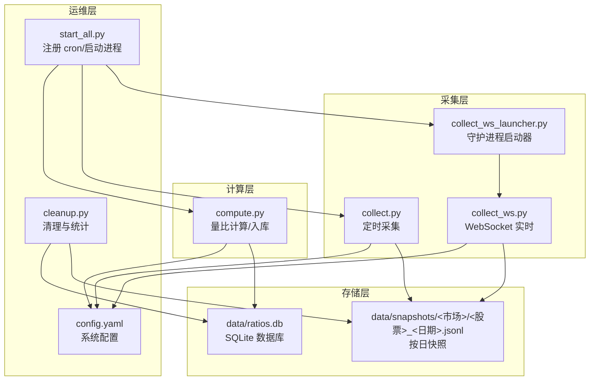
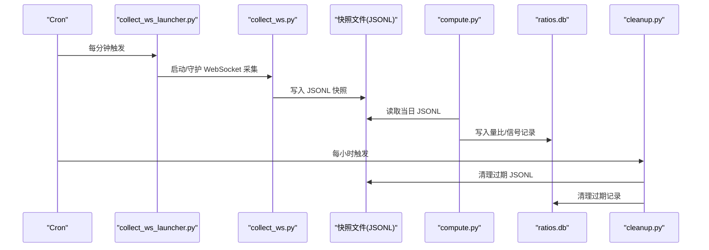
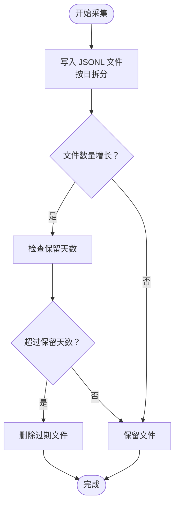
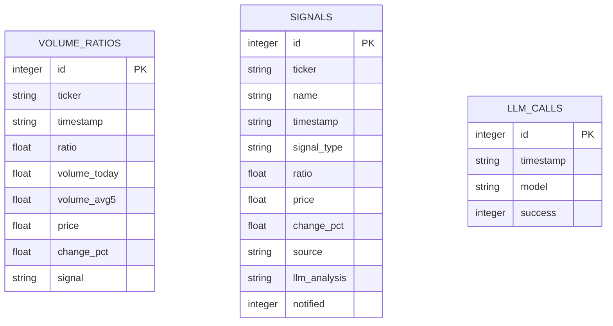
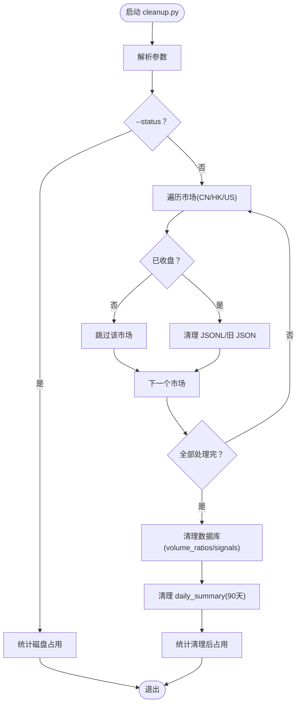
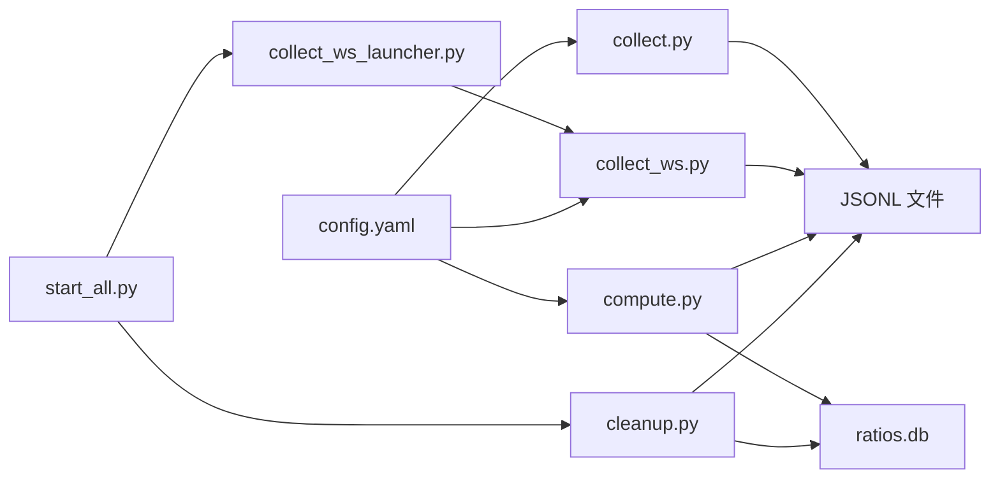

# 数据生命周期管理

<cite>
**本文引用的文件**
- [scripts/cleanup.py](file://scripts/cleanup.py)
- [scripts/collect.py](file://scripts/collect.py)
- [scripts/collect_ws.py](file://scripts/collect_ws.py)
- [scripts/collect_ws_launcher.py](file://scripts/collect_ws_launcher.py)
- [scripts/compute.py](file://scripts/compute.py)
- [scripts/core/config.py](file://scripts/core/config.py)
- [scripts/core/market.py](file://scripts/core/market.py)
- [scripts/start_all.py](file://scripts/start_all.py)
- [config.yaml](file://config.yaml)
- [config.yaml.example](file://config.yaml.example)
</cite>

## 目录
1. [简介](#简介)
2. [项目结构](#项目结构)
3. [核心组件](#核心组件)
4. [架构总览](#架构总览)
5. [详细组件分析](#详细组件分析)
6. [依赖关系分析](#依赖关系分析)
7. [性能考量](#性能考量)
8. [故障排查指南](#故障排查指南)
9. [结论](#结论)
10. [附录](#附录)

## 简介
本文件系统性阐述该跨市场量比监控系统在数据生命周期管理方面的策略与实现，涵盖以下方面：
- 快照数据的存储策略与增长管理（按日 JSONL 文件）
- 量比与信号数据的存储周期与历史保留规则
- 数据清理脚本的工作原理与清理策略
- 数据压缩与归档机制（现状与建议）
- 数据备份与恢复方案（数据库与快照文件）
- 数据迁移指南（版本间格式变更与迁移步骤）
- 数据完整性检查与修复机制

## 项目结构
系统围绕“采集-计算-存储-清理”的闭环组织，核心目录与文件如下：
- scripts/：业务脚本与核心模块
  - collect.py / collect_ws.py：行情采集（定时与 WebSocket）
  - compute.py：量比计算与数据库写入
  - cleanup.py：数据清理与磁盘占用统计
  - core/config.py / core/market.py：配置与市场工具
  - start_all.py：一键启动与 cron 注册
  - collect_ws_launcher.py：WebSocket 启动器
- data/：数据存储目录（快照与 SQLite 数据库）
- logs/：运行日志
- config.yaml / config.yaml.example：系统配置

图表来源
- [scripts/collect.py:1-125](file://scripts/collect.py#L1-L125)
- [scripts/collect_ws.py:1-258](file://scripts/collect_ws.py#L1-L258)
- [scripts/collect_ws_launcher.py:1-83](file://scripts/collect_ws_launcher.py#L1-L83)
- [scripts/compute.py:1-498](file://scripts/compute.py#L1-L498)
- [scripts/start_all.py:1-169](file://scripts/start_all.py#L1-L169)
- [scripts/cleanup.py:1-216](file://scripts/cleanup.py#L1-L216)
- [config.yaml:1-45](file://config.yaml#L1-L45)

章节来源
- [scripts/collect.py:1-125](file://scripts/collect.py#L1-L125)
- [scripts/collect_ws.py:1-258](file://scripts/collect_ws.py#L1-L258)
- [scripts/collect_ws_launcher.py:1-83](file://scripts/collect_ws_launcher.py#L1-L83)
- [scripts/compute.py:1-498](file://scripts/compute.py#L1-L498)
- [scripts/start_all.py:1-169](file://scripts/start_all.py#L1-L169)
- [scripts/cleanup.py:1-216](file://scripts/cleanup.py#L1-L216)
- [config.yaml:1-45](file://config.yaml#L1-L45)

## 核心组件
- 快照采集与存储
  - 定时采集：collect.py 每分钟从长桥 CLI 获取报价并写入 data/snapshots/<市场>/<股票>_<YYYYMMDD>.jsonl（按日文件，逐条 JSONL 记录）
  - 实时采集：collect_ws.py 通过 WebSocket 接收推送，主线程负责落盘，避免后台模式下文件丢失
- 量比与信号计算与存储
  - compute.py 从 JSONL 读取当日快照，计算量比与信号，并写入 SQLite 数据库（volume_ratios、signals 表）
- 数据清理与磁盘管理
  - cleanup.py 每小时由 cron 调用，按市场收盘状态动态清理过期数据；支持按保留天数清理 JSONL 快照与数据库记录
- 配置与市场工具
  - core/config.py 提供热加载配置；core/market.py 提供市场判断与标的遍历
- 启动与调度
  - start_all.py 注册 cron 任务，包含清理脚本的定时执行

章节来源
- [scripts/collect.py:81-95](file://scripts/collect.py#L81-L95)
- [scripts/collect_ws.py:138-147](file://scripts/collect_ws.py#L138-L147)
- [scripts/compute.py:340-375](file://scripts/compute.py#L340-L375)
- [scripts/cleanup.py:63-129](file://scripts/cleanup.py#L63-L129)
- [scripts/core/config.py:20-32](file://scripts/core/config.py#L20-L32)
- [scripts/core/market.py:50-59](file://scripts/core/market.py#L50-L59)
- [scripts/start_all.py:140](file://scripts/start_all.py#L140)

## 架构总览
系统采用“采集-计算-存储-清理”闭环，核心流程如下：

图表来源
- [scripts/start_all.py:135-140](file://scripts/start_all.py#L135-L140)
- [scripts/collect_ws_launcher.py:29-79](file://scripts/collect_ws_launcher.py#L29-L79)
- [scripts/collect_ws.py:159-214](file://scripts/collect_ws.py#L159-L214)
- [scripts/compute.py:451-483](file://scripts/compute.py#L451-L483)
- [scripts/cleanup.py:157-211](file://scripts/cleanup.py#L157-L211)

## 详细组件分析

### 快照数据存储策略与增长管理
- 文件命名与组织
  - 文件路径：data/snapshots/<市场>/<股票>_<YYYYMMDD>.jsonl
  - 每日一个文件，逐条记录为 JSONL 行，便于增量读取与压缩
- 采集方式
  - 定时采集：collect.py 每分钟从长桥 CLI 获取报价并追加写入
  - 实时采集：collect_ws.py 通过 WebSocket 接收推送，主线程负责落盘
- 增长控制
  - 通过 cleanup.py 按保留天数清理过期 JSONL 文件
  - 支持两种 JSONL 格式：按日文件与旧格式单文件（过渡期兼容）

图表来源
- [scripts/collect.py:81-95](file://scripts/collect.py#L81-L95)
- [scripts/collect_ws.py:138-147](file://scripts/collect_ws.py#L138-L147)
- [scripts/cleanup.py:63-113](file://scripts/cleanup.py#L63-L113)

章节来源
- [scripts/collect.py:81-95](file://scripts/collect.py#L81-L95)
- [scripts/collect_ws.py:126-147](file://scripts/collect_ws.py#L126-L147)
- [scripts/cleanup.py:63-113](file://scripts/cleanup.py#L63-L113)

### 量比与信号数据的存储周期与历史保留
- 数据库表结构
  - volume_ratios：保存每日量比计算结果（含时间戳索引）
  - signals：保存信号记录（含通知标记）
  - llm_calls：保存 LLM 调用记录（用于统计）
- 保留策略
  - volume_ratios 与 signals：保留 20 天
  - daily_summary：保留 90 天（使用 date 字段）
- 清理逻辑
  - 按 timestamp 或 date 字段删除过期记录
  - 支持 dry-run 与 force 参数进行调试与强制清理

图表来源
- [scripts/compute.py:155-194](file://scripts/compute.py#L155-L194)
- [scripts/cleanup.py:115-129](file://scripts/cleanup.py#L115-L129)

章节来源
- [scripts/compute.py:155-194](file://scripts/compute.py#L155-L194)
- [scripts/cleanup.py:115-129](file://scripts/cleanup.py#L115-L129)

### 数据清理脚本工作原理与策略
- 触发与频率
  - 通过 cron 每小时执行一次
  - 脚本内部按市场收盘状态决定是否清理
- 清理对象与保留天数
  - JSONL 快照：20 天
  - volume_ratios：20 天
  - signals：20 天
  - daily_summary：90 天
- 关键功能
  - is_market_closed：动态判断市场收盘（考虑时区与夏令时）
  - cleanup_jsonl_snapshots / cleanup_old_json_snapshots：清理 JSONL 与旧格式 JSON
  - cleanup_database：按时间戳清理数据库记录
  - get_disk_usage / format_size：统计磁盘占用与格式化输出
  - 命令行参数：--dry-run/--force/--status

图表来源
- [scripts/cleanup.py:157-211](file://scripts/cleanup.py#L157-L211)
- [scripts/cleanup.py:46-60](file://scripts/cleanup.py#L46-L60)
- [scripts/cleanup.py:63-113](file://scripts/cleanup.py#L63-L113)
- [scripts/cleanup.py:115-129](file://scripts/cleanup.py#L115-L129)

章节来源
- [scripts/cleanup.py:157-211](file://scripts/cleanup.py#L157-L211)
- [scripts/cleanup.py:46-60](file://scripts/cleanup.py#L46-L60)
- [scripts/cleanup.py:63-113](file://scripts/cleanup.py#L63-L113)
- [scripts/cleanup.py:115-129](file://scripts/cleanup.py#L115-L129)

### 数据压缩与归档机制
- 现状
  - 快照以 JSONL 按日文件存储，未内置压缩或归档逻辑
- 建议
  - 压缩：对过期 JSONL 文件进行 gzip 压缩，保留原始文件以便回溯
  - 归档：将超过一定周期（如 90 天）的 JSONL 文件移动至归档目录并生成索引
  - 注意：归档需保证读取兼容性（计算模块仍能解析）

[本节为通用建议，不直接分析具体文件，故无章节来源]

### 数据备份与恢复方案
- 数据库备份
  - 使用 SQLite 的备份机制或定期复制 ratios.db 文件
  - 建议在清理前进行增量备份，防止误删
- 快照文件备份
  - 备份 data/snapshots 目录的完整副本
  - 对大文件可采用差异备份策略（仅备份新增/变更文件）
- 恢复流程
  - 数据库：停止写入后替换或恢复 ratios.db
  - 快照：恢复 JSONL 文件后，计算模块可直接读取
- 备份自动化
  - 结合 cron 定期执行备份脚本，并监控备份完整性

[本节为通用建议，不直接分析具体文件，故无章节来源]

### 数据迁移指南
- 版本间格式变更
  - JSONL 文件格式：从旧的单文件格式迁移到按日文件格式（过渡期保留旧格式清理函数）
  - 数据库结构：如新增字段或索引，需在 init_db 中增加迁移逻辑
- 迁移步骤
  - 备份现有数据（数据库与快照）
  - 更新配置与代码，确保向后兼容
  - 执行迁移脚本，验证数据一致性
  - 切换到新版本并观察运行状态
- 风险控制
  - 使用 dry-run 模式预演清理与迁移
  - 保留回滚方案（旧版本可读取新格式的兼容层）

章节来源
- [scripts/cleanup.py:89-113](file://scripts/cleanup.py#L89-L113)
- [scripts/compute.py:147-194](file://scripts/compute.py#L147-L194)

### 数据完整性检查与修复机制
- 快照完整性
  - 校验 JSONL 行是否可解析，跳过损坏行
  - 校验文件名与日期一致性，识别异常文件
- 数据库完整性
  - 使用 UNIQUE 约束避免重复写入
  - 定期检查索引有效性（如 timestamp 索引）
- 修复建议
  - 发现损坏 JSONL：重建当日文件或从上游重新采集
  - 数据库异常：备份后重建表结构并重算历史数据

章节来源
- [scripts/compute.py:48-70](file://scripts/compute.py#L48-L70)
- [scripts/compute.py:347-356](file://scripts/compute.py#L347-L356)

## 依赖关系分析

图表来源
- [scripts/collect.py:16-25](file://scripts/collect.py#L16-L25)
- [scripts/collect_ws.py:22-30](file://scripts/collect_ws.py#L22-L30)
- [scripts/collect_ws_launcher.py:13-19](file://scripts/collect_ws_launcher.py#L13-L19)
- [scripts/compute.py:16-25](file://scripts/compute.py#L16-L25)
- [scripts/cleanup.py:19-22](file://scripts/cleanup.py#L19-L22)
- [scripts/start_all.py:124-131](file://scripts/start_all.py#L124-L131)
- [config.yaml:1-45](file://config.yaml#L1-45)

章节来源
- [scripts/collect.py:16-25](file://scripts/collect.py#L16-L25)
- [scripts/collect_ws.py:22-30](file://scripts/collect_ws.py#L22-L30)
- [scripts/collect_ws_launcher.py:13-19](file://scripts/collect_ws_launcher.py#L13-L19)
- [scripts/compute.py:16-25](file://scripts/compute.py#L16-L25)
- [scripts/cleanup.py:19-22](file://scripts/cleanup.py#L19-L22)
- [scripts/start_all.py:124-131](file://scripts/start_all.py#L124-L131)
- [config.yaml:1-45](file://config.yaml#L1-45)

## 性能考量
- I/O 模型
  - JSONL 追加写入，适合高吞吐实时采集
  - SQLite 写入集中在计算阶段，注意并发写入与事务边界
- 磁盘占用
  - 通过保留天数控制快照与数据库规模
  - 建议定期评估磁盘配额与清理策略
- 时区与时钟
  - 清理脚本考虑 EDT/EST 时区差异，避免在交易时段清理
- 并发与守护
  - WebSocket 采集采用守护进程与启动器，减少进程丢失风险

[本节提供一般性指导，不直接分析具体文件，故无章节来源]

## 故障排查指南
- WebSocket 采集中断
  - 检查 collect_ws_launcher 是否正常启动进程
  - 查看 logs/ws_collect.log 与 logs/ws_collect.err
- 数据缺失或损坏
  - 检查 JSONL 文件是否可解析，必要时重建当日文件
  - 核对配置文件 watchlist 与市场后缀
- 清理误删
  - 使用 --dry-run 预演清理策略
  - 在非交易时段执行清理，避免影响实时计算
- 数据库异常
  - 检查索引与约束，必要时重建表结构
  - 备份后重算历史数据

章节来源
- [scripts/collect_ws_launcher.py:29-79](file://scripts/collect_ws_launcher.py#L29-L79)
- [scripts/compute.py:48-70](file://scripts/compute.py#L48-L70)
- [scripts/cleanup.py:157-211](file://scripts/cleanup.py#L157-L211)

## 结论
该系统通过“按日 JSONL 快照 + SQLite 数据库”的组合实现了高效的数据采集与计算，并以清理脚本为核心保障了长期运行的稳定性。建议在现有基础上引入压缩与归档机制，完善备份与恢复流程，并持续优化清理策略以适应业务增长。

## 附录
- 配置文件示例与参数
  - watchlist：监控标的清单
  - params：量比窗口、快照间隔、阈值等
  - llm / feishu：第三方集成配置

章节来源
- [config.yaml:1-45](file://config.yaml#L1-L45)
- [config.yaml.example:1-73](file://config.yaml.example#L1-L73)