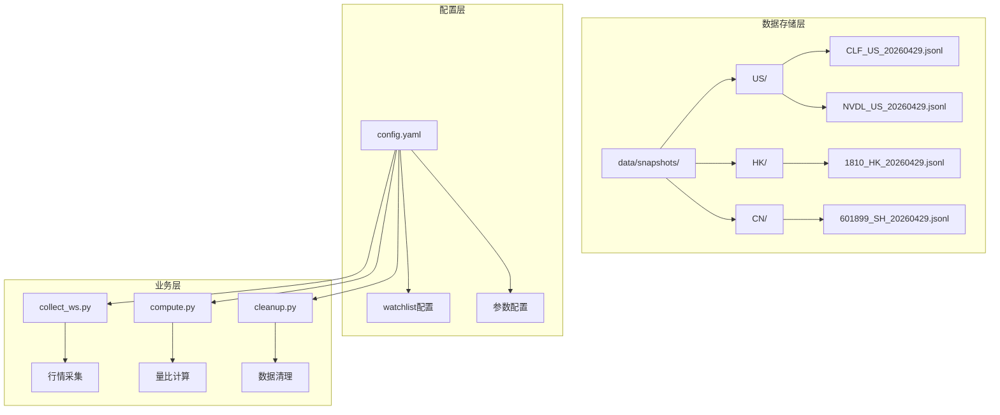
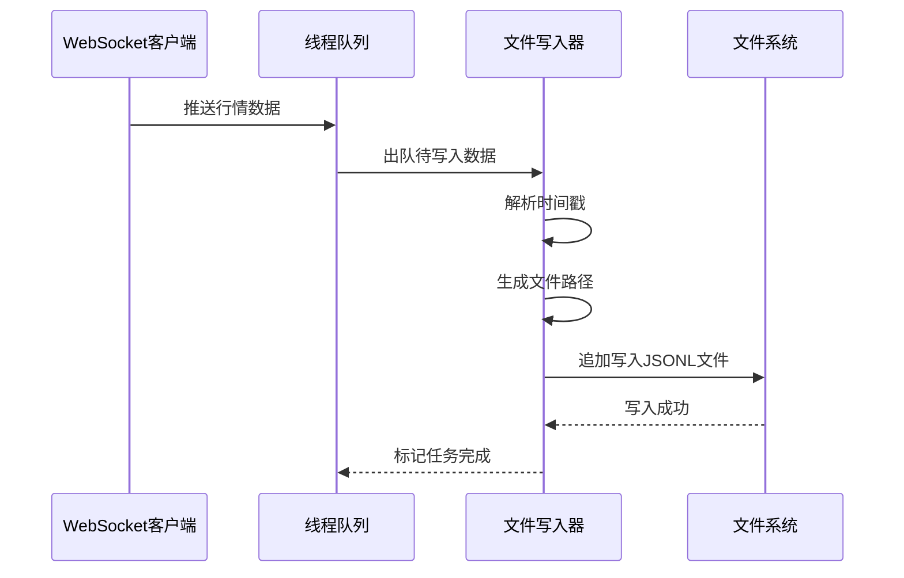
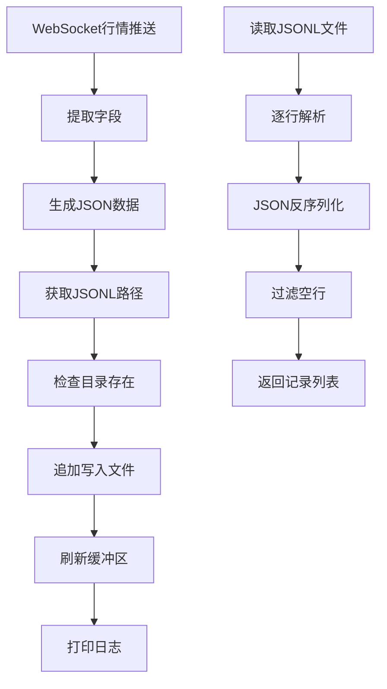
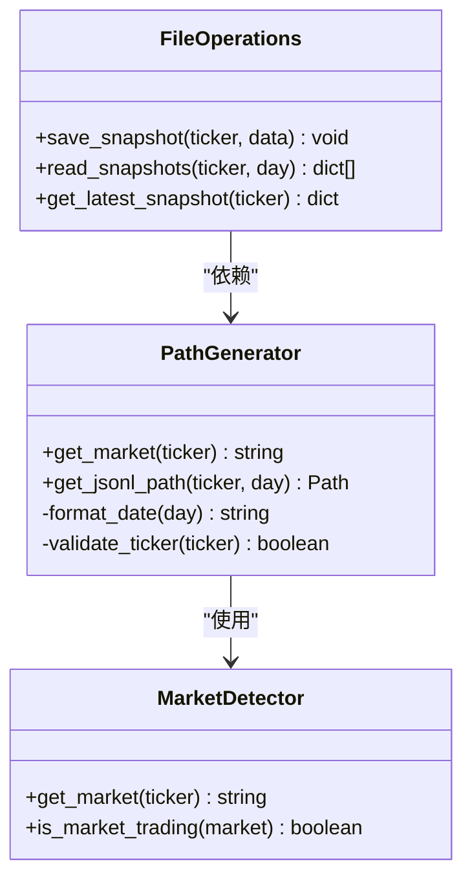
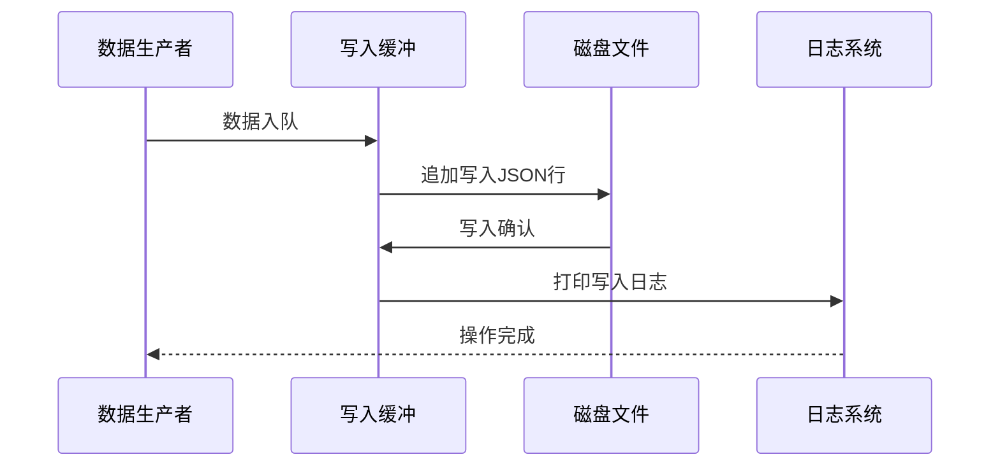
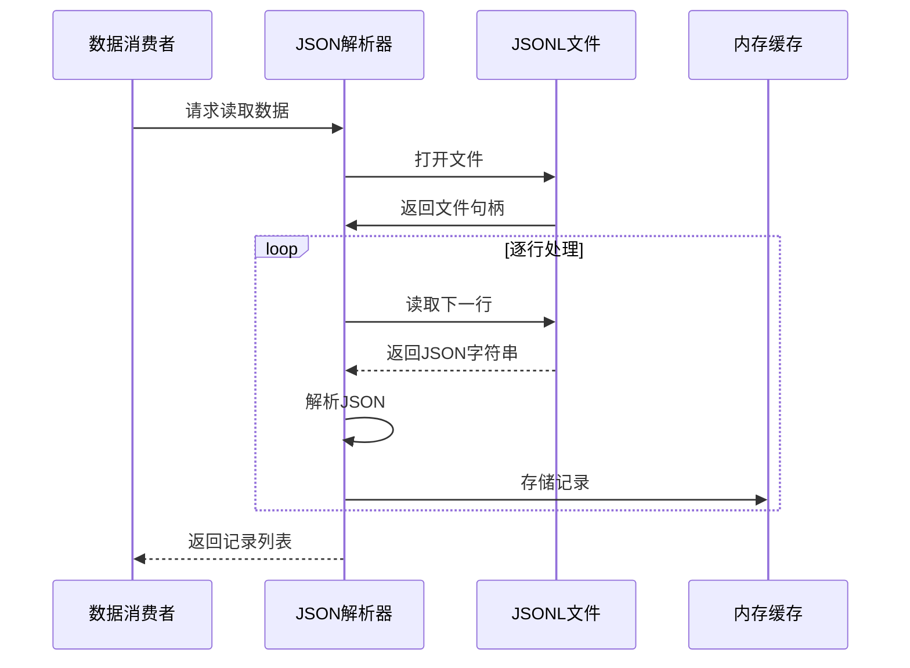
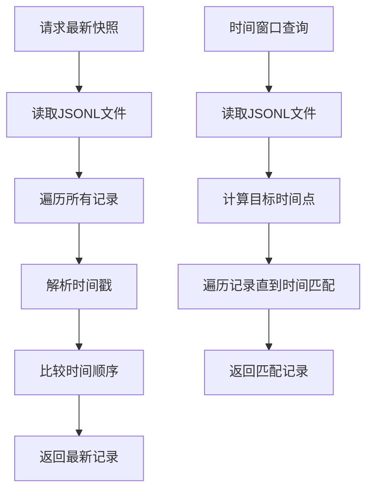
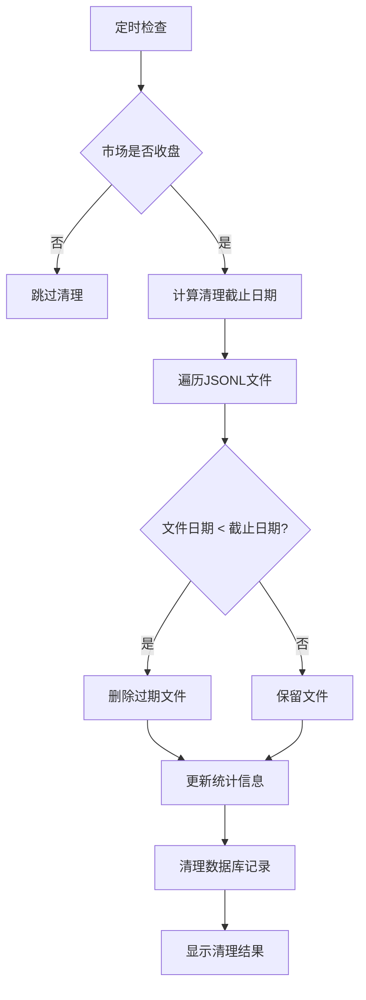
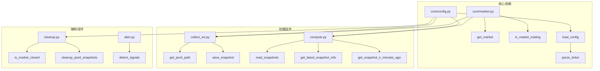

# 文件存储机制

<cite>
**本文档引用的文件**
- [README.md](file://README.md)
- [config.yaml.example](file://config.yaml.example)
- [collect_ws.py](file://scripts/collect_ws.py)
- [compute.py](file://scripts/compute.py)
- [cleanup.py](file://scripts/cleanup.py)
- [core/market.py](file://scripts/core/market.py)
- [core/config.py](file://scripts/core/config.py)
- [alert.py](file://scripts/alert.py)
</cite>

## 目录
1. [简介](#简介)
2. [项目结构](#项目结构)
3. [核心组件](#核心组件)
4. [架构概览](#架构概览)
5. [详细组件分析](#详细组件分析)
6. [依赖关系分析](#依赖关系分析)
7. [性能考虑](#性能考虑)
8. [故障排除指南](#故障排除指南)
9. [结论](#结论)

## 简介

本项目采用JSONL（JSON Lines）文件格式实现高效的行情快照存储系统。该系统通过按市场分目录的存储架构，实现了每标的每日单文件存储策略，将原本6万个/天的文件数量大幅降低至11个/天，显著提升了文件系统性能和管理效率。

JSONL格式的优势在于：
- **逐行存储**：每行一条JSON记录，便于增量更新和高效读取
- **流式处理**：支持大文件的流式读取，内存友好
- **原子性写入**：追加写入保证数据完整性
- **压缩友好**：相邻记录具有相似结构，压缩效果好

## 项目结构

项目采用清晰的分层架构，核心数据存储位于`data/snapshots/`目录下：

**图表来源**
- [README.md: 134-142:134-142](file://README.md#L134-L142)
- [collect_ws.py: 22-23:22-23](file://scripts/collect_ws.py#L22-L23)

**章节来源**
- [README.md: 134-142:134-142](file://README.md#L134-L142)
- [README.md: 314-351:314-351](file://README.md#L314-L351)

## 核心组件

### JSONL文件存储架构

系统采用三层存储架构：
1. **市场分目录**：按US/HK/CN三个市场分别存储
2. **日期分文件**：每标的每日一个文件
3. **逐行记录**：每行一条JSON快照记录

文件命名规范：`{ticker}_{date}.jsonl`
- 示例：`CLF_US_20260429.jsonl`
- 日期格式：YYYYMMDD

### 数据序列化方式

JSONL格式采用标准JSON序列化，包含以下关键字段：
- `ticker`: 股票代码（如CLF.US）
- `timestamp`: ISO格式时间戳
- `price`: 当前价格
- `volume`: 累计成交量
- `change`: 价格变动
- `change_pct`: 涨跌幅百分比

**章节来源**
- [README.md: 316-325:316-325](file://README.md#L316-L325)
- [collect_ws.py: 126-146:126-146](file://scripts/collect_ws.py#L126-L146)

## 架构概览

**图表来源**
- [collect_ws.py: 117-146:117-146](file://scripts/collect_ws.py#L117-L146)

### 数据流处理

**图表来源**
- [collect_ws.py: 86-146:86-146](file://scripts/collect_ws.py#L86-L146)
- [compute.py: 48-70:48-70](file://scripts/compute.py#L48-L70)

## 详细组件分析

### 文件路径生成器

文件路径生成逻辑是整个存储系统的核心组件：

**图表来源**
- [collect_ws.py: 126-146:126-146](file://scripts/collect_ws.py#L126-L146)
- [compute.py: 37-45:37-45](file://scripts/compute.py#L37-L45)
- [core/market.py: 50-58:50-58](file://scripts/core/market.py#L50-L58)

#### 市场识别机制

系统通过股票代码后缀自动识别市场：
- `.US` → 美股 (US)
- `.HK` → 港股 (HK)  
- `.SH`/`.SZ` → A股 (CN)

#### 日期处理逻辑

日期处理采用UTC时间转换机制：
- 美股：使用美国东部时间（EDT/EST）
- 港股：使用北京时间（与港股时间一致）
- A股：使用北京时间

**章节来源**
- [collect_ws.py: 126-135:126-135](file://scripts/collect_ws.py#L126-L135)
- [compute.py: 37-45:37-45](file://scripts/compute.py#L37-L45)
- [core/market.py: 30-46:30-46](file://scripts/core/market.py#L30-L46)

### 文件读写操作实现

#### 写入操作流程

**图表来源**
- [collect_ws.py: 138-146:138-146](file://scripts/collect_ws.py#L138-L146)

#### 读取操作流程

**图表来源**
- [compute.py: 48-70:48-70](file://scripts/compute.py#L48-L70)

**章节来源**
- [collect_ws.py: 138-146:138-146](file://scripts/collect_ws.py#L138-L146)
- [compute.py: 48-70:48-70](file://scripts/compute.py#L48-L70)

### 数据查询功能

#### 最新数据获取

`get_latest_snapshot_info`函数提供高效的最新数据访问：

**图表来源**
- [compute.py: 73-76:73-76](file://scripts/compute.py#L73-L76)
- [compute.py: 79-97:79-97](file://scripts/compute.py#L79-L97)

#### 时间窗口查询

`get_snapshot_n_minutes_ago`函数支持灵活的时间窗口查询：

| 参数 | 描述 | 默认值 |
|------|------|--------|
| `ticker` | 股票代码 | 必需 |
| `day` | 查询日期 | 当前日期 |
| `n` | 分钟数窗口 | 5分钟 |

**章节来源**
- [compute.py: 73-97:73-97](file://scripts/compute.py#L73-L97)

### 数据清理机制

系统采用智能清理策略，基于市场收盘时间自动清理过期数据：

**图表来源**
- [cleanup.py: 63-87:63-87](file://scripts/cleanup.py#L63-L87)
- [cleanup.py: 115-129:115-129](file://scripts/cleanup.py#L115-L129)

**章节来源**
- [cleanup.py: 63-87:63-87](file://scripts/cleanup.py#L63-L87)
- [cleanup.py: 115-129:115-129](file://scripts/cleanup.py#L115-L129)

## 依赖关系分析

**图表来源**
- [collect_ws.py: 28-29:28-29](file://scripts/collect_ws.py#L28-L29)
- [compute.py: 23-24:23-24](file://scripts/compute.py#L23-L24)
- [cleanup.py: 25](file://scripts/cleanup.py#L25)

### 外部依赖

系统依赖以下外部库：
- `longbridge`: 长桥API客户端
- `pytz`: 时区处理
- `lark-oapi`: 飞书机器人SDK
- `requests`: HTTP请求处理

**章节来源**
- [README.md: 394-407:394-407](file://README.md#L394-L407)

## 性能考虑

### 存储性能优化

1. **文件数量优化**
   - 从60,000+/天减少到11个/天
   - 显著降低文件系统开销

2. **内存使用优化**
   - 逐行读取，避免大文件一次性加载
   - 流式处理JSON数据

3. **I/O性能优化**
   - 追加写入模式，避免随机写入
   - 文件缓冲区自动刷新

### 查询性能优化

1. **索引策略**
   - JSONL文件按时间戳有序存储
   - 支持二分查找优化

2. **缓存机制**
   - 市场状态缓存
   - 最近价格缓存

3. **批处理优化**
   - 多标的批量计算
   - 批量API调用

## 故障排除指南

### 常见问题及解决方案

#### 文件写入失败

**症状**: WebSocket进程正常但无快照文件
**原因**: 文件权限或磁盘空间不足
**解决方案**:
1. 检查`data/snapshots/`目录权限
2. 确认磁盘空间充足
3. 验证Python用户对目录的写权限

#### JSON解析错误

**症状**: 读取快照时报JSON解析错误
**原因**: 文件损坏或格式不正确
**解决方案**:
1. 检查文件完整性
2. 验证JSON格式
3. 重新生成文件

#### 时间戳解析失败

**症状**: 量比计算异常或时间窗口查询失败
**原因**: 时间戳格式不正确
**解决方案**:
1. 验证ISO时间戳格式
2. 检查时区设置
3. 确认时间同步

**章节来源**
- [collect_ws.py: 69-83:69-83](file://scripts/collect_ws.py#L69-L83)
- [compute.py: 64-67:64-67](file://scripts/compute.py#L64-L67)

### 监控和诊断

系统提供多种监控手段：
- CLI状态检查命令
- 飞书机器人状态报告
- 日志文件追踪
- 磁盘使用情况统计

**章节来源**
- [alert.py: 124-150:124-150](file://scripts/alert.py#L124-L150)
- [cleanup.py: 131-154:131-154](file://scripts/cleanup.py#L131-L154)

## 结论

本文件存储机制通过JSONL格式和按市场分目录的架构设计，实现了高性能、高可靠性的行情数据存储系统。主要优势包括：

1. **架构简洁**: 清晰的三层存储结构，易于维护和扩展
2. **性能优异**: 显著减少文件数量，提升I/O性能
3. **可靠性强**: 追加写入模式保证数据完整性
4. **扩展性好**: 支持多市场、多标的并发处理
5. **运维友好**: 自动清理机制和完善的监控体系

该系统为量比计算引擎提供了稳定的数据基础，支撑着整个跨市场监控系统的高效运行。