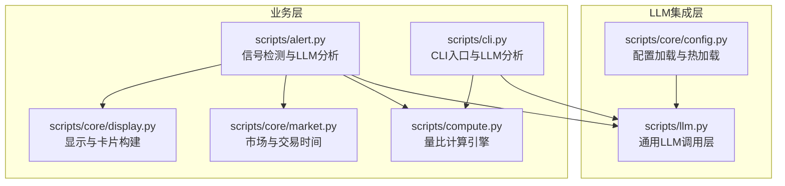
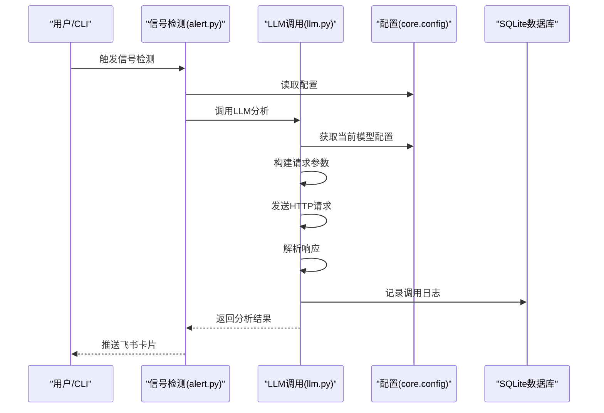
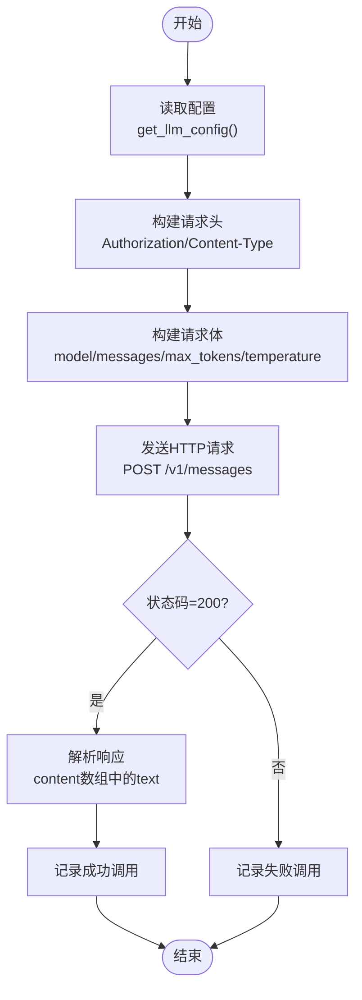
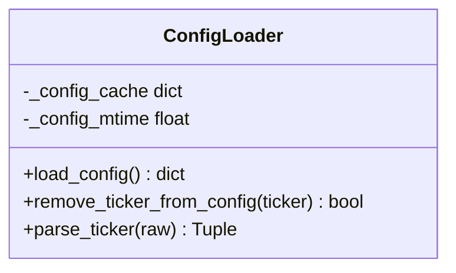
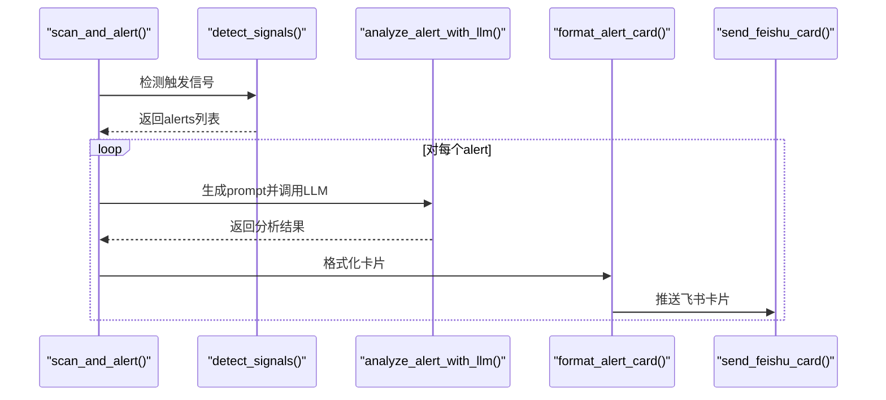
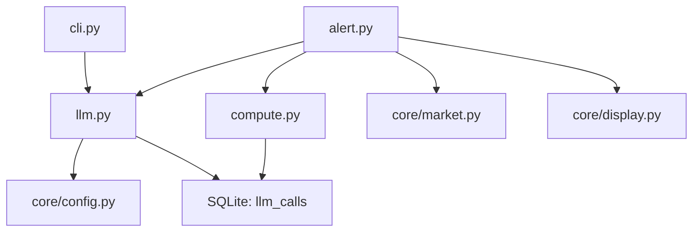

# LLM集成模块

<cite>
**本文档引用的文件**
- [scripts/llm.py](file://scripts/llm.py)
- [scripts/core/config.py](file://scripts/core/config.py)
- [scripts/alert.py](file://scripts/alert.py)
- [scripts/cli.py](file://scripts/cli.py)
- [scripts/compute.py](file://scripts/compute.py)
- [scripts/core/market.py](file://scripts/core/market.py)
- [scripts/core/display.py](file://scripts/core/display.py)
- [config.yaml.example](file://config.yaml.example)
- [README.md](file://README.md)
- [todo.md](file://todo.md)
- [跨市场量比监控-MiniMax-M2.7-实现方案.md](file://跨市场量比监控-MiniMax-M2.7-实现方案.md)
- [mimo-issue.md](file://mimo-issue.md)
- [deepseek-issue.md](file://deepseek-issue.md)
</cite>

## 目录
1. [简介](#简介)
2. [项目结构](#项目结构)
3. [核心组件](#核心组件)
4. [架构概览](#架构概览)
5. [详细组件分析](#详细组件分析)
6. [依赖关系分析](#依赖关系分析)
7. [性能考量](#性能考量)
8. [故障排查指南](#故障排查指南)
9. [结论](#结论)
10. [附录](#附录)

## 简介
本文件为跨市场量比监控系统的LLM集成模块技术文档，重点阐述多模型调用层的实现架构，包括llm_profiles配置、模型选择策略、负载均衡机制、请求参数构建、响应处理与错误重试、模型切换逻辑、成本控制策略与性能优化方案。文档还涵盖与信号检测系统的集成方式与数据流转过程，并提供配置文件示例、API密钥管理与安全防护措施、实际调用示例、参数调优建议与故障排查指南。

## 项目结构
LLM集成模块位于scripts/llm.py，采用通用多模型调用层设计，通过config.yaml中的llm与llm_profiles配置实现一键切换。核心模块包括：
- scripts/llm.py：通用LLM调用层，负责配置读取、模型切换、请求构建、响应解析与调用记录
- scripts/core/config.py：统一配置加载与热加载缓存
- scripts/alert.py：信号检测与LLM分析集成
- scripts/cli.py：CLI入口，支持LLM分析调用
- scripts/compute.py：量比计算引擎，提供信号与数据供LLM分析
- scripts/core/market.py：市场判断与交易时间过滤
- scripts/core/display.py：显示格式化与飞书卡片构建

**图表来源**
- [scripts/llm.py:1-193](file://scripts/llm.py#L1-L193)
- [scripts/core/config.py:1-63](file://scripts/core/config.py#L1-L63)
- [scripts/alert.py:1-514](file://scripts/alert.py#L1-L514)
- [scripts/cli.py:1-463](file://scripts/cli.py#L1-L463)
- [scripts/compute.py:1-498](file://scripts/compute.py#L1-L498)
- [scripts/core/market.py:1-88](file://scripts/core/market.py#L1-L88)
- [scripts/core/display.py:1-102](file://scripts/core/display.py#L1-L102)

**章节来源**
- [scripts/llm.py:1-193](file://scripts/llm.py#L1-L193)
- [scripts/core/config.py:1-63](file://scripts/core/config.py#L1-L63)
- [README.md:106-142](file://README.md#L106-L142)

## 核心组件
- 通用LLM调用层（call_llm）：根据provider自动选择调用方式，构建Anthropic兼容的请求，解析响应并记录调用日志
- 配置管理（get_llm_config/switch_llm/list_profiles）：从config.yaml读取llm与llm_profiles配置，支持一键切换与列出可用配置
- 请求参数构建：基于配置生成headers与payload，包含Authorization、Content-Type、model、messages、max_tokens、temperature
- 响应处理：解析content数组中的text类型内容，记录调用成功/失败状态
- 错误重试机制：当前实现为基础异常捕获与日志记录，未实现自动重试
- 模型切换逻辑：通过llm_profiles配置复制到顶层llm配置，写回config.yaml实现持久化切换
- 成本控制策略：通过llm_calls表记录调用次数与成功率，配合信号去重避免重复调用
- 性能优化：配置热加载缓存、数据库连接超时设置、交易时间过滤

**章节来源**
- [scripts/llm.py:110-159](file://scripts/llm.py#L110-L159)
- [scripts/llm.py:32-91](file://scripts/llm.py#L32-L91)
- [scripts/alert.py:248-274](file://scripts/alert.py#L248-L274)
- [scripts/compute.py:147-194](file://scripts/compute.py#L147-L194)

## 架构概览
LLM集成模块采用分层架构：
- 配置层：统一从config.yaml加载配置，支持热加载缓存
- 调用层：根据provider选择调用方式，构建请求并处理响应
- 业务层：信号检测与CLI入口调用LLM进行分析
- 数据层：llm_calls表记录调用历史，便于成本统计与分析

**图表来源**
- [scripts/alert.py:367-448](file://scripts/alert.py#L367-L448)
- [scripts/llm.py:110-159](file://scripts/llm.py#L110-L159)
- [scripts/core/config.py:20-31](file://scripts/core/config.py#L20-L31)
- [scripts/llm.py:93-108](file://scripts/llm.py#L93-L108)

## 详细组件分析

### 通用LLM调用层（scripts/llm.py）
- 配置读取：get_llm_config()从config.yaml读取llm配置，兼容旧版minimax配置
- 模型切换：switch_llm()将llm_profiles中的配置复制到顶层llm配置并写回config.yaml
- 请求构建：基于base_url与provider构建Anthropic兼容接口请求，包含Authorization与JSON payload
- 响应解析：解析content数组中的text类型内容，支持多模型统一响应格式
- 调用记录：log_llm_call()将调用时间、模型与成功状态写入llm_calls表

**图表来源**
- [scripts/llm.py:110-159](file://scripts/llm.py#L110-L159)
- [scripts/llm.py:93-108](file://scripts/llm.py#L93-L108)

**章节来源**
- [scripts/llm.py:32-91](file://scripts/llm.py#L32-L91)
- [scripts/llm.py:110-159](file://scripts/llm.py#L110-L159)
- [scripts/llm.py:93-108](file://scripts/llm.py#L93-L108)

### 配置管理（scripts/core/config.py）
- 热加载实现：基于文件修改时间缓存配置，修改后自动生效
- watchlist管理：提供移除标的与解析标的函数
- 共享接口：被所有脚本通过from core.config import load_config使用

**图表来源**
- [scripts/core/config.py:20-31](file://scripts/core/config.py#L20-L31)
- [scripts/core/config.py:34-47](file://scripts/core/config.py#L34-L47)
- [scripts/core/config.py:50-63](file://scripts/core/config.py#L50-L63)

**章节来源**
- [scripts/core/config.py:1-63](file://scripts/core/config.py#L1-L63)

### 信号检测与LLM分析集成（scripts/alert.py）
- LLM分析流程：generate_llm_prompt()构建prompt，analyze_alert_with_llm()调用LLM，format_alert_card()格式化飞书卡片
- 信号去重：should_push()基于信号优先级与状态升级策略实现去重
- 简报功能：send_brief_report()每30分钟生成持仓组合量比简报并调用LLM解读

**图表来源**
- [scripts/alert.py:367-448](file://scripts/alert.py#L367-L448)
- [scripts/alert.py:248-274](file://scripts/alert.py#L248-L274)
- [scripts/alert.py:145-197](file://scripts/alert.py#L145-L197)

**章节来源**
- [scripts/alert.py:248-274](file://scripts/alert.py#L248-L274)
- [scripts/alert.py:367-448](file://scripts/alert.py#L367-L448)
- [scripts/alert.py:450-502](file://scripts/alert.py#L450-L502)

### CLI入口与LLM分析（scripts/cli.py）
- 单标的查询：query_ticker()支持--analyze参数调用LLM进行分析
- 历史查询：cmd_history()查询近7日量比趋势
- 系统状态：cmd_status()检查WebSocket、Cron、飞书、LLM、数据库与快照文件状态

**章节来源**
- [scripts/cli.py:41-65](file://scripts/cli.py#L41-L65)
- [scripts/cli.py:200-238](file://scripts/cli.py#L200-L238)
- [scripts/cli.py:113-179](file://scripts/cli.py#L113-L179)

### 量比计算引擎（scripts/compute.py）
- 数据存储：volume_ratios表存储量比历史，signals表存储信号记录，llm_calls表记录LLM调用
- 信号生成：calc_volume_ratio()与calc_intraday_ratio()分别计算5日量比与日内滚动量比
- 数据库初始化：init_db()创建必要表并建立索引

**章节来源**
- [scripts/compute.py:147-194](file://scripts/compute.py#L147-L194)
- [scripts/compute.py:197-226](file://scripts/compute.py#L197-L226)
- [scripts/compute.py:249-322](file://scripts/compute.py#L249-L322)

### 市场与显示模块（scripts/core/market.py, scripts/core/display.py）
- 市场判断：get_market()根据ticker后缀判断市场，is_market_trading()判断交易时间
- 显示格式：format_ratio_display()与format_ticker_line()提供量比符号与格式化输出
- 飞书表格：build_market_table()与build_brief_elements()构建飞书原生表格

**章节来源**
- [scripts/core/market.py:50-88](file://scripts/core/market.py#L50-L88)
- [scripts/core/display.py:8-41](file://scripts/core/display.py#L8-L41)
- [scripts/core/display.py:43-102](file://scripts/core/display.py#L43-L102)

## 依赖关系分析
- 模块耦合：llm.py依赖core.config进行配置读取；alert.py与cli.py依赖llm.py进行LLM分析；compute.py提供数据支撑
- 配置依赖：llm.py与alert.py均依赖core.config的load_config()；llm.py依赖config.yaml中的llm与llm_profiles配置
- 数据依赖：llm_calls表记录调用历史，signals表存储信号，volume_ratios表存储量比历史

**图表来源**
- [scripts/llm.py:22-22](file://scripts/llm.py#L22-L22)
- [scripts/alert.py:20-23](file://scripts/alert.py#L20-L23)
- [scripts/cli.py:21-23](file://scripts/cli.py#L21-L23)
- [scripts/compute.py:147-194](file://scripts/compute.py#L147-L194)

**章节来源**
- [scripts/llm.py:22-22](file://scripts/llm.py#L22-L22)
- [scripts/alert.py:20-23](file://scripts/alert.py#L20-L23)
- [scripts/cli.py:21-23](file://scripts/cli.py#L21-L23)
- [scripts/compute.py:147-194](file://scripts/compute.py#L147-L194)

## 性能考量
- 配置热加载：core.config使用文件修改时间缓存，避免重复解析YAML文件
- 数据库超时：compute.py中SQLite连接设置timeout=30，减少并发写入冲突
- 交易时间过滤：core/market.py提供is_market_trading()，避免非交易时间的LLM调用
- 信号去重：alert.py基于信号优先级与状态升级策略，减少重复LLM调用

**章节来源**
- [scripts/core/config.py:20-31](file://scripts/core/config.py#L20-L31)
- [scripts/compute.py:147-194](file://scripts/compute.py#L147-L194)
- [scripts/core/market.py:11-47](file://scripts/core/market.py#L11-L47)
- [scripts/alert.py:339-365](file://scripts/alert.py#L339-L365)

## 故障排查指南
- LLM API调用失败：检查config.yaml中的api_key配置，使用scripts/llm.py --test测试连接，必要时切换模型
- 飞书机器人不响应：确认feishu配置正确，查看logs/feishu_bot.log日志
- WebSocket进程不存在：查看logs/launcher.log，手动重启scripts/collect_ws_launcher.py
- LLM密钥泄露：--test模式已进行脱敏显示，建议迁移到环境变量存储

**章节来源**
- [README.md:354-390](file://README.md#L354-L390)
- [scripts/llm.py:161-193](file://scripts/llm.py#L161-L193)
- [mimo-issue.md:25-29](file://mimo-issue.md#L25-L29)
- [deepseek-issue.md:111-124](file://deepseek-issue.md#L111-L124)

## 结论
LLM集成模块通过统一的调用层与配置管理，实现了多模型的灵活切换与成本控制。结合信号检测与交易时间过滤，有效减少了不必要的LLM调用。建议进一步完善错误重试机制、引入结构化日志与测试覆盖，以提升系统的健壮性与可维护性。

## 附录

### 配置文件示例
- llm配置：provider、model、base_url、api_key、max_tokens、temperature
- llm_profiles配置：支持minimax与xiaomi等多模型配置
- 飞书配置：app_id、app_secret、chat_id

**章节来源**
- [config.yaml.example:42-62](file://config.yaml.example#L42-L62)
- [config.yaml.example:67-72](file://config.yaml.example#L67-L72)

### API密钥管理与安全防护
- 密钥脱敏：--test模式仅显示API Key前6位与后4位
- 环境变量迁移：建议将API Key迁移到环境变量或密钥管理服务
- 日志安全：避免在错误日志中输出响应body，防止敏感信息泄露

**章节来源**
- [scripts/llm.py:25-29](file://scripts/llm.py#L25-L29)
- [mimo-issue.md:25-29](file://mimo-issue.md#L25-L29)
- [deepseek-issue.md:111-124](file://deepseek-issue.md#L111-L124)

### 实际调用示例
- 列出可用模型：python3 scripts/llm.py --list
- 切换模型：python3 scripts/llm.py --switch xiaomi
- 测试配置：python3 scripts/llm.py --test
- CLI查询：python3 scripts/cli.py --ticker CLF.US --analyze

**章节来源**
- [scripts/llm.py:161-193](file://scripts/llm.py#L161-L193)
- [README.md:257-268](file://README.md#L257-L268)
- [scripts/cli.py:417-424](file://scripts/cli.py#L417-L424)

### 参数调优建议
- max_tokens：根据分析需求调整，平衡成本与输出长度
- temperature：0.3适合稳定输出，可根据场景适当调整
- 交易时间过滤：结合is_market_trading()减少非交易时间的调用

**章节来源**
- [config.yaml.example:47-48](file://config.yaml.example#L47-L48)
- [scripts/core/market.py:11-47](file://scripts/core/market.py#L11-L47)

### 与信号检测系统的集成
- 数据流转：compute.py提供量比与信号数据，alert.py进行信号检测与LLM分析，最终通过飞书推送
- 成本控制：通过信号去重与交易时间过滤，避免重复调用与无效调用

**章节来源**
- [scripts/compute.py:382-402](file://scripts/compute.py#L382-L402)
- [scripts/alert.py:367-448](file://scripts/alert.py#L367-L448)
- [scripts/alert.py:450-502](file://scripts/alert.py#L450-L502)