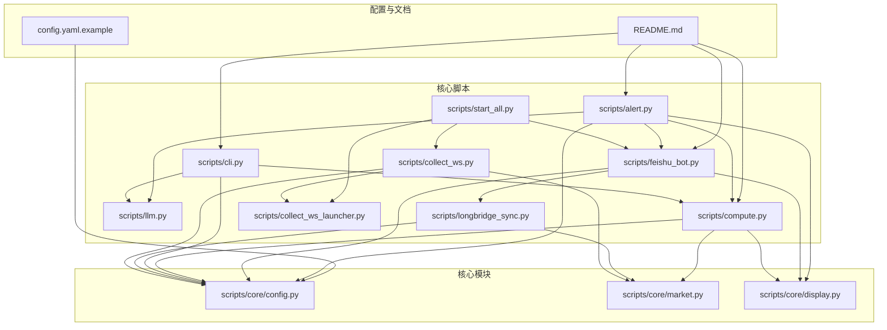
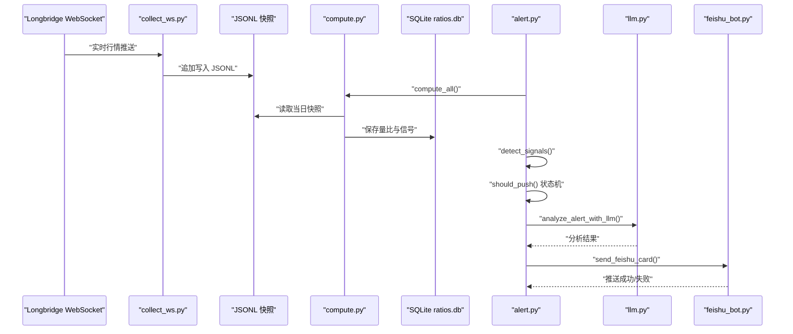
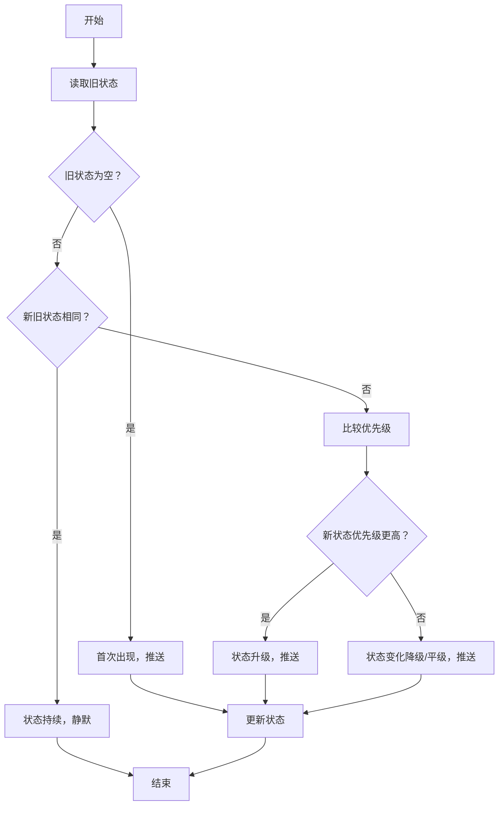
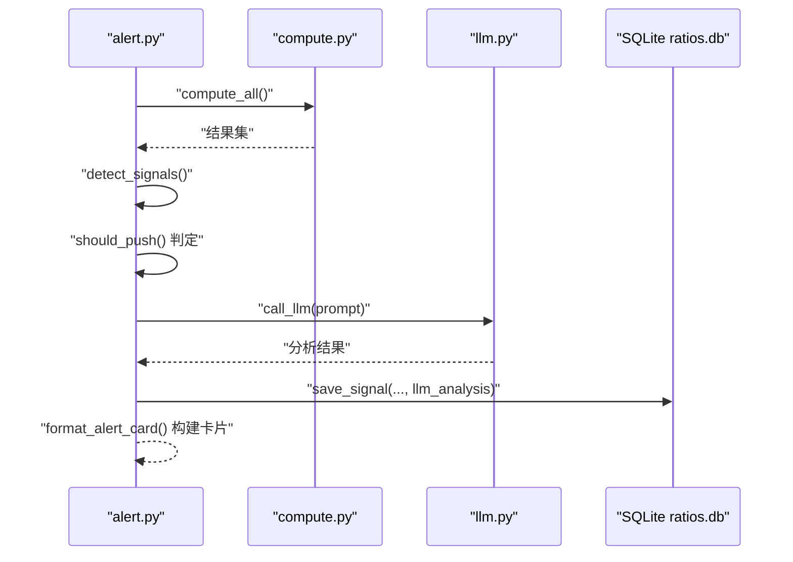
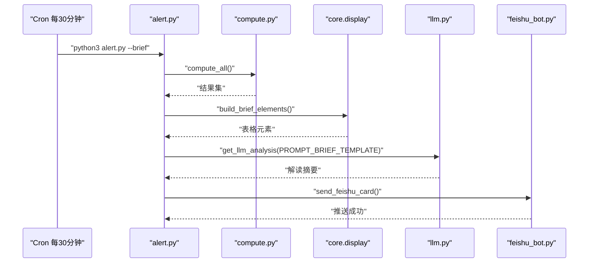
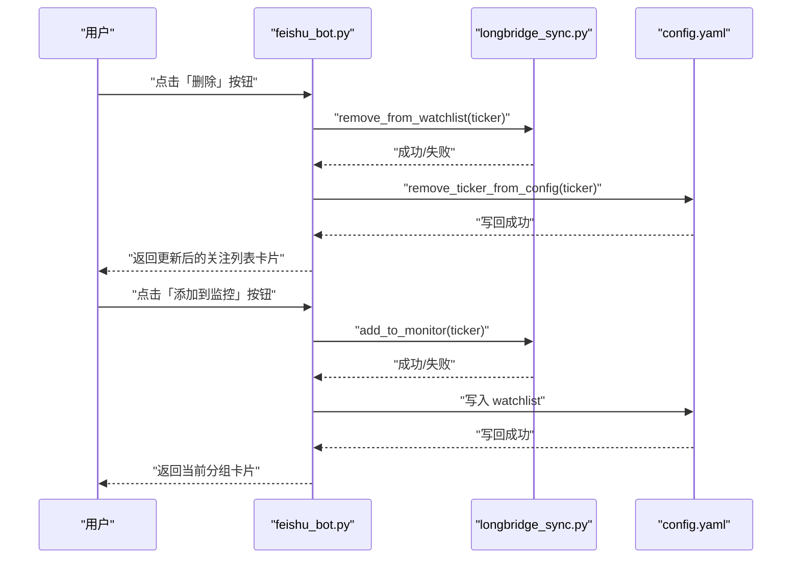
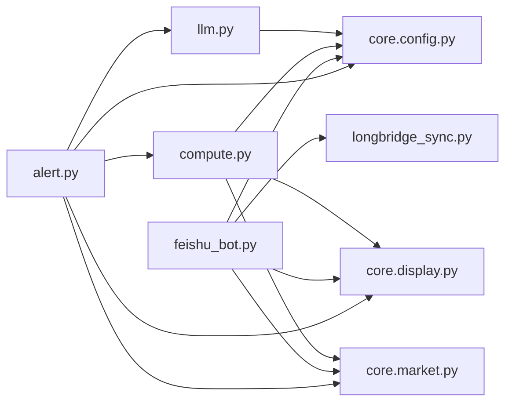

# 信号检测与告警系统

<cite>
**本文引用的文件**
- [README.md](file://README.md)
- [config.yaml.example](file://config.yaml.example)
- [scripts/alert.py](file://scripts/alert.py)
- [scripts/llm.py](file://scripts/llm.py)
- [scripts/feishu_bot.py](file://scripts/feishu_bot.py)
- [scripts/compute.py](file://scripts/compute.py)
- [scripts/core/config.py](file://scripts/core/config.py)
- [scripts/core/market.py](file://scripts/core/market.py)
- [scripts/core/display.py](file://scripts/core/display.py)
- [scripts/longbridge_sync.py](file://scripts/longbridge_sync.py)
- [scripts/cli.py](file://scripts/cli.py)
- [scripts/start_all.py](file://scripts/start_all.py)
- [scripts/collect_ws.py](file://scripts/collect_ws.py)
- [scripts/collect_ws_launcher.py](file://scripts/collect_ws_launcher.py)
</cite>

## 目录
1. [简介](#简介)
2. [项目结构](#项目结构)
3. [核心组件](#核心组件)
4. [架构总览](#架构总览)
5. [详细组件分析](#详细组件分析)
6. [依赖关系分析](#依赖关系分析)
7. [性能考量](#性能考量)
8. [故障排除指南](#故障排除指南)
9. [结论](#结论)
10. [附录](#附录)

## 简介
本系统围绕“跨市场量比监控”展开，实时采集美股、港股、A股的实时行情，计算量比并进行信号检测，结合 LLM 进行智能分析，通过飞书机器人以富文本卡片推送告警；同时提供定时简报、交互式卡片、信号去重状态机、阈值与灵敏度配置、以及与长桥账户的同步能力。系统采用 JSONL 快照与 SQLite 数据库存储，支持热加载配置与守护进程保障运行稳定性。

## 项目结构
- 配置与文档
  - config.yaml.example：系统配置模板（监控标的、参数、LLM、飞书）
  - README.md：系统概述、功能说明、部署与运维
- 核心脚本
  - scripts/alert.py：信号检测、去重状态机、LLM 分析、飞书推送、定时简报
  - scripts/llm.py：多模型调用层（Anthropic 兼容接口）、配置切换、调用记录
  - scripts/feishu_bot.py：飞书机器人（WebSocket 长连接、交互指令、卡片构建、按钮回调）
  - scripts/compute.py：量比计算引擎（历史量比 + 日内滚动量比）、数据库持久化
  - scripts/cli.py：命令行入口（查询、扫描、状态、历史、信号、增删静默）
  - scripts/longbridge_sync.py：长桥持仓/自选股同步至 watchlist，并支持卡片按钮联动
  - scripts/start_all.py：一键启动（cron + WebSocket + 飞书机器人）
  - scripts/collect_ws.py：Longbridge WebSocket 实时行情采集（JSONL 追加）
  - scripts/collect_ws_launcher.py：守护进程启动器（每分钟检查并拉起采集进程）
- 核心模块
  - scripts/core/config.py：统一配置加载（热加载）
  - scripts/core/market.py：市场判断、交易时间、watchlist 解析
  - scripts/core/display.py：量比符号与格式化、飞书表格构建

图表来源
- [scripts/alert.py:1-514](file://scripts/alert.py#L1-L514)
- [scripts/llm.py:1-193](file://scripts/llm.py#L1-L193)
- [scripts/feishu_bot.py:1-991](file://scripts/feishu_bot.py#L1-L991)
- [scripts/compute.py:1-498](file://scripts/compute.py#L1-L498)
- [scripts/cli.py:1-463](file://scripts/cli.py#L1-L463)
- [scripts/longbridge_sync.py:1-265](file://scripts/longbridge_sync.py#L1-L265)
- [scripts/start_all.py:1-169](file://scripts/start_all.py#L1-L169)
- [scripts/collect_ws.py:1-258](file://scripts/collect_ws.py#L1-L258)
- [scripts/collect_ws_launcher.py:1-83](file://scripts/collect_ws_launcher.py#L1-L83)
- [scripts/core/config.py:1-63](file://scripts/core/config.py#L1-L63)
- [scripts/core/market.py:1-88](file://scripts/core/market.py#L1-L88)
- [scripts/core/display.py:1-102](file://scripts/core/display.py#L1-L102)

章节来源
- [README.md:106-142](file://README.md#L106-L142)
- [scripts/start_all.py:120-169](file://scripts/start_all.py#L120-L169)

## 核心组件
- 信号检测与去重状态机
  - 历史量比与日内滚动量比双路径检测，结合规则与阈值生成信号集合
  - 基于信号优先级的状态机，仅在状态变化或升级时推送，避免重复告警
- LLM 分析集成
  - 多模型切换（Anthropic 兼容接口），统一 prompt 模板，按需调用，记录调用次数
- 飞书机器人与交互卡片
  - WebSocket 长连接，支持指令与按钮回调；富文本卡片构建与按钮交互
- 定时简报
  - 每30分钟生成简报，按市场分组表格展示，附加 LLM 总结解读
- 量比计算引擎
  - 历史量比（N日窗口）与日内滚动量比（三条件放量止跌），并持久化到 SQLite
- 配置与同步
  - 热加载配置，支持静默列表、阈值与灵敏度调节；长桥持仓/自选股同步

章节来源
- [scripts/alert.py:61-142](file://scripts/alert.py#L61-L142)
- [scripts/alert.py:276-448](file://scripts/alert.py#L276-L448)
- [scripts/llm.py:110-159](file://scripts/llm.py#L110-L159)
- [scripts/feishu_bot.py:526-616](file://scripts/feishu_bot.py#L526-L616)
- [scripts/alert.py:450-502](file://scripts/alert.py#L450-L502)
- [scripts/compute.py:197-322](file://scripts/compute.py#L197-L322)
- [scripts/core/config.py:20-32](file://scripts/core/config.py#L20-L32)
- [scripts/longbridge_sync.py:209-250](file://scripts/longbridge_sync.py#L209-L250)

## 架构总览
系统采用“采集-计算-检测-推送”的流水线架构，核心数据流如下：
- WebSocket 实时行情采集 → JSONL 快照
- 计算引擎读取 JSONL → 生成量比与信号 → 写入 SQLite
- 信号检测模块扫描数据库 → 去重状态机判定 → LLM 分析 → 飞书卡片推送
- 定时任务每分钟/每30分钟触发相应动作

图表来源
- [scripts/collect_ws.py:159-214](file://scripts/collect_ws.py#L159-L214)
- [scripts/compute.py:382-403](file://scripts/compute.py#L382-L403)
- [scripts/alert.py:367-448](file://scripts/alert.py#L367-L448)
- [scripts/llm.py:110-159](file://scripts/llm.py#L110-L159)
- [scripts/feishu_bot.py:81-98](file://scripts/feishu_bot.py#L81-L98)

## 详细组件分析

### 信号去重状态机设计与实现
- 设计理念
  - 通过“状态优先级”区分信号强度，仅在状态变化或升级时推送，避免重复告警
  - 对同一标的在同一周期内仅调用一次 LLM 分析，降低成本
- 状态定义与优先级
  - 正常、缩量、放量、温放、放量突破、放量下跌、放量止跌、缩量止跌、尾盘放量、巨量
- 状态机逻辑
  - 首次出现：推送
  - 状态持续：静默
  - 状态变化：若新状态优先级更高则推送；否则也推送（不遗漏方向变化）
- 数据持久化
  - 使用 SQLite 表 signal_states 记录每个标的的最新状态与更新时间

图表来源
- [scripts/alert.py:295-365](file://scripts/alert.py#L295-L365)

章节来源
- [scripts/alert.py:276-448](file://scripts/alert.py#L276-L448)

### analyze_alert_with_llm() 函数的 AI 分析集成
- 多模型调用
  - 统一通过 llm.py 的 call_llm() 调用，基于配置中的 provider/base_url/model/temperature/max_tokens
  - 支持 minimax/xiaomi 等模型一键切换，切换时写回 config.yaml
- 信号解读与分析报告生成
  - 生成 prompt 模板，包含标的、价格、涨跌幅、量比、近5日均量、近期走势
  - 对强信号（放量突破/放量下跌/高量比+明显涨跌）调用 LLM，限制输出长度
  - 记录 LLM 调用成功/失败到 llm_calls 表，便于统计与排障

图表来源
- [scripts/alert.py:264-274](file://scripts/alert.py#L264-L274)
- [scripts/alert.py:410-432](file://scripts/alert.py#L410-L432)
- [scripts/llm.py:110-159](file://scripts/llm.py#L110-L159)

章节来源
- [scripts/alert.py:248-274](file://scripts/alert.py#L248-L274)
- [scripts/llm.py:61-91](file://scripts/llm.py#L61-L91)
- [scripts/llm.py:93-108](file://scripts/llm.py#L93-L108)

### send_brief_report() 定时简报功能
- 触发机制
  - 通过 cron 每30分钟调用 alert.py --brief
- 内容生成
  - 读取当日所有标的，按量比降序排列
  - 使用 core.display.build_brief_elements() 构建飞书原生表格（按 US/HK/CN 分组）
  - 生成纯文本 prompt，调用 LLM 生成整体解读摘要
- 推送策略
  - 构建卡片标题“📋 量比简报 HH:MM”，包含表格与 LLM 解读
  - 仅在有数据且有开盘市场时发送

图表来源
- [scripts/alert.py:450-502](file://scripts/alert.py#L450-L502)
- [scripts/core/display.py:90-102](file://scripts/core/display.py#L90-L102)
- [scripts/llm.py:110-159](file://scripts/llm.py#L110-L159)

章节来源
- [scripts/alert.py:450-502](file://scripts/alert.py#L450-L502)

### 信号分类体系、阈值配置与灵敏度调节
- 信号分类
  - 历史量比：正常、缩量、放量、显著放量、巨量
  - 日内滚动量比：放量止跌、放量、空
- 阈值与灵敏度
  - 配置项：volume_ratio_window（量比窗口）、snapshot_interval（快照间隔）、alert_threshold（放量阈值）、shrink_threshold（缩量阈值）
  - 灵敏度调节：通过调整 alert_threshold 与 shrink_threshold 控制告警敏感度
- 静默机制
  - 通过 CLI 的 --mute 命令设置静默截止时间，避免特定标的在一段时间内被推送

章节来源
- [config.yaml.example:32-37](file://config.yaml.example#L32-L37)
- [scripts/alert.py:67-69](file://scripts/alert.py#L67-L69)
- [scripts/cli.py:347-370](file://scripts/cli.py#L347-L370)

### 飞书机器人集成、消息卡片构建与按钮交互
- 机器人能力
  - WebSocket 长连接，支持 /start、/stop、/status、/scan、/signals、/brief、/watchlist、/allstock、/sync、/add、/remove、/mute、/history 等指令
  - 富文本卡片：系统状态、量比扫描、今日信号、量比简报、关注列表、全部股票分组与明细
- 消息卡片构建
  - 使用 core.display.build_market_table/build_brief_elements 构建原生表格
  - format_alert_card 构建信号卡片，包含标题、内容与 LLM 分析
- 按钮交互
  - 关注列表卡片支持“删除”按钮，点击后从 config.yaml 与长桥自选股移除
  - “全部股票”分组列表支持“添加到监控”按钮，点击后同步到长桥“量比监控”分组并更新 config.yaml
  - 回调处理函数 handle_card_action 根据 action.value 执行对应操作并返回更新后的卡片

图表来源
- [scripts/feishu_bot.py:526-616](file://scripts/feishu_bot.py#L526-L616)
- [scripts/longbridge_sync.py:124-164](file://scripts/longbridge_sync.py#L124-L164)
- [scripts/core/config.py:34-47](file://scripts/core/config.py#L34-L47)

章节来源
- [scripts/feishu_bot.py:100-164](file://scripts/feishu_bot.py#L100-L164)
- [scripts/feishu_bot.py:339-358](file://scripts/feishu_bot.py#L339-L358)
- [scripts/feishu_bot.py:361-414](file://scripts/feishu_bot.py#L361-L414)
- [scripts/feishu_bot.py:417-524](file://scripts/feishu_bot.py#L417-L524)

### 信号检测参数配置与数据流
- 参数来源
  - config.yaml.params：窗口、快照间隔、阈值
  - config.yaml.mute：静默列表
- 数据流
  - WebSocket 采集 JSONL → compute.compute_all → detect_signals → should_push → LLM 分析 → 保存信号 → 发送卡片
- 市场与交易时间
  - core.market.is_market_trading 判断 US/HK/CN 交易时间，过滤非交易时段信号

章节来源
- [scripts/compute.py:197-242](file://scripts/compute.py#L197-L242)
- [scripts/alert.py:61-142](file://scripts/alert.py#L61-L142)
- [scripts/core/market.py:11-47](file://scripts/core/market.py#L11-L47)

## 依赖关系分析
- 组件耦合
  - alert.py 依赖 compute.py、llm.py、core.config、core.display、core.market
  - feishu_bot.py 依赖 longbridge_sync.py、core.config、core.display、core.market
  - compute.py 依赖 core.config、core.market、core.display
  - llm.py 依赖 core.config
- 外部依赖
  - Longbridge OpenAPI（行情订阅与账户同步）
  - lark-oapi（飞书客户端）
  - requests（LLM 调用）
  - pytz（时区转换）

图表来源
- [scripts/alert.py:17-23](file://scripts/alert.py#L17-L23)
- [scripts/feishu_bot.py:21-34](file://scripts/feishu_bot.py#L21-L34)
- [scripts/compute.py:20-25](file://scripts/compute.py#L20-L25)
- [scripts/llm.py:16-23](file://scripts/llm.py#L16-L23)

章节来源
- [scripts/alert.py:17-23](file://scripts/alert.py#L17-L23)
- [scripts/feishu_bot.py:21-34](file://scripts/feishu_bot.py#L21-L34)
- [scripts/compute.py:20-25](file://scripts/compute.py#L20-L25)
- [scripts/llm.py:16-23](file://scripts/llm.py#L16-L23)

## 性能考量
- I/O 优化
  - JSONL 追加写入，避免频繁打开/关闭文件；按市场分目录组织，减少目录项数量
  - SQLite 使用索引（signals.timestamp、volume_ratios.ticker）提升查询效率
- 计算优化
  - 日内滚动量比采用滑动窗口与差分量计算，避免重复遍历
  - LLM 调用限制：仅对强信号调用，同一周期内同一标的仅调用一次
- 网络与外部依赖
  - Longbridge WebSocket 重试机制，指数退避，降低断连影响
  - LLM 调用超时控制与异常捕获，避免阻塞主流程
- 运维与资源
  - 守护进程启动器每分钟检查，确保采集与机器人进程存活
  - 数据清理脚本定期清理过期 JSONL/DB/信号，控制存储增长

[本节为通用性能建议，不直接分析具体文件]

## 故障排除指南
- 常见问题定位
  - 量比显示“数据不足”：5日历史量比需要至少5个交易日数据；可使用日内滚动量比
  - 飞书机器人不响应：检查 config.yaml 中 app_id/app_secret；查看 logs/feishu_bot.log
  - WebSocket 进程不存在：查看 logs/launcher.log；手动重启 scripts/collect_ws_launcher.py
  - LLM API 调用失败：确认 api_key；使用 scripts/llm.py --test 测试；切换模型
- 日志位置
  - logs/ws_collect.log/err：WebSocket 采集主/错误日志
  - logs/feishu_bot.log/err：飞书机器人主/错误日志
  - logs/alert.log：信号扫描日志
  - logs/brief.log：简报日志
  - logs/launcher.log：守护进程启动日志
  - logs/cleanup.log：数据清理日志
- 建议排查步骤
  - 检查 cron 配置与进程状态
  - 核对 config.yaml 热加载是否生效
  - 验证长桥 token 与网络连通性
  - 查看数据库表结构与索引是否存在

章节来源
- [README.md:354-391](file://README.md#L354-L391)

## 结论
本系统通过“采集-计算-检测-推送”的闭环，实现了跨市场的量比监控与智能告警。信号去重状态机有效降低了噪声，LLM 分析提供上下文解读，飞书机器人支持交互与一键管理。配合 JSONL 与 SQLite 的高效存储、守护进程与定时任务的稳定运行，系统具备良好的可维护性与扩展性。

[本节为总结性内容，不直接分析具体文件]

## 附录
- 一键启停与守护进程
  - scripts/start_all.py：配置 cron + 启动 WebSocket 与飞书机器人
  - scripts/collect_ws_launcher.py：每分钟检查并拉起采集进程
- CLI 命令
  - scripts/cli.py：查询、扫描、状态、历史、信号、增删静默等
- 配置模板
  - config.yaml.example：监控标的、参数、LLM、飞书配置示例

章节来源
- [scripts/start_all.py:120-169](file://scripts/start_all.py#L120-L169)
- [scripts/collect_ws_launcher.py:29-83](file://scripts/collect_ws_launcher.py#L29-L83)
- [scripts/cli.py:372-463](file://scripts/cli.py#L372-L463)
- [config.yaml.example:9-73](file://config.yaml.example#L9-L73)