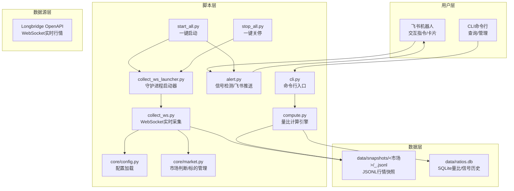
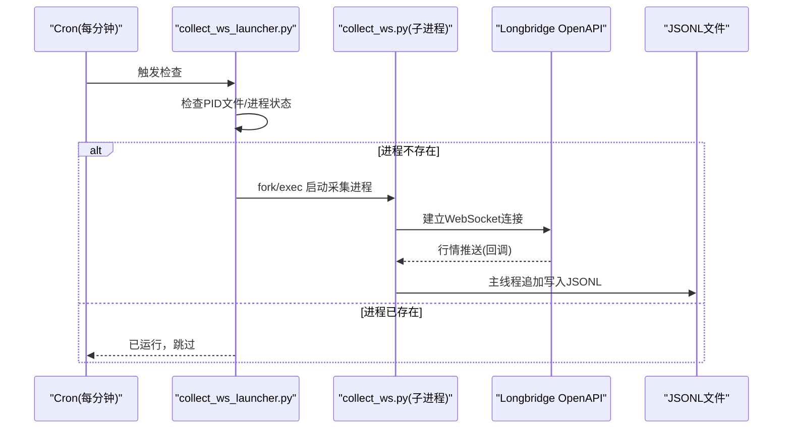
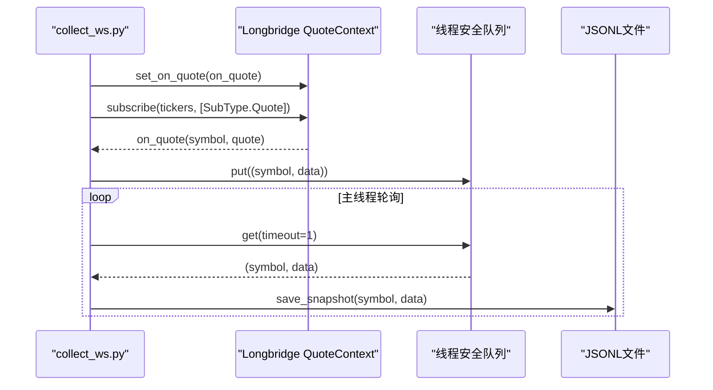
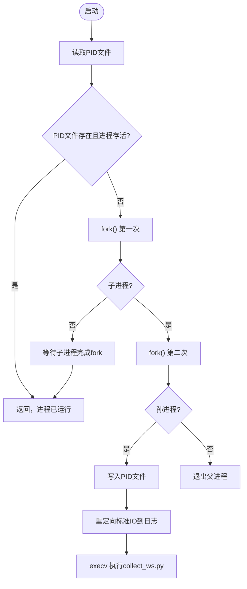
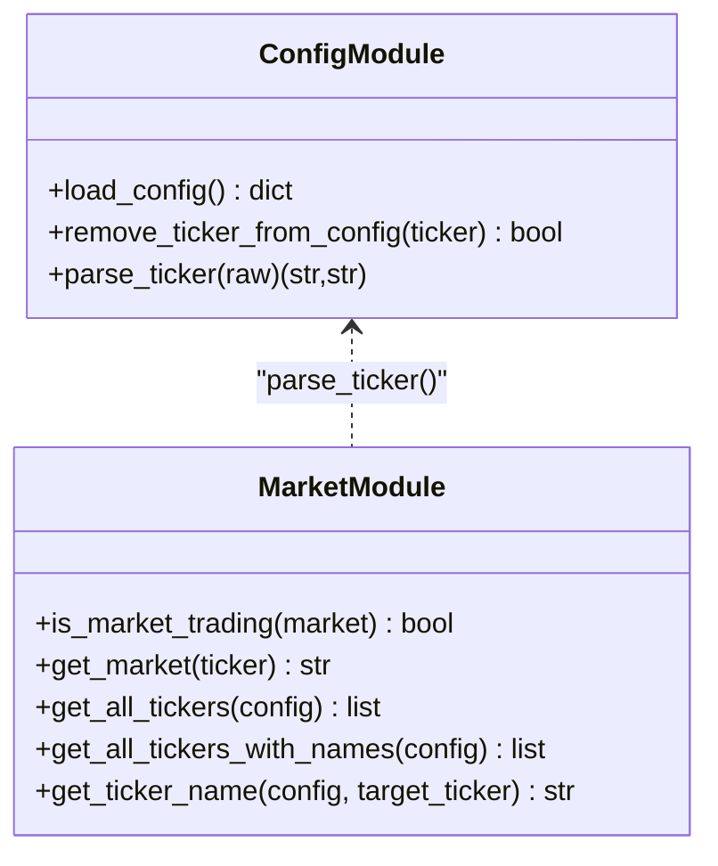
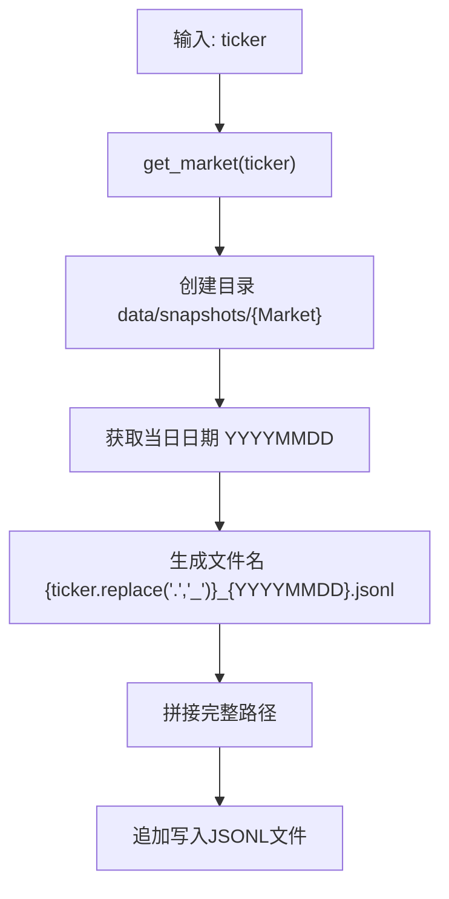
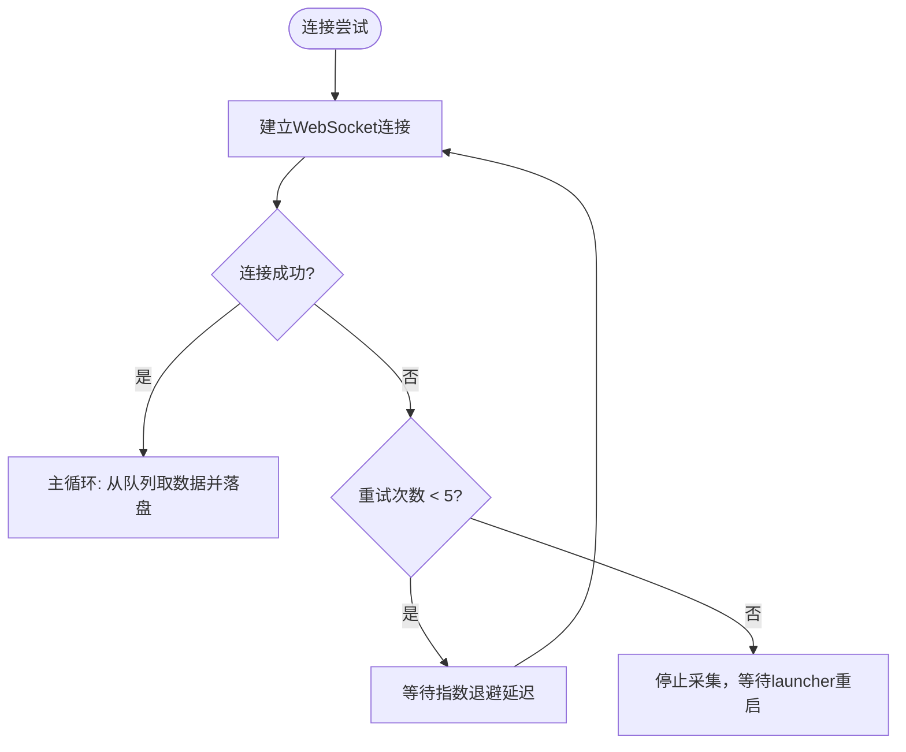
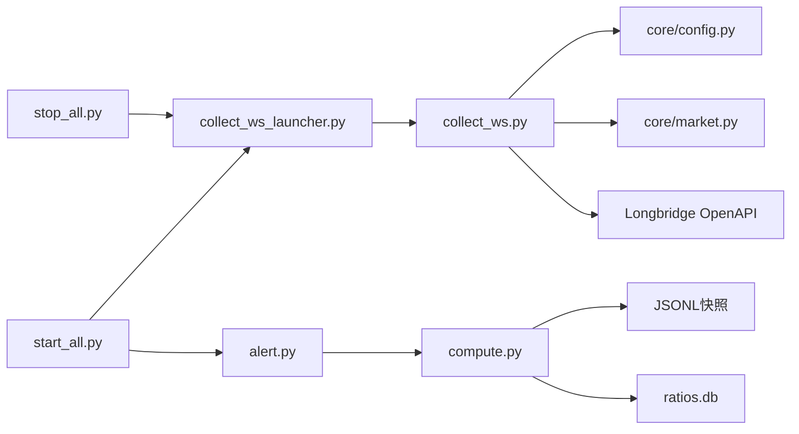

# 实时数据采集系统

<cite>
**本文档引用的文件**
- [README.md](file://README.md)
- [config.yaml.example](file://config.yaml.example)
- [scripts/collect_ws.py](file://scripts/collect_ws.py)
- [scripts/collect_ws_launcher.py](file://scripts/collect_ws_launcher.py)
- [scripts/core/config.py](file://scripts/core/config.py)
- [scripts/core/market.py](file://scripts/core/market.py)
- [scripts/collect.py](file://scripts/collect.py)
- [scripts/cli.py](file://scripts/cli.py)
- [scripts/start_all.py](file://scripts/start_all.py)
- [scripts/stop_all.py](file://scripts/stop_all.py)
- [scripts/compute.py](file://scripts/compute.py)
- [scripts/alert.py](file://scripts/alert.py)
</cite>

## 目录
1. [简介](#简介)
2. [项目结构](#项目结构)
3. [核心组件](#核心组件)
4. [架构总览](#架构总览)
5. [详细组件分析](#详细组件分析)
6. [依赖关系分析](#依赖关系分析)
7. [性能考虑](#性能考虑)
8. [故障排查指南](#故障排查指南)
9. [结论](#结论)
10. [附录](#附录)

## 简介
本系统是一个跨市场量比监控与实时数据采集平台，支持美股(US)、港股(HK)、A股(CN)三大市场的实时行情采集与量比计算，结合LLM智能分析与飞书机器人推送，提供交互式信号卡片与一键启停管理能力。系统采用Longbridge OpenAPI的WebSocket长连接进行实时行情推送，数据以JSONL格式按市场和日期组织存储，辅以SQLite数据库记录量比与信号历史。

## 项目结构
系统采用脚本层-数据层-数据源层的分层设计，核心脚本位于scripts目录，数据存储于data目录，配置文件为config.yaml。

**图表来源**
- [README.md: 106-142:106-142](file://README.md#L106-L142)
- [scripts/collect_ws.py: 159-213:159-213](file://scripts/collect_ws.py#L159-L213)
- [scripts/collect_ws_launcher.py: 29-78:29-78](file://scripts/collect_ws_launcher.py#L29-L78)
- [scripts/core/config.py: 20-31:20-31](file://scripts/core/config.py#L20-L31)
- [scripts/core/market.py: 61-69:61-69](file://scripts/core/market.py#L61-L69)
- [scripts/compute.py: 138-194:138-194](file://scripts/compute.py#L138-L194)
- [scripts/alert.py: 15-18:15-18](file://scripts/alert.py#L15-L18)

**章节来源**
- [README.md: 106-142:106-142](file://README.md#L106-L142)

## 核心组件
- WebSocket实时采集：通过Longbridge OpenAPI建立WebSocket连接，订阅行情推送，回调线程仅入队，主线程负责落盘，避免后台模式下的文件丢失问题。
- 守护进程启动器：每分钟检查并确保采集进程存活，进程挂掉自动重启。
- 配置与市场模块：统一的配置热加载与市场判断，支持US/HK/CN市场及watchlist管理。
- 数据存储：JSONL文件按市场和日期组织，每标的每日一个文件；SQLite数据库记录量比与信号历史。
- 信号检测与推送：基于规则检测量比异常信号，通过飞书机器人推送富文本卡片。

**章节来源**
- [scripts/collect_ws.py: 117-147:117-147](file://scripts/collect_ws.py#L117-L147)
- [scripts/collect_ws_launcher.py: 29-78:29-78](file://scripts/collect_ws_launcher.py#L29-L78)
- [scripts/core/config.py: 20-31:20-31](file://scripts/core/config.py#L20-L31)
- [scripts/core/market.py: 50-69:50-69](file://scripts/core/market.py#L50-L69)
- [scripts/compute.py: 138-194:138-194](file://scripts/compute.py#L138-L194)
- [scripts/alert.py: 61-142:61-142](file://scripts/alert.py#L61-L142)

## 架构总览
系统采用“守护进程+定时任务”的架构，WebSocket采集进程通过守护进程启动器保证存活，定时任务负责信号检测、简报推送、数据清理等。

**图表来源**
- [scripts/collect_ws_launcher.py: 29-78:29-78](file://scripts/collect_ws_launcher.py#L29-L78)
- [scripts/collect_ws.py: 159-213:159-213](file://scripts/collect_ws.py#L159-L213)

## 详细组件分析

### WebSocket数据采集组件
- 连接建立：通过OAuthBuilder构建客户端，Config.from_oauth加载令牌，创建QuoteContext并订阅行情。
- 行情订阅：订阅类型为Quote，回调函数on_quote仅将数据入队，避免并发写盘。
- 主线程落盘：主线程循环从队列取出数据，调用extract_fields提取关键字段，保存为JSONL文件。
- 错误处理与重试：连接异常时按指数退避重试，最多5次；进程收到SIGINT/SIGTERM信号时优雅退出。
- 守护进程：支持前台运行与后台守护模式，后台模式下重定向标准IO至日志文件。

**图表来源**
- [scripts/collect_ws.py: 117-196:117-196](file://scripts/collect_ws.py#L117-L196)
- [scripts/collect_ws.py: 138-147:138-147](file://scripts/collect_ws.py#L138-L147)

**章节来源**
- [scripts/collect_ws.py: 39-61:39-61](file://scripts/collect_ws.py#L39-L61)
- [scripts/collect_ws.py: 86-114:86-114](file://scripts/collect_ws.py#L86-L114)
- [scripts/collect_ws.py: 159-213:159-213](file://scripts/collect_ws.py#L159-L213)
- [scripts/collect_ws.py: 216-257:216-257](file://scripts/collect_ws.py#L216-L257)

### 守护进程启动器组件
- 进程检查：读取PID文件，使用os.kill(pid, 0)判断进程是否存在。
- 启动流程：fork两次形成双倍守护进程，创建新会话，重定向标准IO，exec目标脚本。
- 日志管理：输出日志到ws_collect.log，错误日志到ws_collect.err，PID写入ws_collect.pid。
- 定时触发：通过cron每分钟调用，确保采集进程始终运行。

**图表来源**
- [scripts/collect_ws_launcher.py: 29-78:29-78](file://scripts/collect_ws_launcher.py#L29-L78)

**章节来源**
- [scripts/collect_ws_launcher.py: 21-26:21-26](file://scripts/collect_ws_launcher.py#L21-L26)
- [scripts/collect_ws_launcher.py: 29-78:29-78](file://scripts/collect_ws_launcher.py#L29-L78)

### 配置与市场模块
- 配置热加载：基于文件修改时间的缓存机制，修改config.yaml后无需重启进程即可生效。
- watchlist管理：支持添加/移除标的，解析带中文名的ticker格式，按市场分类管理。
- 市场判断：根据ticker后缀判断市场，提供交易时间判断与遍历所有标的的工具方法。

**图表来源**
- [scripts/core/config.py: 20-62:20-62](file://scripts/core/config.py#L20-L62)
- [scripts/core/market.py: 11-87:11-87](file://scripts/core/market.py#L11-L87)

**章节来源**
- [scripts/core/config.py: 20-47:20-47](file://scripts/core/config.py#L20-L47)
- [scripts/core/market.py: 50-87:50-87](file://scripts/core/market.py#L50-L87)

### 数据存储策略
- JSONL文件格式：每行一条JSON记录，追加写入，避免频繁打开/关闭文件带来的性能损耗。
- 目录结构：按市场分目录，如data/snapshots/US/，便于按市场检索与清理。
- 文件命名规范：格式为{TICKER}_{YYYYMMDD}.jsonl，TICKER中的点号替换为下划线，确保文件系统兼容性。
- 数据持久化：主线程负责落盘，回调线程仅入队，降低后台模式下文件丢失风险。

**图表来源**
- [scripts/collect_ws.py: 126-147:126-147](file://scripts/collect_ws.py#L126-L147)
- [scripts/collect.py: 81-94:81-94](file://scripts/collect.py#L81-L94)

**章节来源**
- [scripts/collect_ws.py: 126-147:126-147](file://scripts/collect_ws.py#L126-L147)
- [scripts/collect.py: 81-94:81-94](file://scripts/collect.py#L81-L94)

### 错误处理与重试机制
- 连接断开检测：捕获OSError、ConnectionError、TimeoutError等异常，判定为连接失败。
- 自动重连逻辑：最多5次重试，延迟按[30s, 1m, 2m, 5m, 10m]递增，达到最大重试次数后停止采集。
- 异常恢复策略：未知异常时打印错误并退出；进程信号处理确保优雅关闭。
- 守护进程健壮性：启动器每分钟检查，进程挂掉自动重启，保证系统连续运行。

**图表来源**
- [scripts/collect_ws.py: 159-213:159-213](file://scripts/collect_ws.py#L159-L213)

**章节来源**
- [scripts/collect_ws.py: 159-213:159-213](file://scripts/collect_ws.py#L159-L213)

### 数据采集配置选项
- watchlist：监控标的清单，支持US/HK/CN三市场，格式为“代码.市场-中文名”。
- params：系统参数，包括量比窗口、快照间隔、告警阈值、缩量阈值等。
- llm：LLM提供商配置，支持多模型切换与测试。
- feishu：飞书机器人配置，支持自建应用与Webhook备用方案。

**章节来源**
- [config.yaml.example: 13-28:13-28](file://config.yaml.example#L13-L28)
- [config.yaml.example: 32-36:32-36](file://config.yaml.example#L32-L36)
- [config.yaml.example: 42-62:42-62](file://config.yaml.example#L42-L62)
- [config.yaml.example: 67-72:67-72](file://config.yaml.example#L67-L72)

## 依赖关系分析
- collect_ws.py依赖core.config与core.market进行配置与市场判断，依赖Longbridge OpenAPI进行行情订阅。
- collect_ws_launcher.py依赖os与pathlib进行进程管理与文件操作。
- compute.py依赖SQLite进行量比与信号历史存储，依赖JSONL文件读取快照。
- alert.py依赖compute.py进行量比计算，依赖飞书机器人进行消息推送。
- start_all.py与stop_all.py分别负责定时任务配置与进程管理。

**图表来源**
- [scripts/collect_ws.py: 28-29:28-29](file://scripts/collect_ws.py#L28-L29)
- [scripts/collect_ws_launcher.py: 17-18:17-18](file://scripts/collect_ws_launcher.py#L17-L18)
- [scripts/compute.py: 16-L18:16-18](file://scripts/compute.py#L16-L18)
- [scripts/alert.py: 15-L18:15-18](file://scripts/alert.py#L15-L18)
- [scripts/start_all.py: 124-L128:124-128](file://scripts/start_all.py#L124-L128)
- [scripts/stop_all.py: 51-L72:51-72](file://scripts/stop_all.py#L51-L72)

**章节来源**
- [scripts/collect_ws.py: 28-29:28-29](file://scripts/collect_ws.py#L28-L29)
- [scripts/collect_ws_launcher.py: 17-18:17-18](file://scripts/collect_ws_launcher.py#L17-L18)
- [scripts/compute.py: 16-L18:16-18](file://scripts/compute.py#L16-L18)
- [scripts/alert.py: 15-L18:15-18](file://scripts/alert.py#L15-L18)
- [scripts/start_all.py: 124-L128:124-128](file://scripts/start_all.py#L124-L128)
- [scripts/stop_all.py: 51-L72:51-72](file://scripts/stop_all.py#L51-L72)

## 性能考虑
- JSONL追加写入：避免随机写入，减少磁盘碎片与IO抖动。
- 线程分离：回调线程仅入队，主线程负责落盘，降低锁竞争与上下文切换。
- 指数退避重试：避免频繁重连导致的资源浪费与网络拥塞。
- 文件组织：按市场分目录，减少单目录文件数量，提升文件系统性能。
- 定时任务：通过cron精确控制运行频率，平衡实时性与资源占用。

[本节为通用性能讨论，无需具体文件分析]

## 故障排查指南
- WebSocket进程不存在：查看launcher.log确认启动情况，手动执行collect_ws_launcher.py验证。
- 飞书机器人不响应：检查config.yaml中feishu配置，确认飞书开放平台权限与版本发布状态。
- LLM API调用失败：核对api_key与模型配置，使用llm.py测试连接与切换模型。
- 数据不足：5日历史量比需至少5个交易日数据，可使用日内滚动量比作为补充。
- 日志定位：关注ws_collect.log、feishu_bot.log、alert.log等关键日志文件。

**章节来源**
- [README.md: 354-390:354-390](file://README.md#L354-L390)

## 结论
该实时数据采集系统通过WebSocket长连接实现低延迟行情推送，结合守护进程与定时任务保障高可用性，采用JSONL与SQLite双存储策略满足不同场景需求。系统提供完善的配置管理、信号检测与飞书推送能力，适合在生产环境中长期稳定运行。

[本节为总结性内容，无需具体文件分析]

## 附录

### 实际使用示例
- 启动所有服务：python3 scripts/start_all.py
- 关停所有服务：python3 scripts/stop_all.py
- 查询单个标的：python3 scripts/cli.py --ticker CLF.US
- 添加监控标的：python3 scripts/cli.py --add CLF.US-克利夫兰
- 查看今日信号：python3 scripts/cli.py --signals
- LLM模型切换：python3 scripts/llm.py --switch xiaomi

**章节来源**
- [README.md: 272-294:272-294](file://README.md#L272-L294)
- [README.md: 219-268:219-268](file://README.md#L219-L268)