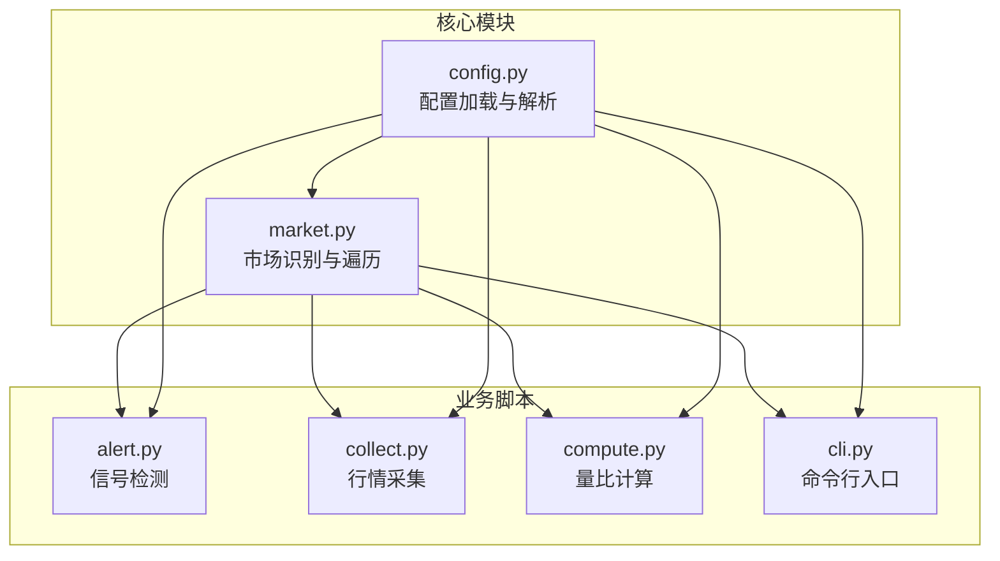
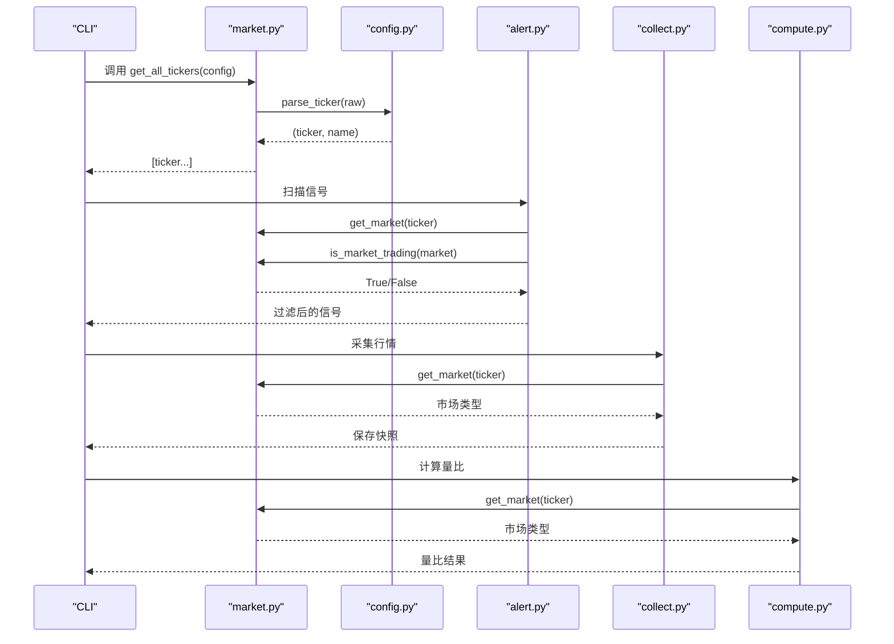
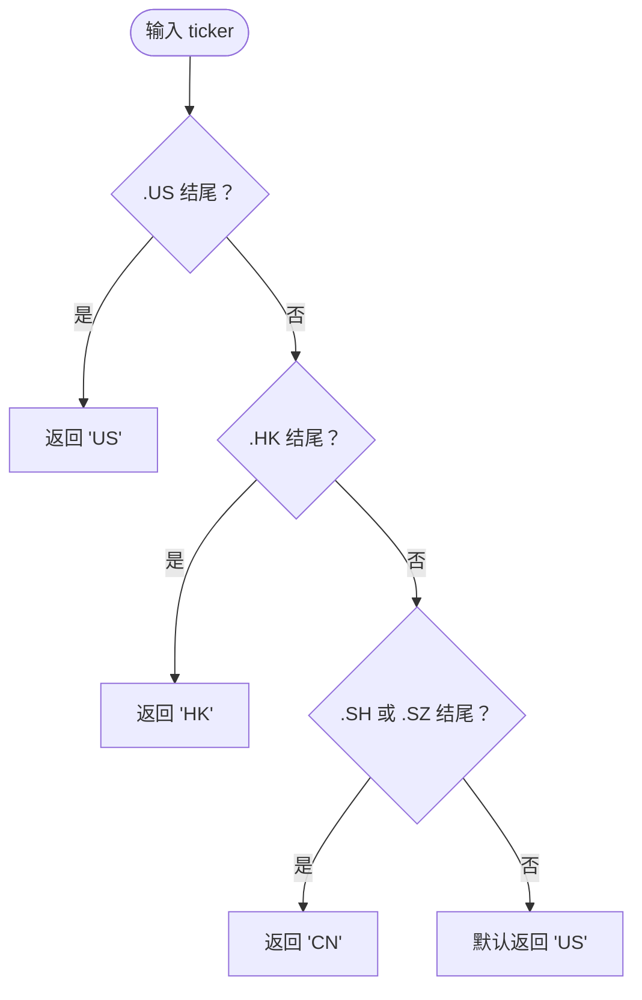
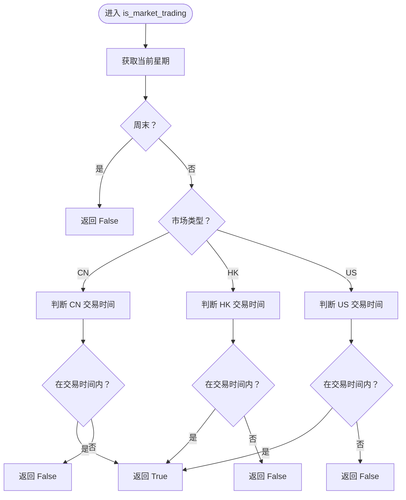
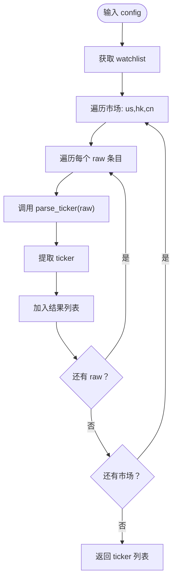
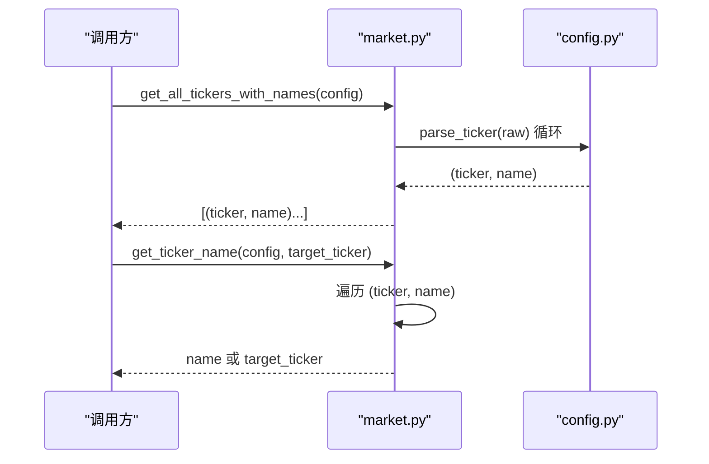
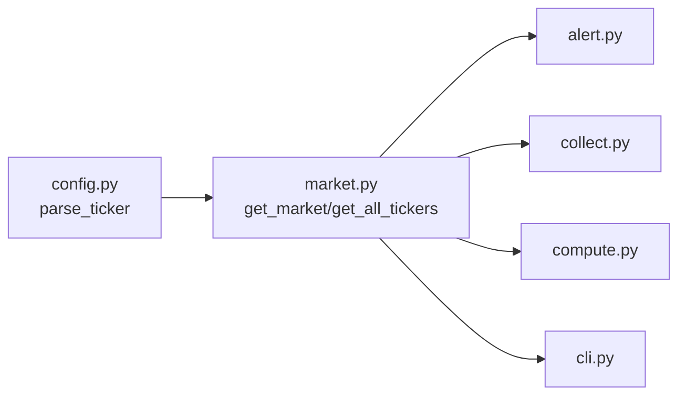

# 市场工具模块

<cite>
**本文档引用的文件**
- [scripts/core/market.py](file://scripts/core/market.py)
- [scripts/core/config.py](file://scripts/core/config.py)
- [scripts/cli.py](file://scripts/cli.py)
- [scripts/alert.py](file://scripts/alert.py)
- [scripts/collect.py](file://scripts/collect.py)
- [scripts/compute.py](file://scripts/compute.py)
- [config.yaml.example](file://config.yaml.example)
- [README.md](file://README.md)
</cite>

## 目录
1. [简介](#简介)
2. [项目结构](#项目结构)
3. [核心组件](#核心组件)
4. [架构总览](#架构总览)
5. [详细组件分析](#详细组件分析)
6. [依赖关系分析](#依赖关系分析)
7. [性能考虑](#性能考虑)
8. [故障排除指南](#故障排除指南)
9. [结论](#结论)
10. [附录](#附录)

## 简介
本文件为市场工具模块的技术文档，重点介绍市场识别与判断功能，包括：
- get_market() 函数的市场类型判断逻辑
- is_market_trading() 交易时间过滤机制
- get_all_tickers() 标的遍历功能
- 不同市场的标识符规范、时区处理和交易时间配置
- 标的名称获取 get_ticker_name()、市场过滤和交易状态检查的实现细节
- 多市场支持的架构设计、数据格式标准化和兼容性处理
- 市场配置示例、时区设置指南和交易时间自定义方法
- 实际使用示例和扩展新市场的步骤指南

## 项目结构
市场工具模块位于 scripts/core/market.py，配合核心配置模块 scripts/core/config.py，为整个系统提供统一的市场识别、标的遍历和名称解析能力。其他脚本如 alert.py、collect.py、compute.py、cli.py 等均通过导入 market.py 提供的功能进行市场维度的数据处理与过滤。

图表来源
- [scripts/core/market.py:1-88](file://scripts/core/market.py#L1-L88)
- [scripts/core/config.py:1-63](file://scripts/core/config.py#L1-L63)
- [scripts/alert.py:60-142](file://scripts/alert.py#L60-L142)
- [scripts/collect.py:20-125](file://scripts/collect.py#L20-L125)
- [scripts/compute.py:20-219](file://scripts/compute.py#L20-L219)
- [scripts/cli.py:20-463](file://scripts/cli.py#L20-L463)

章节来源
- [scripts/core/market.py:1-88](file://scripts/core/market.py#L1-L88)
- [scripts/core/config.py:1-63](file://scripts/core/config.py#L1-L63)
- [scripts/alert.py:60-142](file://scripts/alert.py#L60-L142)
- [scripts/collect.py:20-125](file://scripts/collect.py#L20-L125)
- [scripts/compute.py:20-219](file://scripts/compute.py#L20-L219)
- [scripts/cli.py:20-463](file://scripts/cli.py#L20-L463)

## 核心组件
本模块的核心函数包括：
- get_market(ticker: str) -> str：根据 ticker 后缀判断市场类型（US/HK/CN）
- is_market_trading(market: str) -> bool：判断某市场当前是否处于交易时间
- get_all_tickers(config: dict) -> list：从 watchlist 中提取所有 ticker（纯代码）
- get_all_tickers_with_names(config: dict) -> list：从 watchlist 中提取 (ticker, name) 元组
- get_ticker_name(config: dict, target_ticker: str) -> str：根据 ticker 查找中文名

这些函数共同支撑了跨市场监控的统一入口，确保各业务脚本能够以一致的方式处理不同市场的数据。

章节来源
- [scripts/core/market.py:50-87](file://scripts/core/market.py#L50-L87)

## 架构总览
市场工具模块采用“统一识别 + 分层过滤”的架构设计：
- 统一识别：通过 ticker 后缀识别市场类型，避免在各业务脚本中重复实现
- 分层过滤：在信号检测、行情采集、量比计算等阶段，先按市场类型过滤，再按交易时间过滤
- 名称解析：通过 parse_ticker 规范化解析 watchlist 中的 (ticker, name) 元组，支持中文名显示

图表来源
- [scripts/core/market.py:61-87](file://scripts/core/market.py#L61-L87)
- [scripts/core/config.py:50-62](file://scripts/core/config.py#L50-L62)
- [scripts/alert.py:61-142](file://scripts/alert.py#L61-L142)
- [scripts/collect.py:97-111](file://scripts/collect.py#L97-L111)
- [scripts/compute.py:197-219](file://scripts/compute.py#L197-L219)

## 详细组件分析

### get_market() 市场类型判断逻辑
- 输入：ticker 字符串（如 CLF.US、1810.HK、600029.SH）
- 判断规则：
  - 以 .US 结尾：美国市场（US）
  - 以 .HK 结尾：香港市场（HK）
  - 以 .SH 或 .SZ 结尾：中国内地市场（CN）
  - 默认：返回 US
- 作用：为后续的 is_market_trading() 和数据处理提供市场类型依据

图表来源
- [scripts/core/market.py:50-58](file://scripts/core/market.py#L50-L58)

章节来源
- [scripts/core/market.py:50-58](file://scripts/core/market.py#L50-L58)

### is_market_trading() 交易时间过滤机制
- 周内过滤：周末（周六、周日）一律返回 False
- 交易时间：
  - CN（A股）：9:30-11:30、13:00-15:00（北京时间）
  - HK（港股）：9:30-12:00、13:00-16:00（香港时间，与北京时间相同）
  - US（美股）：9:30-16:00 ET（东部时间）
    - 若安装 pytz：将系统本地时间转换为 US/Eastern 时区后判断
    - 若未安装 pytz：粗略判断（北京时间 21:30-次日5:00）
- 返回值：bool，表示当前是否在交易时间内

图表来源
- [scripts/core/market.py:11-47](file://scripts/core/market.py#L11-L47)

章节来源
- [scripts/core/market.py:11-47](file://scripts/core/market.py#L11-L47)

### get_all_tickers() 标的遍历功能
- 输入：config 字典（来自 load_config()）
- 处理流程：
  - 从 config.get("watchlist", {}) 获取 watchlist
  - 遍历 ["us", "hk", "cn"] 三个市场键
  - 对每个市场的原始条目 raw 调用 parse_ticker(raw)，仅取 ticker 部分
  - 收集为纯 ticker 列表
- 输出：list[str]，包含所有市场的 ticker

图表来源
- [scripts/core/market.py:61-69](file://scripts/core/market.py#L61-L69)
- [scripts/core/config.py:50-62](file://scripts/core/config.py#L50-L62)

章节来源
- [scripts/core/market.py:61-69](file://scripts/core/market.py#L61-L69)
- [scripts/core/config.py:50-62](file://scripts/core/config.py#L50-L62)

### get_all_tickers_with_names() 与 get_ticker_name()
- get_all_tickers_with_names(config: dict) -> list：
  - 与 get_all_tickers 类似，但返回 (ticker, name) 元组
  - 便于后续显示中文名和进行名称匹配
- get_ticker_name(config: dict, target_ticker: str) -> str：
  - 遍历 (ticker, name) 元组，若匹配则返回 name，否则返回 ticker 本身
  - 用于 CLI、告警、展示等场景的友好名称显示

图表来源
- [scripts/core/market.py:72-87](file://scripts/core/market.py#L72-L87)
- [scripts/core/config.py:50-62](file://scripts/core/config.py#L50-L62)

章节来源
- [scripts/core/market.py:72-87](file://scripts/core/market.py#L72-L87)
- [scripts/core/config.py:50-62](file://scripts/core/config.py#L50-L62)

### 多市场支持的架构设计与数据格式标准化
- 市场标识符规范：
  - 美国市场：ticker 后缀 .US
  - 香港市场：ticker 后缀 .HK
  - 中国内地市场：ticker 后缀 .SH 或 .SZ
- watchlist 格式：
  - 每个市场的条目支持两种格式：
    - 纯 ticker：如 CLF.US
    - 带中文名：如 CLF.US-克利夫兰
  - parse_ticker() 将上述格式解析为 (ticker, name) 元组
- 兼容性处理：
  - 默认返回 US，保证在未识别后缀时仍能正常工作
  - 在 US 交易时间判断中，若缺少 pytz，则采用粗略的北京时间区间判断

章节来源
- [scripts/core/market.py:50-58](file://scripts/core/market.py#L50-L58)
- [scripts/core/config.py:50-62](file://scripts/core/config.py#L50-L62)
- [config.yaml.example:12-28](file://config.yaml.example#L12-L28)

## 依赖关系分析
- market.py 依赖：
  - core.config.parse_ticker：用于解析 watchlist 条目中的 (ticker, name)
- alert.py、collect.py、compute.py、cli.py 等脚本通过导入 market.py 的函数实现：
  - 市场识别：get_market()
  - 交易时间过滤：is_market_trading()
  - 标的遍历：get_all_tickers()、get_all_tickers_with_names()
  - 名称解析：get_ticker_name()

图表来源
- [scripts/core/market.py:8](file://scripts/core/market.py#L8)
- [scripts/core/config.py:50-62](file://scripts/core/config.py#L50-L62)
- [scripts/alert.py:61-142](file://scripts/alert.py#L61-L142)
- [scripts/collect.py:97-111](file://scripts/collect.py#L97-L111)
- [scripts/compute.py:197-219](file://scripts/compute.py#L197-L219)
- [scripts/cli.py:21-463](file://scripts/cli.py#L21-L463)

章节来源
- [scripts/core/market.py:8](file://scripts/core/market.py#L8)
- [scripts/core/config.py:50-62](file://scripts/core/config.py#L50-L62)
- [scripts/alert.py:61-142](file://scripts/alert.py#L61-L142)
- [scripts/collect.py:97-111](file://scripts/collect.py#L97-L111)
- [scripts/compute.py:197-219](file://scripts/compute.py#L197-L219)
- [scripts/cli.py:21-463](file://scripts/cli.py#L21-L463)

## 性能考虑
- get_all_tickers() 与 get_all_tickers_with_names()：
  - 时间复杂度：O(N)，其中 N 为 watchlist 中的总条目数
  - 空间复杂度：O(N)
- is_market_trading()：
  - 时间复杂度：O(1)
  - 依赖 pytz 时，需进行时区转换，可能带来额外开销；未安装 pytz 时采用粗略判断，避免外部依赖
- get_ticker_name()：
  - 时间复杂度：O(N)，最坏情况下需遍历完整 (ticker, name) 列表
  - 建议在高频调用场景下缓存名称映射

[本节为一般性指导，不直接分析具体文件]

## 故障排除指南
- 交易时间判断异常（US）：
  - 现象：US 交易时间判断不准确
  - 原因：未安装 pytz
  - 处理：安装 pytz 或等待系统自动降级为粗略判断
- watchlist 解析错误：
  - 现象：中文名显示异常或 ticker 识别错误
  - 原因：watchlist 条目格式不符合规范
  - 处理：确保条目格式为 "TICKER.MARKET-中文名" 或 "TICKER.MARKET"
- 标的名称缺失：
  - 现象：get_ticker_name() 返回 ticker 本身
  - 原因：watchlist 中未包含该 ticker 的中文名条目
  - 处理：在 watchlist 中添加对应条目

章节来源
- [scripts/core/market.py:34-45](file://scripts/core/market.py#L34-L45)
- [scripts/core/config.py:50-62](file://scripts/core/config.py#L50-L62)
- [config.yaml.example:12-28](file://config.yaml.example#L12-L28)

## 结论
市场工具模块通过统一的市场识别、交易时间过滤和标的遍历能力，为跨市场量比监控系统提供了坚实的基础。其简洁的接口设计与良好的兼容性，使得各业务脚本能够以一致的方式处理不同市场的数据，并在保证性能的同时满足多市场支持的需求。

[本节为总结性内容，不直接分析具体文件]

## 附录

### 实际使用示例
- CLI 查询单个标的并显示中文名：
  - 使用 get_ticker_name() 获取中文名，结合 display 模块进行格式化输出
- 信号检测过滤：
  - 在 alert.py 中先通过 get_market() 识别市场，再通过 is_market_trading() 过滤非交易时间
- 行情采集遍历：
  - 在 collect.py 中通过 get_all_tickers() 获取所有 ticker，逐个采集并保存快照
- 量比计算遍历：
  - 在 compute.py 中通过 get_all_tickers() 获取所有 ticker，逐个计算量比并入库

章节来源
- [scripts/cli.py:41-65](file://scripts/cli.py#L41-L65)
- [scripts/alert.py:61-142](file://scripts/alert.py#L61-L142)
- [scripts/collect.py:97-111](file://scripts/collect.py#L97-L111)
- [scripts/compute.py:197-219](file://scripts/compute.py#L197-L219)

### 扩展新市场的步骤指南
- 新增市场标识符：
  - 在 get_market() 中增加新的后缀判断分支，返回新的市场代码（如 JP、SG 等）
- 配置交易时间：
  - 在 is_market_trading() 中新增 elif 分支，设置该市场的交易时间段
  - 如涉及时区差异，优先考虑使用 pytz 进行精确转换
- 更新 watchlist 格式：
  - 在 config.yaml.example 中添加新市场的示例条目，遵循 "TICKER.MARKET-中文名" 格式
- 验证与测试：
  - 使用 CLI 或 alert.py 进行端到端验证，确保新市场能被正确识别、过滤和处理
  - 检查中文名解析与显示是否正常

章节来源
- [scripts/core/market.py:50-58](file://scripts/core/market.py#L50-L58)
- [scripts/core/market.py:11-47](file://scripts/core/market.py#L11-L47)
- [config.yaml.example:12-28](file://config.yaml.example#L12-L28)