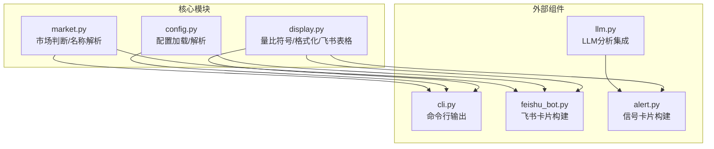
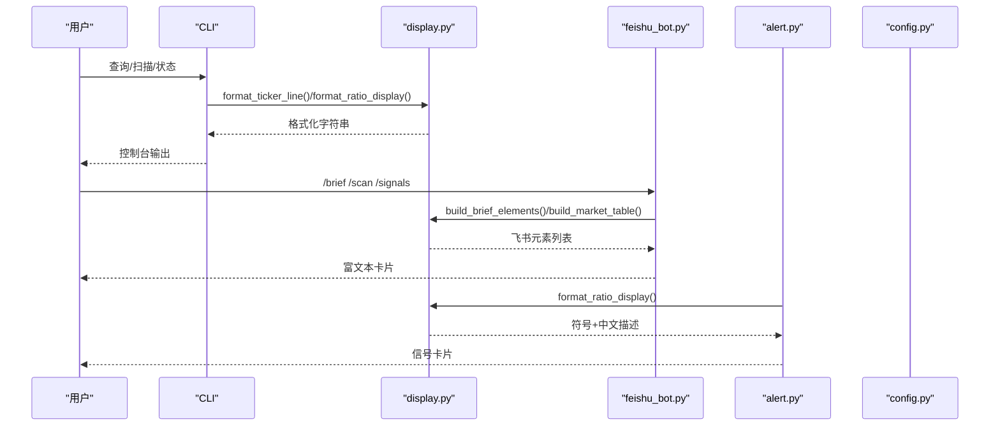
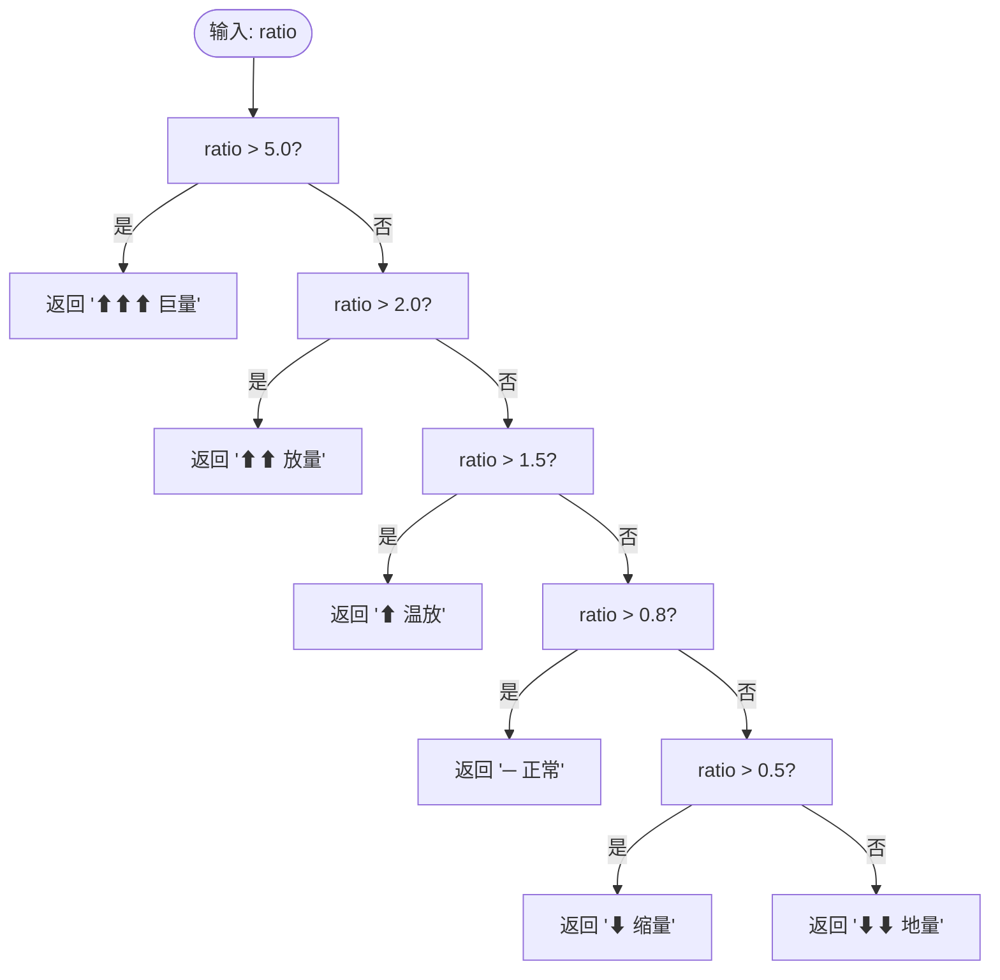
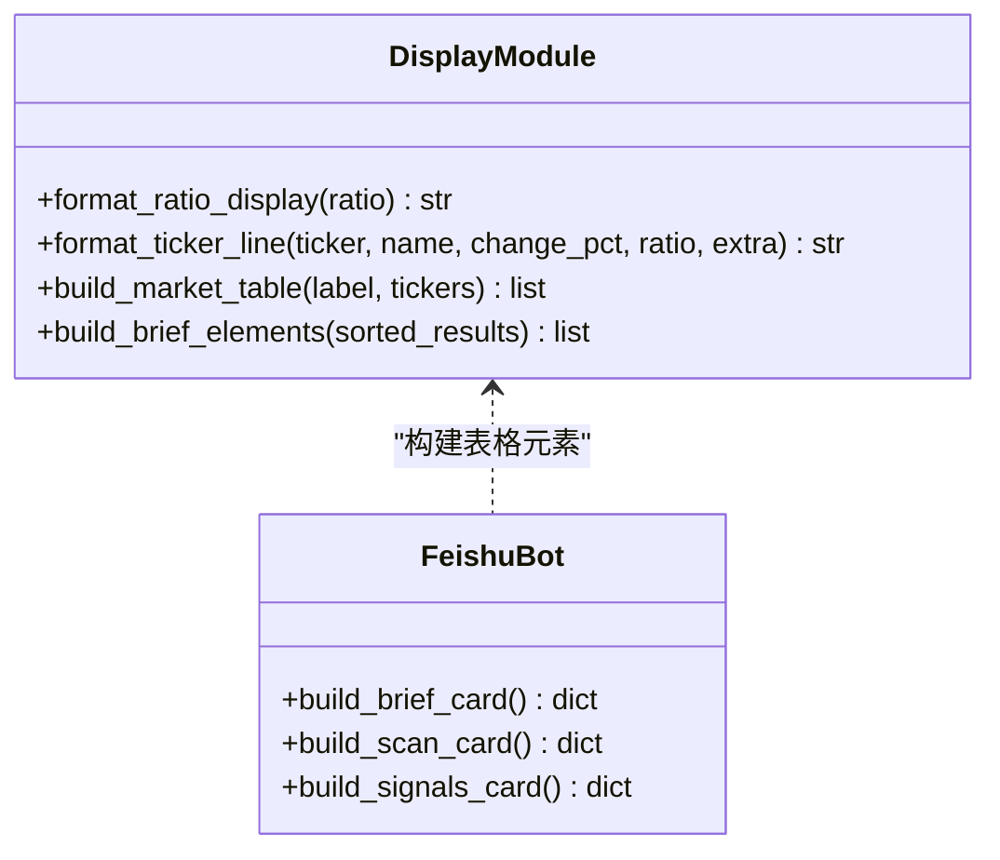
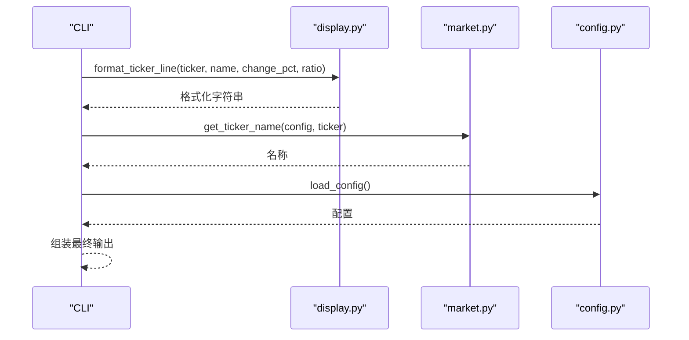
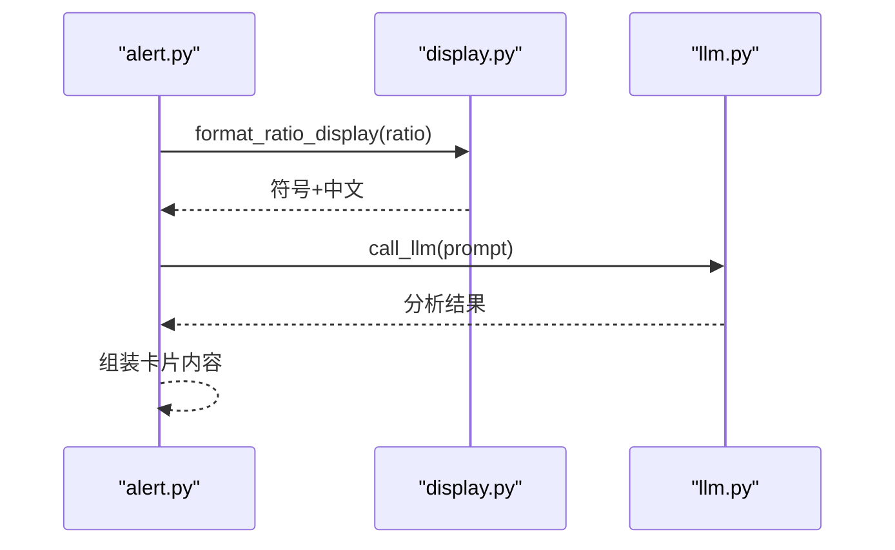
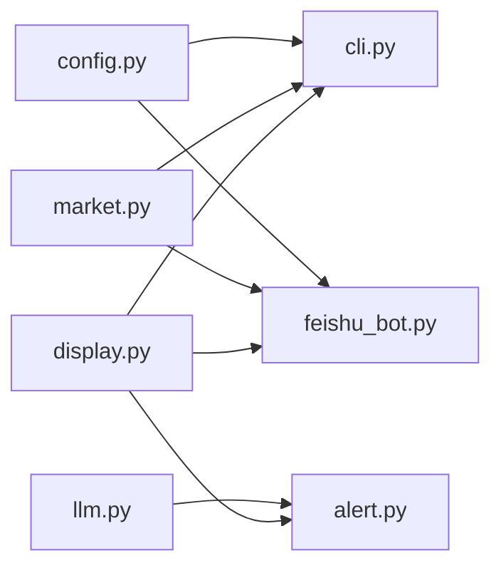

# 显示格式化模块

<cite>
**本文档引用的文件**
- [display.py](file://scripts/core/display.py)
- [cli.py](file://scripts/cli.py)
- [feishu_bot.py](file://scripts/feishu_bot.py)
- [config.py](file://scripts/core/config.py)
- [market.py](file://scripts/core/market.py)
- [alert.py](file://scripts/alert.py)
- [llm.py](file://scripts/llm.py)
- [README.md](file://README.md)
- [config.yaml](file://config.yaml)
</cite>

## 目录
1. [简介](#简介)
2. [项目结构](#项目结构)
3. [核心组件](#核心组件)
4. [架构总览](#架构总览)
5. [详细组件分析](#详细组件分析)
6. [依赖关系分析](#依赖关系分析)
7. [性能考虑](#性能考虑)
8. [故障排除指南](#故障排除指南)
9. [结论](#结论)
10. [附录](#附录)

## 简介
本文件为显示格式化模块的技术文档，聚焦于以下方面：
- 数值格式化：量比区间映射、涨跌幅符号与百分比显示、货币金额格式化
- 飞书卡片构建：消息格式设计、按钮交互配置、样式定制（原生表格、标题、内容块）
- CLI 输出格式化：统一的行格式、对齐方式、颜色编码（emoji）、表格显示
- 多场景格式化策略：命令行界面、飞书机器人、日志输出的差异化处理
- 格式化模板、样式配置与自定义选项
- 实际输出示例、参数调整与用户体验优化建议

## 项目结构
显示格式化模块位于 scripts/core/display.py，被 CLI、飞书机器人、信号推送等多个组件复用。核心职责包括：
- 量比区间到符号与中文描述的映射
- 统一的行格式化函数
- 飞书原生表格元素构建
- 简报卡片元素组装

图表来源
- [display.py:1-102](file://scripts/core/display.py#L1-L102)
- [cli.py:21-23](file://scripts/cli.py#L21-L23)
- [feishu_bot.py:31-33](file://scripts/feishu_bot.py#L31-L33)
- [alert.py:20-22](file://scripts/alert.py#L20-L22)
- [config.py:20-32](file://scripts/core/config.py#L20-L32)
- [market.py:50-79](file://scripts/core/market.py#L50-L79)

章节来源
- [display.py:1-102](file://scripts/core/display.py#L1-L102)
- [README.md:106-142](file://README.md#L106-L142)

## 核心组件
- 量比显示映射：将数值区间映射为符号与中文描述，便于快速扫描与确认
- 行格式化：统一输出格式，包含代码、名称、涨跌、量比、状态与附加信息
- 飞书表格构建：按市场分组生成原生表格元素，支持列宽、对齐、表头样式
- 简报元素组装：按 US/HK/CN 三个市场拆分并拼接多个表格元素

章节来源
- [display.py:8-40](file://scripts/core/display.py#L8-L40)
- [display.py:43-87](file://scripts/core/display.py#L43-L87)
- [display.py:90-101](file://scripts/core/display.py#L90-L101)

## 架构总览
显示格式化模块在系统中的位置与交互如下：

图表来源
- [cli.py:91-108](file://scripts/cli.py#L91-L108)
- [display.py:27-40](file://scripts/core/display.py#L27-L40)
- [display.py:43-87](file://scripts/core/display.py#L43-L87)
- [display.py:90-101](file://scripts/core/display.py#L90-L101)
- [feishu_bot.py:339-358](file://scripts/feishu_bot.py#L339-L358)
- [alert.py:145-196](file://scripts/alert.py#L145-L196)

## 详细组件分析

### 量比显示映射与行格式化
- 量比区间映射：将量比数值划分为若干区间，分别对应符号与中文描述，便于快速识别异常状态
- 行格式化：统一输出格式，包含代码、名称、涨跌符号与百分比、量比数值与状态、以及可选的附加信息
- 状态标记：根据量比区间选择不同的 emoji，作为视觉提示

图表来源
- [display.py:8-24](file://scripts/core/display.py#L8-L24)

章节来源
- [display.py:8-40](file://scripts/core/display.py#L8-L40)

### 飞书原生表格构建
- 市场表格：按 US/HK/CN 三个市场分组，构建包含列定义与行数据的原生表格元素
- 列定义：标的、价格、涨跌、量比、状态，支持列宽、水平对齐、数据类型
- 行数据：价格以美元格式显示，涨跌带符号与百分比，量比保留一位小数，状态包含 emoji 与中文描述
- 表头样式：支持文本对齐、字号、背景色、加粗、行数等

图表来源
- [display.py:43-87](file://scripts/core/display.py#L43-L87)
- [display.py:90-101](file://scripts/core/display.py#L90-L101)
- [feishu_bot.py:339-358](file://scripts/feishu_bot.py#L339-L358)
- [feishu_bot.py:166-197](file://scripts/feishu_bot.py#L166-L197)
- [feishu_bot.py:200-278](file://scripts/feishu_bot.py#L200-L278)

章节来源
- [display.py:43-87](file://scripts/core/display.py#L43-L87)
- [display.py:90-101](file://scripts/core/display.py#L90-L101)
- [feishu_bot.py:166-197](file://scripts/feishu_bot.py#L166-L197)
- [feishu_bot.py:200-278](file://scripts/feishu_bot.py#L200-L278)

### CLI 输出格式化
- 单个标的输出：调用行格式化函数，附加价格、信号详情与 LLM 分析（可选）
- 扫描输出：按量比降序排列，逐行输出格式化结果
- 历史趋势：固定宽度列对齐，包含时间、量比、价格、涨跌、信号
- 今日信号：固定宽度列对齐，包含时间、标的、涨跌、量比、信号来源

图表来源
- [cli.py:91-108](file://scripts/cli.py#L91-L108)
- [cli.py:200-236](file://scripts/cli.py#L200-L236)
- [cli.py:240-275](file://scripts/cli.py#L240-L275)
- [display.py:27-40](file://scripts/core/display.py#L27-L40)
- [market.py:82-87](file://scripts/core/market.py#L82-L87)
- [config.py:20-32](file://scripts/core/config.py#L20-L32)

章节来源
- [cli.py:91-108](file://scripts/cli.py#L91-L108)
- [cli.py:200-236](file://scripts/cli.py#L200-L236)
- [cli.py:240-275](file://scripts/cli.py#L240-L275)

### 信号卡片格式化
- 标题：根据量比区间选择图标，标注“日内/5日”来源
- 内容：当前价、涨跌幅、量比、信号、时间；可选 LLM 分析
- 信号显示：对特定信号类型附加涨跌方向，提升可读性

图表来源
- [alert.py:145-196](file://scripts/alert.py#L145-L196)
- [display.py:8-24](file://scripts/core/display.py#L8-L24)
- [llm.py:110-158](file://scripts/llm.py#L110-L158)

章节来源
- [alert.py:145-196](file://scripts/alert.py#L145-L196)
- [llm.py:110-158](file://scripts/llm.py#L110-L158)

## 依赖关系分析
- display.py 依赖：
  - format_ratio_display：量比区间映射
  - format_ticker_line：统一行格式化
  - build_market_table/build_brief_elements：飞书表格构建
- CLI 依赖：
  - display.py：行格式化与量比显示
  - market.py：名称解析
  - config.py：配置加载
- 飞书机器人依赖：
  - display.py：表格构建与量比显示
  - market.py：名称解析
  - config.py：配置加载
- 信号推送依赖：
  - display.py：量比显示
  - llm.py：分析集成

图表来源
- [display.py:1-102](file://scripts/core/display.py#L1-L102)
- [cli.py:21-23](file://scripts/cli.py#L21-L23)
- [feishu_bot.py:31-33](file://scripts/feishu_bot.py#L31-L33)
- [alert.py:20-22](file://scripts/alert.py#L20-L22)
- [market.py:8-8](file://scripts/core/market.py#L8-L8)
- [config.py:20-32](file://scripts/core/config.py#L20-L32)
- [llm.py:22-22](file://scripts/llm.py#L22-L22)

章节来源
- [display.py:1-102](file://scripts/core/display.py#L1-L102)
- [cli.py:21-23](file://scripts/cli.py#L21-L23)
- [feishu_bot.py:31-33](file://scripts/feishu_bot.py#L31-L33)
- [alert.py:20-22](file://scripts/alert.py#L20-L22)
- [market.py:8-8](file://scripts/core/market.py#L8-L8)
- [config.py:20-32](file://scripts/core/config.py#L20-L32)
- [llm.py:22-22](file://scripts/llm.py#L22-L22)

## 性能考虑
- 热加载配置：config.py 基于文件修改时间进行热加载，避免频繁磁盘访问
- 表格构建：按市场分组，减少不必要的过滤与拼接
- 格式化函数：纯函数式设计，无副作用，便于缓存与复用
- 对齐与宽度：使用固定宽度格式化，避免动态计算带来的开销

## 故障排除指南
- 量比显示异常
  - 检查量比区间映射是否符合预期
  - 确认输入值非负且有效
- 飞书表格样式异常
  - 检查列定义与数据类型一致性
  - 确认表头样式字段完整
- CLI 输出错位
  - 检查列宽与对齐设置
  - 确认中文字符宽度计算
- 配置未生效
  - 确认 config.yaml 修改后热加载机制正常
  - 检查文件权限与编码

章节来源
- [config.py:20-32](file://scripts/core/config.py#L20-L32)
- [display.py:43-87](file://scripts/core/display.py#L43-L87)
- [cli.py:200-236](file://scripts/cli.py#L200-L236)

## 结论
显示格式化模块通过简洁的函数设计与一致的格式规范，实现了跨场景的统一输出体验。其核心价值在于：
- 快速扫描：量比区间映射与符号提示
- 可读性强：统一的行格式与表格布局
- 可扩展：模块化设计便于新增格式化需求
- 可维护：清晰的依赖关系与热加载机制

## 附录

### 格式化参数与配置
- 量比区间阈值：可在配置中调整告警阈值与缩量阈值
- LLM 参数：最大令牌数、温度等，影响分析质量与成本
- 飞书卡片样式：表头样式、列宽、对齐方式等

章节来源
- [config.yaml:17-21](file://config.yaml#L17-L21)
- [config.yaml:22-28](file://config.yaml#L22-L28)
- [display.py:77-83](file://scripts/core/display.py#L77-L83)

### 实际输出示例（路径参考）
- CLI 单个标的输出：[format_ticker_output:91-108](file://scripts/cli.py#L91-L108)
- CLI 历史趋势表格：[cmd_history:200-236](file://scripts/cli.py#L200-L236)
- CLI 今日信号表格：[cmd_signals:240-275](file://scripts/cli.py#L240-L275)
- 飞书简报表格元素：[build_brief_elements:90-101](file://scripts/core/display.py#L90-L101)
- 飞书扫描卡片表格：[build_scan_card:166-197](file://scripts/feishu_bot.py#L166-L197)
- 飞书信号卡片表格：[build_signals_card:200-278](file://scripts/feishu_bot.py#L200-L278)
- 信号卡片内容：[format_alert_card:145-196](file://scripts/alert.py#L145-L196)

### 用户体验优化建议
- 在 CLI 中增加颜色编码（emoji）以增强视觉区分
- 在飞书卡片中提供“展开/收起”按钮，控制详细信息显示
- 支持自定义列宽与对齐，满足不同屏幕尺寸
- 提供导出功能，将表格数据导出为 CSV/Markdown