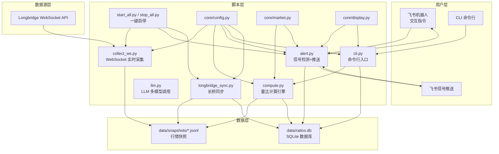
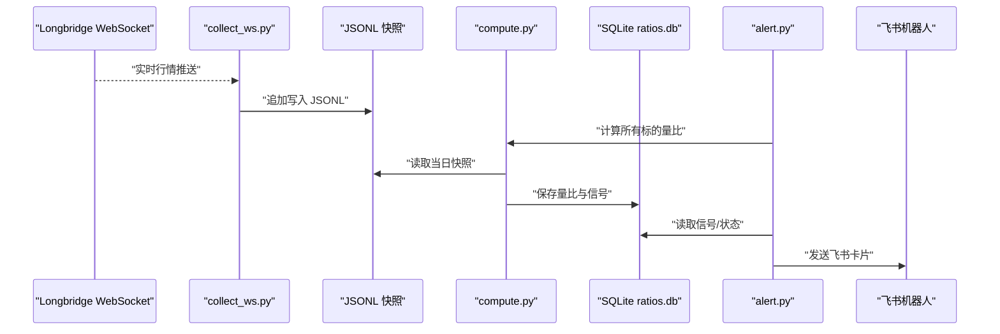
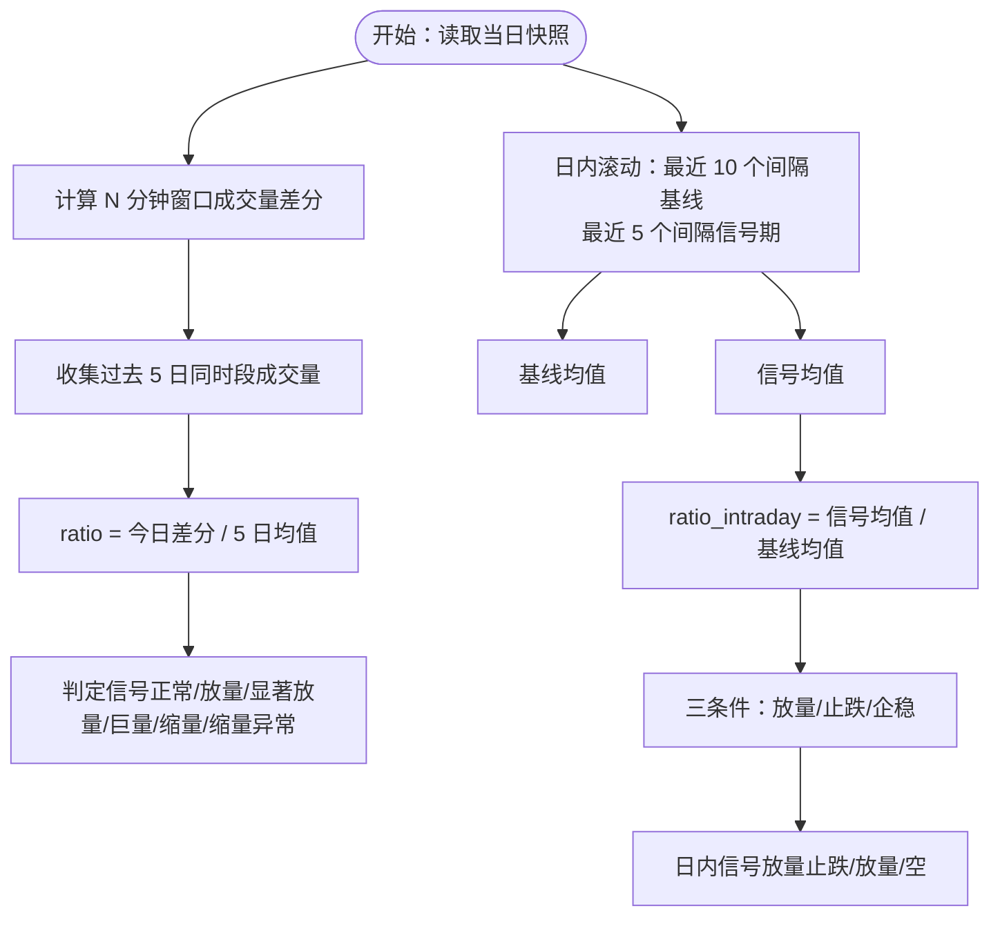
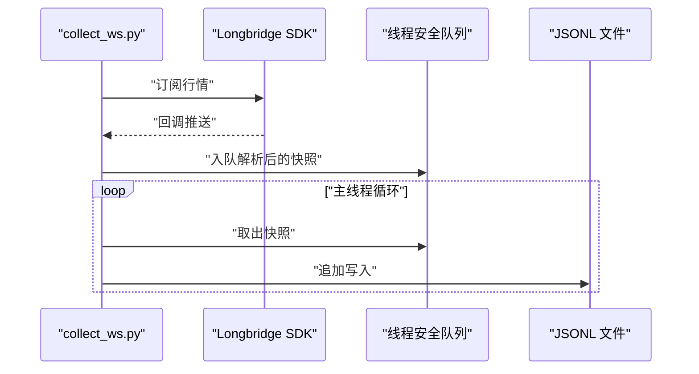
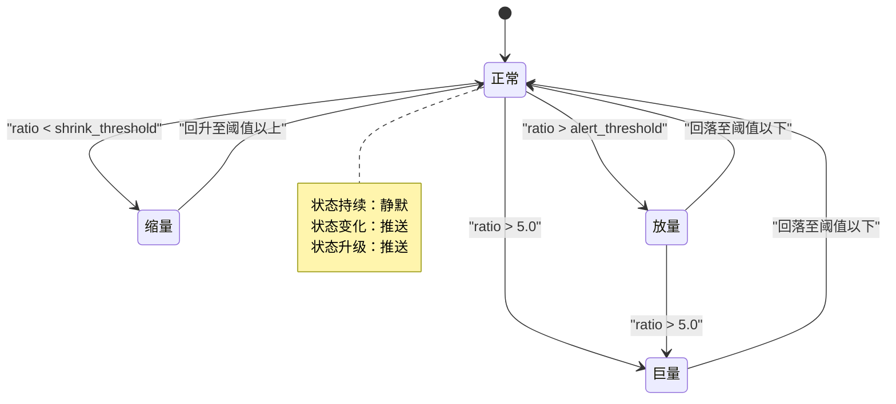
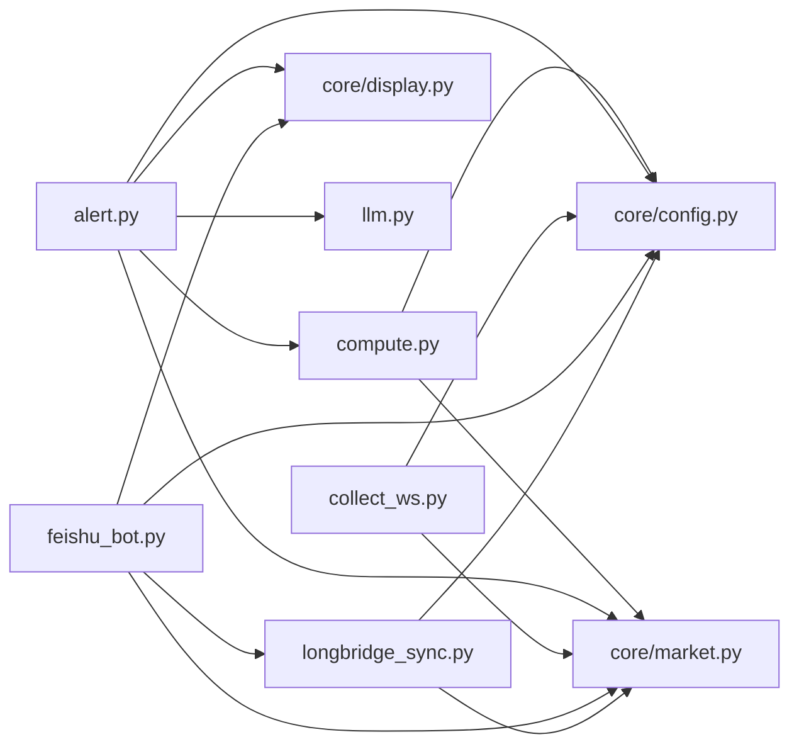

# 核心功能模块

<cite>
**本文引用的文件**
- [README.md](file://README.md)
- [config.yaml.example](file://config.yaml.example)
- [scripts/core/config.py](file://scripts/core/config.py)
- [scripts/core/market.py](file://scripts/core/market.py)
- [scripts/core/display.py](file://scripts/core/display.py)
- [scripts/compute.py](file://scripts/compute.py)
- [scripts/collect.py](file://scripts/collect.py)
- [scripts/collect_ws.py](file://scripts/collect_ws.py)
- [scripts/alert.py](file://scripts/alert.py)
- [scripts/llm.py](file://scripts/llm.py)
- [scripts/cli.py](file://scripts/cli.py)
- [scripts/longbridge_sync.py](file://scripts/longbridge_sync.py)
- [scripts/start_all.py](file://scripts/start_all.py)
- [scripts/stop_all.py](file://scripts/stop_all.py)
</cite>

## 目录
1. [引言](#引言)
2. [项目结构](#项目结构)
3. [核心组件](#核心组件)
4. [架构总览](#架构总览)
5. [详细组件分析](#详细组件分析)
6. [依赖分析](#依赖分析)
7. [性能考虑](#性能考虑)
8. [故障排查指南](#故障排查指南)
9. [结论](#结论)
10. [附录](#附录)

## 引言
本文件面向跨市场量比监控系统的核心功能模块，围绕“量比计算引擎”“实时数据采集”“信号检测与推送”“配置与显示格式化”等主题，提供从架构到实现细节的系统化说明。内容涵盖双量比算法（日内滚动量比与5日历史量比）、WebSocket工作机制、数据存储策略、信号去重状态机、LLM集成与推送机制、模块间交互关系与数据流、API接口说明、参数配置与使用示例。

## 项目结构
系统采用脚本驱动的模块化组织，核心模块位于 scripts/core 下，业务脚本位于 scripts/ 目录，数据落盘于 data/，日志位于 logs/。README 提供了总体架构图与模块职责说明；config.yaml.example 提供配置模板与参数说明。

图表来源
- [README.md:21-46](file://README.md#L21-L46)
- [scripts/start_all.py:120-169](file://scripts/start_all.py#L120-L169)

章节来源
- [README.md:106-142](file://README.md#L106-L142)
- [README.md:21-46](file://README.md#L21-L46)

## 核心组件
- 配置管理模块（core/config.py）：统一加载与热加载配置，提供解析标的格式、移除标的等工具。
- 市场工具模块（core/market.py）：市场判断、交易时间判断、标的遍历与名称解析。
- 显示格式化模块（core/display.py）：量比符号映射、格式化输出、飞书原生表格构建。
- 量比计算引擎（compute.py）：双量比算法（5日历史量比与日内滚动量比）、信号判定、数据库持久化。
- 实时采集（collect_ws.py）：Longbridge WebSocket 实时行情订阅、回调入队、主线程落盘。
- 信号检测与推送（alert.py）：信号规则、去重状态机、LLM分析、飞书卡片推送、定时简报。
- LLM 调用层（llm.py）：多模型切换、统一调用、调用记录。
- CLI（cli.py）：查询、扫描、历史、信号、增删静默等命令。
- 长桥同步（longbridge_sync.py）：持仓与自选股同步至 watchlist，卡片回调联动。
- 一键启停（start_all.py / stop_all.py）：cron 配置与进程管理。

章节来源
- [scripts/core/config.py:1-63](file://scripts/core/config.py#L1-L63)
- [scripts/core/market.py:1-88](file://scripts/core/market.py#L1-L88)
- [scripts/core/display.py:1-102](file://scripts/core/display.py#L1-L102)
- [scripts/compute.py:1-498](file://scripts/compute.py#L1-L498)
- [scripts/collect_ws.py:1-258](file://scripts/collect_ws.py#L1-L258)
- [scripts/alert.py:1-514](file://scripts/alert.py#L1-L514)
- [scripts/llm.py:1-193](file://scripts/llm.py#L1-L193)
- [scripts/cli.py:1-463](file://scripts/cli.py#L1-L463)
- [scripts/longbridge_sync.py:1-265](file://scripts/longbridge_sync.py#L1-L265)
- [scripts/start_all.py:1-169](file://scripts/start_all.py#L1-L169)
- [scripts/stop_all.py:1-108](file://scripts/stop_all.py#L1-L108)

## 架构总览
系统以“实时采集-计算-检测-推送-存储”为主线，辅以配置、显示与同步模块，形成闭环。WebSocket 保证低延迟行情，SQLite 与 JSONL 提供高吞吐与可扩展的数据存储，飞书机器人提供交互与可视化。

图表来源
- [scripts/collect_ws.py:159-214](file://scripts/collect_ws.py#L159-L214)
- [scripts/compute.py:48-117](file://scripts/compute.py#L48-L117)
- [scripts/compute.py:340-375](file://scripts/compute.py#L340-L375)
- [scripts/alert.py:367-448](file://scripts/alert.py#L367-L448)

## 详细组件分析

### 量比计算引擎（双量比算法）
- 5日历史量比（需要数据积累）
  - 计算逻辑：当日同时段成交量 / 过去5日同一时段成交量均值
  - 适用场景：消除日内节律，发现结构性放量
  - 依赖：JSONL 快照按日聚合，SQLite 存量比与信号
- 日内滚动量比（立即生效）
  - 计算逻辑：最近N分钟累计成交量差分 / 基线窗口均值
  - 三条件放量止跌检测：放量、止跌（低点不创新低）、企稳（最新价上破区间低点）
  - 适用场景：盘中即时捕捉异动
- 信号判定
  - 历史路径：基于阈值与信号规则
  - 日内路径：基于三条件组合
  - 详细信号：放量突破、放量下跌、缩量止跌、尾盘放量等

图表来源
- [scripts/compute.py:197-242](file://scripts/compute.py#L197-L242)
- [scripts/compute.py:249-322](file://scripts/compute.py#L249-L322)
- [scripts/compute.py:324-338](file://scripts/compute.py#L324-L338)

章节来源
- [scripts/compute.py:197-338](file://scripts/compute.py#L197-L338)
- [README.md:146-173](file://README.md#L146-L173)

### 实时数据采集系统（WebSocket）
- WebSocket 订阅与回调
  - 订阅标的集合来自配置 watchlist
  - 回调线程仅入队，主线程负责落盘，避免后台模式文件丢失
  - 支持重试与优雅退出
- JSONL 存储策略
  - 每标的每日一个 JSONL 文件，逐条追加
  - 相比单快照单文件，文件数从数万降至约11个/天
- 错误处理
  - 连接异常分级重试（最多5次）
  - 回调异常捕获与日志输出
  - 守护进程日志分离（标准输出/错误）

图表来源
- [scripts/collect_ws.py:117-194](file://scripts/collect_ws.py#L117-L194)
- [scripts/collect_ws.py:138-147](file://scripts/collect_ws.py#L138-L147)
- [README.md:314-325](file://README.md#L314-L325)

章节来源
- [scripts/collect_ws.py:1-258](file://scripts/collect_ws.py#L1-L258)
- [README.md:314-325](file://README.md#L314-L325)

### 信号检测系统（去重状态机、LLM集成、推送）
- 信号规则
  - 历史路径：阈值触发（放量/缩量）与信号规则（放量突破/放量下跌/缩量止跌/尾盘放量）
  - 日内路径：三条件放量止跌检测
- 去重状态机
  - 状态优先级：正常 < 缩量 < 放量/温放 < 放量突破/放量下跌/放量止跌/缩量止跌/尾盘放量 < 巨量
  - 判定策略：状态变化即推送；状态升级亦推送；降级或同级变化亦推送，确保不遗漏
- LLM 集成
  - 多模型切换：通过配置 profiles 一键切换
  - 统一调用：封装 Anthropic 兼容接口，记录调用日志
  - 触发策略：仅对强信号调用 LLM，同一标的同一轮仅调用一次
- 推送机制
  - 飞书卡片：标题、正文、LLM分析、交互按钮
  - 定时简报：每30分钟发送原生表格简报，附带 LLM 总结

图表来源
- [scripts/alert.py:276-365](file://scripts/alert.py#L276-L365)
- [scripts/alert.py:367-448](file://scripts/alert.py#L367-L448)

章节来源
- [scripts/alert.py:1-514](file://scripts/alert.py#L1-L514)
- [scripts/llm.py:1-193](file://scripts/llm.py#L1-L193)

### 配置管理与市场工具
- 配置加载（热加载）
  - 基于文件修改时间缓存，修改后自动生效
  - 提供解析标的格式（含中文名）、移除标的等工具
- 市场工具
  - 交易时间判断（考虑节假日与夏令时）
  - 市场后缀解析、标的遍历、中文名解析
- 显示格式化
  - 量比符号映射（巨量/放量/温放/正常/缩量/地量）
  - 统一格式化输出与飞书原生表格构建

章节来源
- [scripts/core/config.py:1-63](file://scripts/core/config.py#L1-L63)
- [scripts/core/market.py:1-88](file://scripts/core/market.py#L1-L88)
- [scripts/core/display.py:1-102](file://scripts/core/display.py#L1-L102)

### 数据存储策略
- JSONL 快照
  - 每标的每日文件，逐条追加，减少文件数量与 IO 压力
- SQLite 数据库
  - 表：volume_ratios、signals、signal_states、daily_summary、llm_calls
  - 索引：加速查询与统计
- 数据清理
  - 定时清理：JSONL 20天、volume_ratios 20天、signals 20天、daily_summary 90天

章节来源
- [README.md:314-351](file://README.md#L314-L351)
- [scripts/compute.py:147-195](file://scripts/compute.py#L147-L195)
- [scripts/alert.py:292-337](file://scripts/alert.py#L292-L337)

### CLI 与飞书机器人
- CLI
  - 查询单个标的、扫描持仓、扫描市场、历史趋势、今日信号、增删标的、静默等
  - 可选调用 LLM 分析
- 飞书机器人
  - WebSocket 长连接，支持 /start、/stop、/status、/scan、/signals、/brief、/watchlist、/allstock、/sync、/add、/remove、/mute、/history 等指令
  - 交互卡片：关注列表（删除按钮）、全部股票（分组导航+添加按钮）、同步结果、量比简报等
  - 卡片回调：删除/添加/返回等动作处理

章节来源
- [scripts/cli.py:1-463](file://scripts/cli.py#L1-L463)
- [scripts/feishu_bot.py:1-991](file://scripts/feishu_bot.py#L1-L991)

### 一键启停与守护
- 一键启动
  - 配置 cron 任务（采集、机器人、信号扫描、定时简报、同步、清理）
  - 启动 WebSocket 采集进程与飞书机器人进程
- 一键关停
  - 杀掉相关进程并移除 cron 任务，清理 PID 文件

章节来源
- [scripts/start_all.py:1-169](file://scripts/start_all.py#L1-L169)
- [scripts/stop_all.py:1-108](file://scripts/stop_all.py#L1-L108)

## 依赖分析
- 外部依赖
  - longbridge：行情与交易上下文
  - lark-oapi：飞书消息与 WebSocket
  - pyyaml、requests、pytz：配置、HTTP、时区
- 内部模块耦合
  - compute 依赖 core.config、core.market
  - alert 依赖 compute、core.config、core.market、core.display、llm
  - collect_ws 依赖 core.config、core.market
  - feishu_bot 依赖 core.config、core.market、core.display、longbridge_sync
  - longbridge_sync 依赖 core.config、core.market

图表来源
- [scripts/compute.py:23-24](file://scripts/compute.py#L23-L24)
- [scripts/alert.py:17-23](file://scripts/alert.py#L17-L23)
- [scripts/collect_ws.py:25-29](file://scripts/collect_ws.py#L25-L29)
- [scripts/feishu_bot.py:21-34](file://scripts/feishu_bot.py#L21-L34)
- [scripts/longbridge_sync.py:10-16](file://scripts/longbridge_sync.py#L10-L16)

## 性能考虑
- 采集与存储
  - WebSocket 回调入队 + 主线程落盘，降低后台模式下的文件丢失风险
  - JSONL 每日单文件，减少文件句柄与目录项压力
- 计算优化
  - 5日量比依赖历史窗口聚合，避免频繁 IO
  - 日内滚动量比基于差分序列，窗口固定，复杂度可控
- 数据库
  - SQLite 事务写入，索引加速查询
  - LLM 调用按需触发，避免冗余请求
- 并发与守护
  - 守护进程与 cron 定时，确保服务稳定运行

## 故障排查指南
- 量比显示 0.0 “数据不足”
  - 5日历史量比需要至少5个交易日数据
  - 建议优先参考日内滚动量比
- 飞书机器人不响应
  - 检查 app_id/app_secret 是否正确
  - 确认飞书开放平台已启用机器人、配置权限、发布版本
  - 查看 logs/feishu_bot.log
- WebSocket 进程不存在
  - 查看 logs/launcher.log
  - 手动重启 collect_ws_launcher.py
- LLM API 调用失败
  - 确认 api_key 正确
  - 使用 llm.py --test 测试
  - 使用 llm.py --switch 切换模型

章节来源
- [README.md:354-391](file://README.md#L354-L391)

## 结论
本系统通过“双量比算法 + WebSocket 实时采集 + 去重状态机 + LLM 智能分析 + 飞书交互”的组合，实现了跨 US/HK/CN 市场的高效量比监控。模块边界清晰、数据流明确、错误处理完备，具备良好的可维护性与扩展性。

## 附录

### 模块 API 与参数说明
- 配置模块（core/config.py）
  - load_config()：热加载配置
  - remove_ticker_from_config(ticker)：从 watchlist 移除标的
  - parse_ticker(raw)：解析带中文名的 ticker 格式
- 市场模块（core/market.py）
  - is_market_trading(market)：判断市场是否交易
  - get_market(ticker)：解析市场后缀
  - get_all_tickers(config)/get_all_tickers_with_names(config)：遍历 watchlist
  - get_ticker_name(config, ticker)：解析中文名
- 显示模块（core/display.py）
  - format_ratio_display(ratio)：量比符号映射
  - format_ticker_line(...)：统一格式化输出
  - build_market_table(label, tickers)/build_brief_elements(sorted_results)：飞书原生表格
- 量比计算（compute.py）
  - calc_volume_ratio(ticker)/calc_intraday_ratio(ticker)：双量比计算
  - get_signal(ratio)/get_signal_detail(ratio, change_pct)：信号判定
  - save_ratio()/save_signal()：数据库持久化
  - compute_all()/compute_ticker(ticker)：批量/单个计算
- 实时采集（collect_ws.py）
  - run_websocket()：建立订阅与落盘循环
  - save_snapshot(ticker, data)：JSONL 写入
- 信号检测（alert.py）
  - detect_signals(results)：信号检测
  - should_push(ticker, new_state)/update_signal_state(ticker, state)：去重状态机
  - format_alert_card(alert, analysis)/send_feishu_card(card, chat_id)：卡片推送
  - send_brief_report()：定时简报
- LLM 调用（llm.py）
  - call_llm(prompt, model)：统一调用
  - switch_llm(profile_name)：切换模型
  - log_llm_call(model, success)：记录调用
- CLI（cli.py）
  - query_ticker(ticker, analyze)/scan_holdings()/scan_market(market, min_ratio)
  - cmd_status()/cmd_history(ticker)/cmd_signals()/cmd_add_ticker()/cmd_remove_ticker()/cmd_mute(ticker, duration)
- 长桥同步（longbridge_sync.py）
  - run_sync(groups, restart_ws)：完整同步流程
  - add_to_monitor(ticker, name)/remove_from_watchlist(ticker)
  - fetch_other_groups(exclude_names)

章节来源
- [scripts/core/config.py:20-63](file://scripts/core/config.py#L20-L63)
- [scripts/core/market.py:11-88](file://scripts/core/market.py#L11-L88)
- [scripts/core/display.py:8-102](file://scripts/core/display.py#L8-L102)
- [scripts/compute.py:197-484](file://scripts/compute.py#L197-L484)
- [scripts/collect_ws.py:159-214](file://scripts/collect_ws.py#L159-L214)
- [scripts/alert.py:61-502](file://scripts/alert.py#L61-L502)
- [scripts/llm.py:110-159](file://scripts/llm.py#L110-L159)
- [scripts/cli.py:41-463](file://scripts/cli.py#L41-L463)
- [scripts/longbridge_sync.py:18-251](file://scripts/longbridge_sync.py#L18-L251)

### 参数配置选项
- 监控标的（watchlist）
  - 格式：TICKER.MARKET-中文名
  - 支持 us/hk/cn 三市场
- 系统参数（params）
  - volume_ratio_window：日内窗口分钟数（默认5）
  - snapshot_interval：快照间隔（秒）
  - alert_threshold：放量阈值（默认2.0）
  - shrink_threshold：缩量阈值（默认0.6）
- LLM 配置（llm）
  - provider/model/base_url/api_key/max_tokens/temperature
  - 支持 profiles：minimax/xiaomi 等
- 飞书配置（feishu）
  - app_id/app_secret/chat_id/webhook_url（可选）

章节来源
- [config.yaml.example:13-73](file://config.yaml.example#L13-L73)
- [README.md:72-92](file://README.md#L72-L92)

### 使用示例
- 快速开始
  - 复制配置模板并填写 watchlist、LLM、飞书参数
  - 一键启动：python3 scripts/start_all.py
  - 一键关停：python3 scripts/stop_all.py
- 查询与分析
  - 查询单个标的：python3 scripts/cli.py --ticker CLF.US
  - 带 LLM 分析：python3 scripts/cli.py --ticker CLF.US --analyze
  - 扫描市场：python3 scripts/cli.py --market US --min-ratio 2.0
- 飞书交互
  - /start、/stop、/status、/scan、/signals、/brief、/watchlist、/allstock、/sync、/add、/remove、/mute、/history
- LLM 切换
  - 查看模型：python3 scripts/llm.py --list
  - 切换模型：python3 scripts/llm.py --switch xiaomi
  - 测试配置：python3 scripts/llm.py --test

章节来源
- [README.md:50-103](file://README.md#L50-L103)
- [README.md:176-215](file://README.md#L176-L215)
- [README.md:219-269](file://README.md#L219-L269)
- [README.md:272-311](file://README.md#L272-L311)