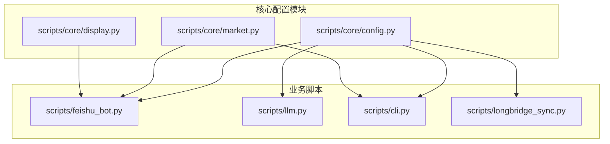
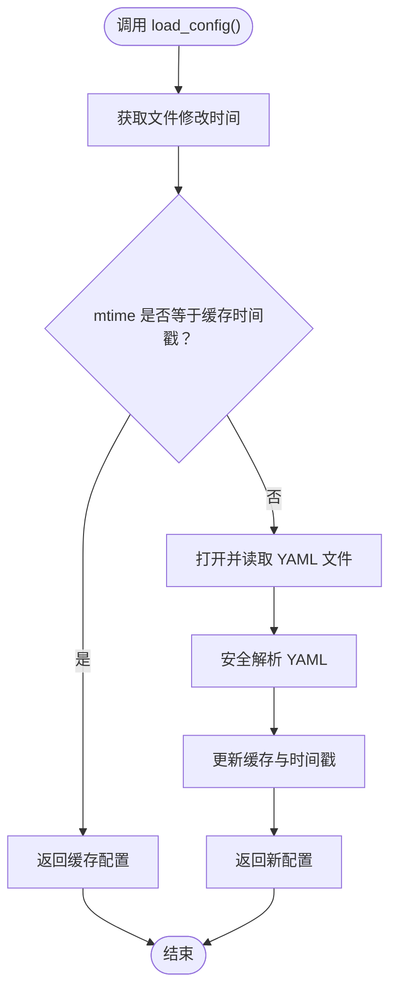
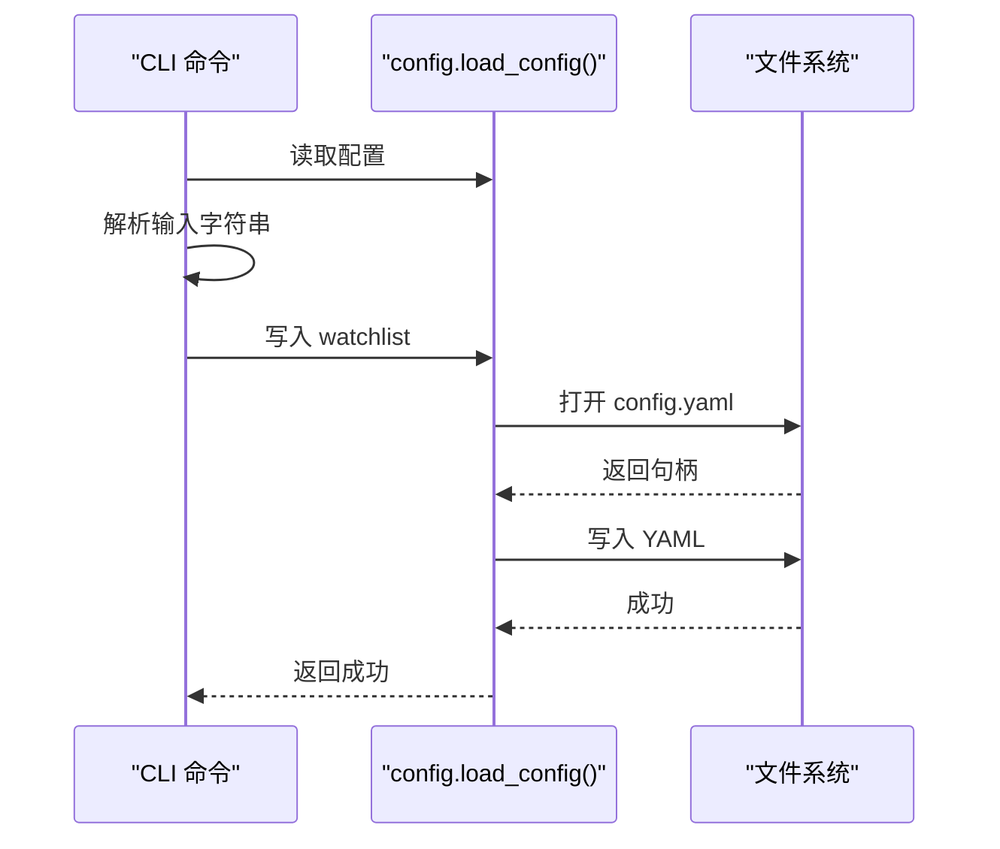
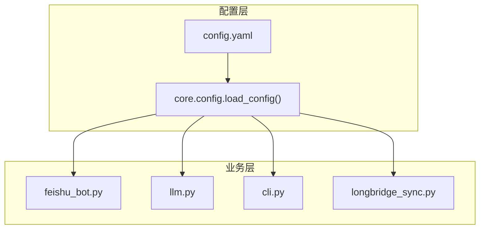
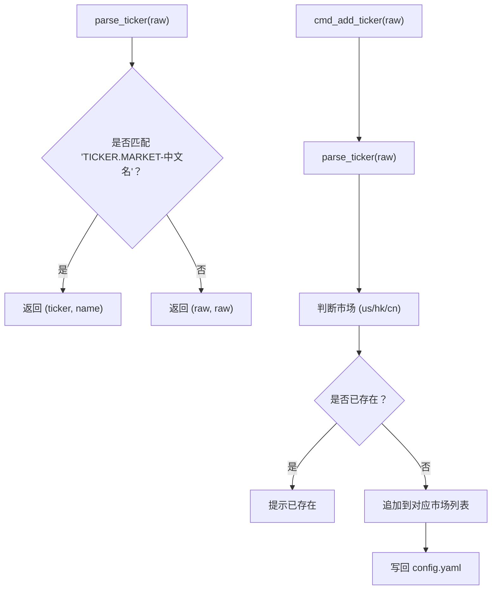
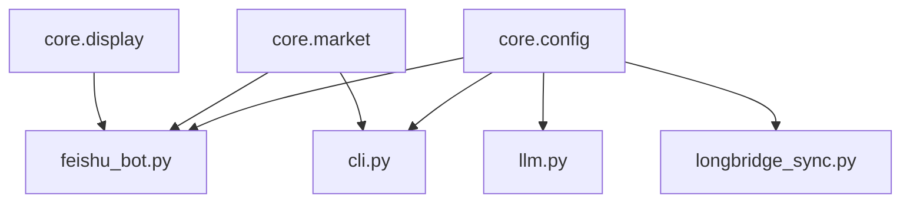

# 配置管理系统

<cite>
**本文档引用的文件**
- [scripts/core/config.py](file://scripts/core/config.py)
- [config.yaml.example](file://config.yaml.example)
- [config.yaml](file://config.yaml)
- [scripts/feishu_bot.py](file://scripts/feishu_bot.py)
- [scripts/llm.py](file://scripts/llm.py)
- [scripts/cli.py](file://scripts/cli.py)
- [scripts/core/market.py](file://scripts/core/market.py)
- [scripts/longbridge_sync.py](file://scripts/longbridge_sync.py)
- [scripts/core/display.py](file://scripts/core/display.py)
- [README.md](file://README.md)
</cite>

## 目录
1. [简介](#简介)
2. [项目结构](#项目结构)
3. [核心组件](#核心组件)
4. [架构总览](#架构总览)
5. [详细组件分析](#详细组件分析)
6. [依赖关系分析](#依赖关系分析)
7. [性能考虑](#性能考虑)
8. [故障排除指南](#故障排除指南)
9. [结论](#结论)
10. [附录](#附录)

## 简介
本文件为配置管理系统的详细技术文档，涵盖配置文件结构与字段含义、热加载机制、标的解析与管理、配置验证与错误处理策略，并提供参数调优建议与最佳实践。系统通过统一的配置模块实现跨模块共享，支持 watchlist 监控列表、params 参数配置、llm_profiles 模型配置以及 feishu_settings 推送配置的集中管理与热更新。

## 项目结构
配置管理相关的核心文件位于 scripts/core/ 目录，主要文件包括：
- config.py：提供 load_config() 热加载、parse_ticker() 解析、remove_ticker_from_config()/add_ticker_to_config() 等功能
- market.py：提供市场判断、标的遍历等工具
- display.py：提供量比显示格式化与飞书表格构建
- 配置文件：config.yaml（实际配置）、config.yaml.example（示例模板）

**图表来源**
- [scripts/core/config.py:1-63](file://scripts/core/config.py#L1-L63)
- [scripts/feishu_bot.py:1-120](file://scripts/feishu_bot.py#L1-L120)
- [scripts/llm.py:1-60](file://scripts/llm.py#L1-L60)
- [scripts/cli.py:1-40](file://scripts/cli.py#L1-L40)
- [scripts/longbridge_sync.py:1-40](file://scripts/longbridge_sync.py#L1-L40)
- [scripts/core/market.py:1-40](file://scripts/core/market.py#L1-L40)
- [scripts/core/display.py:1-40](file://scripts/core/display.py#L1-L40)

**章节来源**
- [scripts/core/config.py:1-63](file://scripts/core/config.py#L1-L63)
- [README.md:106-142](file://README.md#L106-L142)

## 核心组件
本节深入分析配置管理系统的四大核心组件：配置文件结构、热加载机制、标的解析与管理、配置验证与错误处理。

### 配置文件结构与字段含义
- watchlist 监控列表
  - 结构：按市场分组的数组，键为 us/hk/cn，值为字符串数组
  - 格式：TICKER.MARKET-中文名 或仅 TICKER.MARKET
  - 示例：CLF.US-克利夫兰、1810.HK-XIAOMI-W、601899.SH-紫金矿业
- params 系统参数
  - volume_ratio_window：日内滚动量比窗口大小
  - snapshot_interval：行情快照采集间隔（秒）
  - alert_threshold：触发预警的量比阈值
  - shrink_threshold：缩量阈值，用于识别缩量信号
- llm_profiles 模型配置
  - minimax/xiaomi 等预设配置，包含 provider、model、base_url、api_key、max_tokens、temperature 等
  - 通过 llm 节点动态指向当前激活的配置
- feishu_settings 飞书推送配置
  - app_id/app_secret：自建应用凭证
  - chat_id：机器人会话 chat_id
  - webhook_url：备用 Webhook 地址（自建应用模式下可选）

**章节来源**
- [config.yaml.example:12-73](file://config.yaml.example#L12-L73)
- [config.yaml:1-45](file://config.yaml#L1-L45)

### 热加载机制（load_config）
- 基于文件修改时间的缓存策略：每次调用 load_config() 时检查 config.yaml 的 st_mtime，若变化则重新加载 YAML 并更新缓存
- 全局缓存变量：_config_cache、_config_mtime，避免重复 IO
- 异常处理：文件不存在或读取失败时返回空字典，保证系统稳定
- 模块间同步：所有脚本通过 from core.config import load_config 使用同一份内存中的配置副本，实现跨模块共享与热更新

**图表来源**
- [scripts/core/config.py:20-31](file://scripts/core/config.py#L20-L31)

**章节来源**
- [scripts/core/config.py:20-31](file://scripts/core/config.py#L20-L31)

### 标的解析与管理（parse_ticker、add/remove）
- parse_ticker：解析带中文名的标的字符串，返回 (ticker, name) 元组；若无中文名则 name 与 ticker 相同
- add_ticker_to_config：CLI 命令实现，将原始字符串写入对应市场的 watchlist 数组，自动去重并写回 config.yaml
- remove_ticker_from_config：从 watchlist 中移除指定标的，支持模糊匹配（以 ticker 前缀开头或完全相等），移除后写回 config.yaml

**图表来源**
- [scripts/cli.py:278-315](file://scripts/cli.py#L278-L315)
- [scripts/core/config.py:34-47](file://scripts/core/config.py#L34-L47)

**章节来源**
- [scripts/core/config.py:50-62](file://scripts/core/config.py#L50-L62)
- [scripts/cli.py:278-344](file://scripts/cli.py#L278-L344)
- [scripts/feishu_bot.py:526-598](file://scripts/feishu_bot.py#L526-L598)

### 配置验证、默认值与错误处理
- 配置验证
  - 飞书配置：get_feishu_config() 检查 app_id/app_secret 是否存在，缺失时直接退出
  - LLM 配置：get_llm_config() 兼容旧配置（minimax 节），并提供默认值（provider/model/base_url/api_key）
  - 市场判断：get_market() 通过后缀判断市场，提供默认值
- 默认值处理
  - llm 节默认 provider=minimax、model=MiniMax-M2.7、base_url=https://api.minimaxi.com/anthropic、api_key=""
  - params 节默认值在业务逻辑中使用，未在配置文件中显式声明
- 错误处理
  - 文件读取异常：load_config() 捕获 OSError 并返回空字典
  - API 调用异常：llm.call_llm() 捕获连接/超时/解析异常并记录调用日志
  - 飞书发送失败：feishu_bot 发送文本/卡片消息时检查响应码并打印错误信息

**章节来源**
- [scripts/feishu_bot.py:40-49](file://scripts/feishu_bot.py#L40-L49)
- [scripts/llm.py:32-51](file://scripts/llm.py#L32-L51)
- [scripts/core/market.py:50-58](file://scripts/core/market.py#L50-L58)
- [scripts/llm.py:110-158](file://scripts/llm.py#L110-L158)
- [scripts/feishu_bot.py:62-97](file://scripts/feishu_bot.py#L62-L97)

## 架构总览
配置管理系统通过统一的配置模块为所有业务脚本提供共享配置，支持热加载与模块间同步。飞书机器人、LLM 调用层、CLI 命令行、长桥同步等功能均依赖 load_config() 获取最新配置。

**图表来源**
- [scripts/core/config.py:20-31](file://scripts/core/config.py#L20-L31)
- [scripts/feishu_bot.py:31-33](file://scripts/feishu_bot.py#L31-L33)
- [scripts/llm.py:22-22](file://scripts/llm.py#L22-L22)
- [scripts/cli.py:21-23](file://scripts/cli.py#L21-L23)
- [scripts/longbridge_sync.py:14-15](file://scripts/longbridge_sync.py#L14-L15)

## 详细组件分析

### 配置文件结构与字段详解
- watchlist
  - 用途：定义监控标的清单，按市场分组
  - 格式：支持两种形式
    - TICKER.MARKET-中文名：用于飞书卡片展示与 CLI 输出
    - TICKER.MARKET：仅 ticker，parse_ticker() 会回退到 ticker 作为名称
- params
  - volume_ratio_window：日内滚动量比窗口大小，影响日内量比计算的灵敏度
  - snapshot_interval：行情快照采集间隔，单位秒
  - alert_threshold：预警阈值，超过该值触发预警
  - shrink_threshold：缩量阈值，低于该值识别为缩量信号
- llm_profiles
  - minimax/xiaomi 等预设配置，便于一键切换不同提供商的模型
  - llm 节为当前激活的配置，通过 switch_llm() 动态切换
- feishu_settings
  - app_id/app_secret：自建应用凭证，必须配置
  - chat_id：机器人会话 chat_id，从机器人日志中获取
  - webhook_url：备用 Webhook 地址（自建应用模式下可选）

**章节来源**
- [config.yaml.example:12-73](file://config.yaml.example#L12-L73)
- [config.yaml:1-45](file://config.yaml#L1-L45)

### 热加载机制实现细节
- 文件监听：通过 stat().st_mtime 获取文件最后修改时间
- 缓存策略：全局变量缓存上次解析结果，避免频繁 IO
- 线程安全：当前实现为单进程场景下的简单缓存，多进程并发写入时可能出现竞态，建议配合外部锁或进程间同步
- 模块间同步：所有脚本共享同一份内存中的配置对象，无需重启即可生效

**章节来源**
- [scripts/core/config.py:20-31](file://scripts/core/config.py#L20-L31)

### 标的解析与管理流程
- parse_ticker：正则匹配 "TICKER.MARKET-中文名"，提取 ticker 与 name
- add_ticker_to_config：CLI 命令实现，解析输入字符串，判断市场，去重后写回 config.yaml
- remove_ticker_from_config：遍历所有市场，移除匹配项，写回 config.yaml

**图表来源**
- [scripts/core/config.py:50-62](file://scripts/core/config.py#L50-L62)
- [scripts/cli.py:278-315](file://scripts/cli.py#L278-L315)

**章节来源**
- [scripts/core/config.py:50-62](file://scripts/core/config.py#L50-L62)
- [scripts/cli.py:278-344](file://scripts/cli.py#L278-L344)

### 配置验证与错误处理策略
- 飞书配置验证：get_feishu_config() 在缺失 app_id/app_secret 时直接退出，防止后续调用失败
- LLM 配置兼容：get_llm_config() 兼容旧配置（minimax 节），并提供默认值
- API 调用异常：llm.call_llm() 捕获连接/超时/解析异常，记录调用日志并返回 None
- 文件写入异常：CLI/Feishu/LB 同步模块在写入 config.yaml 时捕获异常并打印错误

**章节来源**
- [scripts/feishu_bot.py:40-49](file://scripts/feishu_bot.py#L40-L49)
- [scripts/llm.py:32-51](file://scripts/llm.py#L32-L51)
- [scripts/llm.py:110-158](file://scripts/llm.py#L110-L158)
- [scripts/cli.py:317-344](file://scripts/cli.py#L317-L344)

## 依赖关系分析
配置管理系统的依赖关系如下图所示，核心在于 core.config 为所有业务脚本提供统一的配置访问接口。

**图表来源**
- [scripts/core/config.py:1-15](file://scripts/core/config.py#L1-L15)
- [scripts/feishu_bot.py:31-33](file://scripts/feishu_bot.py#L31-L33)
- [scripts/llm.py:22-22](file://scripts/llm.py#L22-L22)
- [scripts/cli.py:21-23](file://scripts/cli.py#L21-L23)
- [scripts/longbridge_sync.py:14-15](file://scripts/longbridge_sync.py#L14-L15)
- [scripts/core/market.py:8-8](file://scripts/core/market.py#L8-L8)
- [scripts/core/display.py:1-6](file://scripts/core/display.py#L1-L6)

**章节来源**
- [scripts/core/config.py:1-15](file://scripts/core/config.py#L1-L15)
- [scripts/feishu_bot.py:31-33](file://scripts/feishu_bot.py#L31-L33)
- [scripts/llm.py:22-22](file://scripts/llm.py#L22-L22)
- [scripts/cli.py:21-23](file://scripts/cli.py#L21-L23)
- [scripts/longbridge_sync.py:14-15](file://scripts/longbridge_sync.py#L14-L15)

## 性能考虑
- 热加载性能
  - 采用基于文件修改时间的缓存策略，避免重复解析 YAML，提升读取性能
  - 建议在高并发场景下增加文件锁或进程间同步，防止竞态条件导致的配置不一致
- 写入性能
  - 写回 config.yaml 时使用有序写入，避免不必要的排序开销
  - 建议批量写入而非频繁小规模写入，减少磁盘 IO
- 模块间同步
  - 所有脚本共享同一份内存中的配置对象，避免重复 IO
  - 若需跨进程共享，建议引入进程间通信或共享内存机制

[本节为一般性指导，无需特定文件来源]

## 故障排除指南
- 飞书机器人不响应
  - 检查 config.yaml 中 feishu.app_id 和 feishu.app_secret 是否正确
  - 确认飞书开放平台已开启机器人能力、配置权限、发布版本
  - 查看日志：tail -f logs/feishu_bot.log
- WebSocket 进程不存在
  - 查看日志：cat logs/launcher.log
  - 手动重启：python3 scripts/collect_ws_launcher.py
- LLM API 调用失败
  - 确认 config.yaml 中 api_key 正确
  - 测试连接：python3 scripts/llm.py --test
  - 切换模型：python3 scripts/llm.py --switch minimax
- 配置热更新无效
  - 确认修改了 config.yaml 并保存
  - 检查是否有多个进程同时写入 config.yaml 导致竞态
  - 重启相关进程以强制重新加载配置

**章节来源**
- [README.md:354-390](file://README.md#L354-L390)

## 结论
配置管理系统通过统一的配置模块实现了跨模块共享与热更新，支持 watchlist 监控列表、params 参数配置、llm_profiles 模型配置以及 feishu_settings 推送配置的集中管理。parse_ticker() 提供了灵活的标的解析能力，add/remove 功能满足日常运维需求。系统在性能与稳定性之间取得平衡，建议在高并发场景下加强进程间同步与错误处理，以确保配置一致性与系统可靠性。

[本节为总结性内容，无需特定文件来源]

## 附录

### 配置文件示例与参数调优建议
- 配置文件示例
  - 参考 config.yaml.example，复制为 config.yaml 并填入实际值
  - 敏感信息（api_key、app_secret）不要提交到代码仓库
- 参数调优建议
  - volume_ratio_window：根据市场波动性调整，波动大时可适当增大
  - snapshot_interval：根据网络延迟与 CPU 负载调整，建议 60 秒起步
  - alert_threshold：根据策略目标调整，建议 2.0 起步
  - shrink_threshold：建议 0.6，用于识别缩量信号
- 最佳实践
  - 使用 llm_profiles 预设配置，通过 switch_llm() 一键切换
  - 通过 /watchlist 与 /allstock 交互式管理监控列表
  - 定期检查 /status 了解系统健康状态

**章节来源**
- [config.yaml.example:12-73](file://config.yaml.example#L12-L73)
- [scripts/llm.py:61-90](file://scripts/llm.py#L61-L90)
- [README.md:176-213](file://README.md#L176-L213)