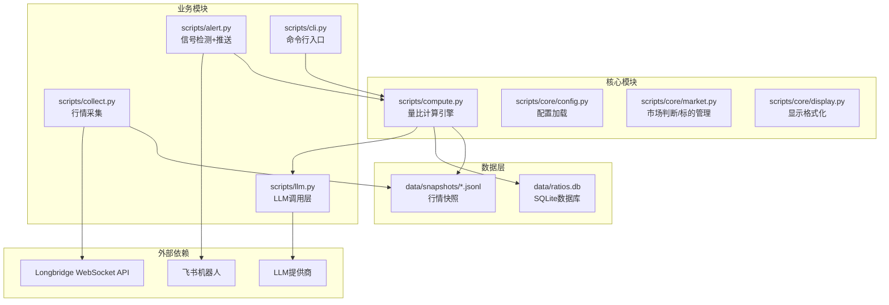
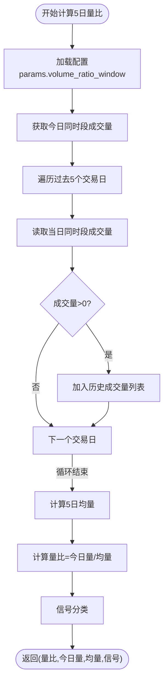
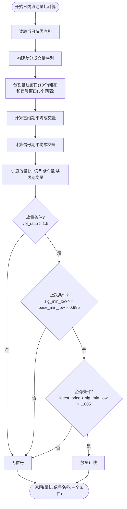
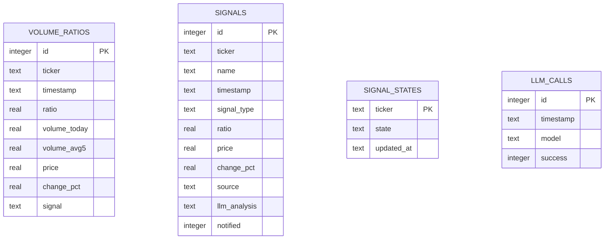
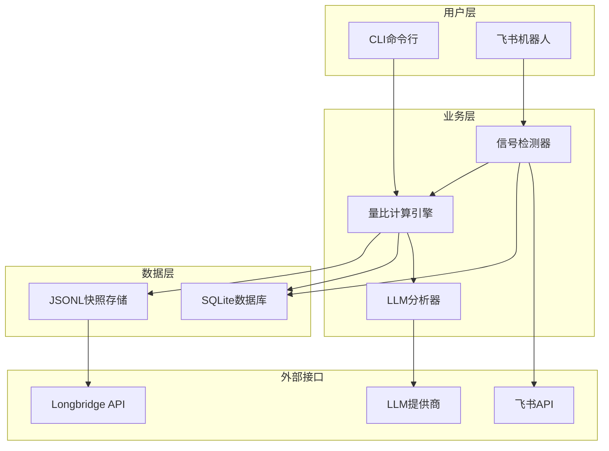
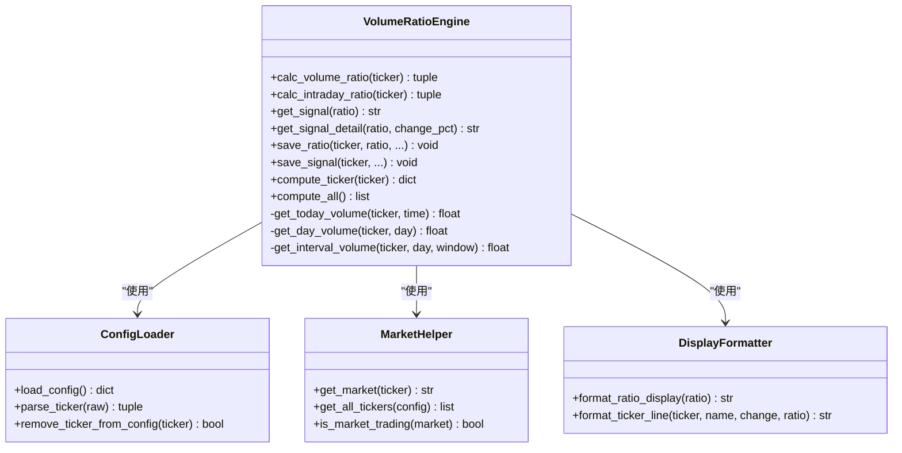
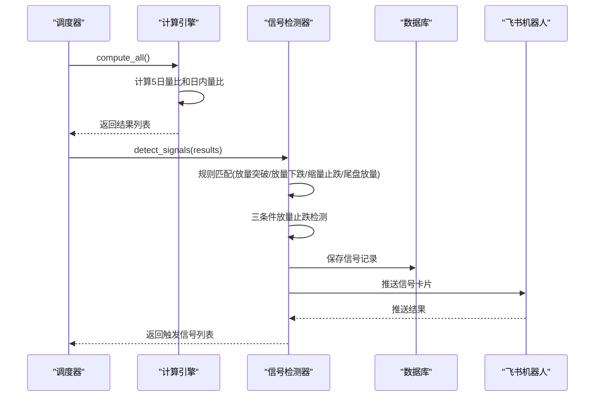
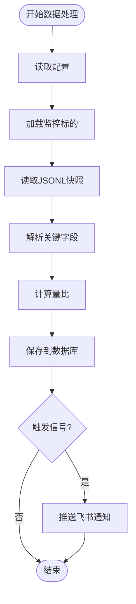
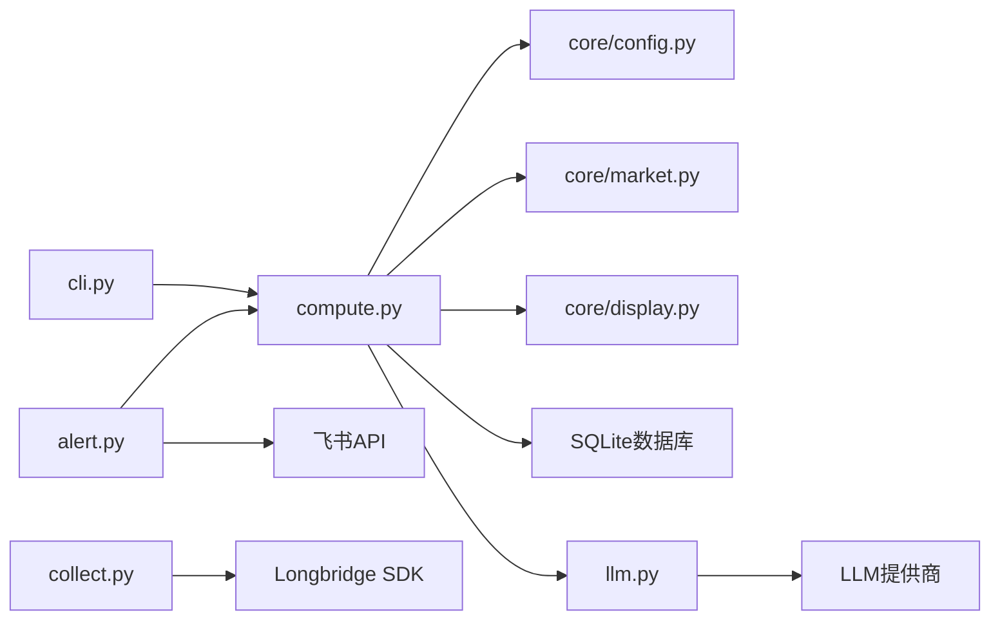

# 量比计算引擎

<cite>
**本文档引用的文件**
- [README.md](file://README.md)
- [compute.py](file://scripts/compute.py)
- [config.py](file://scripts/core/config.py)
- [market.py](file://scripts/core/market.py)
- [display.py](file://scripts/core/display.py)
- [alert.py](file://scripts/alert.py)
- [cli.py](file://scripts/cli.py)
- [llm.py](file://scripts/llm.py)
- [collect.py](file://scripts/collect.py)
- [config.yaml.example](file://config.yaml.example)
- [CLF_US_20260429.jsonl](file://data/snapshots/US/CLF_US_20260429.jsonl)
</cite>

## 目录
1. [简介](#简介)
2. [项目结构](#项目结构)
3. [核心组件](#核心组件)
4. [架构总览](#架构总览)
5. [详细组件分析](#详细组件分析)
6. [依赖关系分析](#依赖关系分析)
7. [性能考量](#性能考量)
8. [故障排查指南](#故障排查指南)
9. [结论](#结论)
10. [附录](#附录)

## 简介
本项目是一个跨市场量比监控系统，支持美股(US)、港股(HK)、A股(CN)三大市场的实时量比计算与信号检测。系统采用双量比引擎：日内滚动量比（立即生效）与5日历史量比（需要数据积累）。通过飞书机器人进行信号推送，并提供CLI查询、简报、LLM智能分析等功能。

## 项目结构
项目采用模块化设计，核心计算逻辑集中在scripts/compute.py，其他模块负责配置、市场判断、显示格式化、信号检测、LLM调用、行情采集等。

**图表来源**
- [compute.py:1-498](file://scripts/compute.py#L1-L498)
- [config.py:1-63](file://scripts/core/config.py#L1-L63)
- [market.py:1-88](file://scripts/core/market.py#L1-L88)
- [display.py:1-102](file://scripts/core/display.py#L1-L102)
- [alert.py:1-514](file://scripts/alert.py#L1-L514)
- [cli.py:1-463](file://scripts/cli.py#L1-L463)
- [llm.py:1-193](file://scripts/llm.py#L1-L193)
- [collect.py:1-125](file://scripts/collect.py#L1-L125)

**章节来源**
- [README.md:106-142](file://README.md#L106-L142)
- [compute.py:1-498](file://scripts/compute.py#L1-L498)

## 核心组件
本节深入分析量比计算引擎的关键组件，包括5日量比算法、日内滚动量比算法、信号分类与详情、数据库存储、API价格获取以及批量计算流程。

### 5日量比计算算法
5日量比是系统的核心指标，计算公式为：量比 = 当前时段成交量 / 过去5日同一时段均量。

- **get_volume_ratio()函数**：封装了完整的5日量比计算流程，包括窗口大小配置、历史成交量统计、量比阈值判断和信号分类。
- **历史成交量统计**：通过get_day_volume()和get_interval_volume()函数，从JSONL快照文件中读取指定日期的成交量，并计算差分量。
- **量比阈值判断**：通过get_signal()函数将量比映射到信号类别，包括正常、放量、显著放量、巨量等。

**图表来源**
- [compute.py:197-226](file://scripts/compute.py#L197-L226)
- [compute.py:228-242](file://scripts/compute.py#L228-L242)

**章节来源**
- [compute.py:197-242](file://scripts/compute.py#L197-L242)

### 日内滚动量比三条件放量止跌检测算法
日内滚动量比用于捕捉盘中异动，采用三条件放量止跌检测：

- **放量条件**：信号期平均成交量 > 基线期平均成交量 × 1.5
- **止跌条件**：信号期最低价 ≥ 基线期最低价 × 0.995
- **企稳条件**：最新价 > 信号期最低价 × 1.005

**图表来源**
- [compute.py:249-321](file://scripts/compute.py#L249-L321)

**章节来源**
- [compute.py:249-321](file://scripts/compute.py#L249-L321)

### 信号分类与信号详情判定逻辑
系统实现了两级信号体系：

- **信号分类(get_signal)**：基于量比范围的静态分类，用于5日历史量比
  - 0.6以下：缩量异常
  - 0.6-0.8：缩量  
  - 0.8-1.2：正常
  - 1.2-2.0：放量
  - 2.0-5.0：显著放量
  - 5.0以上：巨量

- **信号详情(get_signal_detail)**：基于量比和涨跌幅的动态信号，用于展示更细粒度的信号类型
  - 放量突破：量比>2.0且涨跌幅>2%
  - 放量下跌：量比>2.0且涨跌幅<-2%
  - 缩量止跌：量比<0.6且涨跌幅>0
  - 尾盘放量：量比>1.5且在14:30-15:00期间

**章节来源**
- [compute.py:228-242](file://scripts/compute.py#L228-L242)
- [compute.py:324-338](file://scripts/compute.py#L324-L338)

### 数据库存储机制
系统使用SQLite存储量比和信号历史，包含以下表结构：

- **volume_ratios**：量比实时记录，包含时间戳、量比、成交量、价格、涨跌幅、信号等字段
- **signals**：信号记录，包含标的、名称、时间戳、信号类型、量比、价格、涨跌幅、来源、LLM分析等
- **signal_states**：信号去重状态，记录每个标的的信号状态和更新时间
- **llm_calls**：LLM调用记录，记录调用时间、模型、成功状态

**图表来源**
- [compute.py:155-194](file://scripts/compute.py#L155-L194)
- [alert.py:292-336](file://scripts/alert.py#L292-L336)

**章节来源**
- [compute.py:147-194](file://scripts/compute.py#L147-L194)
- [alert.py:292-336](file://scripts/alert.py#L292-L336)

### API价格获取与批量计算
系统提供了两种价格来源：

- **JSONL快照价格**：优先使用实时行情快照中的价格和涨跌幅
- **长桥API价格**：当快照缺失时，通过_longbridge SDK批量获取最新价格

批量计算流程：
1. 读取配置中的监控标的列表
2. 对每个标的计算5日量比和日内量比
3. 从API批量获取缺失的价格数据
4. 保存量比到数据库
5. 返回计算结果

**章节来源**
- [compute.py:382-402](file://scripts/compute.py#L382-L402)
- [compute.py:405-449](file://scripts/compute.py#L405-L449)
- [compute.py:451-483](file://scripts/compute.py#L451-L483)

## 架构总览
系统采用分层架构，各层职责清晰：

**图表来源**
- [compute.py:1-498](file://scripts/compute.py#L1-L498)
- [alert.py:1-514](file://scripts/alert.py#L1-L514)
- [cli.py:1-463](file://scripts/cli.py#L1-L463)
- [llm.py:1-193](file://scripts/llm.py#L1-L193)

## 详细组件分析

### 量比计算引擎类图

**图表来源**
- [compute.py:197-483](file://scripts/compute.py#L197-L483)
- [config.py:20-63](file://scripts/core/config.py#L20-L63)
- [market.py:50-88](file://scripts/core/market.py#L50-L88)
- [display.py:8-41](file://scripts/core/display.py#L8-L41)

**章节来源**
- [compute.py:197-483](file://scripts/compute.py#L197-L483)

### 信号检测序列图

**图表来源**
- [alert.py:61-142](file://scripts/alert.py#L61-L142)
- [alert.py:367-447](file://scripts/alert.py#L367-L447)

**章节来源**
- [alert.py:61-142](file://scripts/alert.py#L61-L142)
- [alert.py:367-447](file://scripts/alert.py#L367-L447)

### 数据流处理流程图

**图表来源**
- [collect.py:97-125](file://scripts/collect.py#L97-L125)
- [compute.py:382-483](file://scripts/compute.py#L382-L483)

**章节来源**
- [collect.py:97-125](file://scripts/collect.py#L97-L125)
- [compute.py:382-483](file://scripts/compute.py#L382-L483)

## 依赖关系分析
系统依赖关系清晰，主要外部依赖包括：

- **Longbridge SDK**：用于获取实时行情数据
- **飞书API**：用于消息推送和卡片交互
- **LLM提供商**：用于智能分析，支持多模型切换
- **SQLite**：轻量级数据库存储
- **PyYAML**：配置文件解析
- **Requests**：HTTP请求处理

**图表来源**
- [compute.py:23-24](file://scripts/compute.py#L23-L24)
- [alert.py:20-22](file://scripts/alert.py#L20-L22)
- [cli.py:21-23](file://scripts/cli.py#L21-L23)
- [collect.py:23-24](file://scripts/collect.py#L23-L24)

**章节来源**
- [compute.py:23-24](file://scripts/compute.py#L23-L24)
- [alert.py:20-22](file://scripts/alert.py#L20-L22)
- [cli.py:21-23](file://scripts/cli.py#L21-L23)
- [collect.py:23-24](file://scripts/collect.py#L23-L24)

## 性能考量
系统在性能方面采用了多项优化策略：

1. **JSONL存储优化**：相比传统方案，文件数从6万+/天降至11个/天，显著减少文件系统开销
2. **索引优化**：数据库建立关键索引，提高查询效率
3. **批量处理**：CLI和计算模块支持批量操作，减少重复开销
4. **缓存机制**：配置采用热加载缓存，避免频繁磁盘访问
5. **异步处理**：信号检测采用独立进程，不影响主计算流程

## 故障排查指南
常见问题及解决方案：

### 量比显示0.0"数据不足"
- **原因**：5日历史量比需要至少5个交易日数据
- **解决**：使用日内滚动量比功能，今天即可生效

### 飞书机器人不响应
- **检查配置**：确认config.yaml中app_id和app_secret正确
- **验证权限**：确保飞书开放平台已开启机器人能力
- **查看日志**：tail -f logs/feishu_bot.log

### WebSocket进程不存在
- **检查守护进程**：查看logs/launcher.log
- **手动重启**：python3 scripts/collect_ws_launcher.py

### LLM API调用失败
- **验证密钥**：确认config.yaml中api_key正确
- **测试连接**：python3 scripts/llm.py --test
- **切换模型**：python3 scripts/llm.py --switch minimax

**章节来源**
- [README.md:354-391](file://README.md#L354-L391)

## 结论
量比计算引擎通过双量比系统实现了对三大市场的全面监控，结合信号检测和智能分析，为用户提供及时准确的市场信号。系统采用模块化设计，具有良好的扩展性和维护性。通过JSONL存储和SQLite数据库的组合，实现了高效的数据管理。飞书机器人的集成使得信号推送更加便捷，CLI工具提供了灵活的查询和管理能力。

## 附录

### 参数配置选项
系统支持的主要配置项：

- **watchlist**：监控标的列表，格式为"代码-中文名"
- **params**：系统参数
  - volume_ratio_window：量比计算窗口大小（默认5分钟）
  - snapshot_interval：行情采集间隔（秒）
  - alert_threshold：告警阈值（默认2.0）
  - shrink_threshold：缩量阈值（默认0.6）
- **llm**：LLM配置，包括provider、model、base_url、api_key等
- **feishu**：飞书机器人配置，包括app_id、app_secret、chat_id等

**章节来源**
- [config.yaml.example:13-73](file://config.yaml.example#L13-L73)

### 数据格式说明
JSONL快照文件每行包含一个时间点的完整行情数据，字段包括：
- ticker：标的代码
- timestamp：时间戳
- price：当前价格
- open/high/low：开盘/最高/最低价
- volume：成交量
- turnover：成交额
- change/change_pct：涨跌额和涨跌幅

**章节来源**
- [CLF_US_20260429.jsonl:1-200](file://data/snapshots/US/CLF_US_20260429.jsonl#L1-L200)