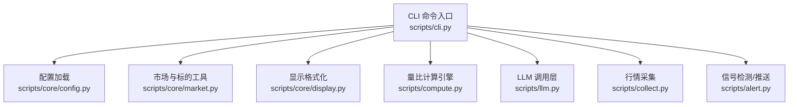
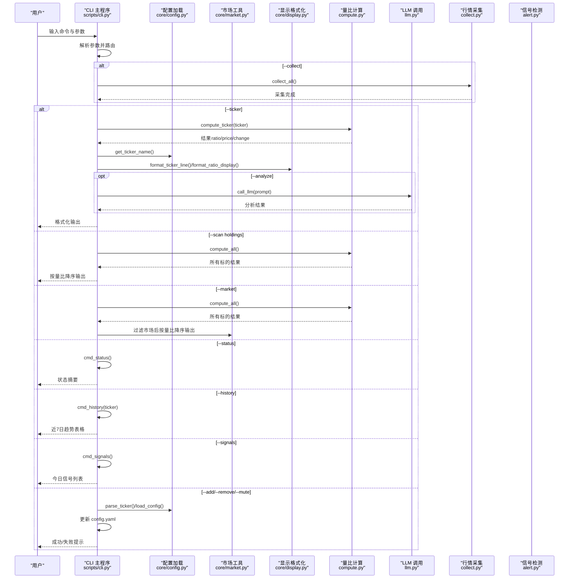
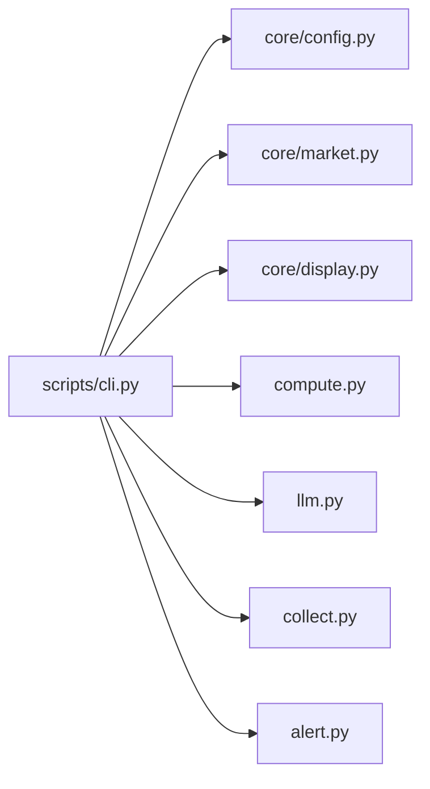

# 命令行界面

<cite>
**本文引用的文件**
- [scripts/cli.py](file://scripts/cli.py)
- [scripts/core/config.py](file://scripts/core/config.py)
- [scripts/core/market.py](file://scripts/core/market.py)
- [scripts/core/display.py](file://scripts/core/display.py)
- [scripts/llm.py](file://scripts/llm.py)
- [scripts/compute.py](file://scripts/compute.py)
- [scripts/collect.py](file://scripts/collect.py)
- [scripts/alert.py](file://scripts/alert.py)
- [README.md](file://README.md)
- [config.yaml.example](file://config.yaml.example)
</cite>

## 目录
1. [简介](#简介)
2. [项目结构](#项目结构)
3. [核心组件](#核心组件)
4. [架构总览](#架构总览)
5. [详细组件分析](#详细组件分析)
6. [依赖关系分析](#依赖关系分析)
7. [性能考量](#性能考量)
8. [故障排查指南](#故障排查指南)
9. [结论](#结论)
10. [附录](#附录)

## 简介
本文件面向使用者与维护者，系统化介绍命令行界面（CLI）工具的完整功能与使用方法。CLI 提供查询单个标的、扫描持仓、扫描市场、系统状态、历史趋势、今日信号、标的管理（添加/移除）、静默设置、以及 LLM AI 分析等能力。文档将逐项说明每个命令行参数的作用、典型使用场景、参数组合方式，并给出查询量比、市场扫描、系统管理命令的操作流程与最佳实践。

## 项目结构
CLI 工具位于 scripts/cli.py，围绕核心模块协作完成功能：
- 配置与市场工具：scripts/core/config.py、scripts/core/market.py
- 显示格式化：scripts/core/display.py
- LLM 调用层：scripts/llm.py
- 量比计算与数据访问：scripts/compute.py
- 行情采集：scripts/collect.py
- 信号检测与飞书推送：scripts/alert.py
- 项目说明与示例：README.md、config.yaml.example

图表来源
- [scripts/cli.py:372-458](file://scripts/cli.py#L372-L458)
- [scripts/core/config.py:20-31](file://scripts/core/config.py#L20-L31)
- [scripts/core/market.py:50-87](file://scripts/core/market.py#L50-L87)
- [scripts/core/display.py:8-41](file://scripts/core/display.py#L8-L41)
- [scripts/compute.py:197-200](file://scripts/compute.py#L197-L200)
- [scripts/llm.py:110-158](file://scripts/llm.py#L110-L158)
- [scripts/collect.py:97-125](file://scripts/collect.py#L97-L125)
- [scripts/alert.py:61-142](file://scripts/alert.py#L61-L142)

章节来源
- [scripts/cli.py:1-463](file://scripts/cli.py#L1-L463)
- [README.md:106-142](file://README.md#L106-L142)

## 核心组件
- 命令行入口与参数解析：负责解析 --ticker、--scan、--market、--status、--history、--signals、--add、--remove、--mute、--analyze、--collect 等参数，并路由到对应命令处理函数。
- 查询与格式化：query_ticker、scan_holdings、scan_market、format_ticker_output 等，统一输出格式与可选 LLM 分析。
- 系统状态：cmd_status 检查 WebSocket 采集进程、Cron 任务、飞书推送、LLM 配置、数据库与快照文件状态。
- 历史与信号：cmd_history 查询近 7 日量比趋势；cmd_signals 查询今日触发信号。
- 标的管理：cmd_add_ticker、cmd_remove_ticker、cmd_mute，基于 config.yaml 的 watchlist 与 mute 列表。
- LLM 集成：当 --analyze 开启时，CLI 会构造提示词并调用 llm.call_llm 获取简短中文分析。

章节来源
- [scripts/cli.py:41-463](file://scripts/cli.py#L41-L463)
- [scripts/core/display.py:8-41](file://scripts/core/display.py#L8-L41)
- [scripts/llm.py:110-158](file://scripts/llm.py#L110-L158)

## 架构总览
CLI 的调用链路如下：用户输入 → 参数解析 → 命令处理函数 → 核心模块（配置/市场/显示/计算/LLM/采集/信号）→ 输出结果或更新配置。

图表来源
- [scripts/cli.py:372-458](file://scripts/cli.py#L372-L458)
- [scripts/core/config.py:20-31](file://scripts/core/config.py#L20-L31)
- [scripts/core/market.py:50-87](file://scripts/core/market.py#L50-L87)
- [scripts/core/display.py:8-41](file://scripts/core/display.py#L8-L41)
- [scripts/compute.py:197-200](file://scripts/compute.py#L197-L200)
- [scripts/llm.py:110-158](file://scripts/llm.py#L110-L158)
- [scripts/collect.py:97-125](file://scripts/collect.py#L97-L125)
- [scripts/alert.py:61-142](file://scripts/alert.py#L61-L142)

## 详细组件分析

### 命令行参数与功能详解
- --ticker TIKER：查询单个标的的量比与价格涨跌，支持 --analyze 输出 LLM 分析。
- --scan holdings：扫描所有持仓标的，按量比降序输出。
- --market MARKET [--min-ratio R]：扫描指定市场（US/HK/CN）中量比≥R 的放量标的。
- --status：系统健康状态检查（WebSocket、Cron、飞书、LLM、数据库、快照）。
- --history TIKER：查询近 7 日量比趋势，包含时间、量比、价格、涨跌、信号。
- --signals：查询今日触发的信号列表。
- --add "TIKER-名称"：添加监控标的到 config.yaml 的对应市场分组。
- --remove TIKER：从 config.yaml 中移除指定标的。
- --mute TIKER DURATION：对指定标的设置静默，DURATION 支持 h/m/s，如 2h、30m、60s。
- --analyze：在 --ticker 查询时启用 LLM 分析。
- --collect：先采集最新行情再查询（适用于需要最新快照的场景）。

章节来源
- [scripts/cli.py:372-458](file://scripts/cli.py#L372-L458)
- [README.md:219-268](file://README.md#L219-L268)

### 查询单个标的（--ticker）
- 功能：计算单个标的的量比，补充最新价格与涨跌幅，可选 LLM 分析。
- 关键流程：
  - 调用 compute_ticker 获取量比与基础指标。
  - 读取最新快照填充 price 与 change_pct。
  - 若 --analyze，则构造提示词并调用 llm.call_llm。
  - 使用 format_ticker_output 与 format_ratio_display 格式化输出。
- 典型参数组合：
  - --ticker CLF.US --analyze
  - --ticker CLF.US --collect --analyze
- 注意事项：
  - 5日历史量比需要至少5个交易日数据；若“数据不足”，可参考 README 的说明。
  - 若未配置 LLM API key，--analyze 将提示未配置。

章节来源
- [scripts/cli.py:41-65](file://scripts/cli.py#L41-L65)
- [scripts/compute.py:197-200](file://scripts/compute.py#L197-L200)
- [scripts/core/display.py:8-41](file://scripts/core/display.py#L8-L41)
- [scripts/llm.py:110-158](file://scripts/llm.py#L110-L158)
- [README.md:358-361](file://README.md#L358-L361)

### 扫描持仓（--scan holdings）
- 功能：对 watchlist 中所有标的计算量比并按量比降序输出。
- 关键流程：
  - 调用 compute_all 获取所有标的结果。
  - 使用 format_ticker_output 输出。
- 典型参数组合：
  - --scan holdings
  - --scan holdings --collect

章节来源
- [scripts/cli.py:68-73](file://scripts/cli.py#L68-L73)
- [scripts/compute.py:197-200](file://scripts/compute.py#L197-L200)
- [scripts/core/display.py:27-41](file://scripts/core/display.py#L27-L41)

### 扫描市场（--market）
- 功能：扫描指定市场（US/HK/CN）中量比≥阈值的放量标的。
- 关键流程：
  - compute_all 获取所有标的结果。
  - 根据市场后缀过滤（.US/.HK/('.SH','.SZ')）。
  - 按量比降序输出。
- 典型参数组合：
  - --market US --min-ratio 2.0
  - --market HK --min-ratio 1.5
- 注意事项：
  - min-ratio 默认 2.0，可根据需要调整。
  - 市场后缀映射在 scan_market 中定义。

章节来源
- [scripts/cli.py:76-89](file://scripts/cli.py#L76-L89)
- [scripts/compute.py:197-200](file://scripts/compute.py#L197-L200)

### 系统状态（--status）
- 功能：检查系统健康状态，包括 WebSocket 采集进程、Cron 任务、飞书推送、LLM、数据库、快照文件。
- 关键流程：
  - 检查 ws_collect.pid 是否存在且进程存活，并读取最近采集时间。
  - 读取 crontab 中与项目相关的任务数量。
  - 读取 config.yaml 中 feishu 与 llm 配置状态。
  - 查询 data/ratios.db 的记录数与大小。
  - 统计 data/snapshots 下文件数量与总大小。
- 典型参数组合：
  - --status

章节来源
- [scripts/cli.py:113-178](file://scripts/cli.py#L113-L178)

### 历史趋势（--history）
- 功能：查询近 7 日量比趋势，包含时间、量比、价格、涨跌、信号。
- 关键流程：
  - 读取 data/ratios.db 中指定标的近 7 日记录。
  - 按时间升序输出表格。
- 典型参数组合：
  - --history CLF.US

章节来源
- [scripts/cli.py:200-237](file://scripts/cli.py#L200-L237)

### 今日信号（--signals）
- 功能：查询今日触发的信号列表。
- 关键流程：
  - 读取 data/ratios.db 中当天的 signals 表记录。
  - 按时间升序输出，包含信号类型、量比、价格、涨跌、来源（日内/5日）。
- 典型参数组合：
  - --signals

章节来源
- [scripts/cli.py:240-275](file://scripts/cli.py#L240-L275)

### 标的管理（--add / --remove / --mute）
- --add "TIKER-名称"：
  - 解析 TIKER 与名称，识别市场后缀（.US/.HK/.SH/.SZ）。
  - 在对应市场分组中添加原始字符串，避免重复。
  - 写回 config.yaml。
- --remove TIKER：
  - 遍历所有市场分组，移除匹配的条目。
  - 写回 config.yaml。
- --mute TIKER DURATION：
  - 解析时长（支持 h/m/s），计算截止时间。
  - 在 config.yaml 的 mute 字典中写入截止时间。
- 典型参数组合：
  - --add "CLF.US-克利夫兰"
  - --remove CLF.US
  - --mute CLF.US 2h

章节来源
- [scripts/cli.py:278-370](file://scripts/cli.py#L278-L370)
- [scripts/core/config.py:50-63](file://scripts/core/config.py#L50-L63)

### LLM AI 分析集成
- --ticker ... --analyze：
  - CLI 构造提示词，包含标的、价格、涨跌幅、量比、近5日均量。
  - 调用 llm.call_llm，返回简短中文分析（100字以内）。
- LLM 配置与切换：
  - 通过 scripts/llm.py 的 --list/--switch/--test 子命令查看与切换模型。
  - 支持多模型配置 profiles，一键复制到顶层 llm 配置。
- 典型参数组合：
  - --ticker CLF.US --analyze
  - scripts/llm.py --list
  - scripts/llm.py --switch xiaomi
  - scripts/llm.py --test

章节来源
- [scripts/cli.py:26-38](file://scripts/cli.py#L26-L38)
- [scripts/llm.py:110-158](file://scripts/llm.py#L110-L158)
- [README.md:257-268](file://README.md#L257-L268)

## 依赖关系分析
- CLI 依赖 core 模块（config、market、display）进行配置解析、市场判断与显示格式化。
- CLI 依赖 compute 进行量比计算与数据访问。
- CLI 依赖 llm 进行 AI 分析。
- CLI 依赖 collect 进行行情采集（--collect）。
- CLI 依赖 alert 进行信号检测（--signals）。

图表来源
- [scripts/cli.py:21-23](file://scripts/cli.py#L21-L23)
- [scripts/compute.py:23-24](file://scripts/compute.py#L23-L24)
- [scripts/llm.py:22-22](file://scripts/llm.py#L22-L22)

章节来源
- [scripts/cli.py:1-463](file://scripts/cli.py#L1-L463)
- [scripts/compute.py:1-200](file://scripts/compute.py#L1-L200)

## 性能考量
- 量比计算涉及 JSONL 文件读取与 SQLite 查询，建议在非交易时间或批量扫描时使用 --collect 预热数据，以减少实时计算开销。
- LLM 调用存在网络延迟与配额限制，建议在需要时才启用 --analyze，并合理设置温度与最大 token 数。
- 市场扫描与持仓扫描按量比降序输出，注意输出量较大时的终端渲染性能。
- 静默（--mute）可减少无效信号推送与 LLM 调用，提升系统吞吐。

## 故障排查指南
- 量比显示“数据不足”：
  - 说明：5日历史量比需要至少5个交易日数据才生效；可使用日内滚动量比（ratio_intraday）。
  - 参考：README 的“常见问题”与“核心概念：量比”。
- 飞书机器人不响应：
  - 检查 config.yaml 中 feishu.app_id 与 app_secret 是否正确。
  - 确认飞书开放平台已开启机器人能力、配置权限、发布版本。
  - 查看日志：logs/feishu_bot.log。
- WebSocket 进程不存在：
  - 查看日志：logs/launcher.log。
  - 手动重启：python3 scripts/collect_ws_launcher.py。
- LLM API 调用失败：
  - 确认 config.yaml 中 api_key 正确。
  - 测试连接：python3 scripts/llm.py --test。
  - 切换模型：python3 scripts/llm.py --switch minimax。

章节来源
- [README.md:354-390](file://README.md#L354-L390)

## 结论
CLI 工具提供了从查询、扫描、系统状态、历史与信号到标的管理与 LLM 分析的完整能力。通过合理的参数组合与配置，用户可以高效地监控跨市场标的的量比变化，并借助 LLM 获得简明的中文分析。建议在生产环境中配合 --collect 预热数据、合理设置 --min-ratio 与 --mute，以获得更稳定与高效的使用体验。

## 附录

### 常用命令示例与参数组合
- 查询单个标的并启用 LLM 分析
  - python3 scripts/cli.py --ticker CLF.US --analyze
- 先采集再查询
  - python3 scripts/cli.py --ticker CLF.US --collect
- 扫描持仓并按量比降序
  - python3 scripts/cli.py --scan holdings
- 扫描市场放量标的
  - python3 scripts/cli.py --market US --min-ratio 2.0
- 查看系统状态
  - python3 scripts/cli.py --status
- 查看近7日量比趋势
  - python3 scripts/cli.py --history CLF.US
- 查看今日信号
  - python3 scripts/cli.py --signals
- 添加/移除标的
  - python3 scripts/cli.py --add "CLF.US-克利夫兰"
  - python3 scripts/cli.py --remove CLF.US
- 设置静默
  - python3 scripts/cli.py --mute CLF.US 2h

章节来源
- [scripts/cli.py:450-459](file://scripts/cli.py#L450-L459)
- [README.md:219-268](file://README.md#L219-L268)

### 配置文件要点
- watchlist：按市场分组的标的列表，格式为“TICKER.MARKET-中文名”。
- params：量比窗口、快照间隔、阈值等参数。
- llm：provider、model、base_url、api_key、max_tokens、temperature。
- feishu：app_id、app_secret、chat_id 等。

章节来源
- [config.yaml.example:9-73](file://config.yaml.example#L9-L73)