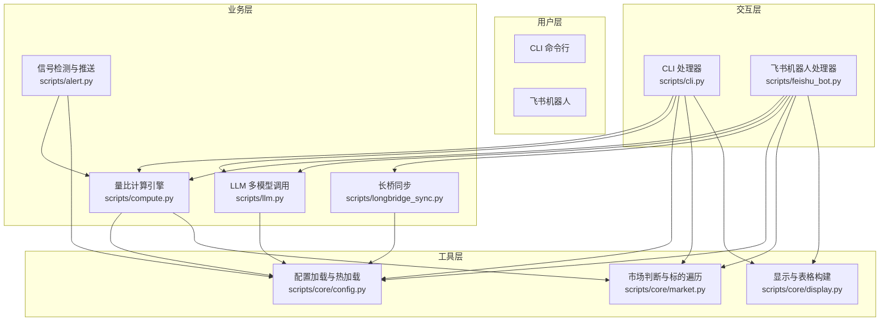
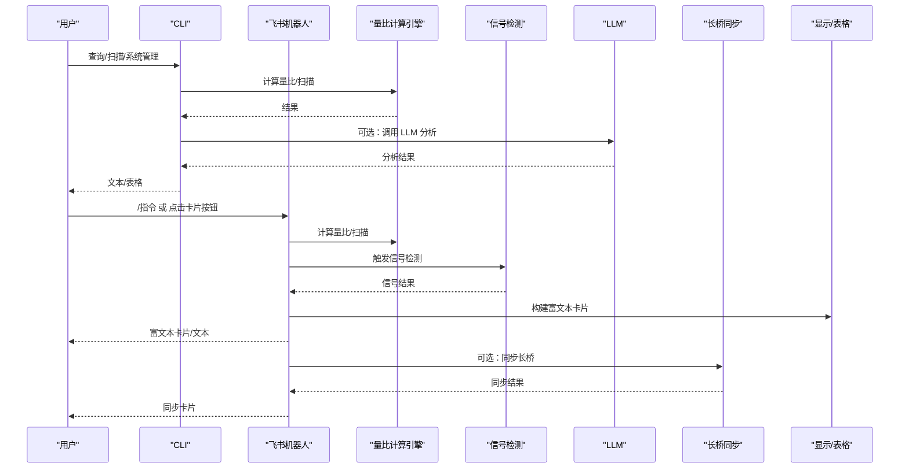
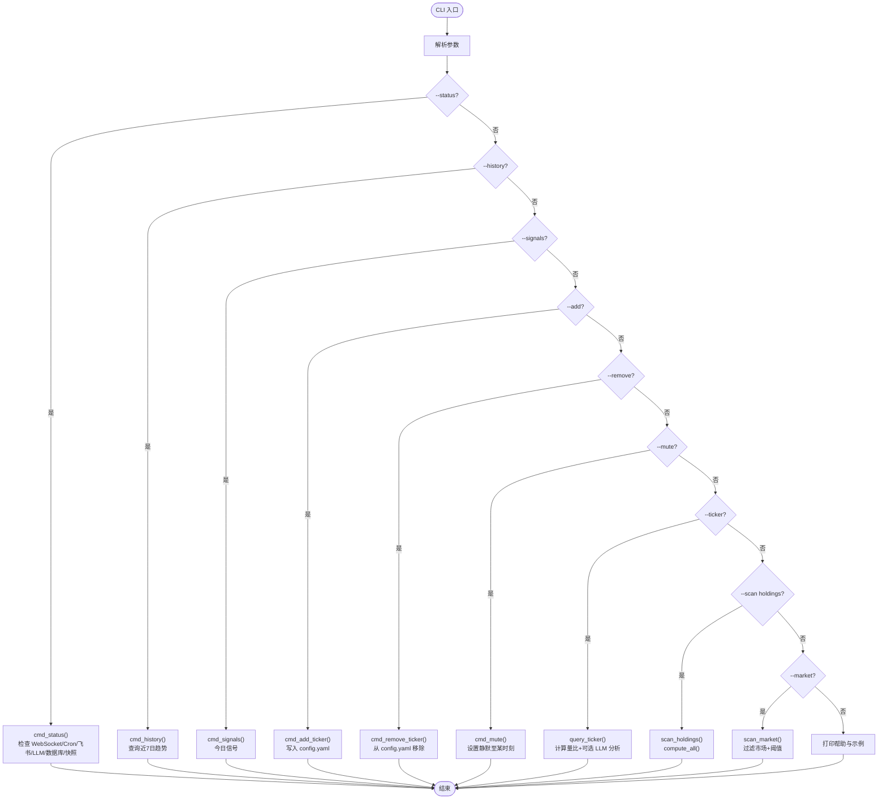
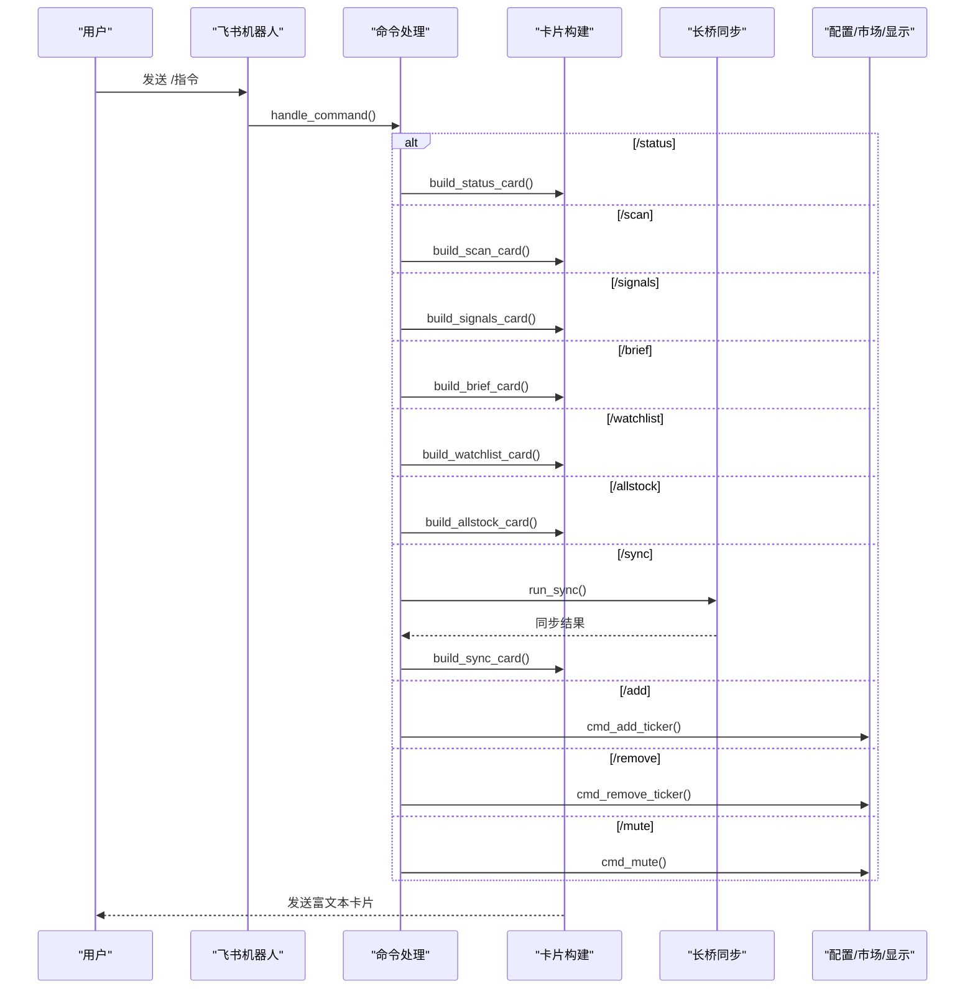
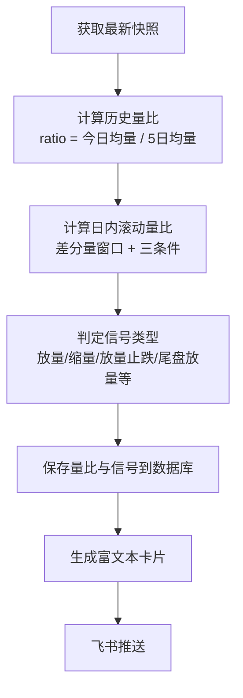
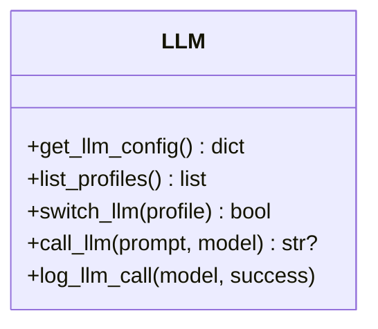
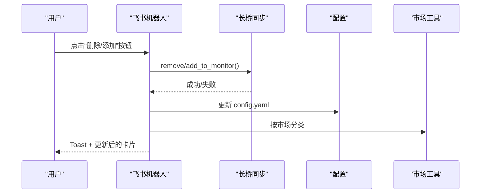
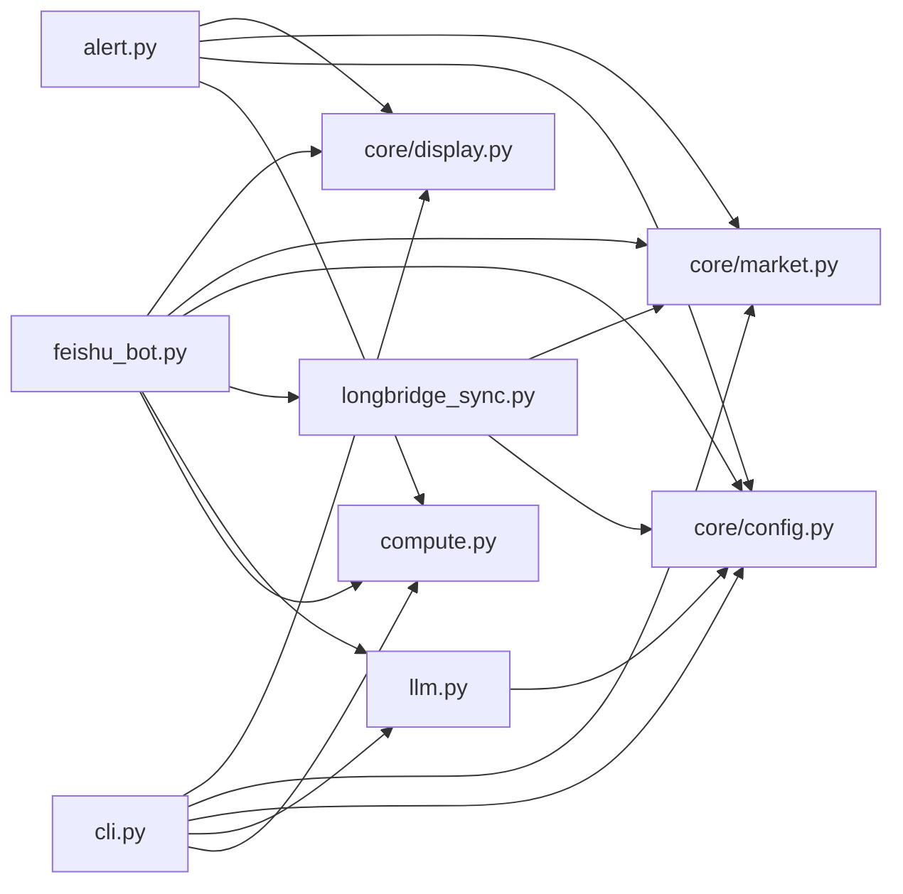

# 用户交互界面

<cite>
**本文引用的文件**
- [README.md](file://README.md)
- [cli.py](file://scripts/cli.py)
- [feishu_bot.py](file://scripts/feishu_bot.py)
- [compute.py](file://scripts/compute.py)
- [display.py](file://scripts/core/display.py)
- [market.py](file://scripts/core/market.py)
- [config.py](file://scripts/core/config.py)
- [llm.py](file://scripts/llm.py)
- [longbridge_sync.py](file://scripts/longbridge_sync.py)
- [alert.py](file://scripts/alert.py)
- [start_all.py](file://scripts/start_all.py)
- [stop_all.py](file://scripts/stop_all.py)
</cite>

## 目录
1. [简介](#简介)
2. [项目结构](#项目结构)
3. [核心组件](#核心组件)
4. [架构总览](#架构总览)
5. [详细组件分析](#详细组件分析)
6. [依赖关系分析](#依赖关系分析)
7. [性能与可用性考量](#性能与可用性考量)
8. [故障排查指南](#故障排查指南)
9. [结论](#结论)
10. [附录：操作流程与示例](#附录操作流程与示例)

## 简介
本项目提供两种主要用户交互入口：命令行界面（CLI）与飞书机器人。CLI 支持查询单个标的、扫描持仓与市场、查看系统状态与历史、添加/移除标的、静默标的、调用 LLM 分析等功能；飞书机器人通过 WebSocket 长连接提供交互指令与富文本卡片，支持系统启停、状态查看、量比扫描、信号列表、量比简报、关注列表与全部股票的交互式卡片，并支持通过卡片按钮直接管理监控标的、查看信号历史、同步长桥持仓。

## 项目结构
- 核心交互层：scripts/cli.py（CLI）、scripts/feishu_bot.py（飞书机器人）
- 核心业务层：scripts/compute.py（量比计算）、scripts/alert.py（信号检测与推送）、scripts/llm.py（LLM 多模型调用）、scripts/longbridge_sync.py（长桥同步）
- 核心工具层：scripts/core/config.py（配置加载与热加载）、scripts/core/market.py（市场判断与标的遍历）、scripts/core/display.py（量比符号与格式化输出）
- 服务编排：scripts/start_all.py、scripts/stop_all.py（一键启停与 cron 配置）

图表来源
- [cli.py:1-463](file://scripts/cli.py#L1-L463)
- [feishu_bot.py:1-991](file://scripts/feishu_bot.py#L1-L991)
- [compute.py:1-498](file://scripts/compute.py#L1-L498)
- [alert.py:1-200](file://scripts/alert.py#L1-L200)
- [llm.py:1-193](file://scripts/llm.py#L1-L193)
- [longbridge_sync.py:1-265](file://scripts/longbridge_sync.py#L1-L265)
- [config.py:1-63](file://scripts/core/config.py#L1-L63)
- [market.py:1-88](file://scripts/core/market.py#L1-L88)
- [display.py:1-102](file://scripts/core/display.py#L1-L102)

章节来源
- [README.md:106-142](file://README.md#L106-L142)
- [cli.py:372-463](file://scripts/cli.py#L372-L463)
- [feishu_bot.py:712-800](file://scripts/feishu_bot.py#L712-L800)

## 核心组件
- CLI 命令行：提供查询量比、扫描市场、系统状态、历史趋势、今日信号、添加/移除标的、静默标的、调用 LLM 分析等命令。
- 飞书机器人：提供 /start、/stop、/status、/scan、/signals、/brief、/watchlist、/allstock、/sync、/add、/remove、/mute 等指令与交互式卡片。
- 量比计算引擎：计算历史量比与日内滚动量比，生成信号并落库。
- 信号检测与推送：基于规则检测信号，生成富文本卡片并通过飞书推送。
- LLM 多模型调用：统一调用接口，支持多模型一键切换与测试。
- 长桥同步：将长桥持仓与自选股合并写入 watchlist，并支持卡片按钮操作。
- 配置与显示：配置热加载、市场判断、量比符号与表格构建。

章节来源
- [cli.py:41-463](file://scripts/cli.py#L41-L463)
- [feishu_bot.py:100-800](file://scripts/feishu_bot.py#L100-L800)
- [compute.py:197-484](file://scripts/compute.py#L197-L484)
- [alert.py:61-200](file://scripts/alert.py#L61-L200)
- [llm.py:32-193](file://scripts/llm.py#L32-L193)
- [longbridge_sync.py:18-265](file://scripts/longbridge_sync.py#L18-265)
- [config.py:20-63](file://scripts/core/config.py#L20-L63)
- [display.py:8-102](file://scripts/core/display.py#L8-L102)

## 架构总览
用户通过 CLI 或飞书机器人发起请求，交互层将请求路由到业务层进行计算与处理，最终以富文本卡片或文本形式返回。系统还支持定时任务与守护进程，保证服务稳定运行。

图表来源
- [cli.py:41-463](file://scripts/cli.py#L41-L463)
- [feishu_bot.py:712-800](file://scripts/feishu_bot.py#L712-L800)
- [compute.py:382-484](file://scripts/compute.py#L382-L484)
- [alert.py:61-200](file://scripts/alert.py#L61-L200)
- [llm.py:110-158](file://scripts/llm.py#L110-L158)
- [longbridge_sync.py:209-250](file://scripts/longbridge_sync.py#L209-L250)
- [display.py:43-102](file://scripts/core/display.py#L43-L102)

## 详细组件分析

### CLI 命令行组件分析
- 查询量比
  - 单个标的查询：支持 --ticker、--analyze（调用 LLM）、--collect（先采集再查询）。
  - 扫描持仓：--scan holdings。
  - 扫描市场：--market US/HK/CN --min-ratio 2.0。
- 系统管理
  - --status：系统健康状态（WebSocket、Cron、飞书、LLM、数据库、快照）。
  - --history CLF.US：近 7 日量比趋势。
  - --signals：今日信号列表。
  - --add/--remove/--mute：添加/移除标的、静默标的。
- LLM 模型切换
  - --list/--switch/--test：查看可用模型、切换模型、测试当前配置。

图表来源
- [cli.py:113-463](file://scripts/cli.py#L113-L463)
- [compute.py:382-484](file://scripts/compute.py#L382-L484)
- [llm.py:110-158](file://scripts/llm.py#L110-L158)

章节来源
- [cli.py:41-463](file://scripts/cli.py#L41-L463)
- [compute.py:382-484](file://scripts/compute.py#L382-L484)
- [llm.py:110-158](file://scripts/llm.py#L110-L158)

### 飞书机器人组件分析
- 指令体系
  - /start、/stop：一键启停系统。
  - /status：系统状态卡片（含 LLM 调用次数）。
  - /scan：量比扫描卡片（按市场分组表格）。
  - /signals：今日信号卡片（表格）。
  - /brief：量比简报卡片（原生表格）。
  - /watchlist：关注列表卡片（带删除按钮，同步长桥）。
  - /allstock：全部股票卡片（分组列表与二级导航，带添加按钮）。
  - /sync：同步长桥持仓+自选股卡片。
  - /add、/remove、/mute：调用 CLI 命令处理。
- 交互式卡片与按钮
  - 关注列表卡片：每行一个“删除”按钮，点击后从 config.yaml 与长桥自选股移除。
  - 全部股票卡片：一级导航展示分组，二级导航展示股票列表，每行多个“添加”按钮，点击后添加到长桥“量比监控”分组并同步到 config.yaml。
  - 卡片回调：处理按钮点击，更新卡片内容并反馈 Toast。

图表来源
- [feishu_bot.py:712-800](file://scripts/feishu_bot.py#L712-L800)
- [feishu_bot.py:100-336](file://scripts/feishu_bot.py#L100-L336)
- [longbridge_sync.py:209-250](file://scripts/longbridge_sync.py#L209-L250)
- [config.py:20-63](file://scripts/core/config.py#L20-L63)
- [market.py:50-88](file://scripts/core/market.py#L50-L88)
- [display.py:43-102](file://scripts/core/display.py#L43-L102)

章节来源
- [feishu_bot.py:100-800](file://scripts/feishu_bot.py#L100-L800)
- [longbridge_sync.py:18-265](file://scripts/longbridge_sync.py#L18-265)
- [config.py:20-63](file://scripts/core/config.py#L20-L63)
- [market.py:50-88](file://scripts/core/market.py#L50-L88)
- [display.py:43-102](file://scripts/core/display.py#L43-L102)

### 量比计算与信号检测
- 计算引擎
  - 历史量比：当日同时段成交量 / 5 日同时段均量，支持阈值与信号类型判定。
  - 日内滚动量比：基于最近若干窗口的差分量，满足“放量+止跌+企稳”三条件时触发“放量止跌”等信号。
  - 信号细节：结合涨跌幅与时间（如尾盘）给出更细粒度信号。
- 信号检测
  - 历史路径与日内路径双通道检测，支持静默名单与市场交易时间过滤。
  - 生成富文本卡片，包含价格、量比、信号、LLM 分析等。

图表来源
- [compute.py:197-338](file://scripts/compute.py#L197-L338)
- [compute.py:340-484](file://scripts/compute.py#L340-L484)
- [alert.py:61-142](file://scripts/alert.py#L61-L142)

章节来源
- [compute.py:197-484](file://scripts/compute.py#L197-L484)
- [alert.py:61-200](file://scripts/alert.py#L61-L200)

### LLM 多模型调用
- 统一调用接口：根据配置自动选择 provider/base_url/model/温度等参数。
- 多配置档：支持 llm_profiles 定义多模型配置，一键切换。
- 调用记录：将每次 LLM 调用记录到数据库，便于统计与审计。

图表来源
- [llm.py:32-193](file://scripts/llm.py#L32-L193)

章节来源
- [llm.py:32-193](file://scripts/llm.py#L32-L193)

### 长桥同步与交互式卡片按钮
- 合并策略：长桥持仓 + 指定分组 → 去重 → 按市场分类 → 写入 config.yaml。
- 卡片按钮：支持“删除”（从 config.yaml 与长桥移除）与“添加”（添加到长桥“量比监控”分组并同步）。
- 同步卡片：展示同步结果与最终列表（原生表格）。

图表来源
- [feishu_bot.py:526-615](file://scripts/feishu_bot.py#L526-L615)
- [longbridge_sync.py:124-163](file://scripts/longbridge_sync.py#L124-L163)
- [longbridge_sync.py:188-250](file://scripts/longbridge_sync.py#L188-L250)
- [config.py:34-47](file://scripts/core/config.py#L34-L47)
- [market.py:50-88](file://scripts/core/market.py#L50-L88)

章节来源
- [feishu_bot.py:526-615](file://scripts/feishu_bot.py#L526-L615)
- [longbridge_sync.py:124-250](file://scripts/longbridge_sync.py#L124-L250)
- [config.py:34-47](file://scripts/core/config.py#L34-L47)
- [market.py:50-88](file://scripts/core/market.py#L50-L88)

## 依赖关系分析
- CLI 依赖：compute（量比计算）、llm（LLM 分析）、core/config（配置）、core/market（市场判断）、core/display（格式化）。
- 飞书机器人依赖：compute、llm、longbridge_sync、core/config、core/market、core/display。
- 信号检测依赖：compute、core/config、core/market、core/display。
- LLM 依赖：core/config。
- 长桥同步依赖：core/config、core/market。

图表来源
- [cli.py:21-24](file://scripts/cli.py#L21-L24)
- [feishu_bot.py:31-34](file://scripts/feishu_bot.py#L31-L34)
- [alert.py:20-23](file://scripts/alert.py#L20-L23)
- [llm.py:22](file://scripts/llm.py#L22)
- [longbridge_sync.py:14-15](file://scripts/longbridge_sync.py#L14-L15)

章节来源
- [cli.py:21-24](file://scripts/cli.py#L21-L24)
- [feishu_bot.py:31-34](file://scripts/feishu_bot.py#L31-L34)
- [alert.py:20-23](file://scripts/alert.py#L20-L23)
- [llm.py:22](file://scripts/llm.py#L22)
- [longbridge_sync.py:14-15](file://scripts/longbridge_sync.py#L14-L15)

## 性能与可用性考量
- JSONL 存储：按天追加，减少文件数量，提高 IO 效率。
- SQLite 索引：对 signals 与 volume_ratios 建立索引，提升查询效率。
- LLM 调用：统一接口与超时控制，避免阻塞；调用记录便于成本与质量追踪。
- 飞书卡片：原生表格渲染，减少前端渲染压力；按钮回调即时更新，降低重复请求。
- 守护进程与 cron：自动重启挂掉的进程，保障服务连续性。

## 故障排查指南
- 量比显示 0.0“数据不足”
  - 5 日历史量比需要至少 5 个交易日数据；可使用日内滚动量比（ratio_intraday）。
- 飞书机器人不响应
  - 检查 config.yaml 中 feishu.app_id 与 feishu.app_secret；确认飞书开放平台已开启机器人能力、配置权限、发布版本；查看日志 logs/feishu_bot.log。
- WebSocket 进程不存在
  - 查看日志 logs/launcher.log；手动重启 scripts/collect_ws_launcher.py。
- LLM API 调用失败
  - 确认 config.yaml 中 api_key 正确；使用 scripts/llm.py --test 测试；通过 scripts/llm.py --switch 切换模型。

章节来源
- [README.md:354-391](file://README.md#L354-L391)

## 结论
本项目通过 CLI 与飞书机器人提供了完整的用户交互体验：CLI 适合批量查询与系统管理，飞书机器人适合日常监控与即时交互。量比计算与信号检测逻辑清晰，LLM 多模型切换与长桥同步增强了实用性与可扩展性。建议在生产环境中配合守护进程与日志监控，确保服务稳定运行。

## 附录：操作流程与示例

### CLI 常用命令示例
- 查询单个标的并调用 LLM 分析
  - python3 scripts/cli.py --ticker CLF.US --analyze
- 扫描持仓并按量比排序
  - python3 scripts/cli.py --scan holdings
- 扫描市场放量标的
  - python3 scripts/cli.py --market US --min-ratio 2.0
- 查看系统状态
  - python3 scripts/cli.py --status
- 查看今日信号
  - python3 scripts/cli.py --signals
- 添加/移除标的
  - python3 scripts/cli.py --add CLF.US-克利夫兰
  - python3 scripts/cli.py --remove CLF.US
- 静默标的
  - python3 scripts/cli.py --mute CLF.US 2h

章节来源
- [README.md:219-269](file://README.md#L219-L269)
- [cli.py:417-447](file://scripts/cli.py#L417-L447)

### 飞书机器人常用指令与卡片
- /status：查看系统状态与今日 LLM 调用次数
- /scan：量比扫描卡片（按 US/HK/CN 分组表格）
- /signals：今日信号卡片（表格）
- /brief：量比简报卡片（原生表格）
- /watchlist：关注列表卡片（带删除按钮）
- /allstock：全部股票卡片（分组列表与二级导航，带添加按钮）
- /sync：同步长桥持仓+自选股卡片
- /add CLF.US-克利夫兰、/remove CLF.US、/mute CLF.US 2h：调用 CLI 命令处理

章节来源
- [README.md:176-215](file://README.md#L176-L215)
- [feishu_bot.py:712-800](file://scripts/feishu_bot.py#L712-L800)

### 一键启停与服务编排
- 一键启动
  - python3 scripts/start_all.py
- 一键关停
  - python3 scripts/stop_all.py
- cron 任务
  - 每分钟检查 WebSocket 与飞书机器人进程
  - 每分钟扫描信号并推送
  - 每 30 分钟发送量比简报
  - 每小时清理过期数据

章节来源
- [README.md:272-311](file://README.md#L272-L311)
- [start_all.py:120-169](file://scripts/start_all.py#L120-L169)
- [stop_all.py:64-108](file://scripts/stop_all.py#L64-L108)