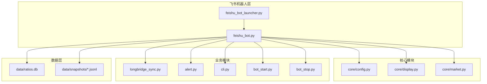
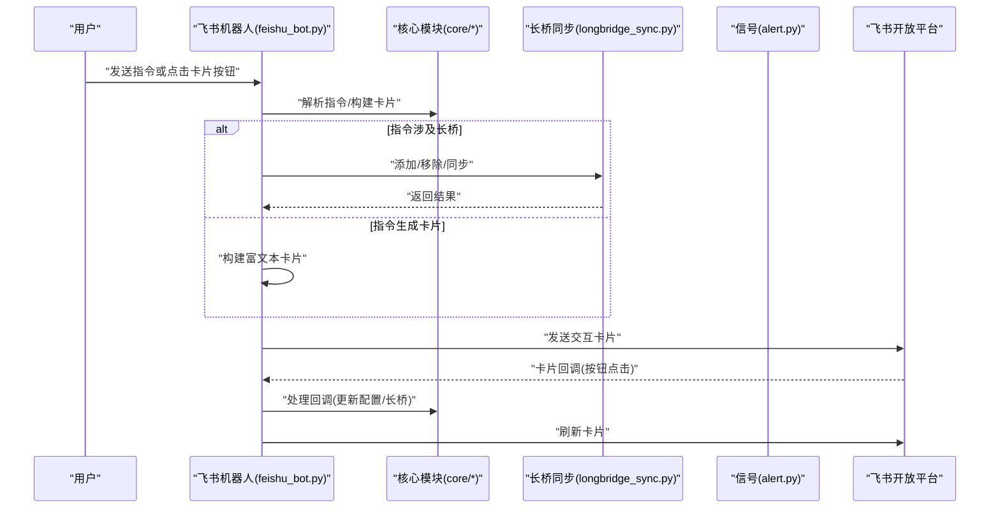
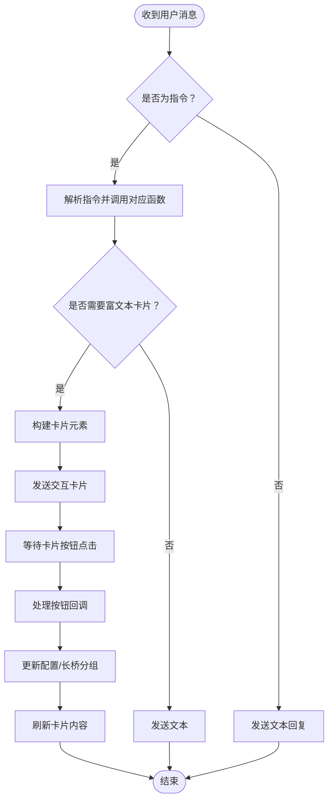
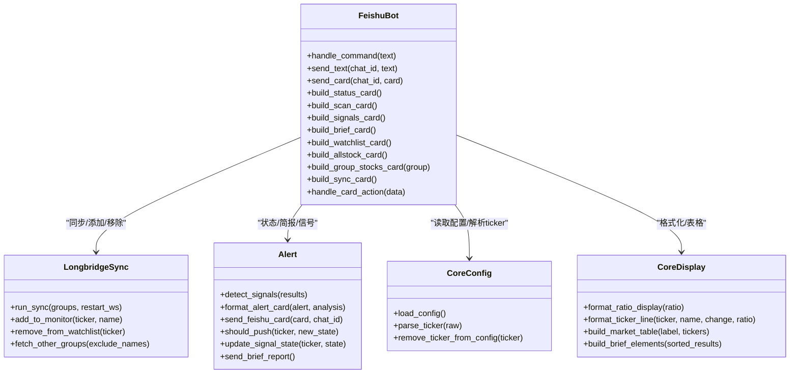
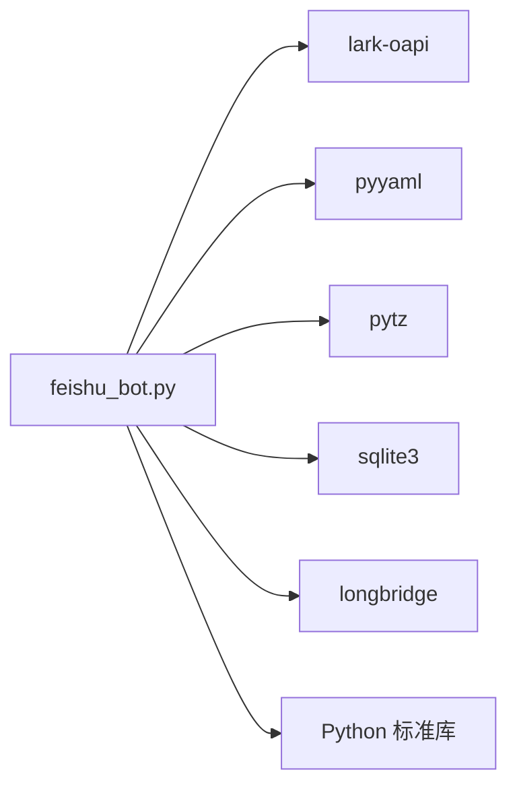

# 飞书机器人界面

<cite>
**本文引用的文件**
- [scripts/feishu_bot.py](file://scripts/feishu_bot.py)
- [scripts/feishu_bot_launcher.py](file://scripts/feishu_bot_launcher.py)
- [scripts/cli.py](file://scripts/cli.py)
- [scripts/longbridge_sync.py](file://scripts/longbridge_sync.py)
- [scripts/core/config.py](file://scripts/core/config.py)
- [scripts/core/market.py](file://scripts/core/market.py)
- [scripts/core/display.py](file://scripts/core/display.py)
- [scripts/alert.py](file://scripts/alert.py)
- [scripts/bot_start.py](file://scripts/bot_start.py)
- [scripts/bot_stop.py](file://scripts/bot_stop.py)
- [config.yaml.example](file://config.yaml.example)
- [README.md](file://README.md)
</cite>

## 目录
1. [简介](#简介)
2. [项目结构](#项目结构)
3. [核心组件](#核心组件)
4. [架构总览](#架构总览)
5. [详细组件分析](#详细组件分析)
6. [依赖关系分析](#依赖关系分析)
7. [性能考量](#性能考量)
8. [故障排查指南](#故障排查指南)
9. [结论](#结论)
10. [附录](#附录)

## 简介
本文件面向飞书机器人的使用者与维护者，系统性介绍机器人交互指令、交互式卡片设计、对话流程与响应机制，并提供常见使用场景、操作示例、配置要求、权限设置与故障排查指南。机器人通过 WebSocket 长连接运行，支持多条交互指令与富文本卡片，覆盖状态查询、市场扫描、信号查询、简报、监控列表、全市场扫描、持仓同步等功能。

## 项目结构
- 机器人核心：scripts/feishu_bot.py（WebSocket 长连接 + 指令解析 + 富文本卡片）
- 守护进程：scripts/feishu_bot_launcher.py（每分钟检查并确保机器人运行）
- 配置与显示：scripts/core/config.py、scripts/core/display.py、scripts/core/market.py
- 长桥同步：scripts/longbridge_sync.py（长桥持仓/自选股同步至监控列表）
- 信号检测与推送：scripts/alert.py（信号去重、LLM 分析、飞书卡片推送）
- CLI 辅助：scripts/cli.py（命令行查询、历史、信号、静默等）
- 启停脚本：scripts/bot_start.py、scripts/bot_stop.py
- 配置样例：config.yaml.example
- 项目说明：README.md

图表来源
- [scripts/feishu_bot.py:1-991](file://scripts/feishu_bot.py#L1-L991)
- [scripts/feishu_bot_launcher.py:1-90](file://scripts/feishu_bot_launcher.py#L1-L90)
- [scripts/core/config.py:1-63](file://scripts/core/config.py#L1-L63)
- [scripts/core/display.py:1-102](file://scripts/core/display.py#L1-L102)
- [scripts/core/market.py:1-88](file://scripts/core/market.py#L1-L88)
- [scripts/longbridge_sync.py:1-265](file://scripts/longbridge_sync.py#L1-L265)
- [scripts/alert.py:1-514](file://scripts/alert.py#L1-L514)
- [scripts/cli.py:1-463](file://scripts/cli.py#L1-L463)
- [scripts/bot_start.py:1-86](file://scripts/bot_start.py#L1-L86)
- [scripts/bot_stop.py:1-62](file://scripts/bot_stop.py#L1-L62)

章节来源
- [README.md:106-142](file://README.md#L106-L142)

## 核心组件
- 飞书机器人（WebSocket 长连接）：接收用户指令，发送富文本卡片；支持卡片按钮回调（删除、添加、返回等）。
- 配置与解析：统一加载 config.yaml，支持热加载；解析 ticker 格式（含中文名）。
- 显示与格式化：量比符号与中文双标识，飞书原生表格构建。
- 长桥同步：拉取持仓与自选股，合并去重，写回 config.yaml，并可添加/移除到“量比监控”分组。
- 信号检测与推送：检测放量/缩量/尾盘放量等信号，去重状态机，必要时调用 LLM 分析，推送富文本卡片。
- CLI 辅助：提供命令行查询、历史、信号、静默、添加/移除标的等能力，便于调试与批量操作。

章节来源
- [scripts/feishu_bot.py:1-991](file://scripts/feishu_bot.py#L1-L991)
- [scripts/core/config.py:1-63](file://scripts/core/config.py#L1-L63)
- [scripts/core/display.py:1-102](file://scripts/core/display.py#L1-L102)
- [scripts/longbridge_sync.py:1-265](file://scripts/longbridge_sync.py#L1-L265)
- [scripts/alert.py:1-514](file://scripts/alert.py#L1-L514)
- [scripts/cli.py:1-463](file://scripts/cli.py#L1-L463)

## 架构总览
机器人通过 WebSocket 与飞书开放平台建立长连接，接收用户消息与卡片回调，解析指令后调用相应模块生成富文本卡片并发送。卡片中包含按钮与菜单，用户点击后触发回调，更新配置与长桥分组，并刷新卡片内容。

图表来源
- [scripts/feishu_bot.py:712-832](file://scripts/feishu_bot.py#L712-L832)
- [scripts/feishu_bot.py:526-615](file://scripts/feishu_bot.py#L526-L615)
- [scripts/longbridge_sync.py:124-163](file://scripts/longbridge_sync.py#L124-L163)
- [scripts/alert.py:199-246](file://scripts/alert.py#L199-L246)

## 详细组件分析

### 交互指令与使用方法
- /status：系统健康状态（WebSocket、LLM、数据库、快照大小等）
- /scan：当前量比快照（按量比排序，分市场展示）
- /signals：今日触发信号列表（含时间、标的、涨跌、量比、信号类型、来源）
- /brief：立即发送量比简报（原生表格，含 LLM 解读）
- /watchlist：关注列表（含删除按钮，同步长桥“量比监控”分组）
- /allstock：全部股票（二级导航，可逐组查看并一键添加到监控）
- /sync：同步长桥持仓+自选股到 watchlist，并重启 WebSocket 采集
- /start：一键启动系统（cron + WebSocket + 飞书机器人）
- /stop：一键关停系统（先发结果卡片，再关停）
- /add TICKER-名称：添加监控标的
- /remove TICKER：移除监控标的
- /mute TICKER DURATION：静默指定标的（支持 h/m/s）
- /history TICKER：近 7 日量比趋势

章节来源
- [scripts/feishu_bot.py:712-832](file://scripts/feishu_bot.py#L712-L832)
- [README.md:176-216](file://README.md#L176-L216)

### 交互式卡片设计理念
- 卡片结构：宽屏模式、标题头、内容元素（Markdown/表格/动作区）
- 按钮操作：
  - 删除关注：点击“❌ 标的”，从 config.yaml 与长桥分组移除
  - 添加监控：点击“➕ 标的”，添加到长桥“量比监控”分组，并同步到 config.yaml
  - 导航：点击“📁 分组名”进入分组详情，点击“⬅ 返回列表”回到分组列表
- 菜单选择：分组列表以 Markdown 列表呈现，按钮以 primary/danger 类型区分
- 消息格式：Markdown + 飞书原生表格，统一量比符号与中文标识，带方向箭头与状态图标

章节来源
- [scripts/feishu_bot.py:361-414](file://scripts/feishu_bot.py#L361-L414)
- [scripts/feishu_bot.py:417-523](file://scripts/feishu_bot.py#L417-L523)
- [scripts/feishu_bot.py:526-615](file://scripts/feishu_bot.py#L526-L615)
- [scripts/core/display.py:43-101](file://scripts/core/display.py#L43-L101)

### 对话流程与响应机制
- 指令解析：收到文本消息后，按指令分支处理，生成对应卡片或文本回复
- 卡片回调：用户点击按钮后，触发回调函数，更新配置与长桥分组，返回刷新后的卡片
- 异步推送：信号检测模块按分钟扫描，满足条件时推送富文本卡片，必要时调用 LLM 分析

图表来源
- [scripts/feishu_bot.py:712-832](file://scripts/feishu_bot.py#L712-L832)
- [scripts/feishu_bot.py:526-615](file://scripts/feishu_bot.py#L526-L615)

### 常见使用场景与操作示例
- 添加静默标的：/mute CLF.US 2h（静默2小时）
- 查看历史信号：/signals（今日信号列表）
- 获取 AI 分析：/brief（简报卡片含 LLM 解读）
- 管理监控列表：/watchlist（点击“❌ 标的”删除；/remove 移除）
- 全市场扫描：/allstock（浏览分组，点击“➕ 标的”添加）
- 持仓同步：/sync（同步长桥持仓+自选股，重启 WebSocket）

章节来源
- [scripts/feishu_bot.py:762-800](file://scripts/feishu_bot.py#L762-L800)
- [scripts/feishu_bot.py:712-744](file://scripts/feishu_bot.py#L712-L744)
- [scripts/feishu_bot.py:746-761](file://scripts/feishu_bot.py#L746-L761)
- [scripts/feishu_bot.py:758-761](file://scripts/feishu_bot.py#L758-L761)
- [scripts/feishu_bot.py:762-786](file://scripts/feishu_bot.py#L762-L786)
- [scripts/feishu_bot.py:788-800](file://scripts/feishu_bot.py#L788-L800)
- [scripts/longbridge_sync.py:209-250](file://scripts/longbridge_sync.py#L209-L250)

### 关键函数与类关系（代码级）

图表来源
- [scripts/feishu_bot.py:1-991](file://scripts/feishu_bot.py#L1-L991)
- [scripts/longbridge_sync.py:1-265](file://scripts/longbridge_sync.py#L1-L265)
- [scripts/alert.py:1-514](file://scripts/alert.py#L1-L514)
- [scripts/core/config.py:1-63](file://scripts/core/config.py#L1-L63)
- [scripts/core/display.py:1-102](file://scripts/core/display.py#L1-L102)

## 依赖关系分析
- 飞书客户端：lark-oapi（消息发送、交互卡片）
- 长桥客户端：longbridge（行情/交易上下文、自选股分组）
- 配置与显示：pyyaml、pytz（配置解析、时区转换）
- 数据存储：sqlite3（SQLite 数据库）、JSONL（行情快照）

图表来源
- [scripts/feishu_bot.py:24-29](file://scripts/feishu_bot.py#L24-L29)
- [scripts/longbridge_sync.py:20-29](file://scripts/longbridge_sync.py#L20-L29)
- [scripts/alert.py:201-202](file://scripts/alert.py#L201-L202)

章节来源
- [README.md:394-407](file://README.md#L394-L407)

## 性能考量
- 卡片构建：按需生成，避免重复查询；表格分市场分页，降低渲染压力
- 配置热加载：基于文件修改时间缓存，减少频繁 IO
- 信号去重：状态机优先级控制，避免重复推送
- WebSocket 重试：长连接断开后自动重启，保证数据连续性
- 日志分离：标准输出/错误分别写入独立文件，便于定位问题

## 故障排查指南
- 飞书机器人不响应
  - 检查 config.yaml 中 feishu.app_id 与 app_secret 是否正确
  - 确认飞书开放平台已开启机器人能力、配置权限、发布版本
  - 查看日志：tail -f logs/feishu_bot.log
- WebSocket 进程不存在
  - 查看守护进程日志：cat logs/launcher.log
  - 手动重启：python3 scripts/collect_ws_launcher.py
- LLM API 调用失败
  - 确认 config.yaml 中 api_key 正确
  - 测试连接：python3 scripts/llm.py --test
  - 切换模型：python3 scripts/llm.py --switch minimax
- 卡片按钮无响应
  - 检查回调处理逻辑与长桥分组名称一致性
  - 确认长桥 token 目录存在且可访问

章节来源
- [README.md:354-390](file://README.md#L354-L390)

## 结论
飞书机器人通过交互式卡片与按钮操作，将量比监控、信号推送、列表管理、长桥同步等功能整合在一个统一的界面中。其架构清晰、模块职责明确，既适合日常使用，也便于维护与扩展。建议在生产环境中配合守护进程与日志监控，确保服务稳定运行。

## 附录

### 配置要求与权限设置
- 飞书配置（config.yaml）
  - app_id、app_secret：自建应用凭证
  - chat_id：机器人会话 chat_id（从机器人日志中获取）
- LLM 配置（可选）
  - provider、model、base_url、api_key、max_tokens、temperature
- 长桥配置
  - 长桥 token 目录 ~/.longbridge/openapi/tokens 需存在且可读

章节来源
- [config.yaml.example:64-72](file://config.yaml.example#L64-L72)
- [scripts/longbridge_sync.py:22-29](file://scripts/longbridge_sync.py#L22-L29)

### 常用命令速查
- 启动/停止飞书机器人：python3 scripts/bot_start.py、python3 scripts/bot_stop.py
- 查看日志：tail -f logs/feishu_bot.log
- 一键启停系统：python3 scripts/start_all.py、python3 scripts/stop_all.py

章节来源
- [README.md:204-213](file://README.md#L204-L213)
- [README.md:288-294](file://README.md#L288-L294)