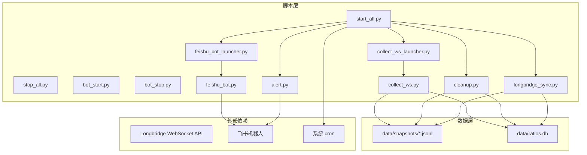
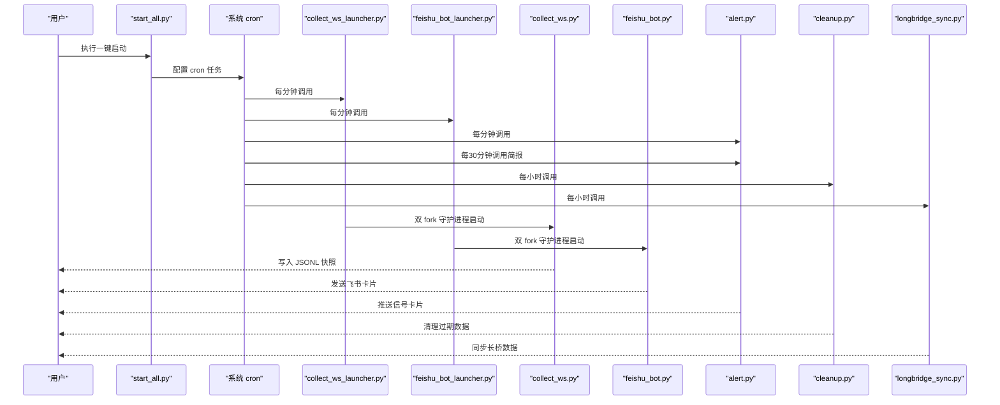
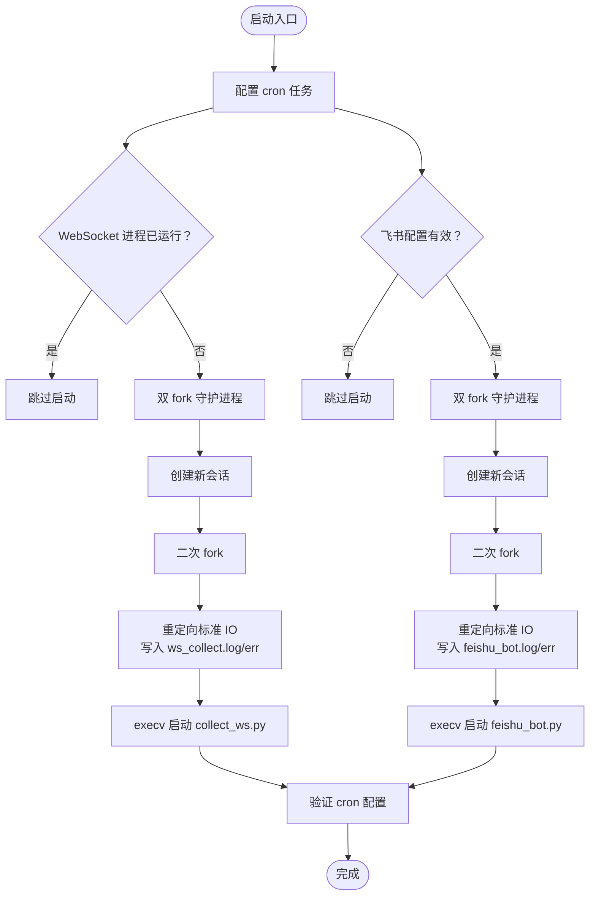
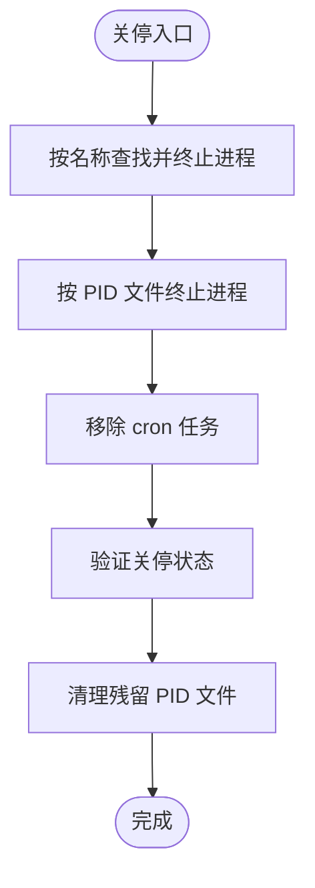
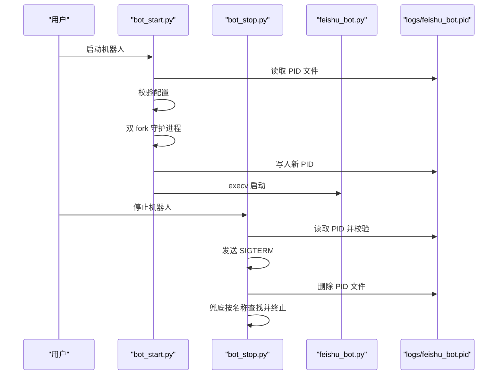
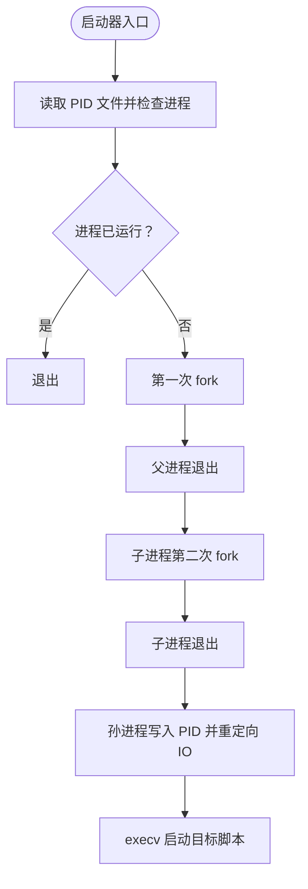
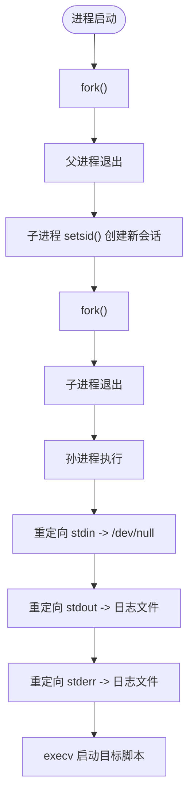
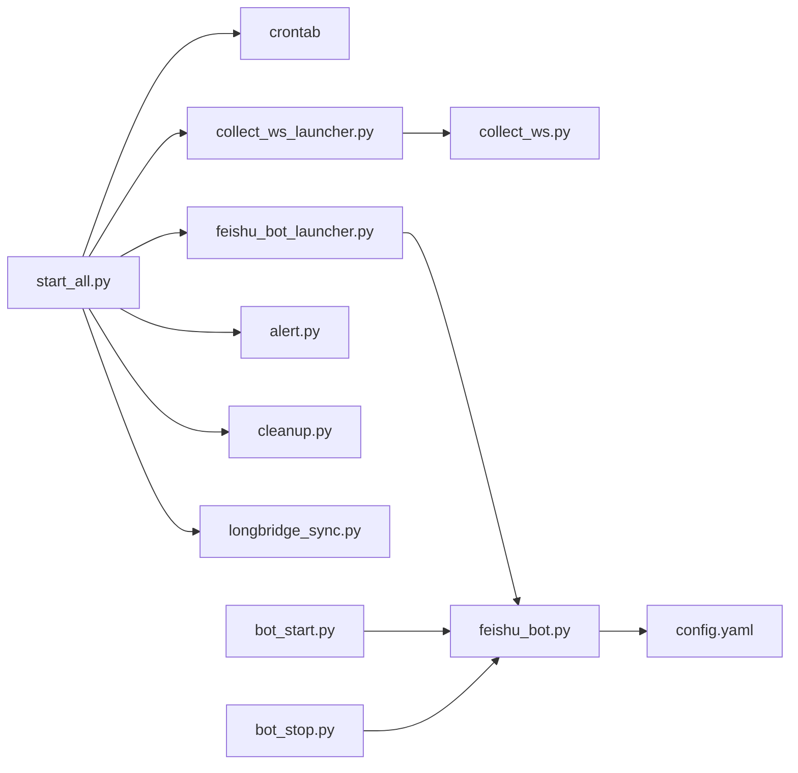

# 启动与关停管理

<cite>
**本文档引用的文件**
- [start_all.py](file://scripts/start_all.py)
- [stop_all.py](file://scripts/stop_all.py)
- [bot_start.py](file://scripts/bot_start.py)
- [bot_stop.py](file://scripts/bot_stop.py)
- [collect_ws_launcher.py](file://scripts/collect_ws_launcher.py)
- [feishu_bot_launcher.py](file://scripts/feishu_bot_launcher.py)
- [collect_ws.py](file://scripts/collect_ws.py)
- [feishu_bot.py](file://scripts/feishu_bot.py)
- [alert.py](file://scripts/alert.py)
- [cleanup.py](file://scripts/cleanup.py)
- [longbridge_sync.py](file://scripts/longbridge_sync.py)
- [config.yaml.example](file://config.yaml.example)
- [README.md](file://README.md)
</cite>

## 目录
1. [简介](#简介)
2. [项目结构](#项目结构)
3. [核心组件](#核心组件)
4. [架构总览](#架构总览)
5. [详细组件分析](#详细组件分析)
6. [依赖关系分析](#依赖关系分析)
7. [性能考量](#性能考量)
8. [故障排查指南](#故障排查指南)
9. [结论](#结论)
10. [附录](#附录)

## 简介
本文件聚焦于系统的启动与关停管理，涵盖一键启动脚本的完整流程、守护进程机制、关停流程、机器人专用启动关停逻辑，以及最佳实践建议。目标是帮助运维人员和开发者快速理解并高效维护该跨市场量比监控系统。

## 项目结构
系统采用“脚本层 + 数据层 + 数据源层”的分层架构，启动与关停管理主要集中在 scripts 目录下的多个脚本之间协同完成。

图表来源
- [start_all.py:120-164](file://scripts/start_all.py#L120-L164)
- [collect_ws_launcher.py:29-78](file://scripts/collect_ws_launcher.py#L29-L78)
- [feishu_bot_launcher.py:28-85](file://scripts/feishu_bot_launcher.py#L28-L85)
- [collect_ws.py:159-214](file://scripts/collect_ws.py#L159-L214)
- [feishu_bot.py:1-120](file://scripts/feishu_bot.py#L1-L120)
- [alert.py:1-60](file://scripts/alert.py#L1-L60)
- [cleanup.py:1-40](file://scripts/cleanup.py#L1-L40)
- [longbridge_sync.py:1-40](file://scripts/longbridge_sync.py#L1-L40)

章节来源
- [README.md:106-142](file://README.md#L106-L142)

## 核心组件
- 一键启动脚本：负责配置 cron 任务、启动 WebSocket 采集进程、启动飞书机器人，并进行最终状态验证。
- 一键关停脚本：负责终止相关进程、移除 cron 任务、清理残留 PID 文件，并验证关停状态。
- 机器人专用启动关停：独立管理飞书机器人的生命周期，支持配置校验与守护进程创建。
- 守护进程启动器：通过 cron 每分钟检查并确保进程存活，实现自动重启。
- 进程守护机制：基于双 fork 守护进程模式，创建新会话、重定向标准输入输出、脱离控制终端。

章节来源
- [start_all.py:120-164](file://scripts/start_all.py#L120-L164)
- [stop_all.py:64-103](file://scripts/stop_all.py#L64-L103)
- [bot_start.py:25-81](file://scripts/bot_start.py#L25-L81)
- [bot_stop.py:23-57](file://scripts/bot_stop.py#L23-L57)
- [collect_ws_launcher.py:29-78](file://scripts/collect_ws_launcher.py#L29-L78)
- [feishu_bot_launcher.py:28-85](file://scripts/feishu_bot_launcher.py#L28-L85)

## 架构总览
系统通过 cron 定时调度多个守护进程启动器，分别负责 WebSocket 采集和飞书机器人的存活检查与重启；同时提供一键启动/关停脚本以简化运维操作。

图表来源
- [start_all.py:133-141](file://scripts/start_all.py#L133-L141)
- [collect_ws_launcher.py:48-78](file://scripts/collect_ws_launcher.py#L48-L78)
- [feishu_bot_launcher.py:56-85](file://scripts/feishu_bot_launcher.py#L56-L85)
- [alert.py:504-514](file://scripts/alert.py#L504-L514)
- [cleanup.py:157-211](file://scripts/cleanup.py#L157-L211)
- [longbridge_sync.py:209-250](file://scripts/longbridge_sync.py#L209-L250)

## 详细组件分析

### 一键启动脚本 start_all.py
- cron 任务配置
  - 添加 6 个 cron 任务，分别负责 WebSocket 启动器、飞书机器人启动器、信号扫描、简报、同步与清理。
  - 使用 crontab -l 读取现有任务，避免重复添加。
- WebSocket 采集进程启动
  - 若 PID 文件存在且进程存活则跳过；否则执行双 fork 守护进程创建。
  - 创建新会话、二次 fork、重定向标准输入输出至日志文件、execv 启动 collect_ws.py。
- 飞书机器人启动
  - 读取配置文件，校验 app_id/app_secret；若缺失则跳过启动。
  - 双 fork 守护进程，重定向标准输入输出，execv 启动 feishu_bot.py。
- 状态验证
  - 通过 crontab -l 输出当前配置，便于核对。

图表来源
- [start_all.py:18-27](file://scripts/start_all.py#L18-L27)
- [start_all.py:30-66](file://scripts/start_all.py#L30-L66)
- [start_all.py:69-117](file://scripts/start_all.py#L69-L117)
- [start_all.py:120-164](file://scripts/start_all.py#L120-L164)

章节来源
- [start_all.py:18-27](file://scripts/start_all.py#L18-L27)
- [start_all.py:30-66](file://scripts/start_all.py#L30-L66)
- [start_all.py:69-117](file://scripts/start_all.py#L69-L117)
- [start_all.py:120-164](file://scripts/start_all.py#L120-L164)

### 一键关停脚本 stop_all.py
- 进程终止
  - 通过 ps aux 按名称查找并发送 SIGTERM；同时尝试通过 PID 文件定位进程并终止。
  - 对飞书机器人 PID 文件进行清理。
- cron 任务移除
  - 读取现有任务，过滤包含关键字的行，重新写回 crontab。
- 状态验证与清理
  - 输出剩余 cron 任务；遍历 logs 目录下的 .pid 文件并删除。

图表来源
- [stop_all.py:30-48](file://scripts/stop_all.py#L30-L48)
- [stop_all.py:51-61](file://scripts/stop_all.py#L51-L61)
- [stop_all.py:64-103](file://scripts/stop_all.py#L64-L103)

章节来源
- [stop_all.py:16-27](file://scripts/stop_all.py#L16-L27)
- [stop_all.py:30-48](file://scripts/stop_all.py#L30-L48)
- [stop_all.py:51-61](file://scripts/stop_all.py#L51-L61)
- [stop_all.py:64-103](file://scripts/stop_all.py#L64-L103)

### 机器人专用启动关停 bot_start.py / bot_stop.py
- bot_start.py
  - 检查 PID 文件与进程存活状态；若未运行则执行双 fork 守护进程，重定向标准 IO，execv 启动 feishu_bot.py。
  - 配置校验：读取 config.yaml，要求 app_id 与 app_secret 均存在。
- bot_stop.py
  - 优先通过 PID 文件查找并终止；若失败则按进程名兜底查找并终止。
  - 清理 PID 文件，输出处理结果。

图表来源
- [bot_start.py:25-81](file://scripts/bot_start.py#L25-L81)
- [bot_start.py:38-47](file://scripts/bot_start.py#L38-L47)
- [bot_stop.py:23-57](file://scripts/bot_stop.py#L23-L57)

章节来源
- [bot_start.py:17-22](file://scripts/bot_start.py#L17-L22)
- [bot_start.py:25-81](file://scripts/bot_start.py#L25-L81)
- [bot_stop.py:15-21](file://scripts/bot_stop.py#L15-L21)
- [bot_stop.py:23-57](file://scripts/bot_stop.py#L23-L57)

### 守护进程启动器 collect_ws_launcher.py / feishu_bot_launcher.py
- 进程存活检查
  - 读取 PID 文件，解析 PID 并通过 os.kill(pid, 0) 检查进程是否存在。
- 双 fork 守护进程
  - 子进程创建新会话，再次 fork，孙进程写入自身 PID，重定向标准 IO，execv 启动目标脚本。
- 飞书配置检查（机器人启动器）
  - 在启动前读取 config.yaml，校验 app_id/app_secret，若缺失则跳过启动。

图表来源
- [collect_ws_launcher.py:29-78](file://scripts/collect_ws_launcher.py#L29-L78)
- [feishu_bot_launcher.py:28-85](file://scripts/feishu_bot_launcher.py#L28-L85)

章节来源
- [collect_ws_launcher.py:21-26](file://scripts/collect_ws_launcher.py#L21-L26)
- [collect_ws_launcher.py:29-78](file://scripts/collect_ws_launcher.py#L29-L78)
- [feishu_bot_launcher.py:20-25](file://scripts/feishu_bot_launcher.py#L20-L25)
- [feishu_bot_launcher.py:28-85](file://scripts/feishu_bot_launcher.py#L28-L85)

### 进程守护机制详解
- 双 fork 守护进程模式
  - 第一次 fork：父进程退出，子进程继续执行，脱离原进程组。
  - 子进程创建新会话（setsid），成为新会话首进程，脱离控制终端。
  - 第二次 fork：子进程退出，孙进程继续执行，确保不会重新获取控制终端。
- 文件描述符重定向
  - 标准输入重定向到 /dev/null，避免阻塞。
  - 标准输出与标准错误重定向到对应日志文件，权限设置为 0600。
- 进程组管理
  - setsid 创建新会话，使进程不再属于原控制终端的进程组，避免终端关闭影响进程运行。

图表来源
- [collect_ws.py:230-255](file://scripts/collect_ws.py#L230-L255)
- [collect_ws_launcher.py:54-78](file://scripts/collect_ws_launcher.py#L54-L78)
- [feishu_bot_launcher.py:61-85](file://scripts/feishu_bot_launcher.py#L61-L85)
- [bot_start.py:50-81](file://scripts/bot_start.py#L50-L81)

章节来源
- [collect_ws.py:230-255](file://scripts/collect_ws.py#L230-L255)
- [collect_ws_launcher.py:54-78](file://scripts/collect_ws_launcher.py#L54-L78)
- [feishu_bot_launcher.py:61-85](file://scripts/feishu_bot_launcher.py#L61-L85)
- [bot_start.py:50-81](file://scripts/bot_start.py#L50-L81)

### cron 任务配置与调度
- 任务清单
  - WebSocket 启动器：每分钟（工作日）检查并启动。
  - 飞书机器人启动器：每分钟检查并启动。
  - 信号扫描：每分钟（工作日）扫描并推送。
  - 简报：每30分钟（工作日）发送一次。
  - 同步：每小时调用长桥同步。
  - 清理：每小时清理过期数据。
- 关键实现点
  - start_all.py 通过 crontab -l 读取并写入，避免重复。
  - 启动器脚本通过 is_running 检查进程存活，必要时启动。

章节来源
- [start_all.py:133-141](file://scripts/start_all.py#L133-L141)
- [collect_ws_launcher.py:29-39](file://scripts/collect_ws_launcher.py#L29-L39)
- [feishu_bot_launcher.py:28-39](file://scripts/feishu_bot_launcher.py#L28-L39)
- [alert.py:504-514](file://scripts/alert.py#L504-L514)
- [cleanup.py:157-211](file://scripts/cleanup.py#L157-L211)
- [longbridge_sync.py:209-250](file://scripts/longbridge_sync.py#L209-L250)

## 依赖关系分析
- 启动链路
  - start_all.py 依赖 cron、collect_ws_launcher.py、feishu_bot_launcher.py、alert.py、cleanup.py、longbridge_sync.py。
  - 启动器依赖 collect_ws.py 与 feishu_bot.py。
- 关停链路
  - stop_all.py 依赖 ps aux、crontab、PID 文件与日志目录。
- 配置依赖
  - 飞书机器人启动前读取 config.yaml，校验 app_id/app_secret。

图表来源
- [start_all.py:120-164](file://scripts/start_all.py#L120-L164)
- [collect_ws_launcher.py:29-78](file://scripts/collect_ws_launcher.py#L29-L78)
- [feishu_bot_launcher.py:28-85](file://scripts/feishu_bot_launcher.py#L28-L85)
- [bot_start.py:38-47](file://scripts/bot_start.py#L38-L47)
- [config.yaml.example:64-72](file://config.yaml.example#L64-L72)

章节来源
- [start_all.py:120-164](file://scripts/start_all.py#L120-L164)
- [bot_start.py:38-47](file://scripts/bot_start.py#L38-L47)
- [config.yaml.example:64-72](file://config.yaml.example#L64-L72)

## 性能考量
- 守护进程开销
  - 双 fork 模式会增加进程创建成本，但能确保进程稳定运行。
- 日志写入
  - 守护进程将标准输出与错误重定向到日志文件，避免阻塞与终端依赖。
- cron 调度频率
  - 启动器每分钟检查，避免频繁启动造成资源浪费；信号扫描与简报按需配置。
- 数据清理
  - cleanup.py 按市场收盘时间清理，减少磁盘占用增长。

[本节为通用指导，无需特定文件来源]

## 故障排查指南
- 启动失败排查
  - 检查 cron 配置：确认 crontab -l 中包含预期任务。
  - 校验飞书配置：确保 config.yaml 中 app_id 与 app_secret 填写正确。
  - 查看日志：关注 logs/launcher.log、ws_collect.log、feishu_bot.log。
- 进程状态监控
  - 使用 ps aux | grep collect_ws / feishu_bot 检查进程是否存在。
  - 通过 logs/*.pid 文件确认 PID 是否存在且有效。
- 自动重启机制
  - 启动器每分钟检查一次，若进程不存在则自动启动。
  - WebSocket 采集进程支持 --daemon 参数以守护模式运行。
- 常见问题
  - 飞书机器人不响应：检查 app_id/app_secret、网络连通性与日志。
  - WebSocket 进程不存在：查看 launcher.log 并手动执行 collect_ws_launcher.py。
  - LLM API 调用失败：检查 config.yaml 中的 API 密钥与模型配置。

章节来源
- [README.md:354-390](file://README.md#L354-L390)
- [collect_ws_launcher.py:44-46](file://scripts/collect_ws_launcher.py#L44-L46)
- [feishu_bot.py:40-49](file://scripts/feishu_bot.py#L40-L49)

## 结论
本系统通过“一键启动/关停 + cron 守护进程启动器”的组合，实现了稳定的跨市场量比监控服务。双 fork 守护进程模式确保了进程的长期稳定运行，配合 PID 文件与日志文件的规范化管理，使得故障排查与自动化运维变得简单可靠。建议在生产环境中定期检查 cron 配置、日志与磁盘占用，并根据业务需求调整调度频率与清理策略。

[本节为总结性内容，无需特定文件来源]

## 附录
- 配置文件示例
  - config.yaml.example 展示了 watchlist、params、llm、feishu 等配置项的格式与用途。
- 目录结构
  - scripts/ 下包含启动关停脚本、守护进程启动器、核心业务脚本与工具脚本。
  - data/ 下存放 JSONL 快照与 SQLite 数据库。
  - logs/ 下存放各类进程日志与 PID 文件。

章节来源
- [config.yaml.example:1-73](file://config.yaml.example#L1-L73)
- [README.md:106-142](file://README.md#L106-L142)