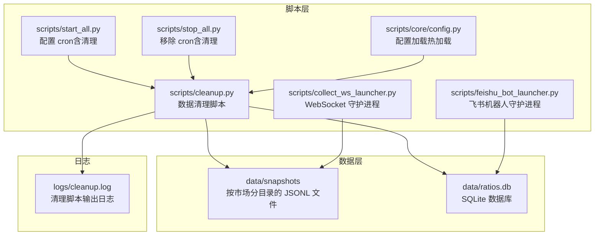
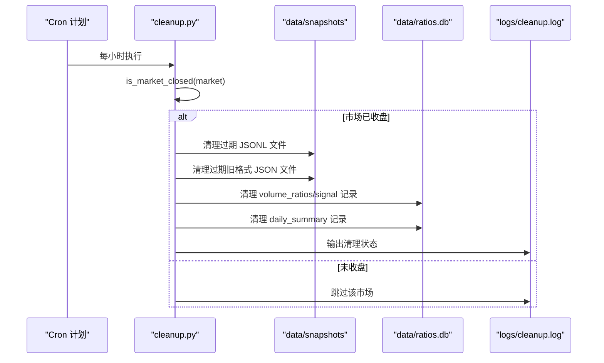
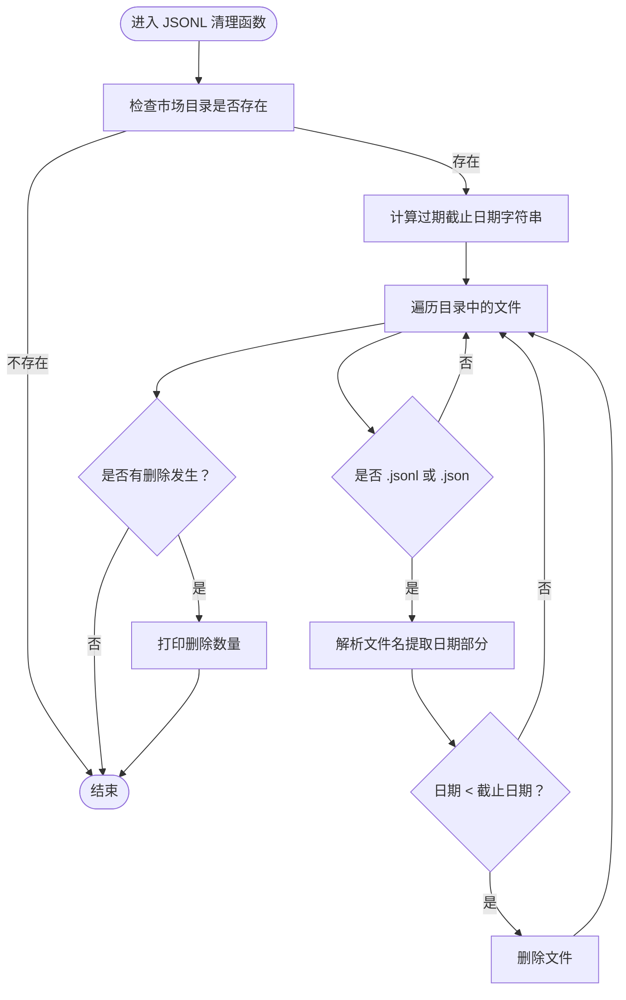
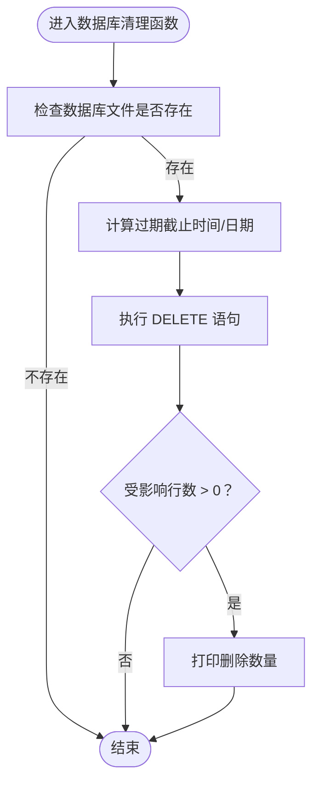
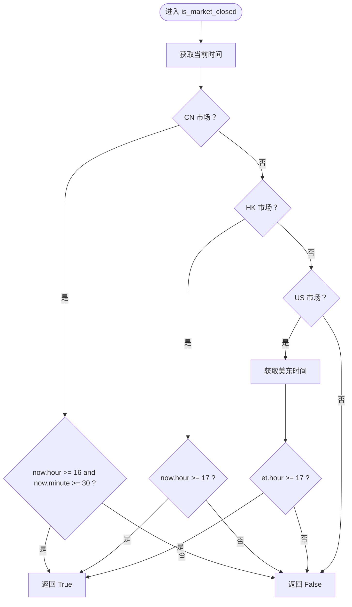
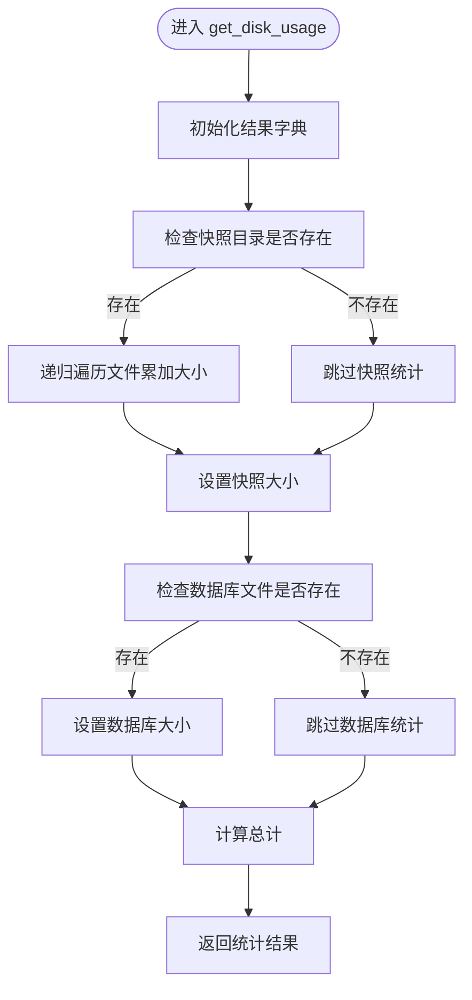
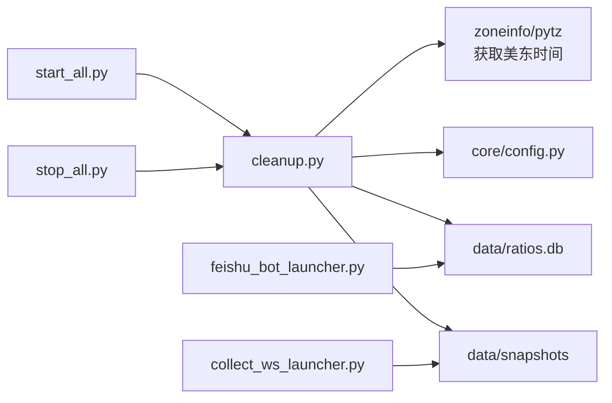

# 数据清理与维护

<cite>
**本文引用的文件**
- [scripts/cleanup.py](file://scripts/cleanup.py)
- [scripts/core/config.py](file://scripts/core/config.py)
- [config.yaml.example](file://config.yaml.example)
- [README.md](file://README.md)
- [scripts/collect_ws_launcher.py](file://scripts/collect_ws_launcher.py)
- [scripts/feishu_bot_launcher.py](file://scripts/feishu_bot_launcher.py)
- [scripts/start_all.py](file://scripts/start_all.py)
- [scripts/stop_all.py](file://scripts/stop_all.py)
- [logs/cleanup.log](file://logs/cleanup.log)
</cite>

## 目录
1. [简介](#简介)
2. [项目结构](#项目结构)
3. [核心组件](#核心组件)
4. [架构总览](#架构总览)
5. [详细组件分析](#详细组件分析)
6. [依赖关系分析](#依赖关系分析)
7. [性能考量](#性能考量)
8. [故障排查指南](#故障排查指南)
9. [结论](#结论)
10. [附录](#附录)

## 简介
本文件面向“数据清理与维护”的目标，围绕 cleanup.py 脚本展开，系统性说明其数据清理策略与实现机制，涵盖：
- JSONL 文件清理：过期数据识别、文件命名规则、删除策略
- 数据库记录清理：按时间戳与日期字段的清理逻辑
- 磁盘使用统计与展示
- 市场收盘时间动态判断与清理时机
- 命令行参数与干跑模式
- 常见问题与预防措施

本说明以仓库现有实现为准，避免臆测未在代码中体现的功能。

## 项目结构
与数据清理直接相关的目录与文件如下：
- data/snapshots：按市场分目录存放 JSONL 快照文件
- data/ratios.db：SQLite 数据库，包含 volume_ratios、signals、daily_summary 等表
- logs/cleanup.log：清理脚本的标准输出日志
- scripts/cleanup.py：清理脚本主体
- scripts/start_all.py：配置 cron 任务，其中包含每小时执行清理的计划
- scripts/stop_all.py：一键关停，用于停止清理任务
- scripts/collect_ws_launcher.py、scripts/feishu_bot_launcher.py：守护进程启动器，配合 cron 运行
- scripts/core/config.py：配置加载（热加载），供其他脚本使用
- config.yaml.example：配置模板，包含 watchlist、params 等

图表来源
- [scripts/cleanup.py:19-21](file://scripts/cleanup.py#L19-L21)
- [scripts/start_all.py:140](file://scripts/start_all.py#L140)
- [scripts/stop_all.py:81](file://scripts/stop_all.py#L81)
- [scripts/collect_ws_launcher.py:17](file://scripts/collect_ws_launcher.py#L17)
- [scripts/feishu_bot_launcher.py:17](file://scripts/feishu_bot_launcher.py#L17)
- [scripts/core/config.py:12-13](file://scripts/core/config.py#L12-L13)

章节来源
- [README.md:106-142](file://README.md#L106-L142)
- [scripts/start_all.py:133-141](file://scripts/start_all.py#L133-L141)

## 核心组件
- 清理脚本主体：负责识别市场收盘时间、清理 JSONL 文件、清理数据库记录、统计磁盘占用、输出状态
- 配置模块：提供热加载配置能力，供其他脚本使用
- 守护进程启动器：通过 cron 每分钟检查并确保相关进程运行
- 启停脚本：统一管理 cron 任务的添加与移除，包含清理任务

章节来源
- [scripts/cleanup.py:157-212](file://scripts/cleanup.py#L157-L212)
- [scripts/core/config.py:20-31](file://scripts/core/config.py#L20-L31)
- [scripts/start_all.py:133-141](file://scripts/start_all.py#L133-L141)
- [scripts/stop_all.py:75-82](file://scripts/stop_all.py#L75-L82)

## 架构总览
清理流程由 cron 触发，脚本内部根据市场收盘时间决定是否清理；清理内容包括 JSONL 快照文件与数据库记录，并输出磁盘使用统计。

图表来源
- [scripts/start_all.py:140](file://scripts/start_all.py#L140)
- [scripts/cleanup.py:182-211](file://scripts/cleanup.py#L182-L211)

## 详细组件分析

### JSONL 文件清理逻辑
- 目录结构：按市场分目录存放 JSONL 文件，文件名包含日期后缀
- 过期识别：基于文件名中的日期后缀与“保留天数”比较
- 删除策略：
  - 新格式：TICKER_YYYYMMDD.jsonl
  - 旧格式：TICKER_YYYYMMDD_HHMMSS_ffffff.json（兼容过渡期）
- 保留策略：默认保留 20 天

图表来源
- [scripts/cleanup.py:63-87](file://scripts/cleanup.py#L63-L87)
- [scripts/cleanup.py:89-113](file://scripts/cleanup.py#L89-L113)

章节来源
- [scripts/cleanup.py:63-113](file://scripts/cleanup.py#L63-L113)

### 数据库记录清理逻辑
- 表与字段：
  - volume_ratios：按 timestamp 字段清理
  - signals：按 timestamp 字段清理
  - daily_summary：按 date 字段清理（非 timestamp）
- 保留策略：默认保留 20 天（volume_ratios、signals），daily_summary 保留 90 天
- 异常处理：捕获数据库操作异常并输出提示

图表来源
- [scripts/cleanup.py:115-129](file://scripts/cleanup.py#L115-L129)
- [scripts/cleanup.py:194-206](file://scripts/cleanup.py#L194-L206)

章节来源
- [scripts/cleanup.py:115-129](file://scripts/cleanup.py#L115-L129)
- [scripts/cleanup.py:194-206](file://scripts/cleanup.py#L194-L206)

### 市场收盘时间判断与清理时机
- A股：15:00 收盘，16:30 后开始清理
- 港股：16:00 收盘，17:00 后开始清理
- 美股：16:00 ET 收盘，17:00 ET 后开始清理（使用美东时间自动处理 EDT/EST）

图表来源
- [scripts/cleanup.py:46-60](file://scripts/cleanup.py#L46-L60)
- [scripts/cleanup.py:34-44](file://scripts/cleanup.py#L34-L44)

章节来源
- [scripts/cleanup.py:46-60](file://scripts/cleanup.py#L46-L60)
- [scripts/cleanup.py:34-44](file://scripts/cleanup.py#L34-L44)

### 磁盘使用统计与展示
- 统计范围：快照目录总大小 + 数据库文件大小
- 展示格式：人类可读的大小单位（B/KB/MB）
- 用途：清理前后对比，便于观察效果

图表来源
- [scripts/cleanup.py:131-144](file://scripts/cleanup.py#L131-L144)
- [scripts/cleanup.py:147-154](file://scripts/cleanup.py#L147-L154)

章节来源
- [scripts/cleanup.py:131-154](file://scripts/cleanup.py#L131-L154)

### 命令行参数与干跑模式
- --status：仅显示磁盘占用状态与各市场 JSONL/JSON 文件数量
- --dry-run：仅显示将要清理的内容，不实际删除
- --force：强制清理所有市场（忽略收盘检测）

章节来源
- [scripts/cleanup.py:157-178](file://scripts/cleanup.py#L157-L178)
- [scripts/cleanup.py:182-185](file://scripts/cleanup.py#L182-L185)

### 日志文件管理与磁盘空间回收
- 清理脚本输出重定向至 logs/cleanup.log
- 通过 cron 配置定期执行，形成周期性清理与日志轮转
- 建议结合系统级日志轮转工具（如 logrotate）进行长期维护

章节来源
- [scripts/start_all.py:140](file://scripts/start_all.py#L140)
- [logs/cleanup.log:1-49](file://logs/cleanup.log#L1-L49)

## 依赖关系分析
- 清理脚本依赖：
  - data/snapshots：JSONL 快照文件所在目录
  - data/ratios.db：SQLite 数据库
  - scripts/core/config.py：配置加载（热加载）
  - 系统时区库（zoneinfo/pytz）：获取美东时间
- 启停脚本：
  - start_all.py：添加清理任务到 crontab
  - stop_all.py：移除清理任务与相关进程

图表来源
- [scripts/cleanup.py:19-25](file://scripts/cleanup.py#L19-L25)
- [scripts/start_all.py:140](file://scripts/start_all.py#L140)
- [scripts/stop_all.py:81](file://scripts/stop_all.py#L81)
- [scripts/collect_ws_launcher.py:17](file://scripts/collect_ws_launcher.py#L17)
- [scripts/feishu_bot_launcher.py:17](file://scripts/feishu_bot_launcher.py#L17)

章节来源
- [scripts/cleanup.py:19-25](file://scripts/cleanup.py#L19-L25)
- [scripts/start_all.py:140](file://scripts/start_all.py#L140)
- [scripts/stop_all.py:81](file://scripts/stop_all.py#L81)

## 性能考量
- 文件系统开销：遍历快照目录进行文件筛选与删除，建议保持目录结构扁平、避免过多嵌套层级
- 数据库清理：DELETE 操作在大表上可能产生锁等待，建议在业务低峰期执行
- 时间复杂度：JSONL 清理为 O(N)，N 为目录中文件数量；数据库清理为 O(M)，M 为过期记录数量
- I/O 优化：批量删除优于逐条删除；清理完成后统计磁盘占用，避免重复扫描

[本节为通用性能讨论，不直接分析具体文件]

## 故障排查指南
- 清理未执行
  - 检查 cron 是否正确添加：确认 start_all.py 的清理任务已写入 crontab
  - 检查日志：查看 logs/cleanup.log 的执行记录
- 市场未清理
  - 确认 is_market_closed 的时间判断是否符合预期（A/H/US 的收盘时间）
  - 使用 --force 参数强制清理验证
- 数据库清理失败
  - 检查数据库文件是否存在与可访问
  - 捕获的异常会输出提示，定位具体表名与错误
- 磁盘占用异常
  - 使用 --status 查看快照与数据库大小分布
  - 结合日志观察清理前后变化

章节来源
- [scripts/start_all.py:133-141](file://scripts/start_all.py#L133-L141)
- [logs/cleanup.log:1-49](file://logs/cleanup.log#L1-L49)
- [scripts/cleanup.py:182-185](file://scripts/cleanup.py#L182-L185)
- [scripts/cleanup.py:127-128](file://scripts/cleanup.py#L127-L128)
- [scripts/cleanup.py:165-178](file://scripts/cleanup.py#L165-L178)

## 结论
cleanup.py 提供了面向 JSONL 文件与 SQLite 数据库的自动化清理机制，结合市场收盘时间动态判断，确保在合适的时间窗口内回收磁盘空间。通过命令行参数支持干跑与强制清理，配合日志输出便于运维观测。建议结合系统级日志轮转与定期巡检，保障长期稳定运行。

[本节为总结性内容，不直接分析具体文件]

## 附录

### 清理策略配置与保留期限
- JSONL 快照：默认保留 20 天
- volume_ratios：默认保留 20 天
- signals：默认保留 20 天
- daily_summary：默认保留 90 天

章节来源
- [scripts/cleanup.py:27-31](file://scripts/cleanup.py#L27-L31)
- [scripts/cleanup.py:194-206](file://scripts/cleanup.py#L194-L206)

### 常见清理问题与预防措施
- 问题：清理未按预期执行
  - 预防：确认 cron 任务已添加且系统时间正确
- 问题：清理后磁盘占用未下降
  - 预防：使用 --status 对比清理前后，检查是否删除了过期文件
- 问题：数据库清理失败
  - 预防：检查数据库文件权限与可用空间，避免在高并发写入期间执行大批量删除

章节来源
- [scripts/start_all.py:133-141](file://scripts/start_all.py#L133-L141)
- [scripts/cleanup.py:165-178](file://scripts/cleanup.py#L165-L178)
- [scripts/cleanup.py:127-128](file://scripts/cleanup.py#L127-L128)