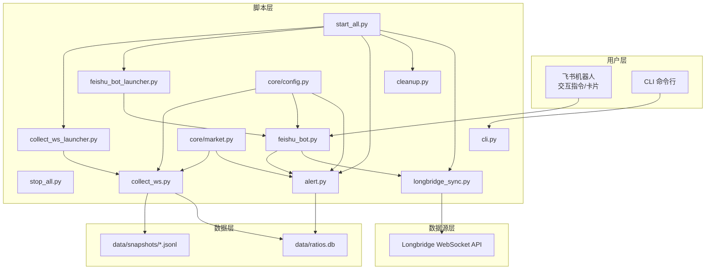
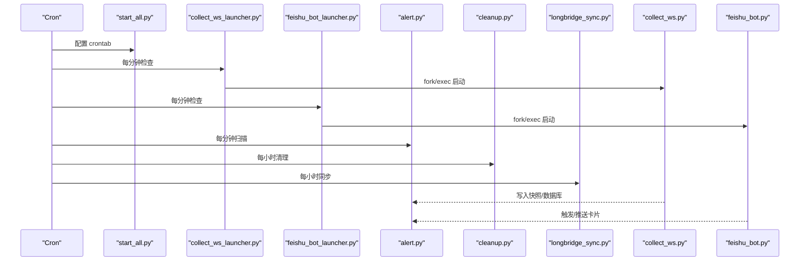
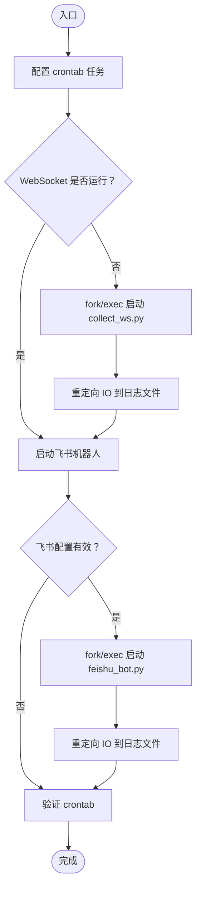
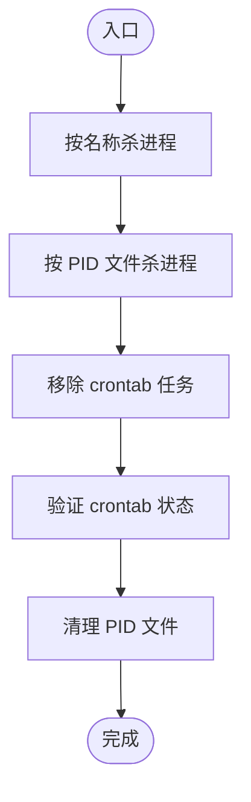
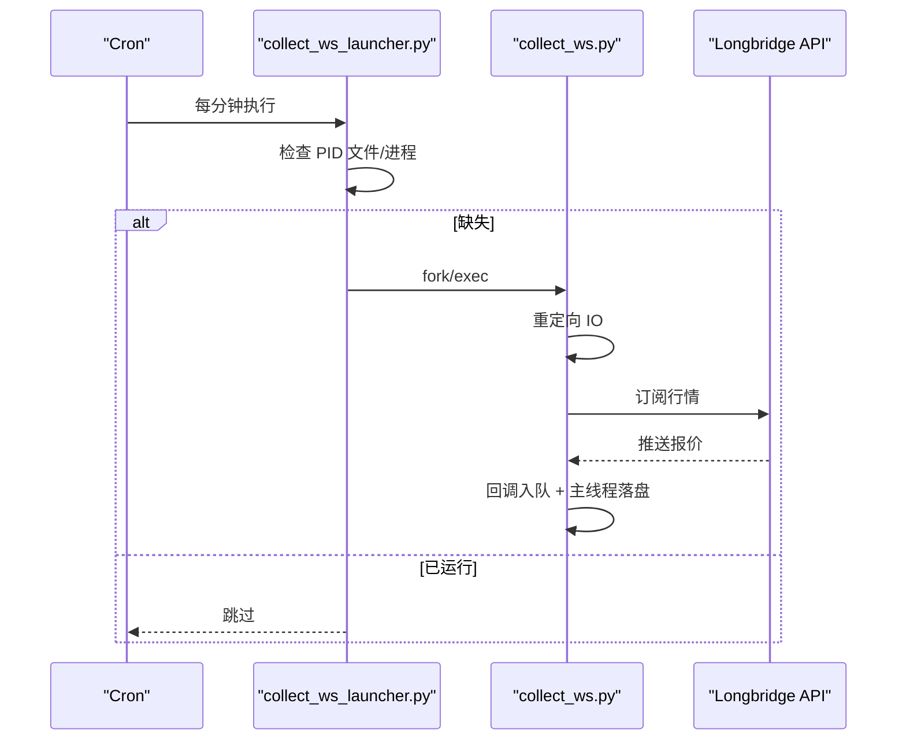
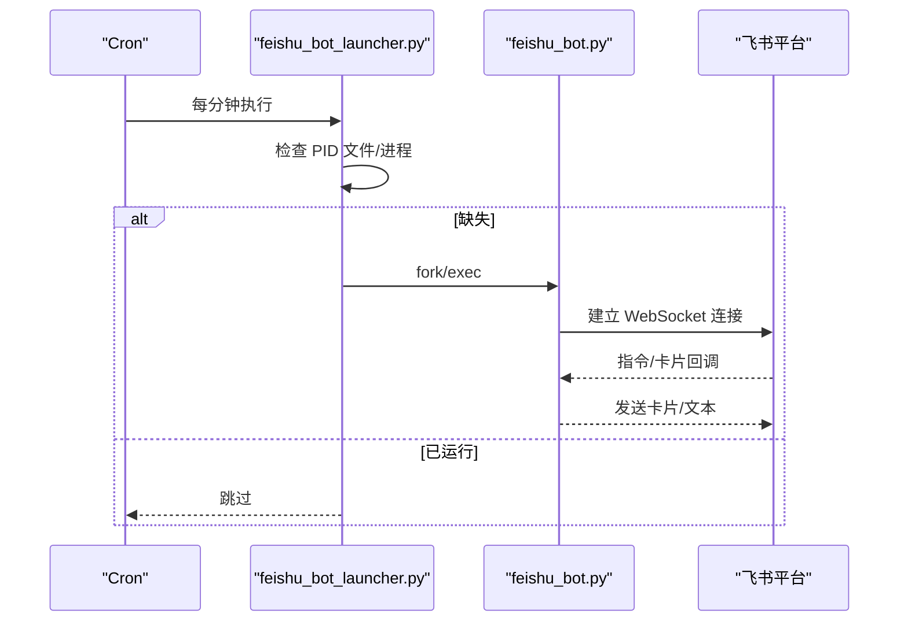
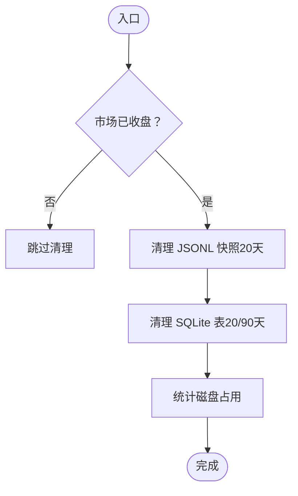
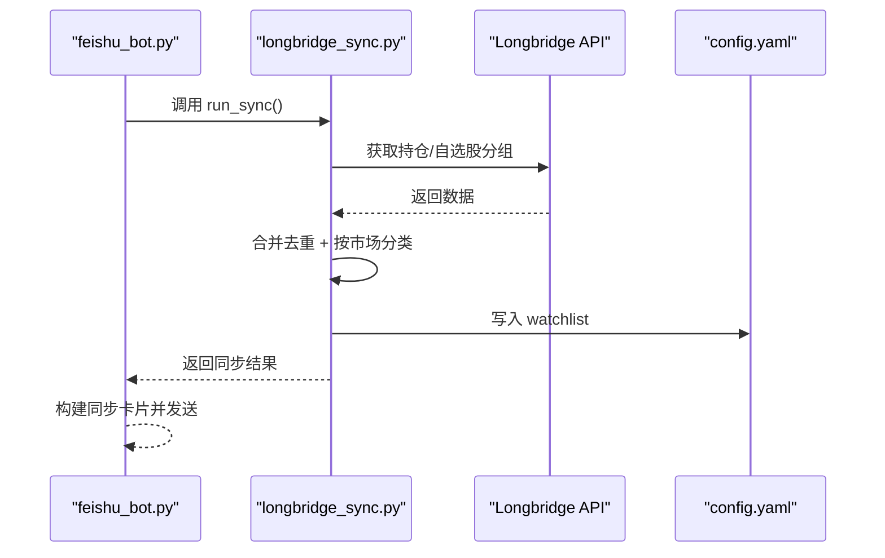
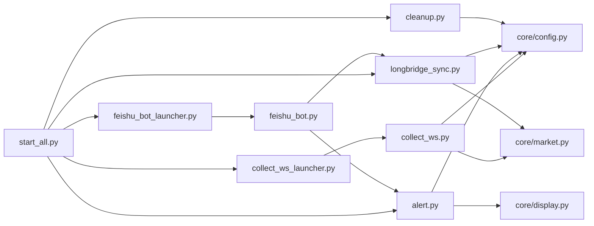

# 系统管理

<cite>
**本文引用的文件**
- [scripts/start_all.py](file://scripts/start_all.py)
- [scripts/stop_all.py](file://scripts/stop_all.py)
- [scripts/collect_ws_launcher.py](file://scripts/collect_ws_launcher.py)
- [scripts/feishu_bot_launcher.py](file://scripts/feishu_bot_launcher.py)
- [scripts/collect_ws.py](file://scripts/collect_ws.py)
- [scripts/feishu_bot.py](file://scripts/feishu_bot.py)
- [scripts/alert.py](file://scripts/alert.py)
- [scripts/longbridge_sync.py](file://scripts/longbridge_sync.py)
- [scripts/cleanup.py](file://scripts/cleanup.py)
- [scripts/core/config.py](file://scripts/core/config.py)
- [scripts/core/market.py](file://scripts/core/market.py)
- [scripts/cli.py](file://scripts/cli.py)
- [config.yaml.example](file://config.yaml.example)
- [README.md](file://README.md)
</cite>

## 目录
1. [简介](#简介)
2. [项目结构](#项目结构)
3. [核心组件](#核心组件)
4. [架构总览](#架构总览)
5. [详细组件分析](#详细组件分析)
6. [依赖关系分析](#依赖关系分析)
7. [性能考量](#性能考量)
8. [故障排查指南](#故障排查指南)
9. [结论](#结论)
10. [附录](#附录)

## 简介
本项目是一个跨市场量比监控系统，提供一键启动/关停、进程守护、数据清理与长桥同步等能力。系统通过 cron 定时任务调度多个守护进程，包括 WebSocket 采集进程、飞书机器人进程以及信号检测与推送；同时具备 JSONL 快照与 SQLite 数据库的清理策略，并支持将长桥持仓与自选股同步至监控配置。

## 项目结构
- scripts/：核心业务脚本与守护进程
  - core/：共享模块（配置、市场、显示）
  - start_all.py / stop_all.py：一键启停入口
  - collect_ws_launcher.py / feishu_bot_launcher.py：守护进程启动器（每分钟检查）
  - collect_ws.py：WebSocket 实时行情采集（daemon 模式）
  - feishu_bot.py：飞书机器人（交互指令、卡片、回调）
  - alert.py：信号检测、去重、LLM 分析与飞书推送
  - longbridge_sync.py：长桥持仓/自选股同步
  - cleanup.py：数据清理（JSONL/DB/信号）
  - cli.py：命令行入口
- data/：数据目录（snapshots/*.jsonl、ratios.db）
- logs/：运行日志（ws_collect.log、feishu_bot.log、alert.log、launcher.log 等）

图表来源
- [scripts/start_all.py:120-164](file://scripts/start_all.py#L120-L164)
- [scripts/collect_ws_launcher.py:29-78](file://scripts/collect_ws_launcher.py#L29-L78)
- [scripts/feishu_bot_launcher.py:28-85](file://scripts/feishu_bot_launcher.py#L28-L85)
- [scripts/collect_ws.py:159-213](file://scripts/collect_ws.py#L159-L213)
- [scripts/alert.py:367-447](file://scripts/alert.py#L367-L447)
- [scripts/feishu_bot.py:712-744](file://scripts/feishu_bot.py#L712-L744)
- [scripts/longbridge_sync.py:209-250](file://scripts/longbridge_sync.py#L209-L250)
- [scripts/cleanup.py:157-211](file://scripts/cleanup.py#L157-L211)
- [scripts/core/config.py:20-31](file://scripts/core/config.py#L20-L31)
- [scripts/core/market.py:61-79](file://scripts/core/market.py#L61-L79)

章节来源
- [README.md:106-142](file://README.md#L106-L142)

## 核心组件
- 一键启停
  - start_all.py：配置 cron 任务、启动 WebSocket 采集进程、启动飞书机器人、验证状态
  - stop_all.py：杀掉进程、移除 cron 任务、清理 PID 文件、验证状态
- 守护进程
  - collect_ws_launcher.py：每分钟检查并确保 WebSocket 采集进程存活
  - feishu_bot_launcher.py：每分钟检查并确保飞书机器人进程存活
- 实时采集
  - collect_ws.py：Longbridge WebSocket 订阅行情，回调入队，主线程落盘，支持 daemon 与重试
- 信号检测与推送
  - alert.py：扫描量比、去重状态机、LLM 分析、飞书卡片推送、定时简报
- 飞书机器人
  - feishu_bot.py：交互指令、状态卡片、扫描卡片、信号卡片、简报卡片、同步卡片、按钮回调处理
- 长桥同步
  - longbridge_sync.py：获取持仓与自选股分组，合并去重，写回 config.yaml，必要时重启 WebSocket
- 数据清理
  - cleanup.py：按市场收盘时间清理 JSONL 快照与 SQLite 记录，统计磁盘占用
- 配置与市场工具
  - core/config.py：热加载配置、解析 ticker、移除标的
  - core/market.py：市场判断、交易时间、遍历标的
- CLI
  - cli.py：查询、扫描、历史、信号、添加/移除/静默、状态检查

章节来源
- [scripts/start_all.py:120-164](file://scripts/start_all.py#L120-L164)
- [scripts/stop_all.py:64-103](file://scripts/stop_all.py#L64-L103)
- [scripts/collect_ws_launcher.py:29-78](file://scripts/collect_ws_launcher.py#L29-L78)
- [scripts/feishu_bot_launcher.py:28-85](file://scripts/feishu_bot_launcher.py#L28-L85)
- [scripts/collect_ws.py:159-213](file://scripts/collect_ws.py#L159-L213)
- [scripts/alert.py:367-447](file://scripts/alert.py#L367-L447)
- [scripts/feishu_bot.py:712-744](file://scripts/feishu_bot.py#L712-L744)
- [scripts/longbridge_sync.py:209-250](file://scripts/longbridge_sync.py#L209-L250)
- [scripts/cleanup.py:157-211](file://scripts/cleanup.py#L157-L211)
- [scripts/core/config.py:20-31](file://scripts/core/config.py#L20-L31)
- [scripts/core/market.py:61-79](file://scripts/core/market.py#L61-L79)
- [scripts/cli.py:372-449](file://scripts/cli.py#L372-L449)

## 架构总览
系统采用“定时任务 + 守护进程 + 交互机器人”的架构：
- cron 定时任务负责启动/检查守护进程与周期性任务
- 守护进程启动器每分钟检查目标进程，若缺失则 fork 并 exec 目标脚本
- WebSocket 采集进程与飞书机器人进程分别独立运行，各自具备 PID 文件与日志
- 信号检测与清理脚本按固定频率运行，保证数据新鲜度与存储空间

图表来源
- [scripts/start_all.py:133-141](file://scripts/start_all.py#L133-L141)
- [scripts/collect_ws_launcher.py:29-78](file://scripts/collect_ws_launcher.py#L29-L78)
- [scripts/feishu_bot_launcher.py:28-85](file://scripts/feishu_bot_launcher.py#L28-L85)
- [scripts/alert.py:367-447](file://scripts/alert.py#L367-L447)
- [scripts/cleanup.py:157-211](file://scripts/cleanup.py#L157-L211)
- [scripts/longbridge_sync.py:209-250](file://scripts/longbridge_sync.py#L209-L250)

## 详细组件分析

### 一键启动流程（start_all.py）
- 配置 cron 任务
  - 每分钟检查 WebSocket 采集进程
  - 每分钟检查飞书机器人进程
  - 每分钟扫描信号并推送
  - 每30分钟发送简报
  - 每小时清理数据
- 启动 WebSocket 采集进程
  - 若 PID 文件存在且进程存活则跳过
  - fork/exec 启动 collect_ws.py，重定向标准 IO，写入 ws_collect.log/err
- 启动飞书机器人进程
  - 读取 config.yaml 检查飞书配置，若缺失则跳过
  - fork/exec 启动 feishu_bot.py，重定向标准 IO，写入 feishu_bot.log/err
- 验证
  - 输出当前 crontab 中与项目相关的任务

图表来源
- [scripts/start_all.py:18-27](file://scripts/start_all.py#L18-L27)
- [scripts/start_all.py:30-66](file://scripts/start_all.py#L30-L66)
- [scripts/start_all.py:69-117](file://scripts/start_all.py#L69-L117)
- [scripts/start_all.py:120-164](file://scripts/start_all.py#L120-L164)

章节来源
- [scripts/start_all.py:18-27](file://scripts/start_all.py#L18-L27)
- [scripts/start_all.py:30-66](file://scripts/start_all.py#L30-L66)
- [scripts/start_all.py:69-117](file://scripts/start_all.py#L69-L117)
- [scripts/start_all.py:120-164](file://scripts/start_all.py#L120-L164)

### 一键关停流程（stop_all.py）
- 杀掉进程
  - 通过 ps 辅助查找并 SIGTERM 杀掉 collect_ws.py、feishu_bot.py
  - 通过 PID 文件读取并尝试 SIGTERM
- 移除 cron 任务
  - 读取 crontab，过滤包含关键字的任务，重新写入
- 验证
  - 输出剩余 cron 任务或提示已清空
  - 清理 logs/ 下的 PID 文件

图表来源
- [scripts/stop_all.py:30-48](file://scripts/stop_all.py#L30-L48)
- [scripts/stop_all.py:51-61](file://scripts/stop_all.py#L51-L61)
- [scripts/stop_all.py:64-103](file://scripts/stop_all.py#L64-L103)

章节来源
- [scripts/stop_all.py:30-48](file://scripts/stop_all.py#L30-L48)
- [scripts/stop_all.py:51-61](file://scripts/stop_all.py#L51-L61)
- [scripts/stop_all.py:64-103](file://scripts/stop_all.py#L64-L103)

### WebSocket 进程管理
- 守护进程启动器（collect_ws_launcher.py）
  - 每分钟检查 PID 文件与进程存活，若缺失则 fork/exec 启动 collect_ws.py
  - 孙子进程写入 PID，重定向 IO，记录启动日志
- WebSocket 采集（collect_ws.py）
  - 从 Longbridge 获取 token，建立 QuoteContext，订阅行情
  - 回调线程仅入队，主线程负责落盘，避免后台模式文件丢失
  - 支持 daemon 模式，重定向 IO，写入 ws_collect.log/err
  - 连接失败具备指数退避重试（最多5次），超过次数后等待 launcher 检测重启

图表来源
- [scripts/collect_ws_launcher.py:29-78](file://scripts/collect_ws_launcher.py#L29-L78)
- [scripts/collect_ws.py:159-213](file://scripts/collect_ws.py#L159-L213)

章节来源
- [scripts/collect_ws_launcher.py:29-78](file://scripts/collect_ws_launcher.py#L29-L78)
- [scripts/collect_ws.py:159-213](file://scripts/collect_ws.py#L159-L213)

### 飞书机器人进程控制
- 守护进程启动器（feishu_bot_launcher.py）
  - 每分钟检查 PID 文件与进程存活，若缺失则 fork/exec 启动 feishu_bot.py
  - 同样进行 IO 重定向与 PID 写入
- 机器人交互（feishu_bot.py）
  - 通过 lark-oapi 建立 WebSocket 长连接
  - 支持 /start、/stop、/status、/scan、/signals、/brief、/watchlist、/allstock、/sync 等指令
  - 卡片构建：状态、扫描、信号、简报、同步结果、关注列表、全部股票分组
  - 按钮回调：删除关注、添加到监控、返回列表等

图表来源
- [scripts/feishu_bot_launcher.py:28-85](file://scripts/feishu_bot_launcher.py#L28-L85)
- [scripts/feishu_bot.py:712-744](file://scripts/feishu_bot.py#L712-L744)

章节来源
- [scripts/feishu_bot_launcher.py:28-85](file://scripts/feishu_bot_launcher.py#L28-L85)
- [scripts/feishu_bot.py:712-744](file://scripts/feishu_bot.py#L712-L744)

### 系统状态监控与健康检查
- 状态卡片构建（feishu_bot.py）
  - 检查 WebSocket 采集进程（PID 文件 + 进程存活）
  - 检查飞书机器人进程（PID 文件 + 进程存活）
  - 检查 cron 任务数量
  - 读取数据库记录数与 LLM 调用次数
  - 统计快照目录大小
- CLI 健康检查（cli.py）
  - 类似的状态检查，输出到终端
  - 获取最近快照时间

章节来源
- [scripts/feishu_bot.py:100-163](file://scripts/feishu_bot.py#L100-L163)
- [scripts/feishu_bot.py:618-671](file://scripts/feishu_bot.py#L618-L671)
- [scripts/cli.py:113-178](file://scripts/cli.py#L113-L178)
- [scripts/cli.py:180-197](file://scripts/cli.py#L180-L197)

### 信号检测与自动重启机制
- 信号检测（alert.py）
  - 每分钟扫描量比，基于规则与去重状态机决定是否推送
  - 对显著信号调用 LLM 分析，保存信号记录
  - 支持定时简报（每30分钟）
- 自动重启
  - WebSocket 连接失败具备指数退避重试，超过次数后等待 launcher 检测重启
  - 守护进程启动器每分钟检查并拉起进程

章节来源
- [scripts/alert.py:367-447](file://scripts/alert.py#L367-L447)
- [scripts/alert.py:450-501](file://scripts/alert.py#L450-L501)
- [scripts/collect_ws.py:162-209](file://scripts/collect_ws.py#L162-L209)
- [scripts/collect_ws_launcher.py:29-78](file://scripts/collect_ws_launcher.py#L29-L78)

### 数据清理策略
- 清理规则
  - JSONL 快照：按市场收盘时间清理，保留 20 天
  - SQLite 表：
    - volume_ratios：按 timestamp 清理，保留 20 天
    - signals：按 timestamp 清理，保留 20 天
    - daily_summary：按 date 清理，保留 90 天
- 动态市场判断
  - A股：16:30 后清理
  - 港股：17:00 后清理
  - 美股：ET 时间 17:00 后清理（考虑 EDT/EST）
- 磁盘占用统计与状态展示

图表来源
- [scripts/cleanup.py:46-60](file://scripts/cleanup.py#L46-L60)
- [scripts/cleanup.py:63-86](file://scripts/cleanup.py#L63-L86)
- [scripts/cleanup.py:115-128](file://scripts/cleanup.py#L115-L128)
- [scripts/cleanup.py:157-211](file://scripts/cleanup.py#L157-L211)

章节来源
- [scripts/cleanup.py:46-60](file://scripts/cleanup.py#L46-L60)
- [scripts/cleanup.py:63-86](file://scripts/cleanup.py#L63-L86)
- [scripts/cleanup.py:115-128](file://scripts/cleanup.py#L115-L128)
- [scripts/cleanup.py:157-211](file://scripts/cleanup.py#L157-L211)

### 长桥同步功能
- 同步流程
  - 获取长桥上下文（OAuthBuilder + Config）
  - 读取持仓与指定自选股分组，合并去重并按市场分类
  - 写回 config.yaml 的 watchlist，必要时重启 WebSocket 采集
- 错误处理
  - 按组获取失败、写入失败、移除/添加失败均有日志输出
- 交互卡片
  - /sync 指令触发同步，返回新增/移除/最终 watchlist

图表来源
- [scripts/feishu_bot.py:281-336](file://scripts/feishu_bot.py#L281-L336)
- [scripts/longbridge_sync.py:209-250](file://scripts/longbridge_sync.py#L209-L250)

章节来源
- [scripts/longbridge_sync.py:18-30](file://scripts/longbridge_sync.py#L18-L30)
- [scripts/longbridge_sync.py:32-47](file://scripts/longbridge_sync.py#L32-L47)
- [scripts/longbridge_sync.py:50-61](file://scripts/longbridge_sync.py#L50-L61)
- [scripts/longbridge_sync.py:70-86](file://scripts/longbridge_sync.py#L70-L86)
- [scripts/longbridge_sync.py:89-121](file://scripts/longbridge_sync.py#L89-L121)
- [scripts/longbridge_sync.py:188-206](file://scripts/longbridge_sync.py#L188-L206)
- [scripts/longbridge_sync.py:209-250](file://scripts/longbridge_sync.py#L209-L250)
- [scripts/feishu_bot.py:281-336](file://scripts/feishu_bot.py#L281-L336)

### 配置与市场工具
- 配置热加载（core/config.py）
  - 基于文件修改时间缓存，修改后自动生效
  - 解析 ticker 格式（含中文名）
  - 移除 watchlist 中的指定标的
- 市场工具（core/market.py）
  - 判断交易时间（考虑周末与节假日）
  - 根据 ticker 后缀判断市场
  - 遍历 watchlist 获取 (ticker, name) 元组

章节来源
- [scripts/core/config.py:20-31](file://scripts/core/config.py#L20-L31)
- [scripts/core/config.py:50-62](file://scripts/core/config.py#L50-L62)
- [scripts/core/market.py:11-47](file://scripts/core/market.py#L11-L47)
- [scripts/core/market.py:50-58](file://scripts/core/market.py#L50-L58)
- [scripts/core/market.py:61-79](file://scripts/core/market.py#L61-L79)

### CLI 与命令行入口
- 查询与扫描
  - --ticker：查询单个标的，可选 --analyze 调用 LLM
  - --scan holdings：扫描持仓按量比排序
  - --market US/HK/CN：扫描放量标的
- 系统管理
  - --status：系统健康状态
  - --history CLF.US：近 7 日量比趋势
  - --signals：今日信号列表
  - --add/--remove/--mute：管理 watchlist 与静默

章节来源
- [scripts/cli.py:41-65](file://scripts/cli.py#L41-L65)
- [scripts/cli.py:68-73](file://scripts/cli.py#L68-L73)
- [scripts/cli.py:76-88](file://scripts/cli.py#L76-L88)
- [scripts/cli.py:113-178](file://scripts/cli.py#L113-L178)
- [scripts/cli.py:200-237](file://scripts/cli.py#L200-L237)
- [scripts/cli.py:240-275](file://scripts/cli.py#L240-L275)
- [scripts/cli.py:278-314](file://scripts/cli.py#L278-L314)
- [scripts/cli.py:317-344](file://scripts/cli.py#L317-L344)
- [scripts/cli.py:347-369](file://scripts/cli.py#L347-L369)

## 依赖关系分析
- 模块耦合
  - start_all.py/stop_all.py 依赖 cron 与进程管理
  - 守护进程启动器依赖 PID 文件与进程存活检测
  - collect_ws.py 依赖 core/config.py 与 core/market.py
  - alert.py 依赖 compute 与 core/display
  - feishu_bot.py 依赖 alert.py 与 longbridge_sync.py
  - longbridge_sync.py 依赖 core/config.py 与 core/market.py
  - cleanup.py 依赖 core/config.py 与 SQLite
- 外部依赖
  - pyyaml、requests、longbridge、lark-oapi、pytz

图表来源
- [scripts/start_all.py:120-164](file://scripts/start_all.py#L120-L164)
- [scripts/collect_ws_launcher.py:29-78](file://scripts/collect_ws_launcher.py#L29-L78)
- [scripts/feishu_bot_launcher.py:28-85](file://scripts/feishu_bot_launcher.py#L28-L85)
- [scripts/collect_ws.py:28-29](file://scripts/collect_ws.py#L28-L29)
- [scripts/alert.py:20-22](file://scripts/alert.py#L20-L22)
- [scripts/feishu_bot.py:31-33](file://scripts/feishu_bot.py#L31-L33)
- [scripts/longbridge_sync.py:13-15](file://scripts/longbridge_sync.py#L13-L15)
- [scripts/cleanup.py:25](file://scripts/cleanup.py#L25)

章节来源
- [scripts/start_all.py:120-164](file://scripts/start_all.py#L120-L164)
- [scripts/collect_ws.py:28-29](file://scripts/collect_ws.py#L28-L29)
- [scripts/alert.py:20-22](file://scripts/alert.py#L20-L22)
- [scripts/feishu_bot.py:31-33](file://scripts/feishu_bot.py#L31-L33)
- [scripts/longbridge_sync.py:13-15](file://scripts/longbridge_sync.py#L13-L15)
- [scripts/cleanup.py:25](file://scripts/cleanup.py#L25)

## 性能考量
- WebSocket 采集
  - 回调线程仅入队，主线程落盘，降低后台模式下的文件丢失风险
  - 指数退避重试，避免频繁重连造成资源浪费
- 信号检测
  - 去重状态机减少重复推送，降低飞书卡片压力
  - 仅对显著信号调用 LLM，控制 API 调用成本
- 数据存储
  - JSONL 每日每标一个文件，大幅减少文件数量
  - 清理策略按天/周/月维度控制存储增长
- 进程管理
  - 守护进程启动器每分钟检查，确保进程存活
  - PID 文件 + 进程存活检测，避免僵尸进程

[本节为通用指导，无需特定文件分析]

## 故障排查指南
- WebSocket 进程不存在
  - 查看 logs/launcher.log 了解启动日志
  - 手动执行 collect_ws_launcher.py 验证
- 飞书机器人不响应
  - 检查 config.yaml 中 feishu.app_id 与 app_secret
  - 查看 logs/feishu_bot.log 与 logs/feishu_bot.err
- LLM API 调用失败
  - 确认 api_key 正确，测试连接
  - 切换模型以排除接口问题
- 数据库异常
  - 检查 data/ratios.db 是否存在与可访问
  - 使用 cleanup.py --status 查看占用情况
- 进程与 cron
  - 使用 ps aux 过滤进程
  - 使用 crontab -l 查看任务

章节来源
- [scripts/collect_ws_launcher.py:44-46](file://scripts/collect_ws_launcher.py#L44-L46)
- [scripts/feishu_bot.py:40-49](file://scripts/feishu_bot.py#L40-L49)
- [scripts/cleanup.py:157-211](file://scripts/cleanup.py#L157-L211)
- [README.md:354-390](file://README.md#L354-L390)

## 结论
本系统通过 cron + 守护进程 + 交互机器人的组合，实现了稳定可靠的跨市场量比监控。一键启停简化了运维，进程健康检查与自动重启保障了连续性，数据清理策略维持了长期可持续运行。长桥同步进一步提升了监控标的的自动化管理体验。

[本节为总结，无需特定文件分析]

## 附录
- 配置示例
  - watchlist：按市场分组的标的清单
  - params：量比窗口、快照间隔、阈值等
  - llm：多模型配置
  - feishu：自建应用配置

章节来源
- [config.yaml.example:13-27](file://config.yaml.example#L13-L27)
- [config.yaml.example:32-36](file://config.yaml.example#L32-L36)
- [config.yaml.example:42-61](file://config.yaml.example#L42-L61)
- [config.yaml.example:67-72](file://config.yaml.example#L67-L72)