# 进程监控与守护

<cite>
**本文引用的文件**
- [collect_ws_launcher.py](file://scripts/collect_ws_launcher.py)
- [feishu_bot_launcher.py](file://scripts/feishu_bot_launcher.py)
- [collect_ws.py](file://scripts/collect_ws.py)
- [feishu_bot.py](file://scripts/feishu_bot.py)
- [start_all.py](file://scripts/start_all.py)
- [stop_all.py](file://scripts/stop_all.py)
- [alert.py](file://scripts/alert.py)
- [cleanup.py](file://scripts/cleanup.py)
- [longbridge_sync.py](file://scripts/longbridge_sync.py)
- [cli.py](file://scripts/cli.py)
- [config.py](file://scripts/core/config.py)
- [config.yaml.example](file://config.yaml.example)
- [README.md](file://README.md)
</cite>

## 目录
1. [简介](#简介)
2. [项目结构](#项目结构)
3. [核心组件](#核心组件)
4. [架构总览](#架构总览)
5. [详细组件分析](#详细组件分析)
6. [依赖关系分析](#依赖关系分析)
7. [性能考量](#性能考量)
8. [故障排查指南](#故障排查指南)
9. [结论](#结论)
10. [附录](#附录)

## 简介
本文件围绕“进程监控与守护”主题，系统性解析两个守护进程脚本：collect_ws_launcher.py（WebSocket 采集守护）与feishu_bot_launcher.py（飞书机器人守护）。内容涵盖：
- 定时器机制：crontab 任务调度、时间间隔配置与任务执行频率控制
- 进程健康检查：PID 文件管理、进程存活检测与异常重启机制
- 日志轮转策略：日志文件管理与磁盘空间控制
- 进程间通信与状态同步：通过 PID 文件、共享配置与数据库实现
- 最佳实践、性能优化与故障诊断方法

## 项目结构
项目采用“脚本层-数据层-数据源层”的分层设计，守护进程位于脚本层，通过 crontab 每分钟检查并确保关键进程存活；数据层以 JSONL 快照与 SQLite 数据库存储；数据源为 Longbridge WebSocket API。

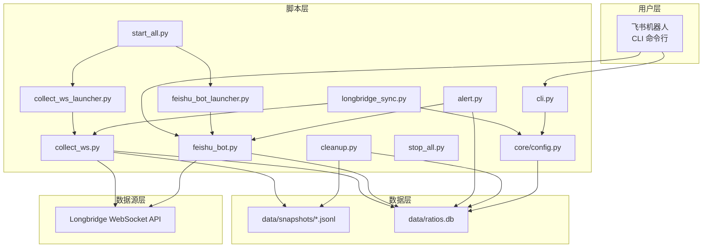

图表来源
- [collect_ws_launcher.py:1-83](file://scripts/collect_ws_launcher.py#L1-L83)
- [feishu_bot_launcher.py:1-90](file://scripts/feishu_bot_launcher.py#L1-L90)
- [collect_ws.py:1-258](file://scripts/collect_ws.py#L1-L258)
- [feishu_bot.py:1-991](file://scripts/feishu_bot.py#L1-L991)
- [alert.py:1-514](file://scripts/alert.py#L1-L514)
- [cleanup.py:1-216](file://scripts/cleanup.py#L1-L216)
- [longbridge_sync.py:1-265](file://scripts/longbridge_sync.py#L1-L265)
- [start_all.py:1-169](file://scripts/start_all.py#L1-L169)
- [stop_all.py:1-108](file://scripts/stop_all.py#L1-L108)
- [cli.py:1-463](file://scripts/cli.py#L1-L463)
- [config.py:1-63](file://scripts/core/config.py#L1-L63)

章节来源
- [README.md:106-142](file://README.md#L106-L142)

## 核心组件
- 守护进程启动器
  - collect_ws_launcher.py：每分钟检查并确保 WebSocket 采集进程存活，若缺失则 fork 并 exec 启动
  - feishu_bot_launcher.py：每分钟检查并确保飞书机器人进程存活，若缺失则 fork 并 exec 启动；同时校验飞书配置
- 进程主体
  - collect_ws.py：WebSocket 实时行情采集，支持 daemon 模式与信号处理
  - feishu_bot.py：飞书机器人（WebSocket 长连接），支持交互指令与富文本卡片
- 管理与监控
  - start_all.py/stop_all.py：一键启停与 cron 注册
  - alert.py：信号检测、去重与飞书推送
  - cleanup.py：按市场收盘时间清理过期数据
  - longbridge_sync.py：长桥持仓/自选股同步至 watchlist，并可重启 WebSocket
  - cli.py：命令行查询与系统状态检查
  - core/config.py：配置热加载与解析

章节来源
- [collect_ws_launcher.py:1-83](file://scripts/collect_ws_launcher.py#L1-L83)
- [feishu_bot_launcher.py:1-90](file://scripts/feishu_bot_launcher.py#L1-L90)
- [collect_ws.py:1-258](file://scripts/collect_ws.py#L1-L258)
- [feishu_bot.py:1-991](file://scripts/feishu_bot.py#L1-L991)
- [start_all.py:1-169](file://scripts/start_all.py#L1-L169)
- [stop_all.py:1-108](file://scripts/stop_all.py#L1-L108)
- [alert.py:1-514](file://scripts/alert.py#L1-L514)
- [cleanup.py:1-216](file://scripts/cleanup.py#L1-L216)
- [longbridge_sync.py:1-265](file://scripts/longbridge_sync.py#L1-L265)
- [cli.py:1-463](file://scripts/cli.py#L1-L463)
- [config.py:1-63](file://scripts/core/config.py#L1-L63)

## 架构总览
守护进程通过 crontab 每分钟触发启动器，启动器读取 PID 文件并检测进程是否存活，若不存活则 fork/exec 启动对应进程，同时重定向标准 IO 到独立日志文件。进程主体通过共享配置与数据库进行状态同步，alert/cleanup 等辅助脚本按计划任务执行。

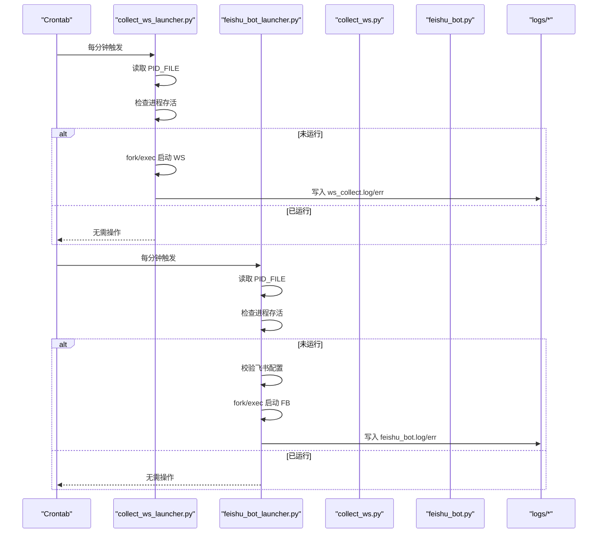

图表来源
- [collect_ws_launcher.py:29-78](file://scripts/collect_ws_launcher.py#L29-L78)
- [feishu_bot_launcher.py:28-85](file://scripts/feishu_bot_launcher.py#L28-L85)
- [collect_ws.py:222-257](file://scripts/collect_ws.py#L222-L257)
- [feishu_bot.py:1-991](file://scripts/feishu_bot.py#L1-L991)

## 详细组件分析

### WebSocket 采集守护（collect_ws_launcher.py）
- PID 文件管理
  - PID_FILE：logs/ws_collect.pid
  - 启动器读取 PID 并通过 os.kill(pid, 0) 检测进程是否存在
- 异常重启机制
  - 若 PID 文件存在但进程不存在，则 fork/exec 启动 collect_ws.py
  - 子进程创建新会话（setsid），再次 fork，孙辈进程写入自身 PID
- 标准 IO 重定向
  - 标准输入重定向到 /dev/null
  - 标准输出/错误重定向到 logs/ws_collect.log 与 logs/ws_collect.err
- 日志记录
  - 启动器写入 logs/launcher.log，便于追踪启动行为

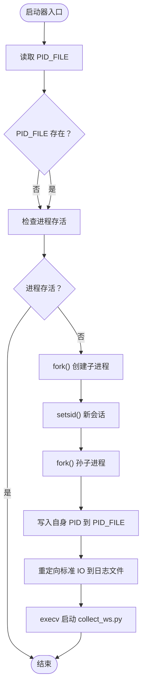

图表来源
- [collect_ws_launcher.py:29-78](file://scripts/collect_ws_launcher.py#L29-L78)

章节来源
- [collect_ws_launcher.py:1-83](file://scripts/collect_ws_launcher.py#L1-L83)

### 飞书机器人守护（feishu_bot_launcher.py）
- 配置校验
  - 启动前读取 config.yaml，检查 feishu.app_id 与 feishu.app_secret 是否存在
- PID 文件与进程存活检测
  - PID_FILE：logs/feishu_bot.pid
  - 通过 os.kill(pid, 0) 检测进程
- 异常重启与日志
  - fork/exec 启动 feishu_bot.py，并重定向标准 IO 到 feishu_bot.log/err
  - 写入 logs/launcher.log 记录启动行为

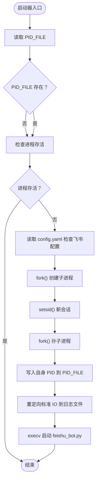

图表来源
- [feishu_bot_launcher.py:28-85](file://scripts/feishu_bot_launcher.py#L28-L85)

章节来源
- [feishu_bot_launcher.py:1-90](file://scripts/feishu_bot_launcher.py#L1-L90)

### WebSocket 采集进程（collect_ws.py）
- 守护模式
  - 支持 --daemon 参数，fork/exec 启动守护进程，重定向标准 IO
- 进程健康检查
  - 通过信号处理（SIGINT/SIGTERM）优雅退出
  - 连接失败具备指数退避重试（最多5次）
- 数据落盘
  - 回调线程仅入队，主线程负责写出，避免后台模式下文件丢失
  - JSONL 文件按市场与日期分目录存放

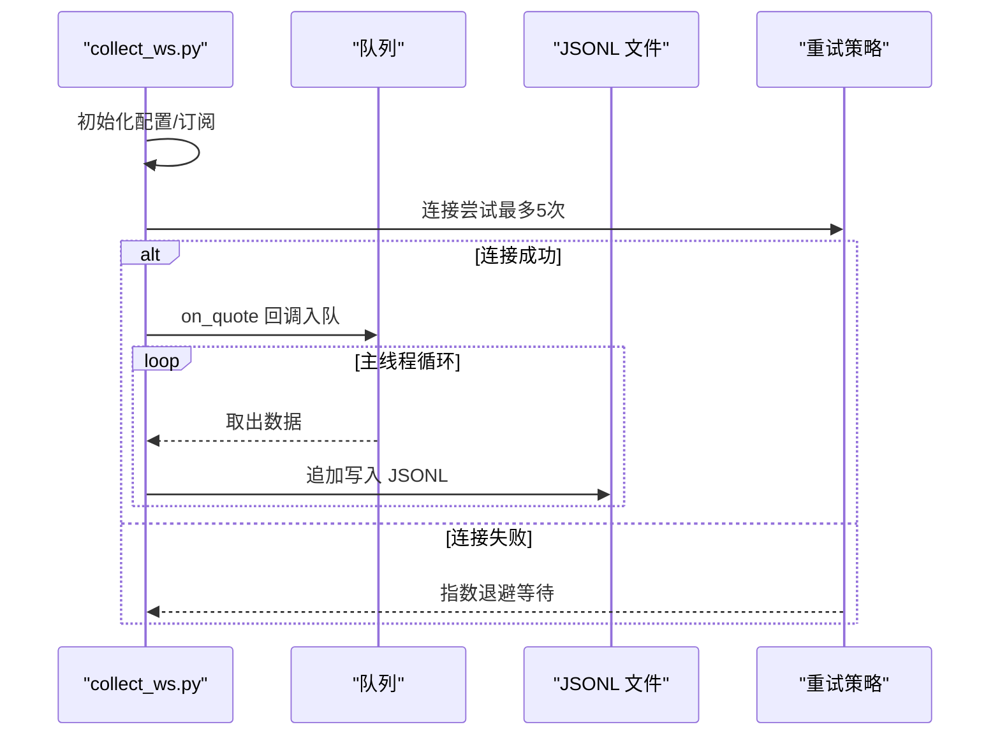

图表来源
- [collect_ws.py:159-214](file://scripts/collect_ws.py#L159-L214)
- [collect_ws.py:117-196](file://scripts/collect_ws.py#L117-L196)

章节来源
- [collect_ws.py:1-258](file://scripts/collect_ws.py#L1-L258)

### 飞书机器人进程（feishu_bot.py）
- 配置与客户端
  - 读取 config.yaml 获取飞书 app_id/app_secret/chat_id
  - 通过 lark_oapi 建立客户端与 WebSocket 长连接
- 状态卡片与交互
  - 构建系统状态、量比扫描、今日信号、简报、关注列表等卡片
  - 支持卡片按钮回调（删除、添加、返回等）
- 组件状态检查
  - 通过 PID 文件与进程存活检测，检查 WebSocket 与机器人运行状态
  - 读取数据库统计记录数量与今日 LLM 调用次数

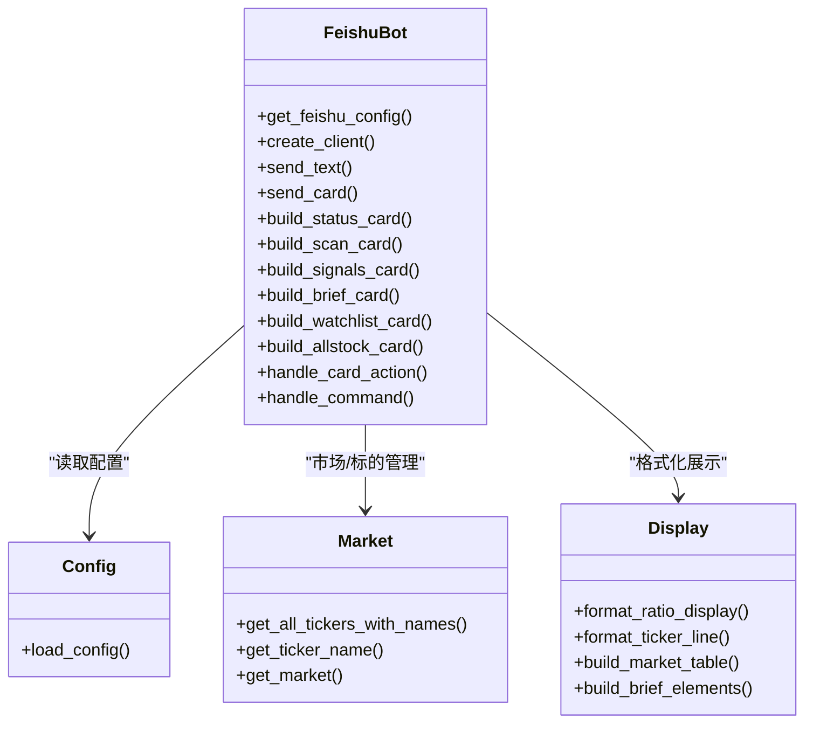

图表来源
- [feishu_bot.py:40-98](file://scripts/feishu_bot.py#L40-L98)
- [feishu_bot.py:100-197](file://scripts/feishu_bot.py#L100-L197)
- [feishu_bot.py:618-710](file://scripts/feishu_bot.py#L618-L710)
- [config.py:20-31](file://scripts/core/config.py#L20-L31)

章节来源
- [feishu_bot.py:1-991](file://scripts/feishu_bot.py#L1-L991)

### 一键启停与定时任务（start_all.py/stop_all.py）
- start_all.py
  - 注册 crontab 任务（工作日/非工作日不同频率）
  - 直接启动 WebSocket 与飞书机器人（非守护模式）
  - 输出当前 cron 配置验证
- stop_all.py
  - 杀掉进程（按名称与 PID 文件）
  - 移除包含关键字的 cron 任务
  - 清理 PID 文件

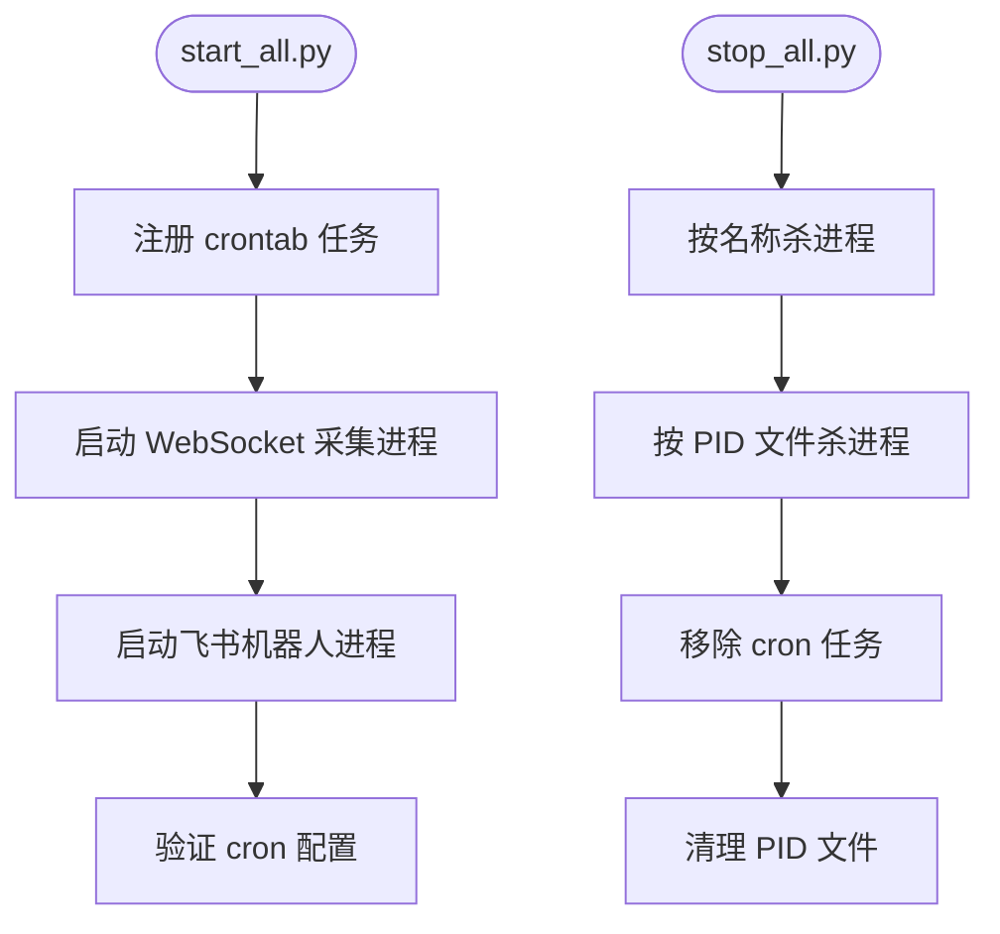

图表来源
- [start_all.py:120-164](file://scripts/start_all.py#L120-L164)
- [stop_all.py:64-103](file://scripts/stop_all.py#L64-L103)

章节来源
- [start_all.py:1-169](file://scripts/start_all.py#L1-L169)
- [stop_all.py:1-108](file://scripts/stop_all.py#L1-L108)

### 信号检测与去重（alert.py）
- 信号规则
  - 放量突破、放量下跌、缩量止跌、尾盘放量等
  - 历史量比与日内滚动量比双路径
- 去重状态机
  - 通过 signal_states 表记录 ticker 的信号状态，按优先级判断是否推送
- LLM 分析
  - 对强信号调用 LLM，生成简短分析并嵌入卡片
- 简报
  - 每30分钟发送一次组合量比简报，含 LLM 总结

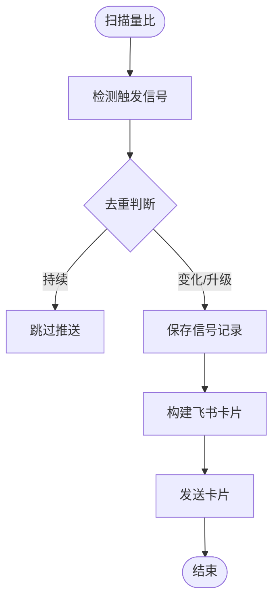

图表来源
- [alert.py:61-142](file://scripts/alert.py#L61-L142)
- [alert.py:339-447](file://scripts/alert.py#L339-L447)

章节来源
- [alert.py:1-514](file://scripts/alert.py#L1-L514)

### 数据清理（cleanup.py）
- 动态收盘检测
  - A股：16:30 后清理；港股：17:00 后清理；美股：ET 17:00 后清理
- 清理策略
  - JSONL 快照：20 天
  - volume_ratios/signals：20 天
  - daily_summary：90 天
- 磁盘占用统计
  - 统计快照与数据库大小，支持 --status 查看

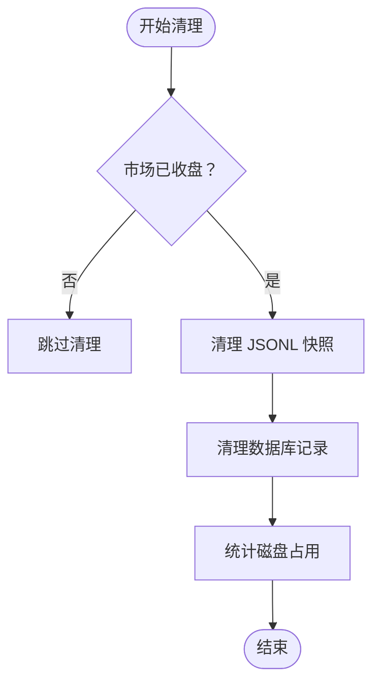

图表来源
- [cleanup.py:46-60](file://scripts/cleanup.py#L46-L60)
- [cleanup.py:115-129](file://scripts/cleanup.py#L115-L129)
- [cleanup.py:157-211](file://scripts/cleanup.py#L157-L211)

章节来源
- [cleanup.py:1-216](file://scripts/cleanup.py#L1-L216)

### 长桥同步（longbridge_sync.py）
- 同步逻辑
  - 获取持仓 + 自选股分组，去重后按市场分类写入 config.yaml
- 交互支持
  - 通过卡片按钮添加/移除标的，同步到长桥分组
- 重启 WebSocket
  - 同步完成后可选择重启 WebSocket 采集进程

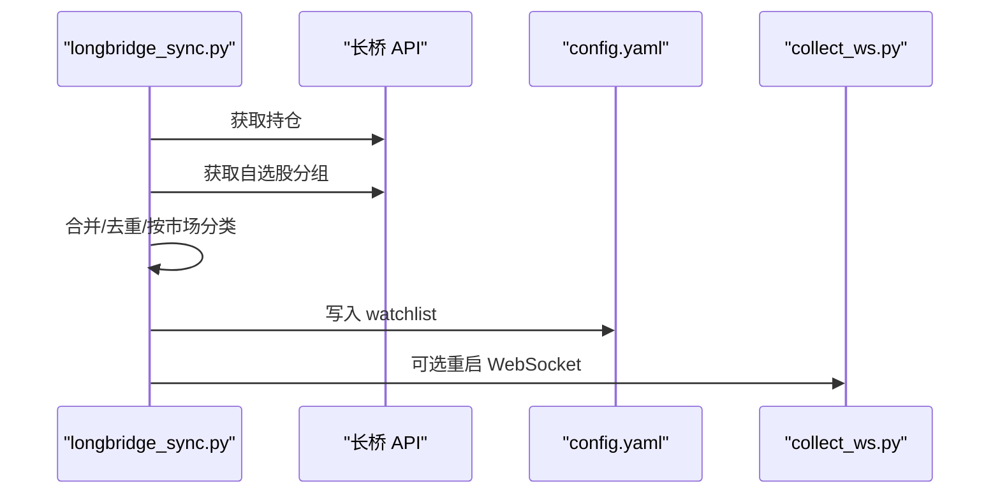

图表来源
- [longbridge_sync.py:209-250](file://scripts/longbridge_sync.py#L209-L250)

章节来源
- [longbridge_sync.py:1-265](file://scripts/longbridge_sync.py#L1-L265)

## 依赖关系分析
- 配置依赖
  - core/config.py 提供统一的配置加载与热加载，所有脚本通过 import 使用
- 进程间通信
  - PID 文件：collect_ws_launcher.py/feishu_bot_launcher.py 通过 PID_FILE 与进程主体通信
  - 共享配置：config.yaml 由多个脚本共享，实现配置热更新
  - 数据库：SQLite 作为信号与量比历史的持久化存储
- 外部依赖
  - Longbridge WebSocket API：行情数据源
  - lark_oapi：飞书机器人消息与卡片
  - crontab：定时任务调度

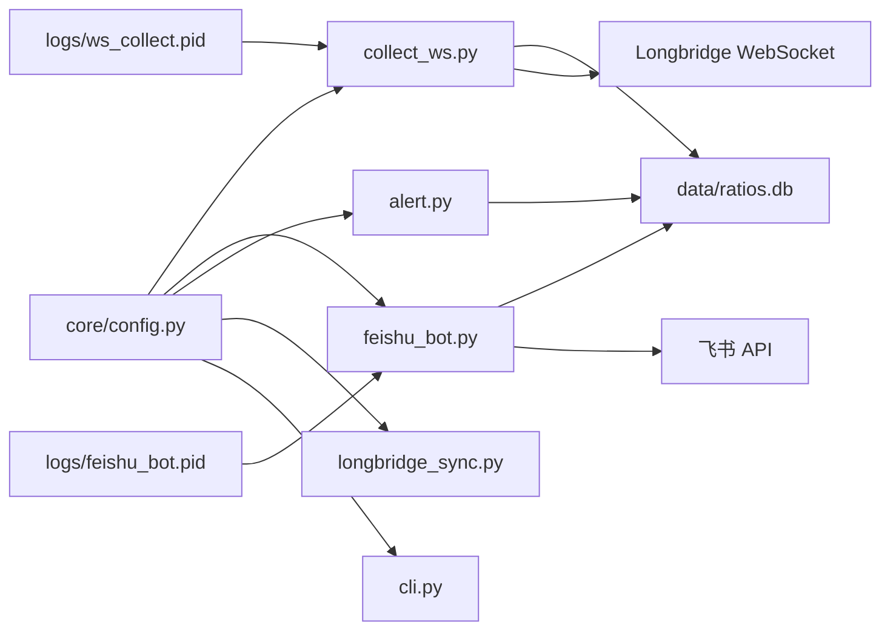

图表来源
- [config.py:20-31](file://scripts/core/config.py#L20-L31)
- [collect_ws.py:22-29](file://scripts/collect_ws.py#L22-L29)
- [feishu_bot.py:21-33](file://scripts/feishu_bot.py#L21-L33)
- [alert.py:20-22](file://scripts/alert.py#L20-L22)
- [longbridge_sync.py:13-15](file://scripts/longbridge_sync.py#L13-L15)

章节来源
- [config.py:1-63](file://scripts/core/config.py#L1-L63)
- [collect_ws.py:1-258](file://scripts/collect_ws.py#L1-L258)
- [feishu_bot.py:1-991](file://scripts/feishu_bot.py#L1-L991)
- [alert.py:1-514](file://scripts/alert.py#L1-L514)
- [longbridge_sync.py:1-265](file://scripts/longbridge_sync.py#L1-L265)

## 性能考量
- 进程启动开销
  - 启动器每分钟检查一次，fork/exec 成本较低；建议在非高峰时段执行 heavy 任务（如清理）
- I/O 与磁盘
  - JSONL 每日每标一个文件，减少文件句柄压力；清理策略按市场收盘时间执行，避免高峰期 I/O
- 网络与 API
  - WebSocket 连接具备指数退避重试，降低频繁重连带来的网络抖动
- 内存与并发
  - 回调线程仅入队，主线程写出，避免后台模式下的文件丢失与锁竞争

[本节为通用性能讨论，不直接分析具体文件]

## 故障排查指南
- WebSocket 进程不存在
  - 检查 logs/launcher.log 与 logs/ws_collect.log/err
  - 手动执行 collect_ws_launcher.py 触发启动
- 飞书机器人不响应
  - 检查 config.yaml 中 feishu.app_id/app_secret/chat_id
  - 查看 logs/feishu_bot.log/err
  - 使用 /status 指令确认组件状态
- LLM API 调用失败
  - 确认 api_key 正确，测试连接
  - 切换模型或调整温度参数
- 数据清理未生效
  - 确认 crontab 中 cleanup.py 任务存在
  - 使用 --status 查看磁盘占用与文件数量
- 配置未生效
  - config.yaml 修改后自动热加载，无需重启进程；可通过 CLI 的 --status 检查

章节来源
- [README.md:354-390](file://README.md#L354-L390)
- [collect_ws_launcher.py:44-46](file://scripts/collect_ws_launcher.py#L44-L46)
- [feishu_bot_launcher.py:52-54](file://scripts/feishu_bot_launcher.py#L52-L54)
- [cli.py:113-177](file://scripts/cli.py#L113-L177)

## 结论
本项目通过“守护进程启动器 + crontab + PID 文件 + 标准 IO 重定向”的轻量机制，实现了 WebSocket 采集与飞书机器人的高可用守护。配合信号去重、数据清理与长桥同步，形成闭环的监控体系。建议在生产环境：
- 使用 start_all.py 一键注册 crontab 任务
- 定期检查 logs 与数据库大小，确保磁盘空间充足
- 在非高峰时段执行 heavy 任务，避免影响实时行情
- 通过 CLI 与飞书机器人进行日常运维与状态检查

[本节为总结性内容，不直接分析具体文件]

## 附录

### 定时器机制与任务频率
- collect_ws_launcher.py：每分钟（工作日）检查并确保 WebSocket 采集进程存活
- feishu_bot_launcher.py：每分钟检查并确保飞书机器人进程存活
- alert.py：每分钟扫描信号，每30分钟发送一次简报
- cleanup.py：每小时清理过期数据（按市场收盘时间）

章节来源
- [start_all.py:133-140](file://scripts/start_all.py#L133-L140)
- [README.md:272-294](file://README.md#L272-L294)

### 进程健康检查与异常重启
- PID 文件管理：启动器读取 PID_FILE 并检测进程存活
- 异常重启：进程不存在时 fork/exec 启动对应进程
- 标准 IO 重定向：避免前台阻塞，日志独立输出

章节来源
- [collect_ws_launcher.py:29-78](file://scripts/collect_ws_launcher.py#L29-L78)
- [feishu_bot_launcher.py:28-85](file://scripts/feishu_bot_launcher.py#L28-L85)

### 日志轮转与磁盘空间控制
- 日志文件：ws_collect.log/err、feishu_bot.log/err、launcher.log、alert.log、brief.log、cleanup.log
- 清理策略：JSONL 与数据库定期清理，避免无限增长
- 磁盘占用统计：cleanup.py 提供 --status 查看

章节来源
- [cleanup.py:131-144](file://scripts/cleanup.py#L131-L144)
- [README.md:376-390](file://README.md#L376-L390)

### 进程间通信与状态同步
- PID 文件：守护进程启动器与进程主体之间的简单通信
- 共享配置：core/config.py 提供热加载，所有脚本共享
- 数据库：SQLite 作为信号与量比历史的统一存储

章节来源
- [config.py:20-31](file://scripts/core/config.py#L20-L31)
- [feishu_bot.py:618-671](file://scripts/feishu_bot.py#L618-L671)