# 长桥同步功能

<cite>
**本文档引用的文件**
- [scripts/longbridge_sync.py](file://scripts/longbridge_sync.py)
- [scripts/core/config.py](file://scripts/core/config.py)
- [scripts/core/market.py](file://scripts/core/market.py)
- [scripts/start_all.py](file://scripts/start_all.py)
- [scripts/stop_all.py](file://scripts/stop_all.py)
- [scripts/collect_ws.py](file://scripts/collect_ws.py)
- [scripts/collect_ws_launcher.py](file://scripts/collect_ws_launcher.py)
- [scripts/feishu_bot_launcher.py](file://scripts/feishu_bot_launcher.py)
- [config.yaml.example](file://config.yaml.example)
- [config.yaml](file://config.yaml)
</cite>

## 目录
1. [简介](#简介)
2. [项目结构](#项目结构)
3. [核心组件](#核心组件)
4. [架构概览](#架构概览)
5. [详细组件分析](#详细组件分析)
6. [依赖关系分析](#依赖关系分析)
7. [性能考虑](#性能考虑)
8. [故障排除指南](#故障排除指南)
9. [结论](#结论)

## 简介

长桥同步功能是跨市场量比监控系统的核心组件，负责将长桥开放平台的持仓数据和自选股信息同步到本地配置文件中。该功能实现了自动化的数据同步机制，包括账户信息获取、持仓数据拉取、自选股同步、状态管理和错误处理等关键功能。

系统采用定时同步策略，通过cron任务每分钟触发同步操作，确保监控标的的实时性和准确性。同时提供了手动触发和实时更新能力，满足不同场景下的使用需求。

## 项目结构

跨市场量比监控系统采用模块化设计，主要包含以下核心目录和文件：

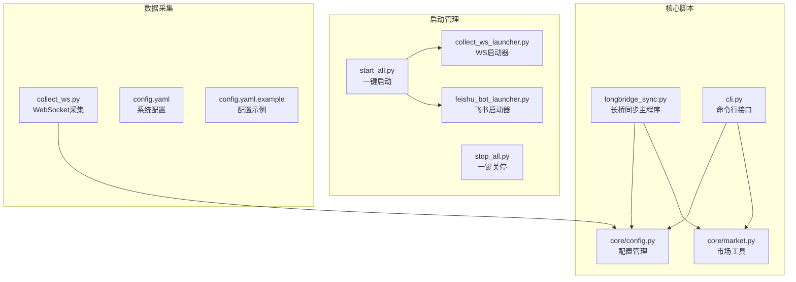

**图表来源**
- [scripts/longbridge_sync.py:1-265](file://scripts/longbridge_sync.py#L1-L265)
- [scripts/core/config.py:1-63](file://scripts/core/config.py#L1-L63)
- [scripts/start_all.py:1-169](file://scripts/start_all.py#L1-L169)

**章节来源**
- [scripts/longbridge_sync.py:1-265](file://scripts/longbridge_sync.py#L1-L265)
- [scripts/core/config.py:1-63](file://scripts/core/config.py#L1-L63)
- [scripts/start_all.py:1-169](file://scripts/start_all.py#L1-L169)

## 核心组件

### 长桥同步主程序

长桥同步功能的核心实现位于 `longbridge_sync.py` 文件中，包含以下关键组件：

- **上下文管理器**：负责建立与长桥开放平台的连接
- **数据获取器**：获取持仓和自选股数据
- **数据处理器**：合并和分类处理数据
- **配置同步器**：将处理后的数据写入配置文件
- **进程控制器**：管理WebSocket采集进程的重启

### 配置管理系统

配置管理模块提供统一的配置访问接口，支持热加载机制：

- **热加载缓存**：基于文件修改时间的智能缓存
- **解析工具**：处理带中文名的股票格式
- **批量操作**：支持批量添加、移除和更新操作

### 市场工具模块

市场工具模块提供跨市场的统一处理能力：

- **市场判断**：根据股票代码后缀判断所属市场
- **交易时间检测**：判断各市场当前的交易状态
- **数据提取**：从配置中提取所有监控标的

**章节来源**
- [scripts/longbridge_sync.py:18-30](file://scripts/longbridge_sync.py#L18-L30)
- [scripts/core/config.py:20-32](file://scripts/core/config.py#L20-L32)
- [scripts/core/market.py:50-58](file://scripts/core/market.py#L50-L58)

## 架构概览

系统采用分层架构设计，实现了高内聚、低耦合的模块化结构：

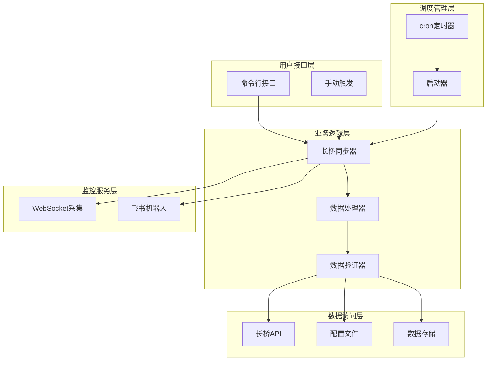

**图表来源**
- [scripts/longbridge_sync.py:209-250](file://scripts/longbridge_sync.py#L209-L250)
- [scripts/start_all.py:133-140](file://scripts/start_all.py#L133-L140)
- [scripts/collect_ws_launcher.py:29-82](file://scripts/collect_ws_launcher.py#L29-L82)

## 详细组件分析

### 长桥API集成机制

#### 认证机制

系统通过OAuth认证机制与长桥开放平台建立安全连接：

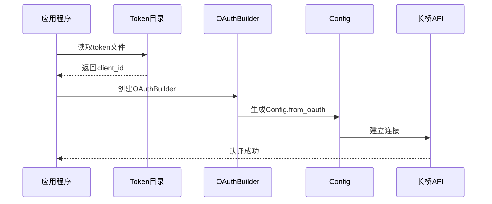

**图表来源**
- [scripts/longbridge_sync.py:18-29](file://scripts/longbridge_sync.py#L18-L29)
- [scripts/collect_ws.py:149-156](file://scripts/collect_ws.py#L149-L156)

#### 请求限流策略

系统实现了多层限流机制来避免API调用过载：

- **连接重试**：最多5次重试，指数退避延迟
- **队列处理**：使用线程安全队列处理异步请求
- **进程隔离**：独立的WebSocket进程避免阻塞

#### 错误处理机制

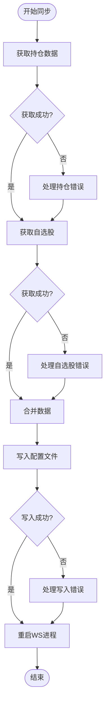

**图表来源**
- [scripts/longbridge_sync.py:32-47](file://scripts/longbridge_sync.py#L32-L47)
- [scripts/longbridge_sync.py:50-61](file://scripts/longbridge_sync.py#L50-L61)
- [scripts/longbridge_sync.py:89-121](file://scripts/longbridge_sync.py#L89-L121)

**章节来源**
- [scripts/longbridge_sync.py:18-29](file://scripts/longbridge_sync.py#L18-L29)
- [scripts/collect_ws.py:159-200](file://scripts/collect_ws.py#L159-L200)

### 持仓同步流程

#### 账户信息获取

系统通过交易上下文获取用户的持仓信息：

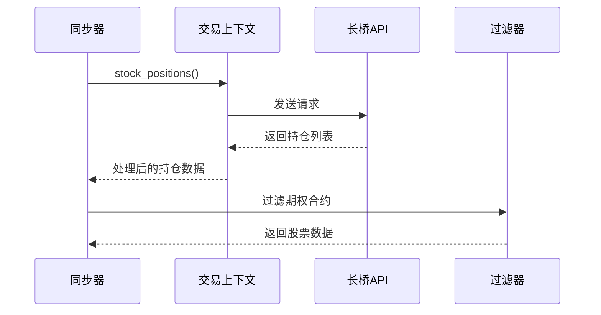

**图表来源**
- [scripts/longbridge_sync.py:32-47](file://scripts/longbridge_sync.py#L32-L47)
- [scripts/longbridge_sync.py:64-67](file://scripts/longbridge_sync.py#L64-L67)

#### 持仓数据拉取

系统支持多种数据源的持仓获取：

- **实时持仓**：通过API获取最新的持仓状态
- **历史数据**：支持历史持仓数据的查询和分析
- **状态监控**：实时监控持仓变化和异常情况

#### 同步状态管理

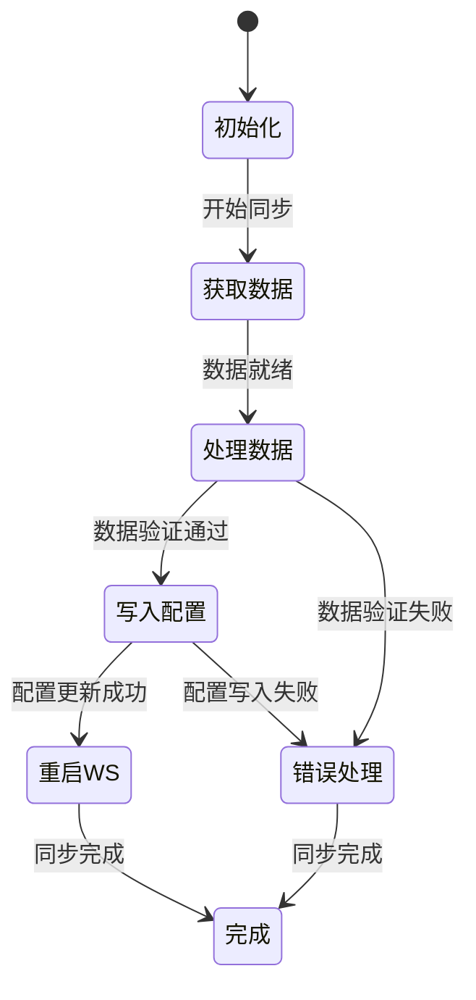

**图表来源**
- [scripts/longbridge_sync.py:209-250](file://scripts/longbridge_sync.py#L209-L250)

**章节来源**
- [scripts/longbridge_sync.py:32-47](file://scripts/longbridge_sync.py#L32-L47)
- [scripts/longbridge_sync.py:209-250](file://scripts/longbridge_sync.py#L209-L250)

### 自选股同步机制

#### 股票池更新

系统支持多个自选股分组的同步：

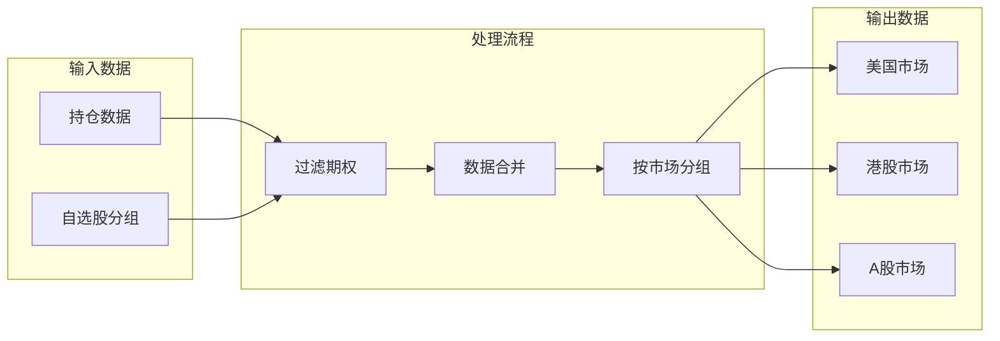

**图表来源**
- [scripts/longbridge_sync.py:70-86](file://scripts/longbridge_sync.py#L70-L86)

#### 增量同步

系统实现了智能的增量同步机制：

- **差异检测**：比较新旧数据集的差异
- **增量更新**：仅更新发生变化的标的
- **冲突处理**：处理重复和冲突的数据

#### 冲突处理策略

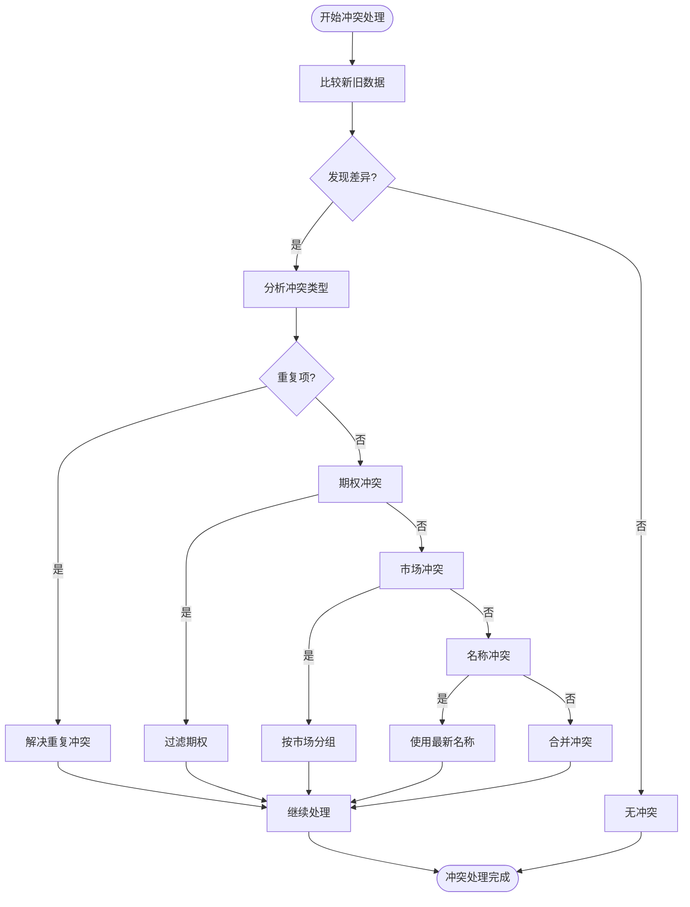

**图表来源**
- [scripts/longbridge_sync.py:70-86](file://scripts/longbridge_sync.py#L70-L86)
- [scripts/longbridge_sync.py:89-121](file://scripts/longbridge_sync.py#L89-L121)

**章节来源**
- [scripts/longbridge_sync.py:50-61](file://scripts/longbridge_sync.py#L50-L61)
- [scripts/longbridge_sync.py:70-86](file://scripts/longbridge_sync.py#L70-L86)
- [scripts/longbridge_sync.py:89-121](file://scripts/longbridge_sync.py#L89-L121)

### 同步频率控制

#### 定时同步

系统通过cron任务实现精确的定时同步：

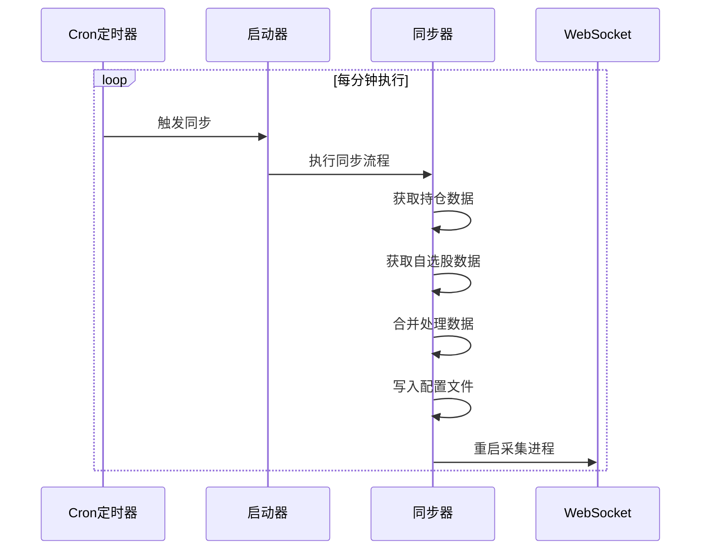

**图表来源**
- [scripts/start_all.py:133-140](file://scripts/start_all.py#L133-L140)
- [scripts/collect_ws_launcher.py:29-82](file://scripts/collect_ws_launcher.py#L29-L82)

#### 手动触发

系统支持手动触发同步操作：

- **命令行触发**：通过命令行参数手动启动同步
- **API接口**：提供编程接口进行同步控制
- **即时响应**：立即执行同步操作

#### 实时更新

系统实现了多层实时更新机制：

- **WebSocket订阅**：实时接收行情数据
- **增量同步**：定期增量更新监控标的
- **状态监控**：实时监控系统运行状态

**章节来源**
- [scripts/start_all.py:133-140](file://scripts/start_all.py#L133-L140)
- [scripts/collect_ws_launcher.py:29-82](file://scripts/collect_ws_launcher.py#L29-L82)

### 数据一致性保证

#### 事务处理

系统实现了多层数据一致性保障：

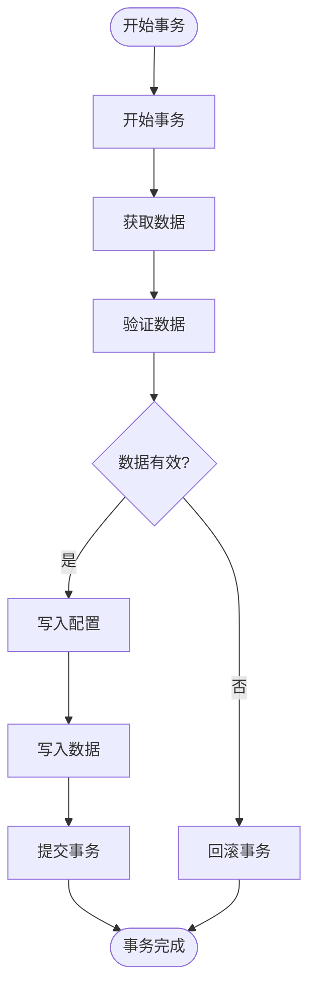

**图表来源**
- [scripts/longbridge_sync.py:89-121](file://scripts/longbridge_sync.py#L89-L121)

#### 回滚机制

系统提供了完善的回滚机制：

- **原子操作**：配置文件写入的原子性保证
- **状态恢复**：异常情况下恢复到之前的状态
- **数据备份**：关键数据的自动备份机制

#### 数据校验

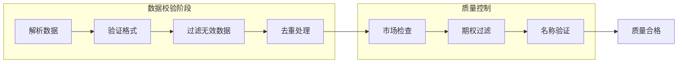

**图表来源**
- [scripts/longbridge_sync.py:64-67](file://scripts/longbridge_sync.py#L64-L67)
- [scripts/longbridge_sync.py:70-86](file://scripts/longbridge_sync.py#L70-L86)

**章节来源**
- [scripts/longbridge_sync.py:89-121](file://scripts/longbridge_sync.py#L89-L121)
- [scripts/longbridge_sync.py:64-67](file://scripts/longbridge_sync.py#L64-L67)

## 依赖关系分析

### 组件耦合度分析

系统采用了松耦合的设计原则，主要依赖关系如下：

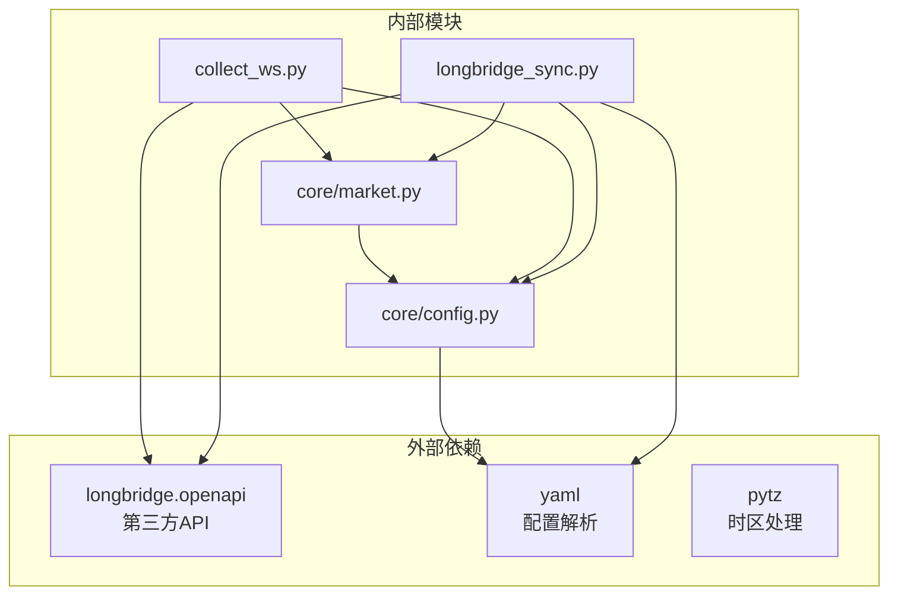

**图表来源**
- [scripts/longbridge_sync.py:13-15](file://scripts/longbridge_sync.py#L13-L15)
- [scripts/core/market.py:35-45](file://scripts/core/market.py#L35-L45)

### 循环依赖检测

系统通过模块化设计避免了循环依赖：

- **单向依赖**：上层模块依赖下层模块，但下层模块不依赖上层模块
- **接口抽象**：通过抽象接口定义模块间的契约
- **依赖注入**：通过参数传递依赖关系

### 外部依赖管理

系统对外部依赖进行了严格的管理：

- **版本锁定**：通过requirements.txt锁定依赖版本
- **安全更新**：定期检查和更新安全补丁
- **兼容性测试**：确保依赖更新不影响系统功能

**章节来源**
- [scripts/longbridge_sync.py:13-15](file://scripts/longbridge_sync.py#L13-L15)
- [scripts/core/market.py:35-45](file://scripts/core/market.py#L35-L45)

## 性能考虑

### 同步性能优化

系统在多个层面实现了性能优化：

#### 并发处理

- **异步API调用**：使用异步模式提高API调用效率
- **多线程处理**：利用多线程处理并发请求
- **队列管理**：通过队列机制平衡系统负载

#### 缓存策略

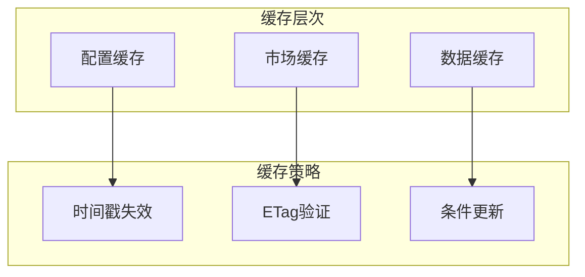

#### 资源管理

- **内存优化**：及时释放不再使用的资源
- **连接池**：复用API连接减少开销
- **文件句柄**：合理管理文件操作

### 监控指标

系统提供了全面的性能监控：

- **响应时间**：API调用的平均响应时间
- **吞吐量**：每秒处理的数据量
- **错误率**：API调用失败的比例
- **资源使用**：CPU、内存、网络的使用情况

## 故障排除指南

### 常见问题诊断

#### 长桥API连接问题

**症状**：同步过程中出现连接超时或认证失败

**诊断步骤**：
1. 检查token目录是否存在且包含有效的token文件
2. 验证网络连接是否正常
3. 确认API配额是否充足
4. 检查防火墙设置

**解决方案**：
- 重新登录长桥账户获取新的token
- 检查代理设置和网络配置
- 调整请求频率避免触发限流
- 查看API文档了解最新的认证要求

#### 数据同步异常

**症状**：同步后配置文件内容不符合预期

**诊断步骤**：
1. 检查日志文件中的错误信息
2. 验证长桥账户的持仓和自选股状态
3. 确认配置文件格式正确
4. 检查磁盘空间和权限

**解决方案**：
- 手动触发同步验证问题
- 检查并修复配置文件格式
- 清理缓存数据后重试
- 联系长桥技术支持

#### WebSocket连接问题

**症状**：行情数据无法正常接收

**诊断步骤**：
1. 检查WebSocket启动器是否正常工作
2. 验证PID文件是否存在且有效
3. 检查网络连接和防火墙设置
4. 确认订阅的标的是否有效

**解决方案**：
- 重启WebSocket采集进程
- 检查并修复网络连接
- 更新订阅的股票列表
- 调整连接参数和重试策略

### 性能优化建议

#### 系统级优化

- **资源分配**：为系统分配足够的CPU和内存资源
- **磁盘I/O**：使用SSD硬盘提高数据读写速度
- **网络优化**：优化网络配置减少延迟
- **进程管理**：合理配置进程数量和优先级

#### 代码级优化

- **算法优化**：优化数据处理和计算算法
- **内存管理**：及时释放内存避免泄漏
- **I/O优化**：批量处理减少系统调用次数
- **并发控制**：合理控制并发度避免资源竞争

#### 配置优化

- **缓存配置**：调整缓存大小和过期时间
- **连接池**：优化连接池参数
- **日志级别**：根据需要调整日志详细程度
- **监控间隔**：合理设置监控和同步间隔

### 安全配置指南

#### API安全

- **Token管理**：定期轮换API token
- **权限控制**：最小权限原则配置API权限
- **传输加密**：确保所有API通信使用HTTPS
- **审计日志**：记录重要的API调用和错误

#### 系统安全

- **文件权限**：配置适当的文件和目录权限
- **网络隔离**：将系统部署在网络隔离环境中
- **访问控制**：限制对敏感数据的访问
- **备份策略**：定期备份重要配置和数据

#### 最佳实践

- **定期检查**：定期检查系统运行状态和错误日志
- **监控告警**：设置合适的监控和告警机制
- **变更管理**：建立规范的配置变更流程
- **灾难恢复**：制定详细的灾难恢复计划

**章节来源**
- [scripts/longbridge_sync.py:45-47](file://scripts/longbridge_sync.py#L45-L47)
- [scripts/collect_ws.py:198-200](file://scripts/collect_ws.py#L198-L200)
- [scripts/start_all.py:18-28](file://scripts/start_all.py#L18-L28)

## 结论

长桥同步功能通过精心设计的架构和实现，为跨市场量比监控系统提供了可靠的数据同步能力。系统具备以下核心优势：

### 技术优势

- **模块化设计**：清晰的模块划分便于维护和扩展
- **高可用性**：多重容错机制确保系统稳定运行
- **高性能**：优化的算法和资源管理提升处理效率
- **安全性**：完善的认证和授权机制保护数据安全

### 功能特性

- **自动化同步**：通过cron定时器实现无人值守的自动同步
- **灵活配置**：支持多种配置选项满足不同需求
- **实时监控**：结合WebSocket实现实时数据更新
- **错误处理**：完善的错误处理和恢复机制

### 应用价值

该同步功能为量化交易和投资决策提供了重要的数据支撑，通过准确、及时的持仓和自选股信息，帮助用户更好地把握市场动态，做出明智的投资决策。

未来可以进一步优化的方向包括：增强机器学习算法用于预测分析、扩展支持更多金融数据源、提供更丰富的可视化界面等。这些改进将进一步提升系统的智能化水平和用户体验。