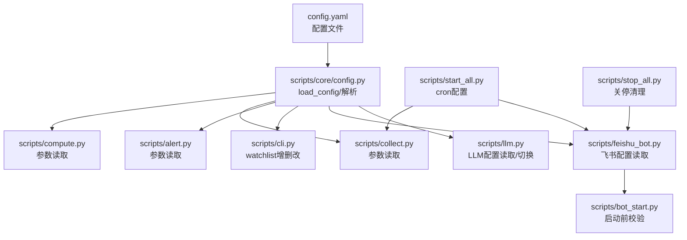
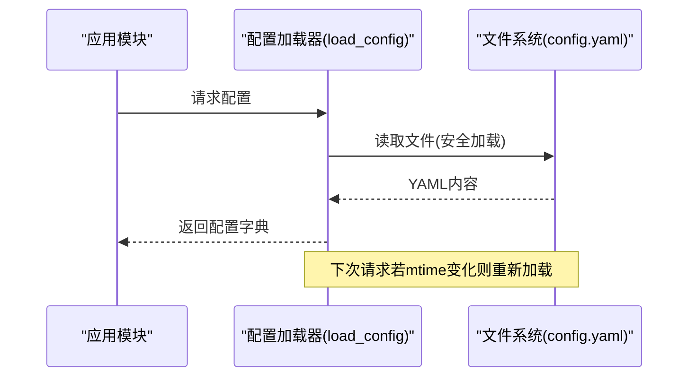
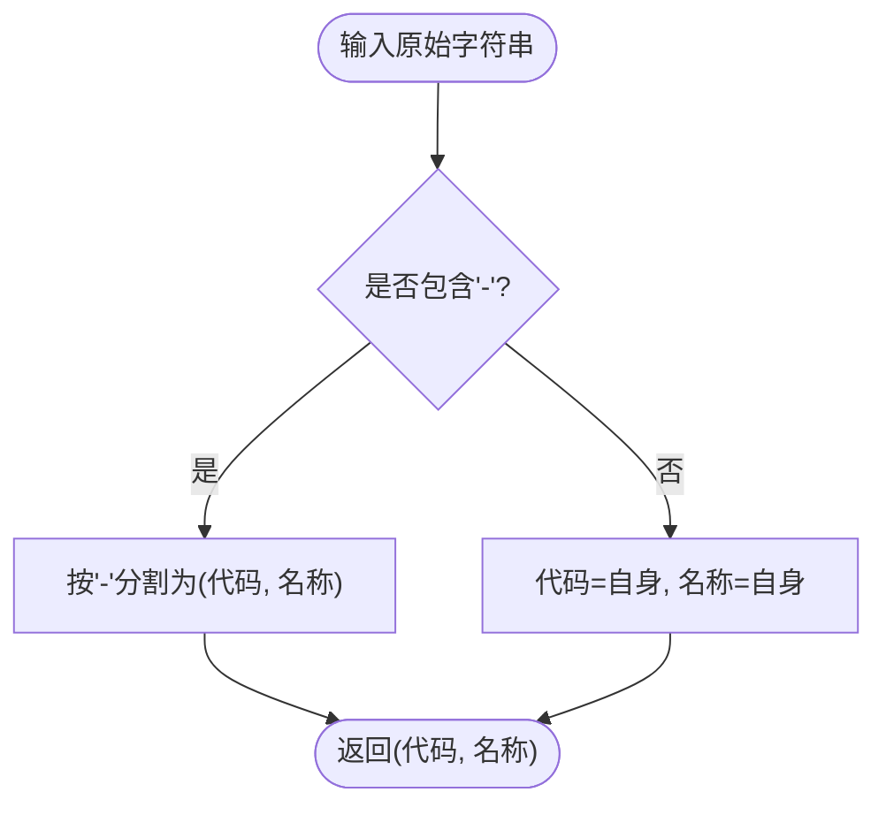
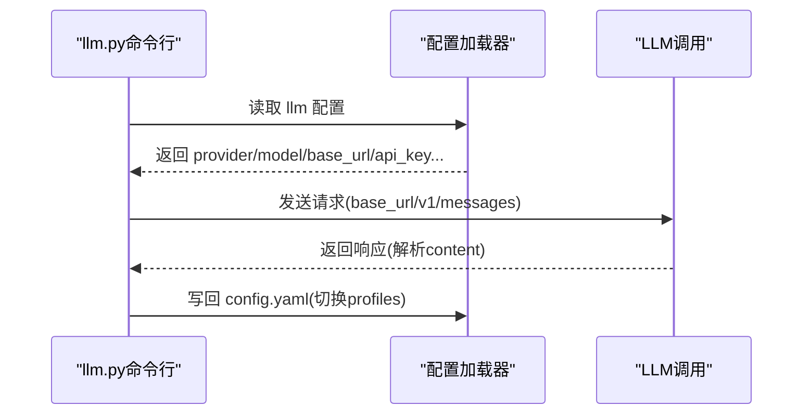
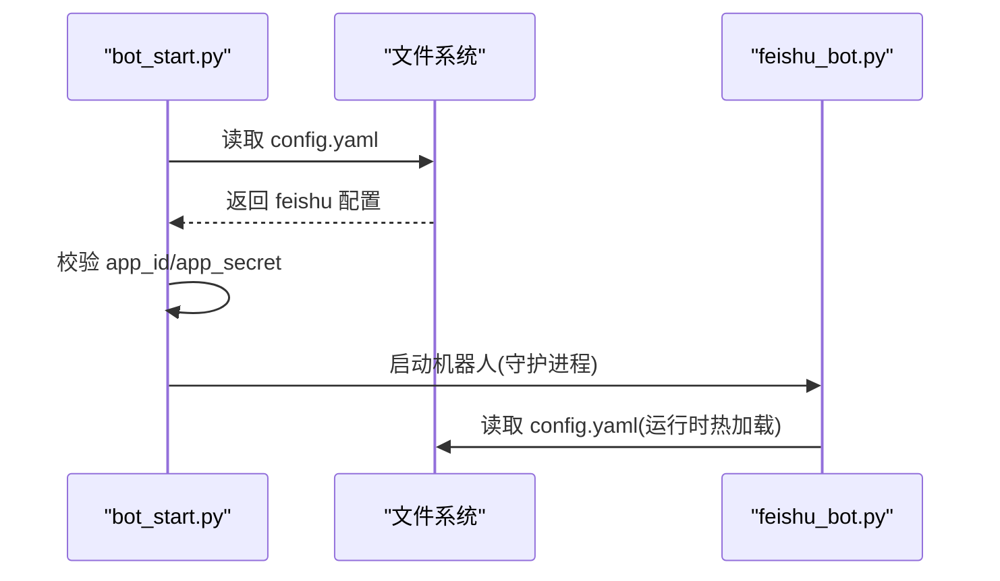
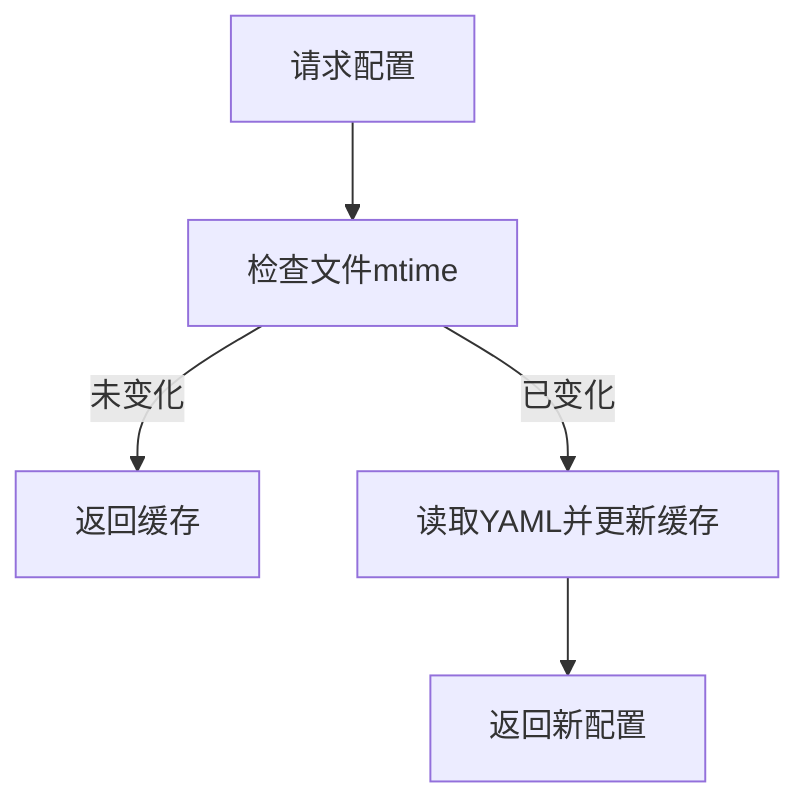
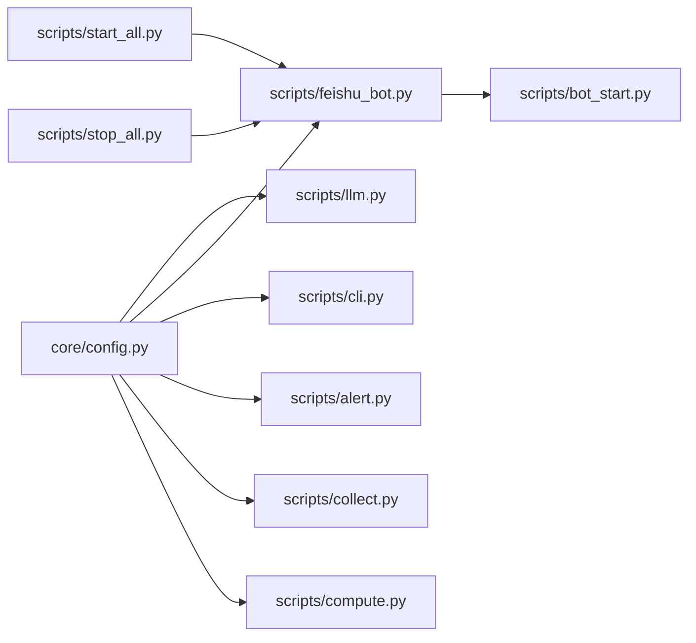

# 配置管理

<cite>
**本文引用的文件**
- [config.yaml.example](file://config.yaml.example)
- [scripts/core/config.py](file://scripts/core/config.py)
- [scripts/llm.py](file://scripts/llm.py)
- [scripts/feishu_bot.py](file://scripts/feishu_bot.py)
- [scripts/cli.py](file://scripts/cli.py)
- [scripts/core/market.py](file://scripts/core/market.py)
- [scripts/core/display.py](file://scripts/core/display.py)
- [scripts/alert.py](file://scripts/alert.py)
- [scripts/collect.py](file://scripts/collect.py)
- [scripts/compute.py](file://scripts/compute.py)
- [scripts/bot_start.py](file://scripts/bot_start.py)
- [scripts/start_all.py](file://scripts/start_all.py)
- [scripts/stop_all.py](file://scripts/stop_all.py)
</cite>

## 目录
1. [简介](#简介)
2. [项目结构](#项目结构)
3. [核心组件](#核心组件)
4. [架构总览](#架构总览)
5. [详细组件分析](#详细组件分析)
6. [依赖关系分析](#依赖关系分析)
7. [性能考量](#性能考量)
8. [故障排查指南](#故障排查指南)
9. [结论](#结论)
10. [附录](#附录)

## 简介
本文件系统性地说明跨市场量比监控系统的配置管理方案，覆盖以下主题：
- config.yaml 的结构与参数说明
- watchlist 的格式规范与多市场标的管理
- LLM 配置项（provider、model、base_url、api_key 等）及多配置文件切换
- 飞书配置（app_id、app_secret）的获取与配置流程
- 配置热加载机制的实现原理与更新策略
- 不同使用场景下的配置示例与最佳实践
- 配置验证方法与常见错误排查

## 项目结构
配置相关的核心位置与职责如下：
- 配置文件：config.yaml（示例见 config.yaml.example）
- 配置加载与解析：scripts/core/config.py
- LLM 调用与配置切换：scripts/llm.py
- 飞书机器人与配置校验：scripts/feishu_bot.py、scripts/bot_start.py
- CLI 与 watchlist 管理：scripts/cli.py
- 市场与 watchlist 工具：scripts/core/market.py
- 显示与格式化：scripts/core/display.py
- 信号检测与参数读取：scripts/alert.py
- 行情采集与参数读取：scripts/collect.py
- 量比计算与参数读取：scripts/compute.py
- 一键启停与 cron 配置：scripts/start_all.py、scripts/stop_all.py

图表来源
- [config.yaml.example](file://config.yaml.example)
- [scripts/core/config.py](file://scripts/core/config.py)
- [scripts/llm.py](file://scripts/llm.py)
- [scripts/feishu_bot.py](file://scripts/feishu_bot.py)
- [scripts/cli.py](file://scripts/cli.py)
- [scripts/alert.py](file://scripts/alert.py)
- [scripts/collect.py](file://scripts/collect.py)
- [scripts/compute.py](file://scripts/compute.py)
- [scripts/bot_start.py](file://scripts/bot_start.py)
- [scripts/start_all.py](file://scripts/start_all.py)
- [scripts/stop_all.py](file://scripts/stop_all.py)

章节来源
- [config.yaml.example](file://config.yaml.example)
- [scripts/core/config.py](file://scripts/core/config.py)
- [scripts/llm.py](file://scripts/llm.py)
- [scripts/feishu_bot.py](file://scripts/feishu_bot.py)
- [scripts/cli.py](file://scripts/cli.py)
- [scripts/alert.py](file://scripts/alert.py)
- [scripts/collect.py](file://scripts/collect.py)
- [scripts/compute.py](file://scripts/compute.py)
- [scripts/bot_start.py](file://scripts/bot_start.py)
- [scripts/start_all.py](file://scripts/start_all.py)
- [scripts/stop_all.py](file://scripts/stop_all.py)

## 核心组件
- 配置加载器：基于文件修改时间的热加载，避免重启进程即可生效
- watchlist 管理：统一的 watchlist 结构与解析规则，支持 US/HK/CN 三市场
- LLM 配置：支持多配置文件档（profiles）与一键切换
- 飞书配置：app_id/app_secret 校验与机器人启动流程
- 参数体系：params 中的窗口、阈值等影响信号检测与展示

章节来源
- [scripts/core/config.py](file://scripts/core/config.py)
- [scripts/core/market.py](file://scripts/core/market.py)
- [scripts/llm.py](file://scripts/llm.py)
- [scripts/feishu_bot.py](file://scripts/feishu_bot.py)
- [scripts/cli.py](file://scripts/cli.py)

## 架构总览
配置在系统中的流转路径如下：
- 应用启动或每次读取时，通过 load_config() 读取 config.yaml
- 若文件被修改，基于 mtime 刷新内存缓存
- 各模块按需读取 params、watchlist、llm、feishu 等节
- LLM 与飞书在启动阶段进行前置校验，确保关键配置存在

图表来源
- [scripts/core/config.py](file://scripts/core/config.py)

## 详细组件分析

### 配置文件结构与参数说明
- watchlist（必填）
  - 结构：按市场分组（us/hk/cn），每项为“代码.市场-中文名”或仅“代码.市场”
  - 解析规则：parse_ticker 支持带中文名的格式，若无“-”则名称等于代码
  - 多市场管理：通过 market_key（us/hk/cn）组织，便于按市场过滤与展示
- params（系统参数）
  - volume_ratio_window：量比计算的时间窗口（分钟）
  - snapshot_interval：快照间隔（秒）
  - alert_threshold：放量阈值
  - shrink_threshold：缩量阈值
- llm（大模型配置）
  - provider：供应商标识（如 xiaomi/minimax）
  - model：模型名称
  - base_url：兼容接口地址
  - api_key：访问密钥
  - max_tokens/temperature：调用参数
  - llm_profiles：多配置档，支持一键切换
- feishu（飞书机器人）
  - app_id/app_secret：自建应用凭证
  - chat_id：机器人会话 chat_id（运行日志中可查看）
  - webhook_url：备用（自建应用模式下可选）

章节来源
- [config.yaml.example](file://config.yaml.example)
- [scripts/core/config.py](file://scripts/core/config.py)
- [scripts/core/market.py](file://scripts/core/market.py)
- [scripts/core/display.py](file://scripts/core/display.py)
- [scripts/llm.py](file://scripts/llm.py)
- [scripts/feishu_bot.py](file://scripts/feishu_bot.py)

### watchlist 格式规范与多市场管理
- 格式规范
  - 推荐格式：TICKER.MARKET-中文名
  - 兼容格式：仅 TICKER.MARKET
  - 解析逻辑：parse_ticker 支持“代码.市场-名称”或“代码.市场”，否则返回自身
- 多市场管理
  - 市场识别：get_market 根据后缀 .US/.HK/.SH/.SZ 判断
  - watchlist 结构：us/hk/cn 三层，便于按市场聚合与展示
  - 名称映射：get_ticker_name 从 watchlist 中查找中文名
- 增删改操作
  - CLI 命令：--add/--remove 支持直接写入 config.yaml
  - 删除逻辑：remove_ticker_from_config 会遍历三个市场并移除匹配条目

图表来源
- [scripts/core/config.py](file://scripts/core/config.py)

章节来源
- [scripts/core/config.py](file://scripts/core/config.py)
- [scripts/core/market.py](file://scripts/core/market.py)
- [scripts/cli.py](file://scripts/cli.py)
- [scripts/feishu_bot.py](file://scripts/feishu_bot.py)

### LLM 配置与多配置档切换
- 配置来源
  - 顶层 llm：当前激活的配置
  - 兼容旧配置：minimax 节（向后兼容）
  - profiles：llm_profiles 中的多个配置档
- 关键字段
  - provider/model/base_url/api_key：调用所需
  - max_tokens/temperature：调用参数
- 切换流程
  - switch_llm 将目标配置档复制到顶层 llm，并写回 config.yaml
  - mask_key 用于脱敏显示 API Key
- 调用流程
  - call_llm 读取当前配置，构造 Anthropic 兼容请求，记录调用日志

图表来源
- [scripts/llm.py](file://scripts/llm.py)
- [scripts/core/config.py](file://scripts/core/config.py)

章节来源
- [scripts/llm.py](file://scripts/llm.py)
- [scripts/core/config.py](file://scripts/core/config.py)

### 飞书配置与启动流程
- 配置项
  - app_id/app_secret：必须配置
  - chat_id：运行日志中可查看
  - webhook_url：备用（自建应用模式下可选）
- 启动校验
  - bot_start.py 在启动前读取 config.yaml 校验 app_id/app_secret
  - start_all.py 在添加 cron 时也会检查飞书配置以决定是否启动机器人
- 机器人行为
  - 读取 config.yaml 的 llm 与 feishu 配置
  - 通过卡片发送系统状态、扫描结果、信号列表等

图表来源
- [scripts/bot_start.py](file://scripts/bot_start.py)
- [scripts/feishu_bot.py](file://scripts/feishu_bot.py)
- [scripts/core/config.py](file://scripts/core/config.py)

章节来源
- [scripts/bot_start.py](file://scripts/bot_start.py)
- [scripts/feishu_bot.py](file://scripts/feishu_bot.py)
- [scripts/core/config.py](file://scripts/core/config.py)

### 配置热加载机制
- 实现原理
  - load_config() 基于文件 stat().st_mtime 缓存
  - 仅当 mtime 变化时才重新读取 YAML 并更新缓存
- 更新策略
  - 写入 config.yaml 后立即生效，无需重启进程
  - CLI 的 add/remove/mute 命令直接写回文件
  - LLM 的 switch_llm 也直接写回文件
- 注意事项
  - 避免在高并发频繁写入时产生竞争
  - 建议批量修改后再保存

图表来源
- [scripts/core/config.py](file://scripts/core/config.py)

章节来源
- [scripts/core/config.py](file://scripts/core/config.py)
- [scripts/cli.py](file://scripts/cli.py)
- [scripts/llm.py](file://scripts/llm.py)

### 参数体系与信号检测
- params
  - volume_ratio_window：量比计算窗口（分钟）
  - snapshot_interval：快照间隔（秒）
  - alert_threshold：放量阈值
  - shrink_threshold：缩量阈值
- 信号检测
  - alert.py 读取 params 并结合市场交易时间与静默名单（mute）生成告警
- 量比计算
  - compute.py 读取 params 中的窗口参数，计算当日量比与历史均值

章节来源
- [config.yaml.example](file://config.yaml.example)
- [scripts/alert.py](file://scripts/alert.py)
- [scripts/compute.py](file://scripts/compute.py)
- [scripts/collect.py](file://scripts/collect.py)

### 使用场景与最佳实践
- 多市场监控
  - 在 watchlist 中按 us/hk/cn 分组添加标的，确保 TICKER.MARKET 后缀正确
  - 使用 CLI 的 --scan/--market 命令快速筛选放量标的
- LLM 分析
  - 在 llm_profiles 中维护多供应商配置，通过 --switch 快速切换
  - 使用 --test 验证当前配置可用性
- 飞书集成
  - 配置 app_id/app_secret 后启动机器人；chat_id 从机器人日志中获取
  - 通过卡片查看系统状态、扫描结果、信号列表
- 参数优化
  - 根据市场调整 alert_threshold 与 shrink_threshold
  - 合理设置 volume_ratio_window 以平衡灵敏度与稳定性

章节来源
- [scripts/cli.py](file://scripts/cli.py)
- [scripts/llm.py](file://scripts/llm.py)
- [scripts/feishu_bot.py](file://scripts/feishu_bot.py)
- [config.yaml.example](file://config.yaml.example)

## 依赖关系分析
- 配置读取依赖
  - 所有模块通过 core.config.load_config() 统一读取配置
  - market.py 依赖 parse_ticker 解析 watchlist
  - display.py 依赖格式化函数构建飞书表格
- 启停与 cron
  - start_all.py 添加 cron 任务并启动采集与机器人
  - stop_all.py 杀掉进程并移除 cron
- LLM 与飞书
  - llm.py 与 feishu_bot.py 均依赖 config.yaml 的对应节
  - bot_start.py 在启动前进行飞书配置校验

图表来源
- [scripts/core/config.py](file://scripts/core/config.py)
- [scripts/llm.py](file://scripts/llm.py)
- [scripts/feishu_bot.py](file://scripts/feishu_bot.py)
- [scripts/cli.py](file://scripts/cli.py)
- [scripts/alert.py](file://scripts/alert.py)
- [scripts/collect.py](file://scripts/collect.py)
- [scripts/compute.py](file://scripts/compute.py)
- [scripts/bot_start.py](file://scripts/bot_start.py)
- [scripts/start_all.py](file://scripts/start_all.py)
- [scripts/stop_all.py](file://scripts/stop_all.py)

章节来源
- [scripts/core/config.py](file://scripts/core/config.py)
- [scripts/llm.py](file://scripts/llm.py)
- [scripts/feishu_bot.py](file://scripts/feishu_bot.py)
- [scripts/cli.py](file://scripts/cli.py)
- [scripts/alert.py](file://scripts/alert.py)
- [scripts/collect.py](file://scripts/collect.py)
- [scripts/compute.py](file://scripts/compute.py)
- [scripts/bot_start.py](file://scripts/bot_start.py)
- [scripts/start_all.py](file://scripts/start_all.py)
- [scripts/stop_all.py](file://scripts/stop_all.py)

## 性能考量
- 配置热加载
  - 基于 mtime 的轻量级缓存，避免重复解析 YAML
  - 建议减少频繁写入，合并修改批次
- LLM 调用
  - 控制 max_tokens 与 temperature，降低延迟与成本
  - 使用 profiles 预设常用配置，减少切换开销
- 飞书卡片
  - 使用原生表格与分页，提升渲染性能与可读性
- 采集与计算
  - 合理设置 snapshot_interval 与 volume_ratio_window，平衡实时性与资源占用

## 故障排查指南
- 飞书配置缺失
  - 现象：启动时报错或机器人无法运行
  - 排查：确认 config.yaml 中 feishu.app_id 与 app_secret 已填写
  - 参考：bot_start.py 与 start_all.py 的启动校验
- LLM 配置无效
  - 现象：调用失败或返回 None
  - 排查：使用 llm.py --test 检查当前配置；确认 api_key、base_url、model
  - 切换：使用 llm.py --switch 切换到目标配置档
- watchlist 未生效
  - 现象：CLI 无法识别新增标的或删除无效
  - 排查：确认格式为“代码.市场-中文名”或“代码.市场”；使用 --add/--remove 命令
  - 参考：parse_ticker 与 remove_ticker_from_config 的实现
- 参数不生效
  - 现象：量比阈值或窗口未按预期工作
  - 排查：检查 config.yaml 中 params 的 alert_threshold、shrink_threshold、volume_ratio_window
  - 参考：alert.py 与 compute.py 的参数读取逻辑
- 配置未热更新
  - 现象：修改 config.yaml 后未立即生效
  - 排查：确认文件被正确写入且 mtime 发生变化；避免并发写入

章节来源
- [scripts/bot_start.py](file://scripts/bot_start.py)
- [scripts/start_all.py](file://scripts/start_all.py)
- [scripts/llm.py](file://scripts/llm.py)
- [scripts/cli.py](file://scripts/cli.py)
- [scripts/core/config.py](file://scripts/core/config.py)
- [scripts/alert.py](file://scripts/alert.py)
- [scripts/compute.py](file://scripts/compute.py)

## 结论
本配置管理体系通过统一的 YAML 配置文件与热加载机制，实现了 watchlist、系统参数、LLM 与飞书配置的集中管理与动态更新。配合 CLI 与启动脚本，可在不重启进程的前提下完成配置变更与服务启停，满足跨市场量比监控的日常运维需求。

## 附录
- 配置示例与字段说明参见 config.yaml.example
- LLM 多配置档与一键切换参见 scripts/llm.py
- watchlist 增删改与解析参见 scripts/cli.py 与 scripts/core/config.py
- 飞书配置校验与启动参见 scripts/feishu_bot.py 与 scripts/bot_start.py
- 参数读取与信号检测参见 scripts/alert.py 与 scripts/compute.py