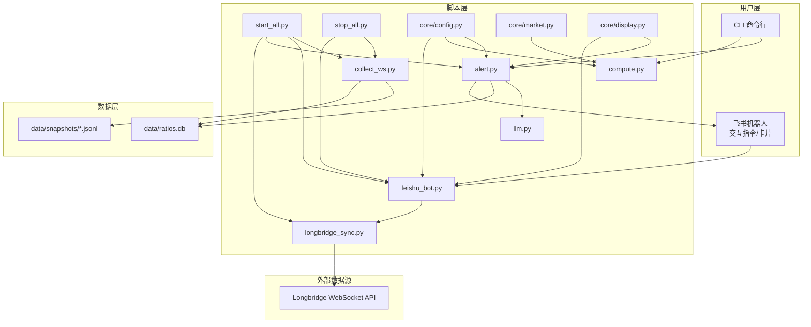
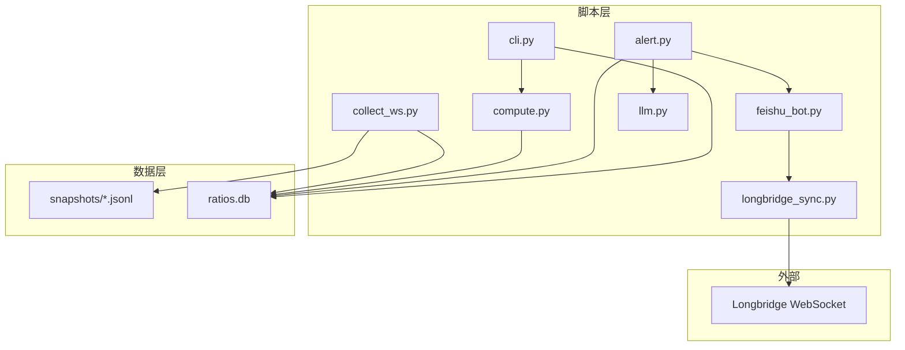
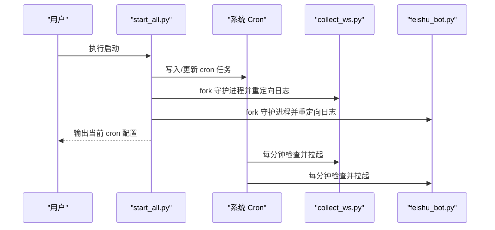
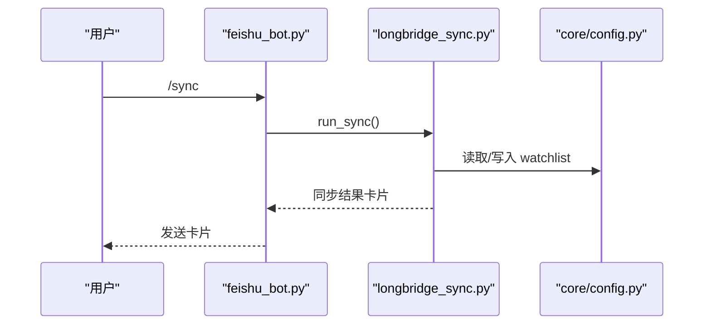
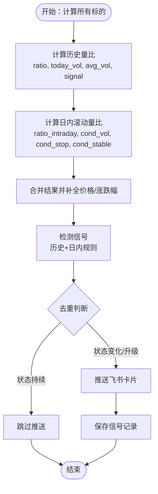
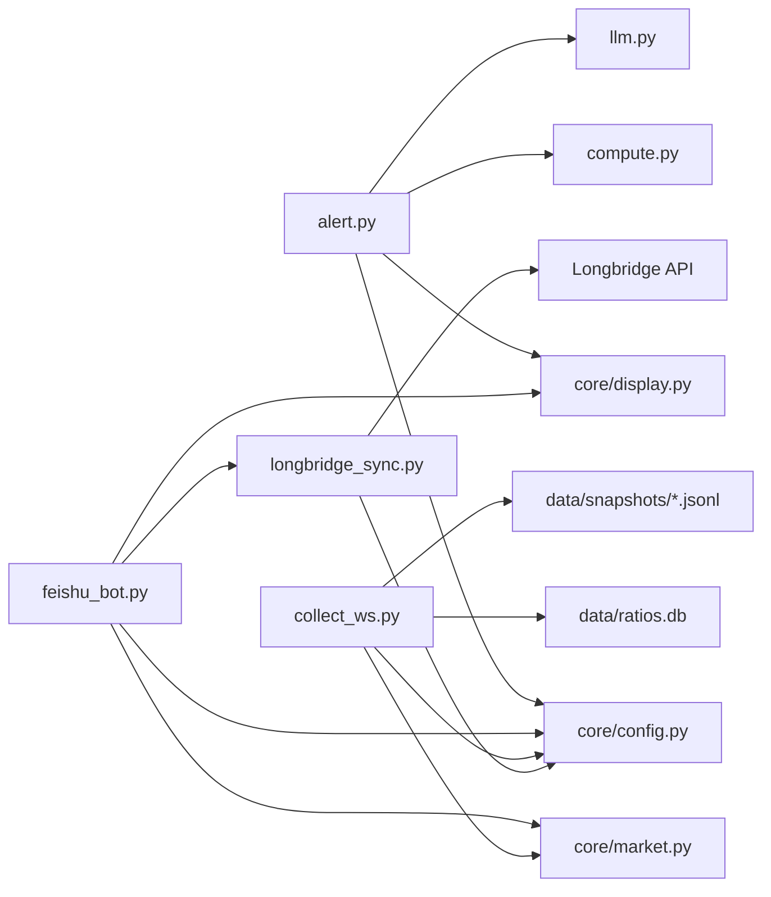

# 快速开始

<cite>
**本文引用的文件**
- [README.md](file://README.md)
- [config.yaml.example](file://config.yaml.example)
- [pyproject.toml](file://pyproject.toml)
- [scripts/start_all.py](file://scripts/start_all.py)
- [scripts/stop_all.py](file://scripts/stop_all.py)
- [scripts/collect_ws.py](file://scripts/collect_ws.py)
- [scripts/alert.py](file://scripts/alert.py)
- [scripts/feishu_bot.py](file://scripts/feishu_bot.py)
- [scripts/llm.py](file://scripts/llm.py)
- [scripts/compute.py](file://scripts/compute.py)
- [scripts/cli.py](file://scripts/cli.py)
- [scripts/longbridge_sync.py](file://scripts/longbridge_sync.py)
- [scripts/core/config.py](file://scripts/core/config.py)
- [scripts/core/market.py](file://scripts/core/market.py)
- [scripts/core/display.py](file://scripts/core/display.py)
</cite>

## 目录
1. [简介](#简介)
2. [项目结构](#项目结构)
3. [核心组件](#核心组件)
4. [架构总览](#架构总览)
5. [详细组件分析](#详细组件分析)
6. [依赖关系分析](#依赖关系分析)
7. [性能与资源考虑](#性能与资源考虑)
8. [故障排查指南](#故障排查指南)
9. [结论](#结论)
10. [附录](#附录)

## 简介
跨市场量比监控系统用于实时监控美股(US)、港股(HK)、A股(CN)三大市场的成交量异动，结合 LLM 智能分析，在信号触发时通过飞书机器人推送富文本卡片。系统支持飞书机器人交互指令、交互式卡片、信号去重、JSONL 快照存储与 SQLite 数据库记录，以及长桥账户的持仓与自选股同步。

## 项目结构
- 顶层配置与元数据
  - 配置模板：config.yaml.example
  - 项目元数据：pyproject.toml
- 核心脚本与模块
  - 启动/关停：scripts/start_all.py、scripts/stop_all.py
  - 数据采集：scripts/collect_ws.py
  - 信号检测与推送：scripts/alert.py
  - 飞书机器人：scripts/feishu_bot.py
  - LLM 调用层：scripts/llm.py
  - 量比计算引擎：scripts/compute.py
  - CLI：scripts/cli.py
  - 长桥同步：scripts/longbridge_sync.py
  - 核心模块：scripts/core/config.py、scripts/core/market.py、scripts/core/display.py
- 数据与日志
  - 快照：data/snapshots/{US,HK,CN}/*.jsonl
  - 数据库：data/ratios.db
  - 日志：logs/*.log、*.err、*.pid

图表来源
- [scripts/start_all.py:120-168](file://scripts/start_all.py#L120-L168)
- [scripts/stop_all.py:64-107](file://scripts/stop_all.py#L64-L107)
- [scripts/collect_ws.py:159-214](file://scripts/collect_ws.py#L159-L214)
- [scripts/alert.py:367-514](file://scripts/alert.py#L367-L514)
- [scripts/feishu_bot.py:712-800](file://scripts/feishu_bot.py#L712-L800)
- [scripts/llm.py:110-159](file://scripts/llm.py#L110-L159)
- [scripts/compute.py:382-484](file://scripts/compute.py#L382-L484)
- [scripts/longbridge_sync.py:209-250](file://scripts/longbridge_sync.py#L209-L250)
- [scripts/core/config.py:20-32](file://scripts/core/config.py#L20-L32)
- [scripts/core/market.py:61-88](file://scripts/core/market.py#L61-L88)
- [scripts/core/display.py:8-102](file://scripts/core/display.py#L8-L102)

章节来源
- [README.md:106-142](file://README.md#L106-L142)

## 核心组件
- 配置系统（热加载）
  - 统一从 config.yaml 加载配置，支持 watchlist、params、llm、feishu、mute 等键，修改后自动生效。
- WebSocket 采集
  - 订阅 Longbridge 实时行情，按市场分目录写入 JSONL 快照，同时入库 volume_ratios。
- 量比计算引擎
  - 同时计算“5日历史量比”和“日内滚动量比”，并生成信号与明细。
- 信号检测与推送
  - 去重状态机，仅在状态变化或升级时推送；支持 LLM 分析摘要。
- 飞书机器人
  - WebSocket 长连接，支持 /start、/stop、/status、/scan、/signals、/brief、/watchlist、/allstock、/sync、/add、/remove、/mute、/history 等指令。
- LLM 多模型切换
  - 支持 minimax/xiaomi 等模型一键切换与测试。
- 长桥同步
  - 同步持仓与自选股到 watchlist，并自动重启 WebSocket 以应用新配置。
- CLI
  - 支持查询单个标的、扫描持仓/市场、查看历史/信号、添加/移除/静默标的等。

章节来源
- [scripts/core/config.py:20-63](file://scripts/core/config.py#L20-L63)
- [scripts/collect_ws.py:159-214](file://scripts/collect_ws.py#L159-L214)
- [scripts/compute.py:197-322](file://scripts/compute.py#L197-L322)
- [scripts/alert.py:61-142](file://scripts/alert.py#L61-L142)
- [scripts/feishu_bot.py:712-800](file://scripts/feishu_bot.py#L712-L800)
- [scripts/llm.py:61-91](file://scripts/llm.py#L61-L91)
- [scripts/longbridge_sync.py:209-250](file://scripts/longbridge_sync.py#L209-L250)
- [scripts/cli.py:41-109](file://scripts/cli.py#L41-L109)

## 架构总览
系统采用“脚本层 + 数据层 + 外部数据源”的分层设计。脚本层通过 cron 或手动启动，负责采集、计算、检测、推送与同步；数据层以 JSONL 快照与 SQLite 数据库存储；外部数据源为 Longbridge WebSocket API。

图表来源
- [scripts/collect_ws.py:138-147](file://scripts/collect_ws.py#L138-L147)
- [scripts/compute.py:340-375](file://scripts/compute.py#L340-L375)
- [scripts/alert.py:425-447](file://scripts/alert.py#L425-L447)
- [scripts/feishu_bot.py:283-336](file://scripts/feishu_bot.py#L283-L336)
- [scripts/longbridge_sync.py:209-250](file://scripts/longbridge_sync.py#L209-L250)
- [scripts/cli.py:41-109](file://scripts/cli.py#L41-L109)

## 详细组件分析

### 环境准备与依赖
- Python 版本要求
  - 项目元数据要求 Python >=3.11（pyproject.toml）
  - README 提供了环境准备示例（Python 3.9+ 依赖）
- 创建虚拟环境与安装依赖
  - 建议使用 venv 创建隔离环境
  - 安装依赖：pyyaml、requests、longbridge、lark-oapi、pytz
- 配置文件准备
  - 复制示例配置并填写 watchlist、llm、feishu 等关键参数

章节来源
- [pyproject.toml:1-8](file://pyproject.toml#L1-L8)
- [README.md:52-60](file://README.md#L52-L60)
- [README.md:61-93](file://README.md#L61-L93)

### 配置文件设置
- 监控标的（watchlist）
  - 格式：TICKER.MARKET-中文名，按市场分组（us/hk/cn）
- 系统参数（params）
  - volume_ratio_window：量比计算窗口（分钟）
  - snapshot_interval：快照间隔（秒）
  - alert_threshold：告警阈值
  - shrink_threshold：缩量阈值
- LLM 配置（llm）
  - provider、model、base_url、api_key、max_tokens、temperature
  - 支持 llm_profiles 多配置文件一键切换
- 飞书配置（feishu）
  - app_id、app_secret、chat_id（可选 webhook_url）

章节来源
- [config.yaml.example:13-28](file://config.yaml.example#L13-L28)
- [config.yaml.example:32-37](file://config.yaml.example#L32-L37)
- [config.yaml.example:42-62](file://config.yaml.example#L42-L62)
- [config.yaml.example:67-73](file://config.yaml.example#L67-L73)

### 一键启动与关停
- 一键启动
  - 添加 cron 任务（每分钟检查 WebSocket/飞书机器人、每分钟扫描信号、每30分钟发送简报、每小时清理数据、每30分钟同步长桥）
  - 直接启动 WebSocket 采集进程与飞书机器人进程
  - 验证 cron 与进程状态
- 一键关停
  - 杀掉相关进程（collect_ws.py、feishu_bot.py）
  - 移除包含关键字的 cron 任务
  - 清理 PID 文件

图表来源
- [scripts/start_all.py:133-164](file://scripts/start_all.py#L133-L164)
- [scripts/start_all.py:30-118](file://scripts/start_all.py#L30-L118)

章节来源
- [scripts/start_all.py:120-168](file://scripts/start_all.py#L120-L168)
- [scripts/stop_all.py:64-107](file://scripts/stop_all.py#L64-L107)

### 飞书机器人交互
- 支持指令
  - /start、/stop、/status、/scan、/signals、/brief、/watchlist、/allstock、/sync、/add、/remove、/mute、/history
- 交互卡片
  - 关注列表（带删除按钮）、全部股票（分组与添加按钮）、量比简报（原生表格）、系统状态等
- 卡片回调
  - 删除 watchlist、添加到监控、返回分组等操作

图表来源
- [scripts/feishu_bot.py:762-787](file://scripts/feishu_bot.py#L762-L787)
- [scripts/longbridge_sync.py:209-250](file://scripts/longbridge_sync.py#L209-L250)
- [scripts/core/config.py:34-47](file://scripts/core/config.py#L34-L47)

章节来源
- [scripts/feishu_bot.py:712-800](file://scripts/feishu_bot.py#L712-L800)
- [scripts/longbridge_sync.py:209-250](file://scripts/longbridge_sync.py#L209-L250)

### 量比计算与信号检测
- 双量比系统
  - 历史量比：当日同时段成交量 / 5日均量
  - 日内滚动量比：基于最近 N 分钟差分量的三条件检测（放量止跌）
- 信号规则
  - 放量突破、放量下跌、缩量止跌、尾盘放量
  - 去重状态机：正常、缩量、放量、显著放量、巨量
- LLM 分析
  - 触发强信号时调用 LLM 生成简要分析

图表来源
- [scripts/compute.py:382-484](file://scripts/compute.py#L382-L484)
- [scripts/alert.py:61-142](file://scripts/alert.py#L61-L142)
- [scripts/alert.py:339-447](file://scripts/alert.py#L339-L447)

章节来源
- [scripts/compute.py:197-322](file://scripts/compute.py#L197-L322)
- [scripts/alert.py:61-142](file://scripts/alert.py#L61-L142)
- [scripts/alert.py:339-447](file://scripts/alert.py#L339-L447)

### LLM 多模型切换
- 配置与切换
  - 通过 llm_profiles 定义多个模型配置，使用 --switch 切换
  - --list 查看可用模型，--test 测试当前配置
- 调用与记录
  - 统一调用 call_llm，记录 llm_calls 表

章节来源
- [scripts/llm.py:54-91](file://scripts/llm.py#L54-L91)
- [scripts/llm.py:110-159](file://scripts/llm.py#L110-L159)

### CLI 使用示例
- 查询单个标的并可选调用 LLM 分析
- 扫描持仓/市场
- 查看历史/今日信号
- 添加/移除/静默标的
- 系统状态检查

章节来源
- [scripts/cli.py:41-109](file://scripts/cli.py#L41-L109)
- [scripts/cli.py:240-276](file://scripts/cli.py#L240-L276)
- [scripts/cli.py:372-463](file://scripts/cli.py#L372-L463)

## 依赖关系分析
- 组件耦合
  - alert.py 依赖 compute.py、core.config、core.display、llm.py
  - feishu_bot.py 依赖 core.config、core.market、core.display、longbridge_sync.py
  - collect_ws.py 依赖 core.config、core.market，写入 JSONL 与 SQLite
  - longbridge_sync.py 依赖 core.config，调用长桥 API
- 外部依赖
  - Longbridge SDK、飞书 SDK、SQLite、JSONL 文件系统

图表来源
- [scripts/alert.py:20-23](file://scripts/alert.py#L20-L23)
- [scripts/feishu_bot.py:31-34](file://scripts/feishu_bot.py#L31-L34)
- [scripts/collect_ws.py:28-29](file://scripts/collect_ws.py#L28-L29)
- [scripts/longbridge_sync.py:14-15](file://scripts/longbridge_sync.py#L14-L15)

章节来源
- [scripts/alert.py:20-23](file://scripts/alert.py#L20-L23)
- [scripts/feishu_bot.py:31-34](file://scripts/feishu_bot.py#L31-L34)
- [scripts/collect_ws.py:28-29](file://scripts/collect_ws.py#L28-L29)
- [scripts/longbridge_sync.py:14-15](file://scripts/longbridge_sync.py#L14-L15)

## 性能与资源考虑
- JSONL 快照替代每条快照一个文件，显著降低文件数量
- SQLite 索引优化查询（signals.timestamp、volume_ratios.ticker）
- WebSocket 重试机制与守护进程保证稳定性
- 建议在非高峰时段进行数据清理，避免影响实时计算

[本节为通用指导，不直接分析具体文件]

## 故障排查指南
- 量比显示 0.0 “数据不足”
  - 5日历史量比需要至少5个交易日数据
  - 使用 ratio_intraday（日内滚动量比）验证今日数据
- 飞书机器人不响应
  - 检查 feishu.app_id 与 feishu.app_secret
  - 查看 logs/feishu_bot.log
- WebSocket 进程不存在
  - 查看 logs/launcher.log
  - 手动重启 scripts/collect_ws_launcher.py
- LLM API 调用失败
  - 确认 api_key 正确
  - 使用 scripts/llm.py --test 测试
  - 切换模型 scripts/llm.py --switch minimax

章节来源
- [README.md:354-391](file://README.md#L354-L391)

## 结论
通过统一的配置、稳定的采集与计算、智能的信号检测与推送，以及完善的飞书交互与长桥同步，系统能够高效地监控跨市场量比并及时发出预警。按照本文档的环境准备、配置设置与一键启停流程，即可快速部署并长期稳定运行。

[本节为总结性内容，不直接分析具体文件]

## 附录

### 一键启停与常用命令
- 一键启动：python3 scripts/start_all.py
- 一键关停：python3 scripts/stop_all.py
- 查看日志：tail -f logs/feishu_bot.log、logs/ws_collect.log、logs/alert.log
- 查看进程：ps aux | grep collect_ws、ps aux | grep feishu_bot

章节来源
- [README.md:94-102](file://README.md#L94-L102)
- [README.md:286-311](file://README.md#L286-L311)

### 数据存储与清理
- JSONL 快照：按市场分目录，每日单文件追加
- SQLite 表：volume_ratios、signals、llm_calls、daily_summary
- 清理策略：定期清理过期数据（JSONL/DB/信号）

章节来源
- [README.md:314-351](file://README.md#L314-L351)