# 技术架构

<cite>
**本文引用的文件**
- [README.md](file://README.md)
- [config.yaml.example](file://config.yaml.example)
- [pyproject.toml](file://pyproject.toml)
- [scripts/core/config.py](file://scripts/core/config.py)
- [scripts/core/market.py](file://scripts/core/market.py)
- [scripts/core/display.py](file://scripts/core/display.py)
- [scripts/collect_ws.py](file://scripts/collect_ws.py)
- [scripts/compute.py](file://scripts/compute.py)
- [scripts/alert.py](file://scripts/alert.py)
- [scripts/feishu_bot.py](file://scripts/feishu_bot.py)
- [scripts/llm.py](file://scripts/llm.py)
- [scripts/cli.py](file://scripts/cli.py)
- [scripts/cleanup.py](file://scripts/cleanup.py)
</cite>

## 目录
1. [引言](#引言)
2. [项目结构](#项目结构)
3. [核心组件](#核心组件)
4. [架构总览](#架构总览)
5. [详细组件分析](#详细组件分析)
6. [依赖关系分析](#依赖关系分析)
7. [性能考量](#性能考量)
8. [故障排查指南](#故障排查指南)
9. [结论](#结论)
10. [附录](#附录)

## 引言
本项目是一个跨市场量比监控系统，覆盖美股(US)、港股(HK)、A股(CN)三大市场，通过Longbridge WebSocket实时采集行情，计算日内滚动量比与5日历史量比，检测放量突破、放量下跌、缩量止跌、尾盘放量等信号，并结合LLM进行智能分析，通过飞书机器人推送交互式卡片。系统采用分层架构：用户层（飞书机器人/CLI）、脚本层（采集/计算/告警/LLM/CLI/清理等）、数据层（JSONL快照+SQLite数据库）、数据源层（Longbridge WebSocket API）。本文档聚焦于系统架构、核心模块职责、数据流与处理流程、关键设计决策与权衡，并提供架构图与组件交互图，帮助开发者快速理解与扩展。

## 项目结构
项目采用“脚本驱动”的分层组织方式，核心模块集中在scripts/core，业务脚本位于scripts根目录，数据落盘在data目录，日志在logs目录。核心文件与职责如下：
- 配置与共享模块：scripts/core/config.py、scripts/core/market.py、scripts/core/display.py
- 实时采集：scripts/collect_ws.py
- 量比计算：scripts/compute.py
- 信号检测与推送：scripts/alert.py
- 飞书机器人：scripts/feishu_bot.py
- LLM调用：scripts/llm.py
- CLI入口：scripts/cli.py
- 数据清理：scripts/cleanup.py
- 配置样例：config.yaml.example
- 项目元数据：pyproject.toml

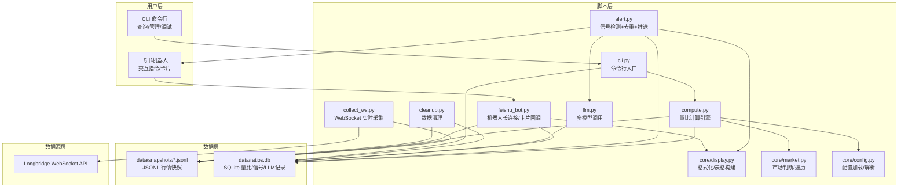

**图表来源**
- [README.md:21-46](file://README.md#L21-L46)
- [scripts/collect_ws.py:159-214](file://scripts/collect_ws.py#L159-L214)
- [scripts/compute.py:147-194](file://scripts/compute.py#L147-L194)
- [scripts/alert.py:367-448](file://scripts/alert.py#L367-L448)
- [scripts/feishu_bot.py:100-197](file://scripts/feishu_bot.py#L100-L197)
- [scripts/llm.py:110-158](file://scripts/llm.py#L110-L158)
- [scripts/cleanup.py:157-211](file://scripts/cleanup.py#L157-L211)

**章节来源**
- [README.md:106-142](file://README.md#L106-L142)
- [pyproject.toml:1-8](file://pyproject.toml#L1-L8)

## 核心组件
- 配置管理模块（core/config.py）
  - 负责config.yaml的热加载、watchlist解析、标的移除、ticker解析等，为全系统提供统一配置入口。
- 市场工具模块（core/market.py）
  - 提供市场交易时间判断、市场归属判断、watchlist遍历、中文名解析等功能。
- 显示格式化模块（core/display.py）
  - 提供量比符号映射、统一格式化输出、飞书原生表格构建、简报元素组装等。
- 实时采集（collect_ws.py）
  - 通过Longbridge WebSocket订阅行情，回调入队，主线程批量写出JSONL快照，具备重试与守护进程能力。
- 量比计算（compute.py）
  - 读取JSONL快照，计算5日历史量比与日内滚动量比，保存至SQLite；提供批量与单标的计算接口。
- 信号检测与推送（alert.py）
  - 基于规则检测信号，集成LLM分析，实现信号去重状态机，通过飞书机器人推送卡片。
- 飞书机器人（feishu_bot.py）
  - WebSocket长连接，处理用户指令，构建各类卡片（状态、扫描、信号、简报、关注列表、全部股票等），支持卡片按钮回调。
- LLM调用（llm.py）
  - 多模型一键切换，统一调用Anthropic兼容接口，记录调用日志。
- CLI入口（cli.py）
  - 提供查询、扫描、状态、历史、信号、增删标的、静默等命令行功能。
- 数据清理（cleanup.py）
  - 按市场收盘状态清理JSONL与SQLite过期数据，控制保留周期。

**章节来源**
- [scripts/core/config.py:20-63](file://scripts/core/config.py#L20-L63)
- [scripts/core/market.py:11-88](file://scripts/core/market.py#L11-L88)
- [scripts/core/display.py:8-102](file://scripts/core/display.py#L8-L102)
- [scripts/collect_ws.py:159-258](file://scripts/collect_ws.py#L159-L258)
- [scripts/compute.py:147-498](file://scripts/compute.py#L147-L498)
- [scripts/alert.py:61-514](file://scripts/alert.py#L61-L514)
- [scripts/feishu_bot.py:100-991](file://scripts/feishu_bot.py#L100-L991)
- [scripts/llm.py:32-193](file://scripts/llm.py#L32-L193)
- [scripts/cli.py:41-463](file://scripts/cli.py#L41-L463)
- [scripts/cleanup.py:46-216](file://scripts/cleanup.py#L46-L216)

## 架构总览
系统采用“事件驱动 + 分层解耦”的架构：
- 用户层：飞书机器人与CLI，提供交互入口与命令行能力。
- 脚本层：各业务脚本独立运行，通过共享模块(core/*)解耦，通过数据层持久化。
- 数据层：JSONL按天追加写入，SQLite存储量比、信号、LLM调用记录。
- 数据源层：Longbridge WebSocket提供实时行情。

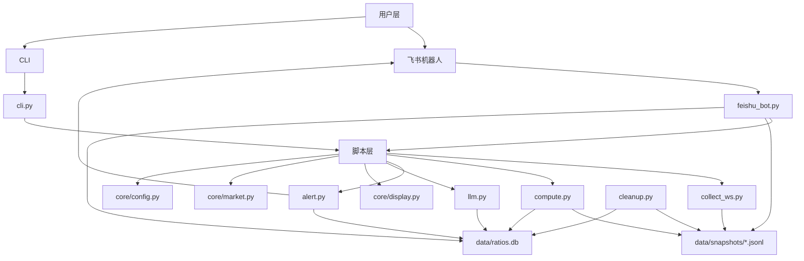

**图表来源**
- [README.md:21-46](file://README.md#L21-L46)
- [scripts/collect_ws.py:159-214](file://scripts/collect_ws.py#L159-L214)
- [scripts/compute.py:147-194](file://scripts/compute.py#L147-L194)
- [scripts/alert.py:367-448](file://scripts/alert.py#L367-L448)
- [scripts/feishu_bot.py:100-197](file://scripts/feishu_bot.py#L100-L197)
- [scripts/llm.py:110-158](file://scripts/llm.py#L110-L158)
- [scripts/cleanup.py:157-211](file://scripts/cleanup.py#L157-L211)

## 详细组件分析

### 配置管理模块（core/config.py）
- 热加载机制：基于文件mtime缓存，修改config.yaml后无需重启即可生效。
- watchlist管理：提供移除标的、解析带中文名的ticker格式等。
- 设计要点：集中式配置入口，避免各脚本重复读取与解析。

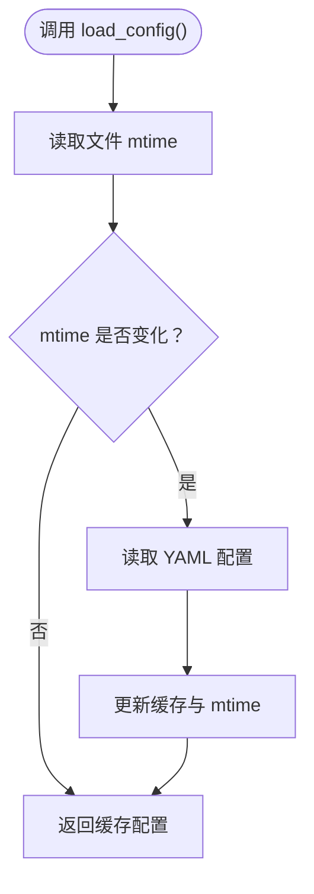

**图表来源**
- [scripts/core/config.py:20-31](file://scripts/core/config.py#L20-L31)

**章节来源**
- [scripts/core/config.py:20-63](file://scripts/core/config.py#L20-L63)

### 市场工具模块（core/market.py）
- 交易时间判断：根据不同市场（CN/HK/US）判断是否交易中，US考虑时区转换。
- 市场归属：根据ticker后缀判断市场。
- watchlist遍历：提供纯ticker与(ticker,name)两种遍历形式。

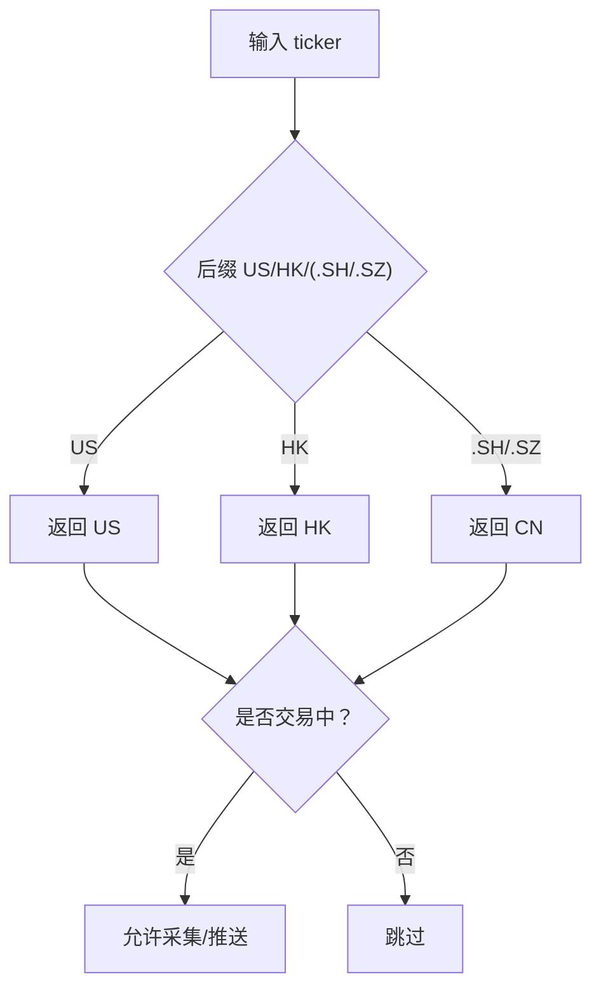

**图表来源**
- [scripts/core/market.py:50-47](file://scripts/core/market.py#L50-L47)

**章节来源**
- [scripts/core/market.py:11-88](file://scripts/core/market.py#L11-L88)

### 显示格式化模块（core/display.py）
- 量比符号映射：将数值区间映射为符号+中文标识，便于快速识别。
- 统一格式化：输出统一格式字符串，支持额外状态标记。
- 飞书表格：构建原生表格元素，支持简报与列表展示。

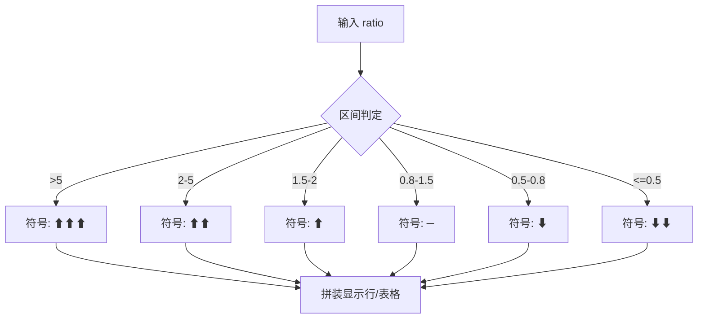

**图表来源**
- [scripts/core/display.py:8-87](file://scripts/core/display.py#L8-L87)

**章节来源**
- [scripts/core/display.py:8-102](file://scripts/core/display.py#L8-L102)

### 实时采集（collect_ws.py）
- WebSocket订阅：从Longbridge获取报价，回调线程入队，主线程批量写出JSONL。
- 昨收价缓存：启动时批量获取昨收，后续缺失时从最新JSONL回溯。
- 重试与守护：支持指数退避重试与双fork守护进程，日志分离。

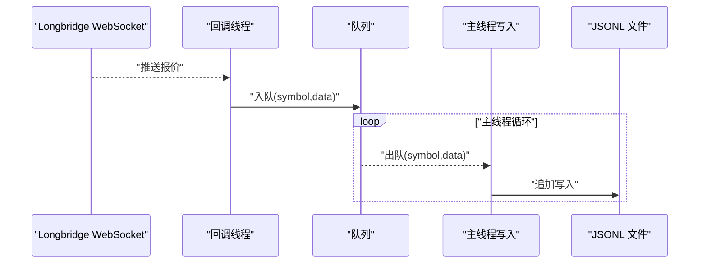

**图表来源**
- [scripts/collect_ws.py:117-194](file://scripts/collect_ws.py#L117-L194)
- [scripts/collect_ws.py:138-147](file://scripts/collect_ws.py#L138-L147)

**章节来源**
- [scripts/collect_ws.py:159-258](file://scripts/collect_ws.py#L159-L258)

### 量比计算（compute.py）
- 5日历史量比：计算当日同时段成交量与过去N日对应时段均量之比。
- 日内滚动量比：三条件放量止跌检测（放量、止跌、企稳）。
- 数据持久化：将量比与信号写入SQLite，提供批量与单标的计算接口。

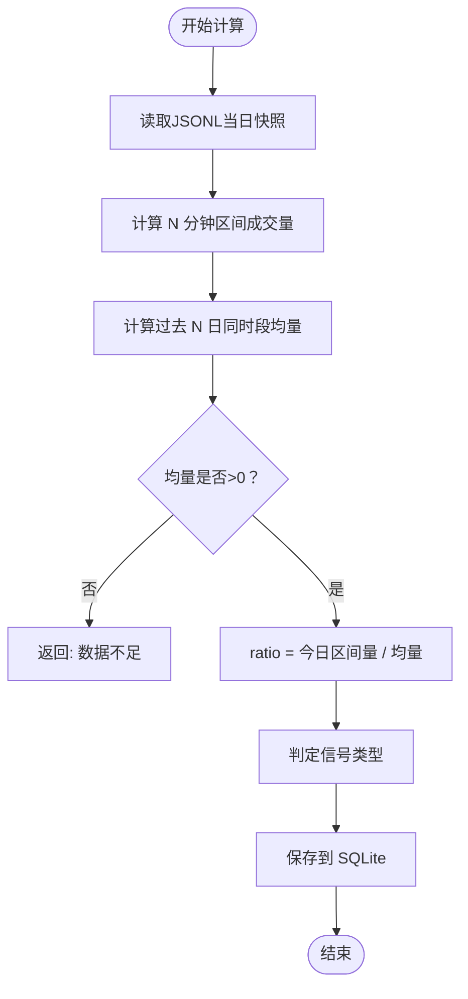

**图表来源**
- [scripts/compute.py:197-226](file://scripts/compute.py#L197-L226)
- [scripts/compute.py:249-321](file://scripts/compute.py#L249-L321)

**章节来源**
- [scripts/compute.py:147-498](file://scripts/compute.py#L147-L498)

### 信号检测与推送（alert.py）
- 规则检测：基于阈值与涨跌幅组合的信号规则集合。
- 去重状态机：按信号优先级判断是否推送，支持状态升级与降级。
- LLM分析：仅对强信号调用，避免过度消耗。
- 飞书推送：构建富文本卡片，包含价格、量比、信号与LLM分析。

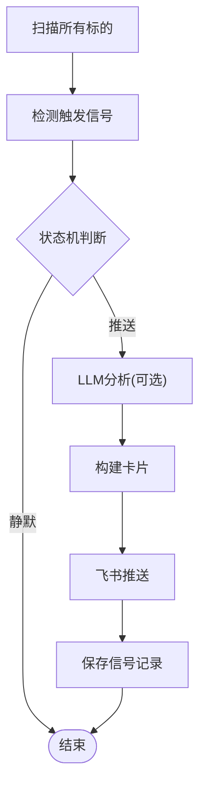

**图表来源**
- [scripts/alert.py:61-142](file://scripts/alert.py#L61-L142)
- [scripts/alert.py:276-365](file://scripts/alert.py#L276-L365)
- [scripts/alert.py:367-448](file://scripts/alert.py#L367-L448)

**章节来源**
- [scripts/alert.py:61-514](file://scripts/alert.py#L61-L514)

### 飞书机器人（feishu_bot.py）
- 长连接：WebSocket监听消息，处理指令与卡片回调。
- 卡片构建：状态、扫描、信号、简报、关注列表、全部股票等。
- 回调处理：支持删除关注、添加监控、返回分组等交互。

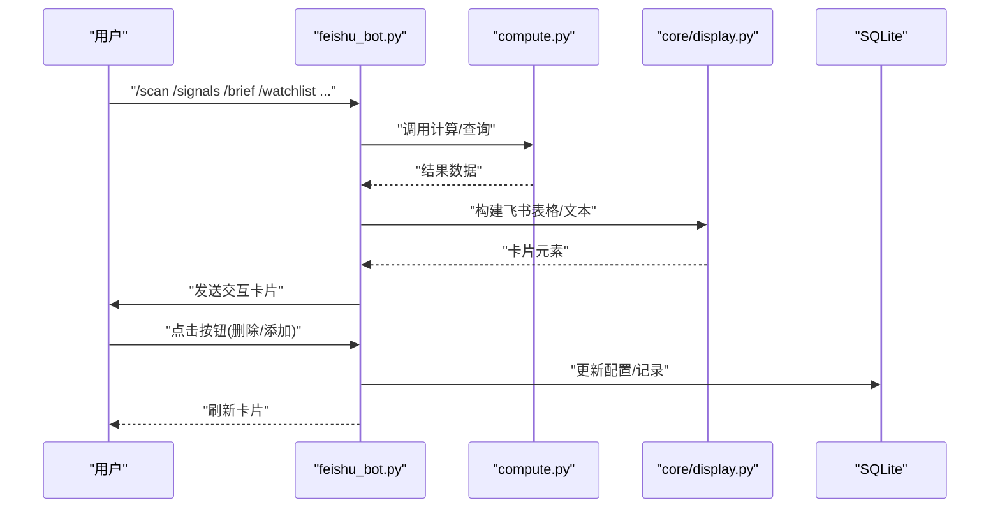

**图表来源**
- [scripts/feishu_bot.py:166-197](file://scripts/feishu_bot.py#L166-L197)
- [scripts/feishu_bot.py:200-278](file://scripts/feishu_bot.py#L200-L278)
- [scripts/feishu_bot.py:361-414](file://scripts/feishu_bot.py#L361-L414)
- [scripts/feishu_bot.py:526-615](file://scripts/feishu_bot.py#L526-L615)

**章节来源**
- [scripts/feishu_bot.py:100-991](file://scripts/feishu_bot.py#L100-L991)

### LLM调用（llm.py）
- 多模型切换：通过llm_profiles一键切换，写回config.yaml。
- 统一接口：调用Anthropic兼容接口，记录调用成功/失败。
- 安全脱敏：API Key脱敏显示。

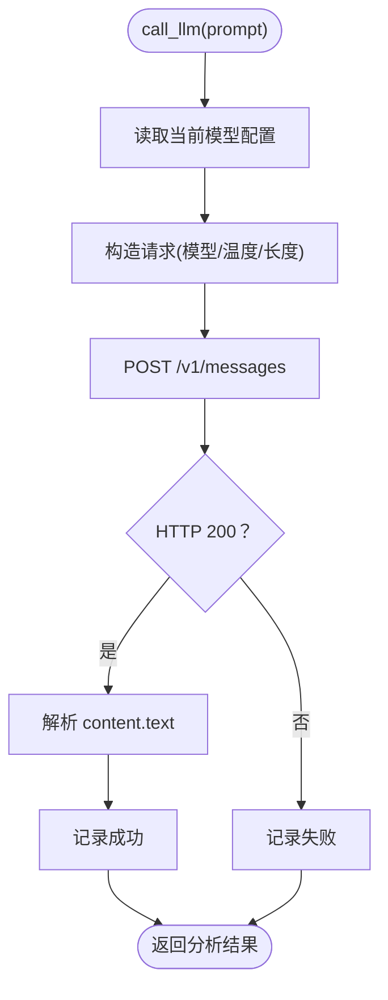

**图表来源**
- [scripts/llm.py:110-158](file://scripts/llm.py#L110-L158)
- [scripts/llm.py:61-90](file://scripts/llm.py#L61-L90)

**章节来源**
- [scripts/llm.py:32-193](file://scripts/llm.py#L32-L193)

### CLI入口（cli.py）
- 查询与扫描：单标的查询、持仓扫描、市场扫描。
- 系统管理：状态检查、历史趋势、今日信号、增删标的、静默设置。
- 与compute/llm/db交互，统一格式化输出。

```mermaid
flowchart TD
CLI["cli.py 参数解析"] --> Cmd{"命令类型"}
Cmd --> |--ticker| Q["query_ticker()"]
Cmd --> |--scan|--market| S["scan_*()"]
Cmd --> |--status| ST["cmd_status()"]
Cmd --> |--history|--signals| H["cmd_history()/cmd_signals()"]
Cmd --> |add/remove/mute| M["cmd_add/remove/mute()"]
Q --> Out["格式化输出"]
S --> Out
H --> Out
M --> Out
```

**图表来源**
- [scripts/cli.py:372-463](file://scripts/cli.py#L372-L463)
- [scripts/cli.py:41-108](file://scripts/cli.py#L41-L108)

**章节来源**
- [scripts/cli.py:41-463](file://scripts/cli.py#L41-L463)

### 数据清理（cleanup.py）
- 动态收盘检测：根据CN/HK/US市场收盘时间判断是否清理。
- 清理策略：JSONL按天保留、SQLite按时间戳清理、daily_summary按日期清理。
- 状态报告：支持统计磁盘占用与文件数量。

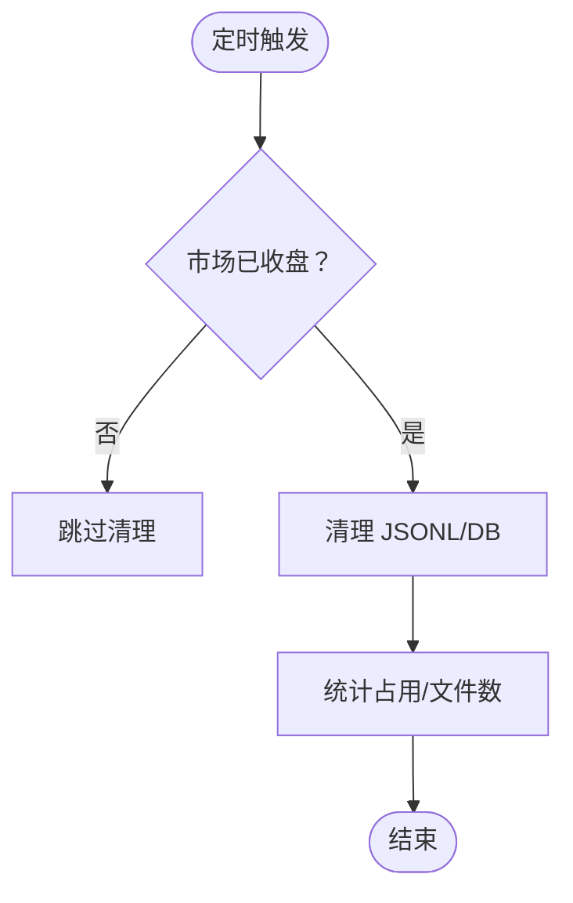

**图表来源**
- [scripts/cleanup.py:46-60](file://scripts/cleanup.py#L46-L60)
- [scripts/cleanup.py:157-211](file://scripts/cleanup.py#L157-L211)

**章节来源**
- [scripts/cleanup.py:46-216](file://scripts/cleanup.py#L46-L216)

## 依赖关系分析
- 模块内聚与耦合
  - core模块提供公共能力，被compute/alert/feishu_bot/cli等广泛复用，内聚高、耦合低。
  - 脚本间通过共享模块解耦，避免直接互相导入。
- 外部依赖
  - Longbridge Python SDK用于行情订阅与报价查询。
  - lark-oapi用于飞书消息与卡片发送。
  - requests用于LLM接口调用。
- 数据依赖
  - JSONL文件按市场/日期组织，SQLite提供结构化查询与索引优化。

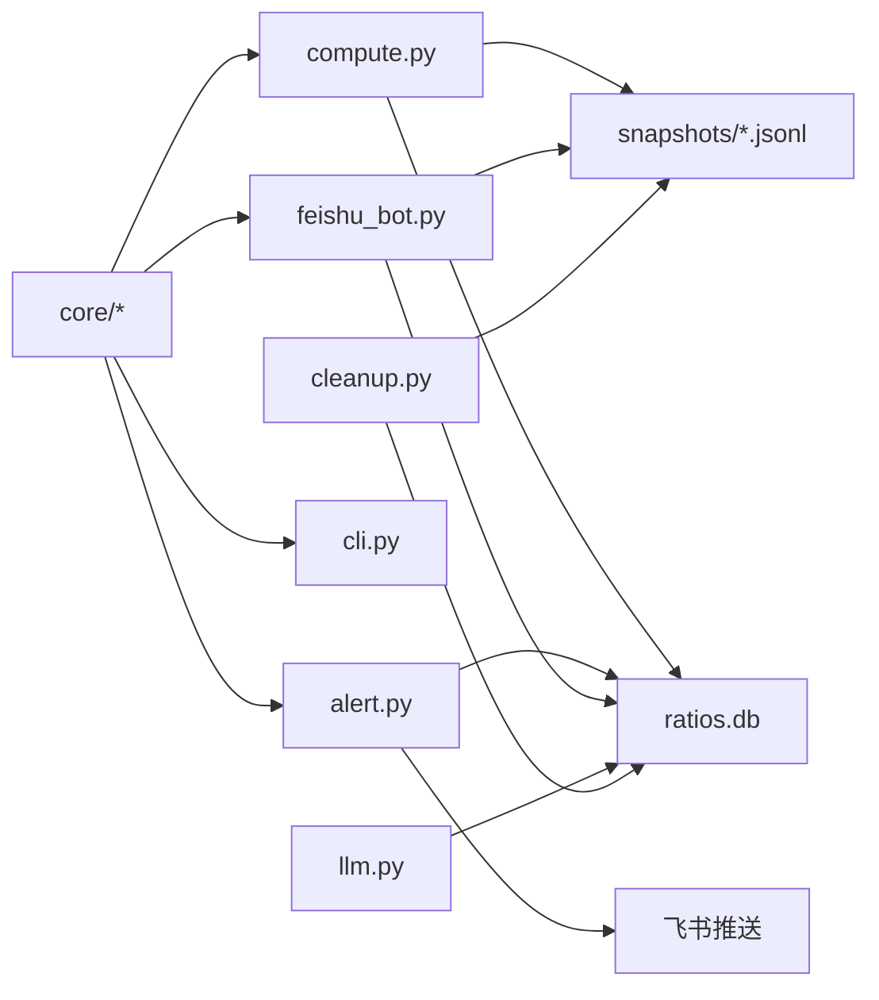

**图表来源**
- [scripts/compute.py:147-194](file://scripts/compute.py#L147-L194)
- [scripts/alert.py:367-448](file://scripts/alert.py#L367-L448)
- [scripts/feishu_bot.py:100-197](file://scripts/feishu_bot.py#L100-L197)
- [scripts/llm.py:110-158](file://scripts/llm.py#L110-L158)
- [scripts/cleanup.py:157-211](file://scripts/cleanup.py#L157-L211)

**章节来源**
- [pyproject.toml:1-8](file://pyproject.toml#L1-L8)

## 性能考量
- JSONL存储方案
  - 每标的每日一个JSONL文件，按天追加写入，避免频繁文件打开/关闭，降低文件系统压力。
  - 相比旧方案（每条快照一个JSON文件），文件数从6万+/天降至约11个/天，显著减少文件句柄与目录项开销。
- 量比计算
  - 仅读取当日JSONL，按时间戳二分或线性回溯定位N分钟前快照，复杂度与采样点成线性关系。
  - SQLite索引建立在timestamp与ticker上，查询与清理效率较高。
- 信号去重状态机
  - 通过ON CONFLICT UPSERT维护状态，避免重复推送，降低飞书推送频率与LLM调用成本。
- LLM调用
  - 仅对强信号调用，且同一轮仅对同一标的调用一次，避免重复分析。
- 采集与写入
  - 回调线程入队、主线程批量写出，减少锁竞争与IO抖动。

[本节为通用性能讨论，不直接分析具体文件]

## 故障排查指南
- 量比显示0.0“数据不足”
  - 5日历史量比需要至少5个交易日数据，可查看日内滚动量比（ratio_intraday）。
- 飞书机器人不响应
  - 检查config.yaml中app_id/app_secret是否正确，确认飞书开放平台已启用机器人、配置权限、发布版本。
  - 查看logs/feishu_bot.log与feishu_bot.err。
- WebSocket进程不存在
  - 查看logs/launcher.log，手动重启collect_ws_launcher.py。
- LLM API调用失败
  - 确认api_key正确，使用scripts/llm.py --test测试，必要时切换模型。

**章节来源**
- [README.md:354-391](file://README.md#L354-L391)

## 结论
本系统通过清晰的分层架构与模块化设计，实现了跨市场的实时量比监控与智能推送。核心创新点包括：
- JSONL存储方案显著降低文件系统开销；
- 双量比引擎兼顾即时性与稳定性；
- 信号去重状态机提升推送质量；
- 飞书机器人与CLI提供丰富的交互与管理能力；
- LLM多模型切换与统一调用层增强分析灵活性。

这些设计在保证可维护性的同时，兼顾了性能与用户体验，适合在生产环境中长期稳定运行。

## 附录
- 配置样例与参数说明参考config.yaml.example。
- 项目依赖与版本要求参考pyproject.toml。

**章节来源**
- [config.yaml.example:1-73](file://config.yaml.example#L1-L73)
- [pyproject.toml:1-8](file://pyproject.toml#L1-L8)