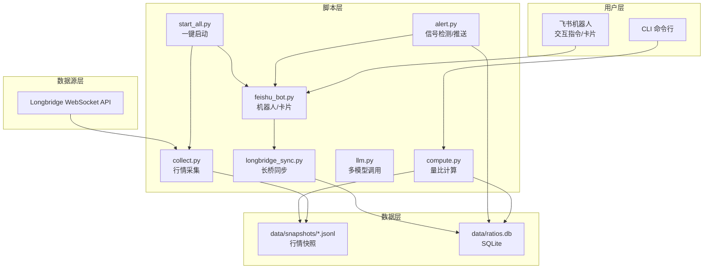
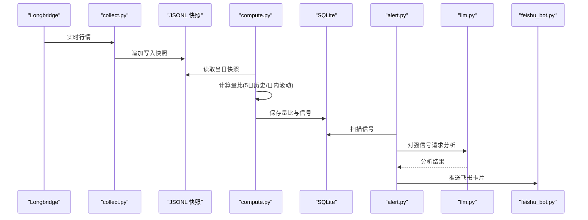
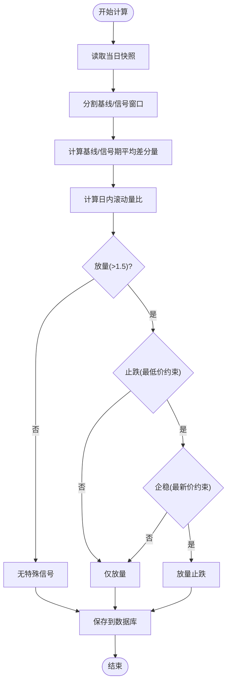
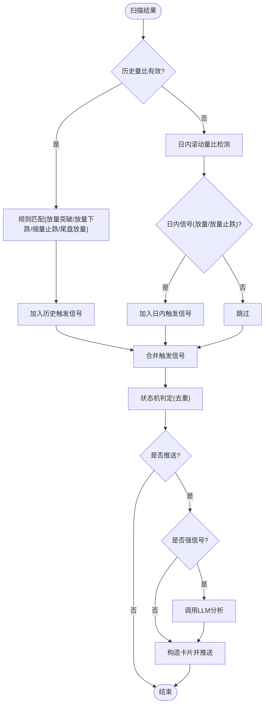
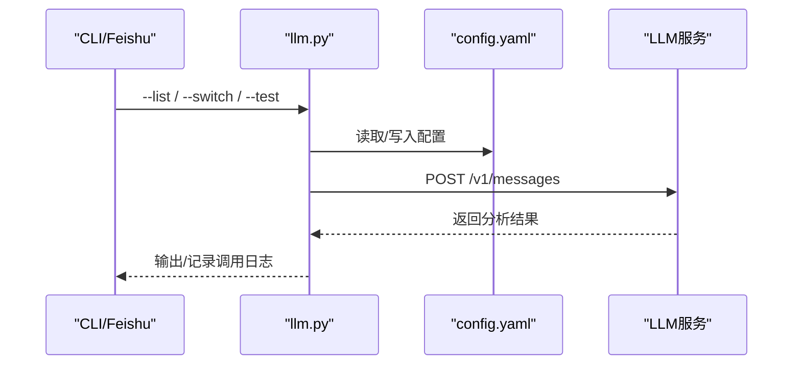
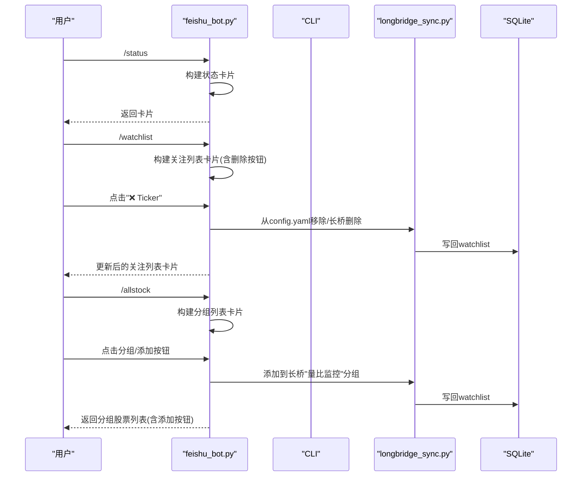
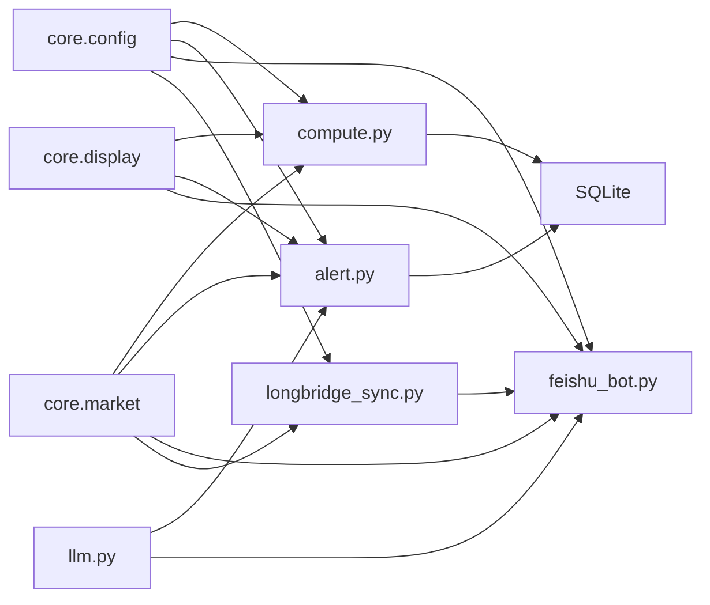

# 核心能力

<cite>
**本文引用的文件**
- [README.md](file://README.md)
- [scripts/core/market.py](file://scripts/core/market.py)
- [scripts/core/config.py](file://scripts/core/config.py)
- [scripts/core/display.py](file://scripts/core/display.py)
- [scripts/collect.py](file://scripts/collect.py)
- [scripts/compute.py](file://scripts/compute.py)
- [scripts/alert.py](file://scripts/alert.py)
- [scripts/llm.py](file://scripts/llm.py)
- [scripts/feishu_bot.py](file://scripts/feishu_bot.py)
- [scripts/cli.py](file://scripts/cli.py)
- [scripts/longbridge_sync.py](file://scripts/longbridge_sync.py)
- [scripts/start_all.py](file://scripts/start_all.py)
</cite>

## 目录
1. [引言](#引言)
2. [项目结构](#项目结构)
3. [核心组件](#核心组件)
4. [架构总览](#架构总览)
5. [详细组件分析](#详细组件分析)
6. [依赖关系分析](#依赖关系分析)
7. [性能考量](#性能考量)
8. [故障排查指南](#故障排查指南)
9. [结论](#结论)
10. [附录](#附录)

## 引言
本项目是一个跨市场量比监控系统，覆盖美股(US)、港股(HK)、A股(CN)，提供双量比引擎（日内滚动量比与5日历史量比）、智能信号检测、LLM多模型切换、飞书机器人交互与卡片推送、以及数据清理等能力。本文聚焦“核心能力详解”，围绕双量比引擎的工作原理、信号检测机制、LLM多模型切换、飞书机器人交互进行深入说明，并给出使用场景与参考路径，帮助读者快速理解与落地应用。

## 项目结构
系统采用脚本驱动的分层组织，核心模块集中在 scripts/ 下，数据层以 JSONL 快照与 SQLite 数据库存储，通过 cron 定时任务协调各组件运行。

图表来源
- [scripts/start_all.py:120-165](file://scripts/start_all.py#L120-L165)
- [scripts/collect.py:1-125](file://scripts/collect.py#L1-L125)
- [scripts/compute.py:1-498](file://scripts/compute.py#L1-L498)
- [scripts/alert.py:1-514](file://scripts/alert.py#L1-L514)
- [scripts/feishu_bot.py:1-991](file://scripts/feishu_bot.py#L1-L991)
- [scripts/llm.py:1-193](file://scripts/llm.py#L1-L193)
- [scripts/longbridge_sync.py:1-265](file://scripts/longbridge_sync.py#L1-L265)

章节来源
- [README.md:21-46](file://README.md#L21-L46)
- [scripts/start_all.py:120-165](file://scripts/start_all.py#L120-L165)

## 核心组件
- 双量比引擎：同时运行日内滚动量比与5日历史量比，前者无需历史数据即可用，后者消除日内节律影响，适合稳健判断。
- 智能信号检测：基于规则与滚动窗口的三条件“放量止跌”检测，以及常规放量/缩量/尾盘放量等信号类型。
- LLM多模型切换：统一调用层，支持MiniMax、Xiaomi等模型无缝切换与测试。
- 飞书机器人：WebSocket长连接，支持交互指令、扫描卡片、信号卡片、关注列表/全部股票卡片、长桥同步等。
- 数据与存储：JSONL按日追加写入，SQLite存储量比与信号历史；定时清理过期数据。
- CLI与守护：CLI查询与管理，一键启动/关停服务，守护进程与cron调度。

章节来源
- [README.md:9-19](file://README.md#L9-L19)
- [scripts/compute.py:197-321](file://scripts/compute.py#L197-L321)
- [scripts/alert.py:27-141](file://scripts/alert.py#L27-L141)
- [scripts/llm.py:32-90](file://scripts/llm.py#L32-L90)
- [scripts/feishu_bot.py:100-197](file://scripts/feishu_bot.py#L100-L197)

## 架构总览
系统通过 Longbridge WebSocket 实时采集行情快照，写入 data/snapshots/*.jsonl；随后 compute.py 读取快照计算量比并落库；alert.py 周期扫描并触发信号，必要时调用 LLM 进行分析，最终通过飞书机器人推送卡片；CLI 与飞书卡片提供交互入口；longbridge_sync.py 实现长桥持仓与自选股同步至 watchlist。

图表来源
- [scripts/collect.py:97-111](file://scripts/collect.py#L97-L111)
- [scripts/compute.py:451-483](file://scripts/compute.py#L451-L483)
- [scripts/alert.py:367-447](file://scripts/alert.py#L367-L447)
- [scripts/llm.py:110-158](file://scripts/llm.py#L110-L158)
- [scripts/feishu_bot.py:81-97](file://scripts/feishu_bot.py#L81-L97)

## 详细组件分析

### 双量比引擎：日内滚动量比与5日历史量比
- 5日历史量比（calc_volume_ratio）
  - 原理：今日同时段成交量 / 过去5日同一时段平均成交量
  - 优势：消除开盘/尾盘节律，适合观察趋势
  - 局限：需要至少5个交易日数据
  - 返回：ratio、today_vol、avg_5d_vol、signal
- 日内滚动量比（calc_intraday_ratio）
  - 基于最近N分钟差分量，分割基线窗口与信号窗口
  - 三条件放量止跌：放量、止跌（信号期最低价不低于基线最低价×0.995）、企稳（最新价高于信号期最低价×1.005）
  - 返回：ratio、signal_name、cond_vol、cond_stop、cond_stable
- 信号细化（get_signal_detail）
  - 放量突破、放量下跌、缩量止跌、尾盘放量等
- 保存与查询
  - save_ratio/save_signal 将结果持久化
  - compute_ticker/compute_all 提供单标/全量计算

图表来源
- [scripts/compute.py:249-321](file://scripts/compute.py#L249-L321)
- [scripts/compute.py:340-374](file://scripts/compute.py#L340-L374)

章节来源
- [scripts/compute.py:197-321](file://scripts/compute.py#L197-L321)
- [scripts/compute.py:324-337](file://scripts/compute.py#L324-L337)
- [scripts/compute.py:340-374](file://scripts/compute.py#L340-L374)

### 智能信号检测机制
- 规则定义（SIGNAL_RULES）
  - 放量突破：ratio>2.0 且 change>2%
  - 放量下跌：ratio>2.0 且 change<-2%
  - 缩量止跌：ratio<0.6 且 change>0
  - 尾盘放量：ratio>1.5 且 14:30-15:59
- 历史路径与日内路径
  - 历史路径：基于5日历史量比与涨跌幅规则
  - 日内路径：基于三条件“放量止跌”与“放量”
- 信号去重状态机
  - 状态优先级：正常 < 缩量 < 放量/温放 < 放量突破/放量下跌/放量止跌/缩量止跌/尾盘放量 < 巨量
  - 判定：状态变化/升级时推送，持续时静默
- LLM分析
  - 对强信号（如放量突破/放量下跌/高倍量比）调用 LLM，生成简短分析

图表来源
- [scripts/alert.py:61-141](file://scripts/alert.py#L61-L141)
- [scripts/alert.py:277-364](file://scripts/alert.py#L277-L364)
- [scripts/alert.py:367-447](file://scripts/alert.py#L367-L447)
- [scripts/alert.py:248-273](file://scripts/alert.py#L248-L273)

章节来源
- [scripts/alert.py:27-141](file://scripts/alert.py#L27-L141)
- [scripts/alert.py:277-364](file://scripts/alert.py#L277-L364)
- [scripts/alert.py:367-447](file://scripts/alert.py#L367-L447)

### LLM多模型切换功能
- 配置来源：config.yaml 的 llm 节点，支持 provider、model、base_url、api_key、max_tokens、temperature
- 切换逻辑：switch_llm 将 llm_profiles 中的配置复制到顶层 llm，写回 config.yaml
- 调用封装：call_llm 统一 Anthropic 兼容接口，支持超时/连接错误处理，并记录 llm_calls
- CLI测试：--list/--switch/--test 便于运维与调试

图表来源
- [scripts/llm.py:54-90](file://scripts/llm.py#L54-L90)
- [scripts/llm.py:110-158](file://scripts/llm.py#L110-L158)
- [scripts/llm.py:161-193](file://scripts/llm.py#L161-L193)

章节来源
- [scripts/llm.py:32-90](file://scripts/llm.py#L32-L90)
- [scripts/llm.py:110-158](file://scripts/llm.py#L110-L158)
- [scripts/llm.py:161-193](file://scripts/llm.py#L161-L193)

### 飞书机器人交互功能
- 交互指令
  - /start、/stop、/status、/scan、/signals、/brief、/watchlist、/allstock、/sync、/add、/remove、/mute、/history
- 卡片能力
  - 系统状态、量比扫描、今日信号、量比简报、关注列表（带删除按钮）、全部股票分组/列表（带添加按钮）、同步结果
- 卡片按钮回调
  - 删除关注、添加到监控、分组导航、返回列表
- 与长桥联动
  - 同步持仓+自选股到 watchlist，卡片按钮直接操作长桥分组

图表来源
- [scripts/feishu_bot.py:100-197](file://scripts/feishu_bot.py#L100-L197)
- [scripts/feishu_bot.py:361-414](file://scripts/feishu_bot.py#L361-L414)
- [scripts/feishu_bot.py:417-523](file://scripts/feishu_bot.py#L417-L523)
- [scripts/feishu_bot.py:526-615](file://scripts/feishu_bot.py#L526-L615)
- [scripts/longbridge_sync.py:124-163](file://scripts/longbridge_sync.py#L124-L163)

章节来源
- [scripts/feishu_bot.py:100-197](file://scripts/feishu_bot.py#L100-L197)
- [scripts/feishu_bot.py:361-414](file://scripts/feishu_bot.py#L361-L414)
- [scripts/feishu_bot.py:417-523](file://scripts/feishu_bot.py#L417-L523)
- [scripts/feishu_bot.py:526-615](file://scripts/feishu_bot.py#L526-L615)
- [scripts/longbridge_sync.py:124-163](file://scripts/longbridge_sync.py#L124-L163)

### 数据与存储
- JSONL快照
  - 每个标的按日追加写入，路径 data/snapshots/{US|HK|CN}/<ticker>_<YYYYMMDD>.jsonl
  - 优点：文件数大幅减少，便于按天归档与清理
- SQLite数据库
  - 表：volume_ratios、daily_summary、signals、signal_states、llm_calls
  - 索引：signals.timestamp、volume_ratios.ticker
- 定时清理
  - 每小时清理过期数据：JSONL/DB/信号等

章节来源
- [scripts/collect.py:81-94](file://scripts/collect.py#L81-L94)
- [scripts/compute.py:147-194](file://scripts/compute.py#L147-L194)
- [README.md:314-351](file://README.md#L314-L351)

### CLI与守护
- CLI
  - 查询单个标的、扫描持仓、扫描市场、系统状态、历史量比、今日信号、添加/移除/静默标的
  - 支持调用 LLM 进行简短分析
- 一键启动/关停
  - start_all.py 添加 cron 任务并启动 WebSocket 采集与飞书机器人
  - 守护进程由 collect_ws_launcher.py 与 feishu_bot_launcher.py 每分钟检查重启

章节来源
- [scripts/cli.py:41-108](file://scripts/cli.py#L41-L108)
- [scripts/cli.py:113-178](file://scripts/cli.py#L113-L178)
- [scripts/cli.py:200-237](file://scripts/cli.py#L200-L237)
- [scripts/cli.py:240-276](file://scripts/cli.py#L240-L276)
- [scripts/cli.py:278-370](file://scripts/cli.py#L278-L370)
- [scripts/start_all.py:120-165](file://scripts/start_all.py#L120-L165)

## 依赖关系分析
- 模块耦合
  - compute.py 依赖 core.config、core.market、core.display，读取快照并写入数据库
  - alert.py 依赖 compute、core.market、core.display、llm，负责信号检测与推送
  - feishu_bot.py 依赖 core.config、core.market、core.display、longbridge_sync，负责卡片构建与回调
  - longbridge_sync.py 依赖 core.config、core.market，负责长桥同步
  - llm.py 与 alert.py/feishu_bot.py 通过统一调用接口交互
- 外部依赖
  - Longbridge SDK 用于行情与交易上下文
  - lark-oapi 用于飞书机器人消息发送与卡片
  - requests 用于 LLM 接口调用

图表来源
- [scripts/compute.py:23-24](file://scripts/compute.py#L23-L24)
- [scripts/alert.py:20-22](file://scripts/alert.py#L20-L22)
- [scripts/feishu_bot.py:31-33](file://scripts/feishu_bot.py#L31-L33)
- [scripts/longbridge_sync.py:14-15](file://scripts/longbridge_sync.py#L14-L15)
- [scripts/llm.py:22](file://scripts/llm.py#L22)

章节来源
- [scripts/compute.py:23-24](file://scripts/compute.py#L23-L24)
- [scripts/alert.py:20-22](file://scripts/alert.py#L20-L22)
- [scripts/feishu_bot.py:31-33](file://scripts/feishu_bot.py#L31-L33)
- [scripts/longbridge_sync.py:14-15](file://scripts/longbridge_sync.py#L14-L15)
- [scripts/llm.py:22](file://scripts/llm.py#L22)

## 性能考量
- JSONL按日追加写入，避免频繁打开/关闭文件，降低IO开销
- SQLite索引优化：signals.timestamp、volume_ratios.ticker，提升查询效率
- 信号去重状态机：避免重复推送，减少飞书卡片压力
- LLM调用限制：仅对强信号调用，控制API成本与延迟
- 守护进程与cron：每分钟检查，保证服务稳定性与及时性

## 故障排查指南
- 量比显示0.0“数据不足”
  - 5日历史量比需要至少5个交易日数据；可查看 ratio_intraday（日内滚动量比）
- 飞书机器人不响应
  - 检查 config.yaml 中 feishu.app_id 与 feishu.app_secret
  - 查看 logs/feishu_bot.log
- WebSocket进程不存在
  - 查看 logs/launcher.log，手动重启 scripts/collect_ws_launcher.py
- LLM API调用失败
  - 确认 api_key 正确，使用 scripts/llm.py --test 测试
  - 切换模型：scripts/llm.py --switch minimax/xiaomi

章节来源
- [README.md:354-391](file://README.md#L354-L391)

## 结论
本系统通过“双量比引擎 + 智能信号检测 + LLM多模型切换 + 飞书机器人交互”的组合，实现了跨市场的实时量比监控与智能推送。其设计兼顾实时性与稳健性（5日历史量比）与灵活性（日内滚动量比），并通过卡片化交互与长桥联动提升了可运维性与用户体验。建议在生产环境中配合定时清理与监控告警，确保长期稳定运行。

## 附录
- 使用场景示例（参考路径）
  - 查询单个标的并获取LLM分析：[scripts/cli.py:41-65](file://scripts/cli.py#L41-L65)
  - 扫描市场放量标的：[scripts/cli.py:76-88](file://scripts/cli.py#L76-L88)
  - 查看今日信号：[scripts/cli.py:240-276](file://scripts/cli.py#L240-L276)
  - 添加/移除监控标的：[scripts/cli.py:278-344](file://scripts/cli.py#L278-L344)
  - 静默指定标的：[scripts/cli.py:347-370](file://scripts/cli.py#L347-L370)
  - 切换LLM模型：[scripts/llm.py:61-90](file://scripts/llm.py#L61-L90)
  - 测试LLM配置：[scripts/llm.py:180-186](file://scripts/llm.py#L180-L186)
  - 一键启动服务：[scripts/start_all.py:120-165](file://scripts/start_all.py#L120-L165)
  - 构建关注列表卡片：[scripts/feishu_bot.py:361-414](file://scripts/feishu_bot.py#L361-L414)
  - 构建全部股票分组卡片：[scripts/feishu_bot.py:417-523](file://scripts/feishu_bot.py#L417-L523)
  - 卡片按钮回调处理：[scripts/feishu_bot.py:526-615](file://scripts/feishu_bot.py#L526-L615)
  - 长桥同步与分组操作：[scripts/longbridge_sync.py:209-250](file://scripts/longbridge_sync.py#L209-L250)