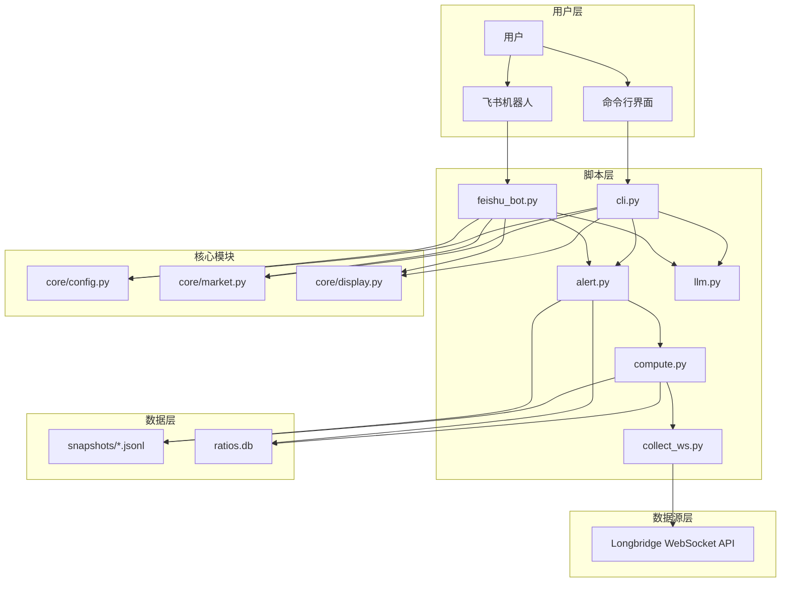
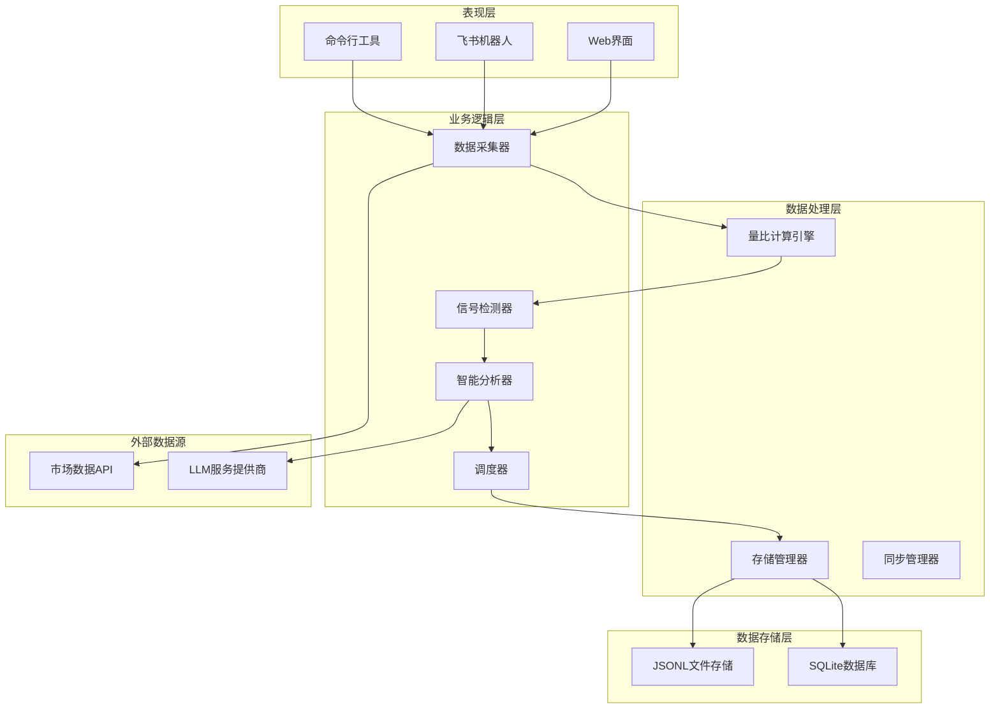
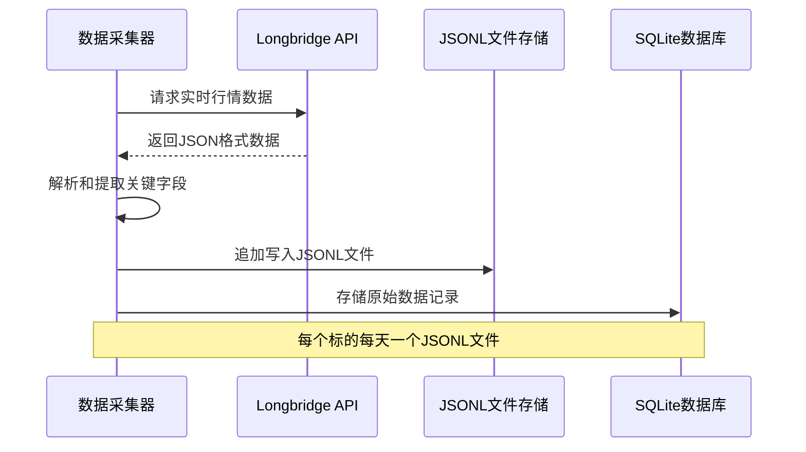
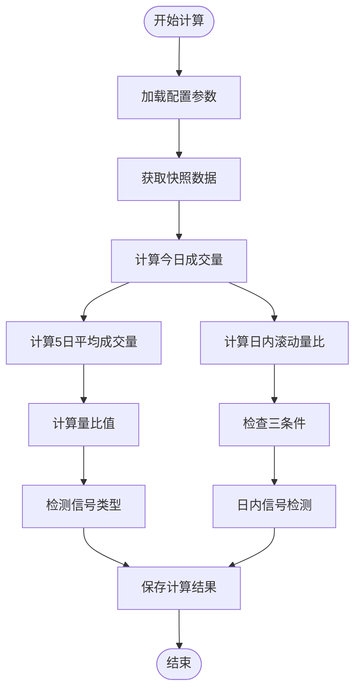
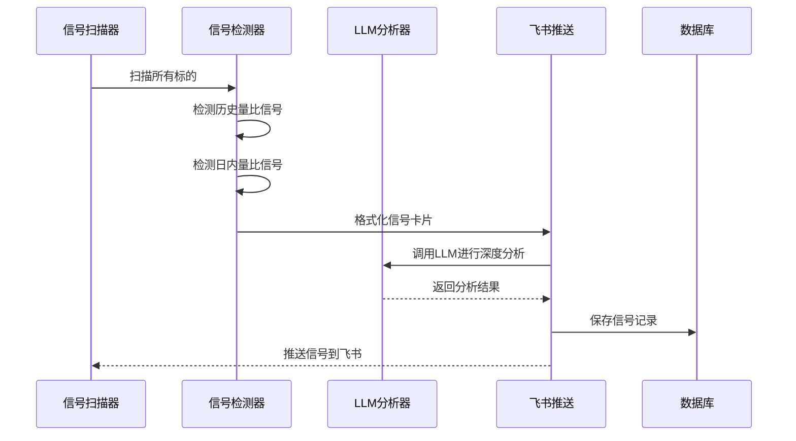
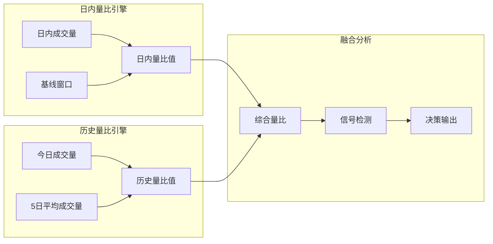
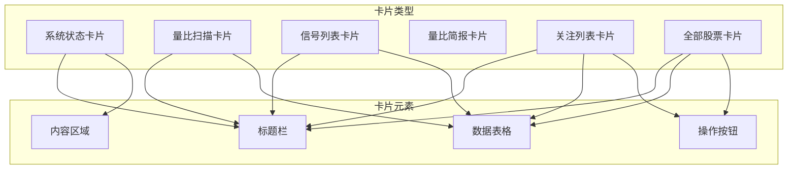
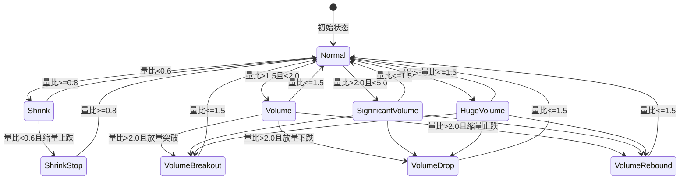

# 系统介绍

<cite>
**本文档引用的文件**
- [README.md](file://README.md)
- [config.yaml.example](file://config.yaml.example)
- [scripts/cli.py](file://scripts/cli.py)
- [scripts/collect.py](file://scripts/collect.py)
- [scripts/compute.py](file://scripts/compute.py)
- [scripts/alert.py](file://scripts/alert.py)
- [scripts/feishu_bot.py](file://scripts/feishu_bot.py)
- [scripts/core/config.py](file://scripts/core/config.py)
- [scripts/core/market.py](file://scripts/core/market.py)
- [scripts/core/display.py](file://scripts/core/display.py)
- [scripts/llm.py](file://scripts/llm.py)
- [scripts/longbridge_sync.py](file://scripts/longbridge_sync.py)
- [scripts/start_all.py](file://scripts/start_all.py)
- [scripts/stop_all.py](file://scripts/stop_all.py)
</cite>

## 目录
1. [引言](#引言)
2. [项目概述](#项目概述)
3. [核心价值主张](#核心价值主张)
4. [系统架构](#系统架构)
5. [核心组件详解](#核心组件详解)
6. [双量比引擎创新](#双量比引擎创新)
7. [飞书机器人交互体验](#飞书机器人交互体验)
8. [信号去重机制](#信号去重机制)
9. [应用场景与用户群体](#应用场景与用户群体)
10. [系统优势总结](#系统优势总结)
11. [部署与配置指南](#部署与配置指南)
12. [故障排查](#故障排查)

## 引言

跨市场量比监控系统是一个专为量化交易员、投资顾问、研究员等金融专业人士设计的智能监控平台。该系统能够实时监控美国、香港、中国三大市场的股票成交量异动，结合人工智能技术进行智能分析，通过飞书机器人即时推送信号通知，为用户提供全方位的市场洞察和决策支持。

## 项目概述

### 核心能力

系统具备以下核心能力：

- **双量比引擎**：同时运行日内滚动量比（立即生效）和5日历史量比（需要数据积累）
- **多市场覆盖**：美股(US)、港股(HK)、A股(CN) 三大市场
- **智能信号检测**：放量突破、放量下跌、缩量止跌、尾盘放量等
- **LLM 多模型切换**：一键切换 MiniMax / Xiaomi 等模型，自动分析量比异常原因
- **飞书机器人**：WebSocket 长连接，支持交互指令（/status /scan /signals /brief /watchlist /allstock /sync /start /stop）
- **交互式卡片**：关注列表可删除、全部股票可添加、长桥持仓自动同步
- **信号去重**：状态机模型，状态变化时推送，状态持续时静默，状态升级时再推送
- **JSONL 存储**：每日每标的一个 JSONL 文件，6万+文件/天 → 11文件/天
- **中文名标识**：标的显示中文名（如 `CLF.US 克利夫兰`），量比用符号+中文双标识

### 系统架构



**图表来源**
- [README.md:21-46](file://README.md#L21-L46)
- [scripts/feishu_bot.py:1-10](file://scripts/feishu_bot.py#L1-L10)
- [scripts/cli.py:1-25](file://scripts/cli.py#L1-L25)

## 核心价值主张

### 解决的核心问题

1. **多市场监控复杂性**：传统单一市场监控无法满足全球化投资需求
2. **信号噪声过滤**：大量市场噪音导致重要信号被淹没
3. **人工分析效率低**：手动跟踪多个市场的成交量变化耗时耗力
4. **决策支持不足**：缺乏智能化的市场分析和预警机制

### 提供的价值

1. **实时性**：通过 WebSocket 实时获取市场数据，确保信号的时效性
2. **智能化**：集成 LLM 模型，提供深度的市场分析和解读
3. **自动化**：完整的自动化流程，从数据采集到信号推送
4. **易用性**：友好的交互界面和丰富的可视化展示

## 系统架构

### 整体架构设计

系统采用分层架构设计，清晰分离用户界面、业务逻辑、数据处理和数据存储层：



**图表来源**
- [scripts/start_all.py:120-165](file://scripts/start_all.py#L120-L165)
- [scripts/stop_all.py:64-103](file://scripts/stop_all.py#L64-L103)

### 组件关系说明

1. **数据采集层**：负责从 Longbridge API 实时获取市场数据
2. **计算处理层**：执行量比计算和信号检测算法
3. **智能分析层**：集成 LLM 模型进行深度市场分析
4. **通知推送层**：通过飞书机器人推送信号和简报
5. **存储管理层**：管理 JSONL 文件和 SQLite 数据库

## 核心组件详解

### 数据采集组件

数据采集组件负责从 Longbridge WebSocket API 实时获取市场数据，采用高效的 JSONL 文件存储格式：



**图表来源**
- [scripts/collect.py:27-95](file://scripts/collect.py#L27-L95)
- [scripts/compute.py:48-76](file://scripts/compute.py#L48-L76)

### 量比计算引擎

量比计算引擎是系统的核心，实现了双量比计算逻辑：



**图表来源**
- [scripts/compute.py:197-242](file://scripts/compute.py#L197-L242)
- [scripts/compute.py:249-321](file://scripts/compute.py#L249-L321)

### 信号检测与推送

信号检测组件实现了智能的信号识别和推送机制：



**图表来源**
- [scripts/alert.py:61-142](file://scripts/alert.py#L61-L142)
- [scripts/alert.py:367-447](file://scripts/alert.py#L367-L447)

## 双量比引擎创新

### 日内滚动量比

日内滚动量比采用"最近N分钟成交量 vs 今日最近基线窗口成交量"的计算方式，具有以下优势：

- **立即生效**：今天就能使用，不需要历史数据积累
- **实时性强**：能够捕捉当日的市场动态变化
- **适应性强**：适合短线交易和日内波动分析

### 5日历史量比

5日历史量比通过"今日同时段成交量 vs 过去5日同一时段平均成交量"的计算，消除日内节律影响：

- **消除节律影响**：避免开盘放量/尾盘缩量的干扰
- **稳定性高**：基于历史数据，信号更加稳定可靠
- **适用性广**：适合中长期趋势分析和策略制定

### 双引擎协同

两个量比引擎通过智能融合，实现了互补优势：



**图表来源**
- [scripts/compute.py:197-225](file://scripts/compute.py#L197-L225)
- [scripts/compute.py:249-321](file://scripts/compute.py#L249-L321)

## 飞书机器人交互体验

### 交互指令系统

飞书机器人提供了完整的交互指令系统，支持多种操作：

| 指令 | 功能 | 用途 |
|:---|:---|:---|
| `/start` | 一键启动量比系统 | 系统启动和恢复 |
| `/stop` | 一键关停量比系统 | 系统维护和暂停 |
| `/status` | 系统健康状态 | 状态检查和诊断 |
| `/scan` | 当前量比快照 | 实时市场扫描 |
| `/signals` | 今日触发信号列表 | 信号回顾和分析 |
| `/brief` | 立即发送量比简报 | 概况了解和汇报 |
| `/watchlist` | 关注列表 | 标的管理和维护 |
| `/allstock` | 全部股票 | 标的添加和筛选 |
| `/sync` | 同步长桥持仓 | 自动化配置管理 |
| `/add` | 添加监控标的 | 标的扩展 |
| `/remove` | 移除监控标的 | 标的清理 |
| `/mute` | 静默指定标的 | 个性化设置 |

### 富文本卡片展示

系统采用飞书原生富文本卡片进行信息展示，提供直观的用户体验：



**图表来源**
- [scripts/feishu_bot.py:100-197](file://scripts/feishu_bot.py#L100-L197)
- [scripts/feishu_bot.py:200-336](file://scripts/feishu_bot.py#L200-L336)

### 卡片按钮交互

飞书机器人支持丰富的卡片按钮交互，实现一键操作：

- **删除按钮**：从关注列表中移除标的
- **添加按钮**：批量添加标的到监控列表
- **分组导航**：长桥自选股分组的层级浏览
- **操作反馈**：即时的操作结果反馈

## 信号去重机制

### 状态机模型

系统采用状态机模型实现智能的信号去重，避免重复推送：



**图表来源**
- [scripts/alert.py:276-364](file://scripts/alert.py#L276-L364)

### 信号优先级

系统定义了明确的信号优先级，确保重要信号得到及时关注：

| 信号类型 | 优先级 | 描述 |
|:---|:---|:---|
| 正常 | 0 | 市场正常交易状态 |
| 缩量 | 1 | 成交量明显萎缩 |
| 放量 | 2 | 成交量显著放大 |
| 温放 | 2 | 成交量温和放大 |
| 放量突破 | 3 | 放量配合价格上涨 |
| 放量下跌 | 3 | 放量配合价格下跌 |
| 放量止跌 | 3 | 放量配合止跌企稳 |
| 缩量止跌 | 3 | 缩量配合止跌企稳 |
| 尾盘放量 | 3 | 尾盘成交量放大 |
| 巨量 | 4 | 成交量极大放大 |

### 去重策略

系统采用"状态变化推送，状态持续静默，状态升级再推送"的智能去重策略：

1. **首次出现**：无论什么状态，首次出现时都会推送
2. **状态持续**：相同状态持续时不会重复推送
3. **状态升级**：状态升级时会重新推送
4. **状态降级**：状态降级时也会推送，确保信息完整性

## 应用场景与用户群体

### 目标用户群体

1. **量化交易员**
   - 需要实时监控多个市场的成交量变化
   - 追求高精度的信号识别和分析
   - 依赖自动化工具提高交易效率

2. **投资顾问**
   - 需要为客户提供及时的市场洞察
   - 希望获得智能化的分析报告
   - 重视用户体验和交互便利性

3. **研究员**
   - 需要深入分析市场趋势和异常现象
   - 依赖数据驱动的研究方法
   - 重视分析结果的准确性和可靠性

### 典型应用场景

1. **实时监控**
   - 24小时不间断监控三大市场
   - 即时发现成交量异常的标的
   - 自动化信号推送和提醒

2. **策略验证**
   - 基于量比信号验证交易策略
   - 分析不同市场的相关性
   - 评估策略在不同市场环境下的表现

3. **风险控制**
   - 监控市场流动性变化
   - 及时发现潜在的风险信号
   - 提供风险预警和应对建议

## 系统优势总结

### 技术优势

1. **双量比引擎创新**
   - 同时运行日内滚动量比和5日历史量比
   - 实现短期波动和长期趋势的双重监控
   - 提供更全面的市场洞察

2. **飞书机器人交互体验**
   - WebSocket 长连接保证实时性
   - 丰富的交互指令和卡片展示
   - 一键化的系统管理和配置

3. **信号去重机制有效性**
   - 状态机模型确保信号质量
   - 智能去重避免信息过载
   - 个性化设置满足不同需求

### 性能优势

1. **高效的数据存储**
   - JSONL 文件格式大幅减少文件数量
   - SQLite 数据库提供快速查询能力
   - 自动清理机制保持系统性能

2. **智能的资源管理**
   - 守护进程确保系统稳定性
   - 自动重启机制提高可用性
   - 资源优化减少系统开销

### 易用性优势

1. **简洁的配置管理**
   - YAML 格式配置文件易于理解和修改
   - 热加载机制无需重启服务
   - 完善的配置验证和错误提示

2. **友好的用户界面**
   - 飞书卡片提供直观的信息展示
   - 丰富的交互功能提升用户体验
   - 多种查询和分析工具满足不同需求

## 部署与配置指南

### 环境准备

系统要求 Python 3.9+ 环境，主要依赖包包括：

- **pyyaml**：YAML 配置文件处理
- **requests**：HTTP 请求处理
- **longbridge**：长桥证券 API 客户端
- **lark-oapi**：飞书开放平台 API
- **pytz**：时区处理

### 配置文件结构

配置文件采用 YAML 格式，包含以下主要部分：

```yaml
# 监控标的配置
watchlist:
  us:
    - NVDL.US-英伟达2x
    - CLF.US-克利夫兰
  hk:
    - 1810.HK-小米集团
  cn:
    - 601899.SH-紫金矿业

# 系统参数配置
params:
  volume_ratio_window: 5
  snapshot_interval: 60
  alert_threshold: 2.0
  shrink_threshold: 0.6

# LLM 配置
llm:
  provider: "xiaomi"
  model: "mimo-v2.5-pro"
  base_url: "https://token-plan-cn.xiaomimimo.com/anthropic"
  api_key: "YOUR_API_KEY_HERE"
  max_tokens: 800
  temperature: 0.3

# 飞书配置
feishu:
  app_id: "YOUR_APP_ID"
  app_secret: "YOUR_APP_SECRET"
  chat_id: "YOUR_CHAT_ID"
```

### 一键启动流程

系统提供完整的启动和停止脚本：

```bash
# 启动所有服务
python3 scripts/start_all.py

# 关停所有服务  
python3 scripts/stop_all.py

# 启动飞书机器人
python3 scripts/bot_start.py

# 停止飞书机器人
python3 scripts/bot_stop.py
```

## 故障排查

### 常见问题及解决方案

1. **量比显示 0.0 "数据不足"**
   - 解决方案：5日历史量比需要5个交易日数据才生效，可查看 `ratio_intraday` 日内滚动量比

2. **飞书机器人不响应**
   - 检查 `config.yaml` 中 `feishu.app_id` 和 `feishu.app_secret` 是否正确
   - 确认飞书开放平台已开启机器人能力、配置权限、发布版本
   - 查看日志：`tail -f logs/feishu_bot.log`

3. **WebSocket 进程不存在**
   - 查看日志：`cat logs/launcher.log`
   - 手动重启：`python3 scripts/collect_ws_launcher.py`

4. **LLM API 调用失败**
   - 确认 `config.yaml` 中 api_key 正确
   - 测试连接：`python3 scripts/llm.py --test`
   - 切换模型：`python3 scripts/llm.py --switch minimax`

### 日志位置

系统提供详细的日志记录，便于问题诊断：

- **ws_collect.log**：WebSocket 采集主日志
- **ws_collect.err**：WebSocket 错误日志
- **feishu_bot.log**：飞书机器人日志
- **feishu_bot.err**：飞书机器人错误日志
- **alert.log**：信号扫描日志
- **brief.log**：简报日志
- **cleanup.log**：数据清理日志
- **launcher.log**：守护进程启动日志

### 性能监控

系统提供完整的性能监控指标：

- **系统状态检查**：`python3 scripts/cli.py --status`
- **数据库大小监控**：定期检查 `data/ratios.db` 大小
- **文件数量监控**：检查 `data/snapshots/` 目录文件数量
- **内存使用监控**：监控各进程内存使用情况

通过以上全面的监控和诊断机制，系统能够确保稳定可靠的运行，为用户提供持续的市场监控服务。