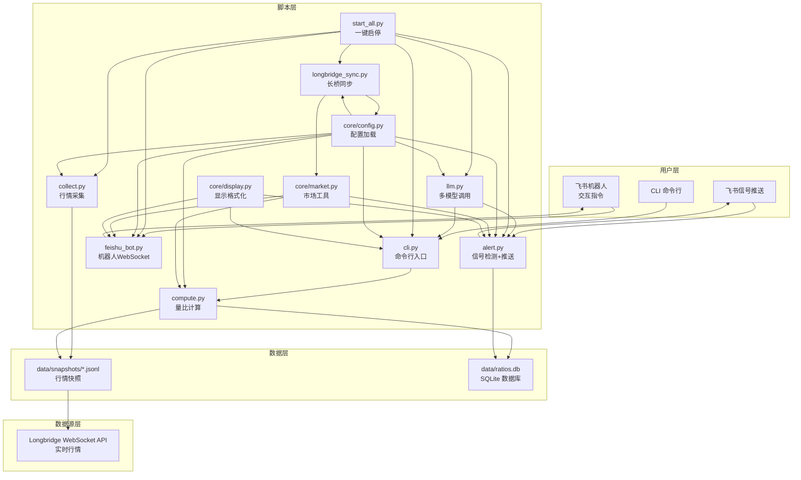
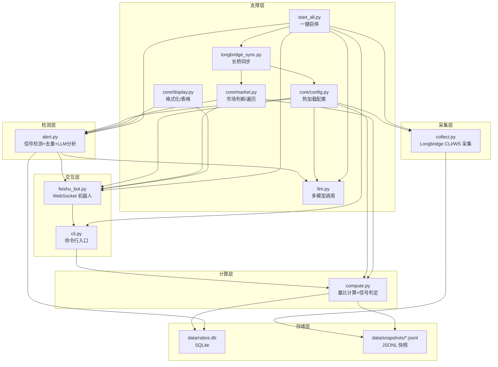
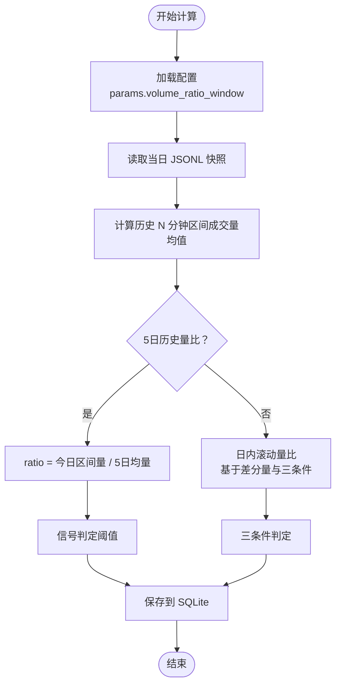
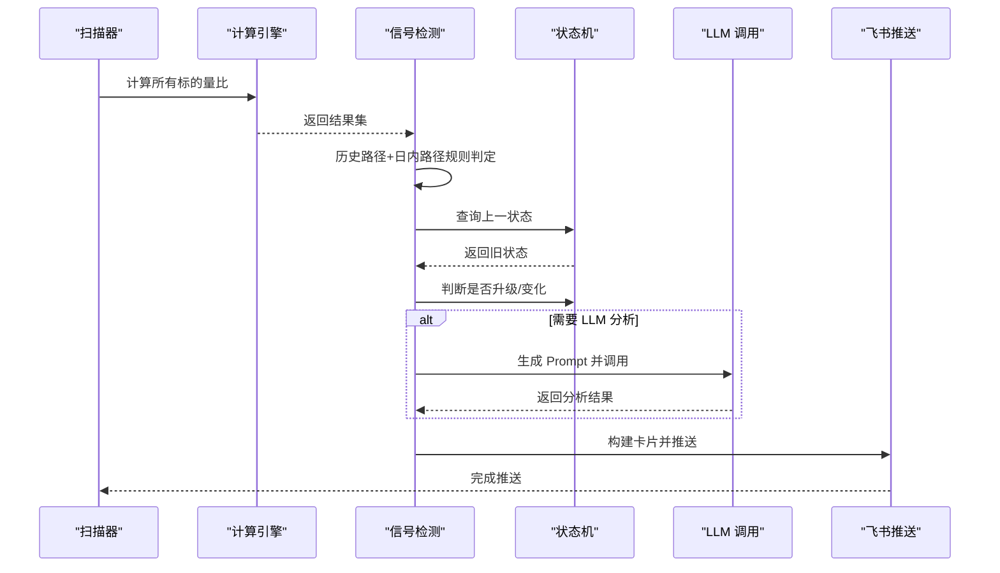
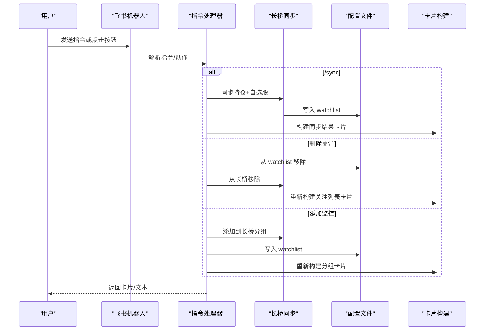
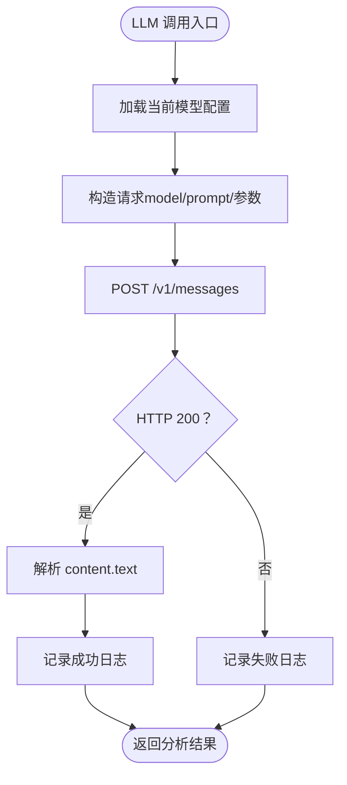
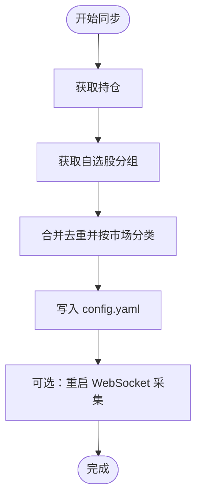
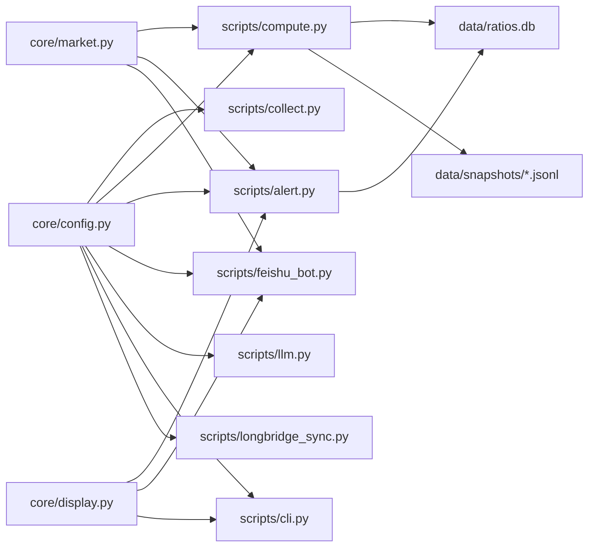

# 项目概述

<cite>
**本文引用的文件**
- [README.md](file://README.md)
- [config.yaml.example](file://config.yaml.example)
- [scripts/cli.py](file://scripts/cli.py)
- [scripts/collect.py](file://scripts/collect.py)
- [scripts/compute.py](file://scripts/compute.py)
- [scripts/alert.py](file://scripts/alert.py)
- [scripts/feishu_bot.py](file://scripts/feishu_bot.py)
- [scripts/llm.py](file://scripts/llm.py)
- [scripts/core/config.py](file://scripts/core/config.py)
- [scripts/core/market.py](file://scripts/core/market.py)
- [scripts/core/display.py](file://scripts/core/display.py)
- [scripts/longbridge_sync.py](file://scripts/longbridge_sync.py)
- [scripts/start_all.py](file://scripts/start_all.py)
</cite>

## 目录
1. [引言](#引言)
2. [项目结构](#项目结构)
3. [核心组件](#核心组件)
4. [架构总览](#架构总览)
5. [详细组件分析](#详细组件分析)
6. [依赖关系分析](#依赖关系分析)
7. [性能考虑](#性能考虑)
8. [故障排查指南](#故障排查指南)
9. [结论](#结论)
10. [附录](#附录)

## 引言
跨市场量比监控系统面向 US/HK/CN 三大市场的投资者，提供实时成交量异动监测与智能信号推送。系统通过“双量比引擎”（日内滚动量比与5日历史量比）识别放量突破、放量下跌、缩量止跌、尾盘放量等关键信号；结合 LLM 多模型切换与飞书机器人交互，实现“可观测、可交互、可分析”的全链路体验。系统采用 JSONL 快照与 SQLite 数据库存储，支持一键启停与守护进程，满足生产级稳定运行需求。

## 项目结构
项目采用“脚本层-数据层-数据源层”的分层组织，核心脚本位于 scripts/ 下，数据落盘于 data/，日志输出至 logs/。核心模块集中在 scripts/core/，提供配置、市场与显示等通用能力。

图表来源
- [README.md:21-46](file://README.md#L21-L46)
- [scripts/start_all.py:120-169](file://scripts/start_all.py#L120-L169)

章节来源
- [README.md:106-142](file://README.md#L106-L142)
- [scripts/start_all.py:120-169](file://scripts/start_all.py#L120-L169)

## 核心组件
- 双量比引擎：同时运行日内滚动量比与5日历史量比，前者“立即生效”，后者“消除节律波动”。
- 多市场覆盖：支持 US/HK/CN 三大市场，自动判断交易时间与市场节律。
- 智能信号检测：基于量比阈值与价格变化，识别放量突破、放量下跌、缩量止跌、尾盘放量等信号。
- LLM 多模型切换：统一调用层，支持 MiniMax/Xiaomi 等模型一键切换与测试。
- 飞书机器人：WebSocket 长连接，支持交互指令与富文本卡片，支持卡片按钮回调。
- 信号去重：基于状态机的去重策略，仅在状态变化或升级时推送。
- JSONL 存储与 SQLite：每日每标一个 JSONL 文件，减少文件数量；SQLite 存量比与信号历史。
- 长桥同步：自动同步持仓与自选股到监控列表，支持卡片按钮一键添加/移除。

章节来源
- [README.md:9-19](file://README.md#L9-L19)
- [scripts/compute.py:197-242](file://scripts/compute.py#L197-L242)
- [scripts/alert.py:276-365](file://scripts/alert.py#L276-L365)
- [scripts/llm.py:61-91](file://scripts/llm.py#L61-L91)
- [scripts/feishu_bot.py:100-163](file://scripts/feishu_bot.py#L100-L163)
- [scripts/collect.py:81-95](file://scripts/collect.py#L81-L95)
- [scripts/longbridge_sync.py:89-122](file://scripts/longbridge_sync.py#L89-L122)

## 架构总览
系统以“采集-计算-检测-推送-交互”为主线，辅以“配置-市场-显示-同步-启停”等支撑模块，形成闭环。

图表来源
- [scripts/collect.py:97-125](file://scripts/collect.py#L97-L125)
- [scripts/compute.py:382-484](file://scripts/compute.py#L382-L484)
- [scripts/alert.py:367-448](file://scripts/alert.py#L367-L448)
- [scripts/feishu_bot.py:712-800](file://scripts/feishu_bot.py#L712-L800)
- [scripts/llm.py:110-159](file://scripts/llm.py#L110-L159)
- [scripts/start_all.py:120-169](file://scripts/start_all.py#L120-L169)

## 详细组件分析

### 双量比引擎：日内滚动量比与5日历史量比
- 5日历史量比：当日同时段成交量与过去5日同一时段平均成交量之比，消除日内节律影响，适合观察结构性变化。
- 日内滚动量比：基于最近N分钟累计成交量差分，结合三条件（放量、止跌、企稳）进行“放量止跌”等细粒度信号识别，适合捕捉盘中异动。
- 信号细节：结合价格涨跌幅与时间窗口，识别“放量突破/下跌”、“缩量止跌”、“尾盘放量”等。

图表来源
- [scripts/compute.py:197-242](file://scripts/compute.py#L197-L242)
- [scripts/compute.py:249-322](file://scripts/compute.py#L249-L322)
- [scripts/compute.py:340-375](file://scripts/compute.py#L340-L375)

章节来源
- [README.md:161-173](file://README.md#L161-L173)
- [scripts/compute.py:197-242](file://scripts/compute.py#L197-L242)
- [scripts/compute.py:249-322](file://scripts/compute.py#L249-L322)
- [scripts/compute.py:324-338](file://scripts/compute.py#L324-L338)

### 智能信号检测与去重状态机
- 规则路径：历史量比路径与日内滚动量比路径分别判定信号，合并后统一去重。
- 去重策略：基于信号优先级（正常<缩量<放量<放量突破/下跌/缩量止跌/尾盘放量<巨量），仅在状态变化或升级时推送；持续状态静默。
- LLM 分析：对强信号（如放量突破/下跌）调用 LLM 获取简短中文分析，避免过度打扰。

图表来源
- [scripts/alert.py:61-142](file://scripts/alert.py#L61-L142)
- [scripts/alert.py:276-365](file://scripts/alert.py#L276-L365)
- [scripts/alert.py:248-274](file://scripts/alert.py#L248-L274)

章节来源
- [scripts/alert.py:27-33](file://scripts/alert.py#L27-L33)
- [scripts/alert.py:276-365](file://scripts/alert.py#L276-L365)
- [scripts/alert.py:367-448](file://scripts/alert.py#L367-L448)

### 飞书机器人：交互指令与卡片回调
- 交互指令：/start、/stop、/status、/scan、/signals、/brief、/watchlist、/allstock、/sync、/add、/remove、/mute、/history 等。
- 富文本卡片：支持原生表格、按钮、回调；关注列表卡片支持删除按钮；全部股票卡片支持二级导航与批量添加。
- 卡片回调：处理按钮点击，调用长桥 API 与本地配置，实现“一键添加/移除”。

图表来源
- [scripts/feishu_bot.py:712-800](file://scripts/feishu_bot.py#L712-L800)
- [scripts/feishu_bot.py:526-616](file://scripts/feishu_bot.py#L526-L616)
- [scripts/longbridge_sync.py:124-164](file://scripts/longbridge_sync.py#L124-L164)

章节来源
- [README.md:180-197](file://README.md#L180-L197)
- [scripts/feishu_bot.py:361-414](file://scripts/feishu_bot.py#L361-L414)
- [scripts/feishu_bot.py:417-524](file://scripts/feishu_bot.py#L417-L524)
- [scripts/longbridge_sync.py:89-122](file://scripts/longbridge_sync.py#L89-L122)

### LLM 多模型切换与调用
- 配置：支持在 config.yaml 中定义多个模型配置，通过 --switch 一键切换，--list 查看可用配置，--test 测试连通性。
- 调用：统一调用接口，兼容 Anthropic 兼容接口（MiniMax/Xiaomi/OpenAI 等），自动记录调用日志到 SQLite。

图表来源
- [scripts/llm.py:110-159](file://scripts/llm.py#L110-L159)
- [scripts/llm.py:61-91](file://scripts/llm.py#L61-L91)

章节来源
- [scripts/llm.py:110-159](file://scripts/llm.py#L110-L159)
- [scripts/llm.py:61-91](file://scripts/llm.py#L61-L91)

### 长桥同步：持仓与自选股
- 合并逻辑：合并持仓与指定分组，去重后按市场分类写入 config.yaml。
- 交互：卡片按钮支持“添加到监控”和“从监控移除”，同步长桥分组与本地 watchlist。
- 重启：同步完成后可自动重启 WebSocket 采集进程，保证配置生效。

图表来源
- [scripts/longbridge_sync.py:209-250](file://scripts/longbridge_sync.py#L209-L250)
- [scripts/longbridge_sync.py:188-207](file://scripts/longbridge_sync.py#L188-L207)

章节来源
- [scripts/longbridge_sync.py:209-250](file://scripts/longbridge_sync.py#L209-L250)
- [scripts/longbridge_sync.py:188-207](file://scripts/longbridge_sync.py#L188-L207)

### CLI 命令行：查询与管理
- 查询：--ticker、--scan holdings、--market、--history、--signals。
- 管理：--add/--remove/--mute、--status、--analyze（调用 LLM）。
- 与核心模块解耦：通过导入 compute、core 等模块实现查询与展示。

章节来源
- [scripts/cli.py:372-463](file://scripts/cli.py#L372-L463)
- [scripts/cli.py:41-65](file://scripts/cli.py#L41-L65)
- [scripts/cli.py:200-238](file://scripts/cli.py#L200-L238)
- [scripts/cli.py:240-276](file://scripts/cli.py#L240-L276)

## 依赖关系分析
- 配置依赖：所有脚本通过 core/config.py 的热加载配置，避免重启进程即可生效。
- 市场依赖：core/market.py 提供市场判断与遍历，确保仅在交易时段扫描有效标的。
- 显示依赖：core/display.py 统一量比符号与表格渲染，保证卡片一致性。
- 数据依赖：compute.py 读取 JSONL 快照并写入 SQLite；alert.py 读取 SQLite 并写入信号与状态。
- 外部依赖：Longbridge SDK/CLI 用于行情与交易上下文；飞书 SDK 用于消息与卡片；requests/lark-oapi 用于 LLM 调用与机器人。

图表来源
- [scripts/core/config.py:20-32](file://scripts/core/config.py#L20-L32)
- [scripts/core/market.py:11-48](file://scripts/core/market.py#L11-L48)
- [scripts/core/display.py:8-41](file://scripts/core/display.py#L8-L41)
- [scripts/compute.py:147-195](file://scripts/compute.py#L147-L195)
- [scripts/alert.py:292-337](file://scripts/alert.py#L292-L337)

章节来源
- [scripts/core/config.py:20-32](file://scripts/core/config.py#L20-L32)
- [scripts/core/market.py:11-48](file://scripts/core/market.py#L11-L48)
- [scripts/core/display.py:8-41](file://scripts/core/display.py#L8-L41)
- [scripts/compute.py:147-195](file://scripts/compute.py#L147-L195)
- [scripts/alert.py:292-337](file://scripts/alert.py#L292-L337)

## 性能考虑
- 文件系统优化：JSONL 每标每日追加，显著降低文件数量（从 6 万+/天 降至 11 个/天）。
- 数据库索引：为 signals 与 volume_ratios 建立索引，提升查询效率。
- 去重策略：避免重复推送，减少网络与 LLM 调用开销。
- 交易时间过滤：仅在交易时段扫描有效标的，节省资源。
- 热加载配置：无需重启进程即可生效，降低维护成本。

章节来源
- [README.md:318-325](file://README.md#L318-L325)
- [scripts/compute.py:147-195](file://scripts/compute.py#L147-L195)
- [scripts/alert.py:276-365](file://scripts/alert.py#L276-L365)
- [scripts/core/market.py:11-48](file://scripts/core/market.py#L11-L48)

## 故障排查指南
- 量比显示 0.0“数据不足”：5日历史量比需要至少 5 个交易日数据；可查看日内滚动量比（ratio_intraday）。
- 飞书机器人不响应：检查 config.yaml 中 app_id/app_secret/chat_id；查看 logs/feishu_bot.log。
- WebSocket 进程不存在：查看 logs/launcher.log；手动重启 scripts/collect_ws_launcher.py。
- LLM API 调用失败：确认 api_key；使用 scripts/llm.py --test；切换模型 scripts/llm.py --switch minimax/xiaomi。
- 数据库异常：检查 data/ratios.db 是否存在与可读；查看 logs/alert.log。

章节来源
- [README.md:356-391](file://README.md#L356-L391)
- [scripts/llm.py:161-193](file://scripts/llm.py#L161-L193)

## 结论
本系统通过“双量比引擎+智能信号检测+LLM 分析+飞书交互”的组合，实现了跨 US/HK/CN 市场的高性价比量比监控方案。其核心优势在于：双量比互补、信号去重减少噪音、JSONL+SQLite 的高效存储、飞书卡片的直观交互、以及一键启停与守护进程的稳定运行。对于追求“及时、准确、可解释”的量化交易辅助工具，该项目提供了清晰的架构与成熟的实现路径。

## 附录
- 一键启停：python3 scripts/start_all.py；python3 scripts/stop_all.py。
- 配置示例：cp config.yaml.example config.yaml；编辑 watchlist、llm、feishu。
- 依赖安装：pip install pyyaml requests longbridge lark-oapi pytz。

章节来源
- [README.md:94-102](file://README.md#L94-L102)
- [README.md:62-92](file://README.md#L62-L92)
- [README.md:394-407](file://README.md#L394-L407)